# P80：【2025版】80. CycleGAN最小二乘损失.zh_en - 小土堆Pytorch教程 - BV1YeknYbENz

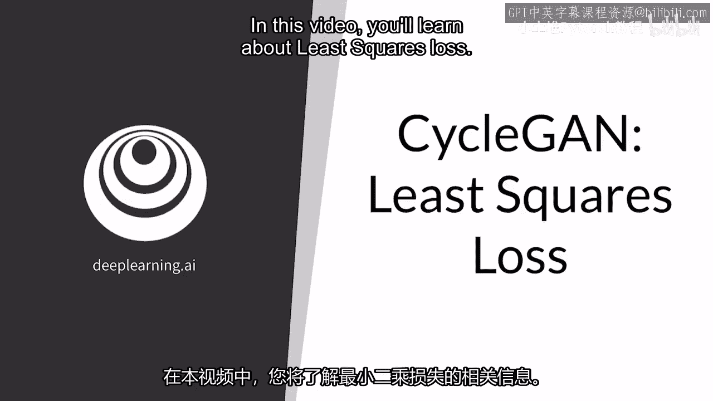

在这个视频中，你将首先学习最小二乘损失，我将概述统计学中的最小二乘法总体概念，然后，最小二乘损失在GANs中意味着什么，这将是一个对抗性损失。

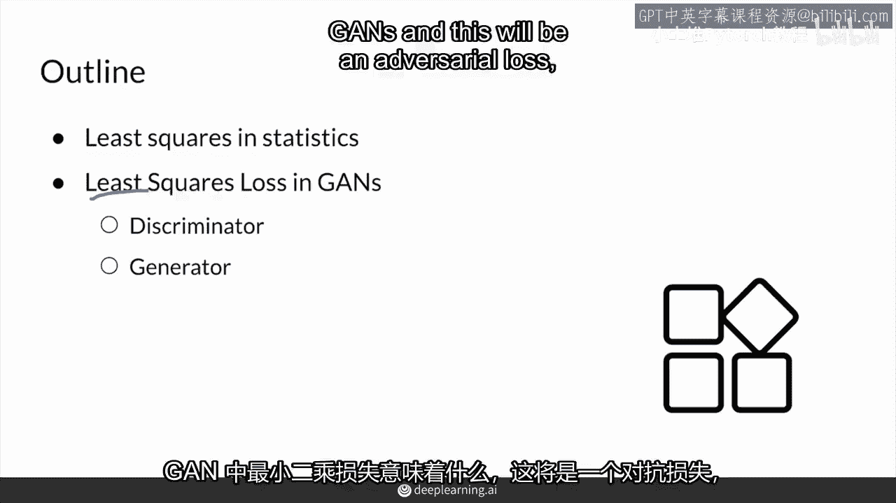

所以这将会取代周期中的bce损失或w损失，关于最小二乘损失和生成对抗网络的快速背景介绍。

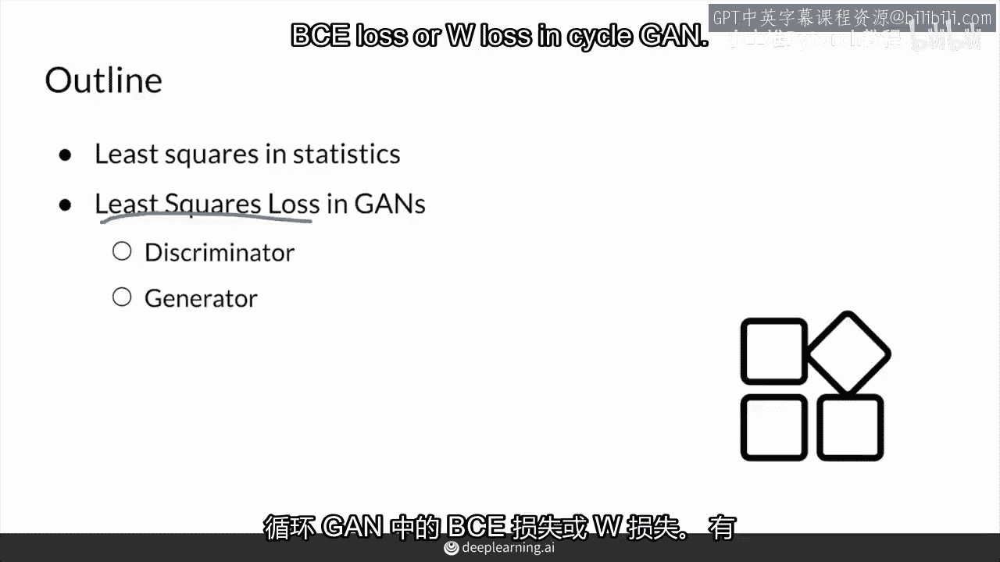

它出现在与wgamgp相似的点上，那是课程一周三，在这个时期，训练生成对抗网络（GANs）的稳定性是一个重大问题。

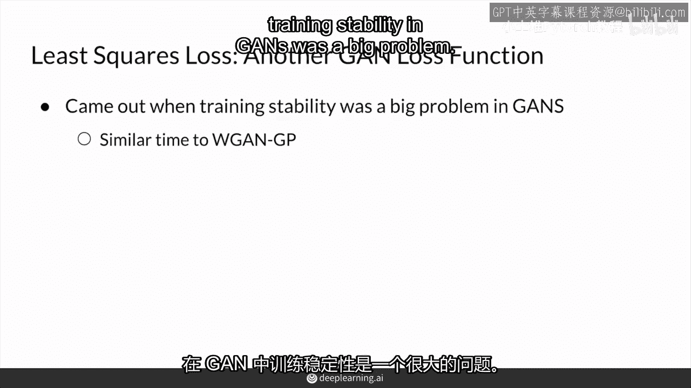

因此，最小二乘损失被用来帮助训练稳定性，即消失的梯度问题，您在BCE损失中看到的问题，然后导致模式崩溃。

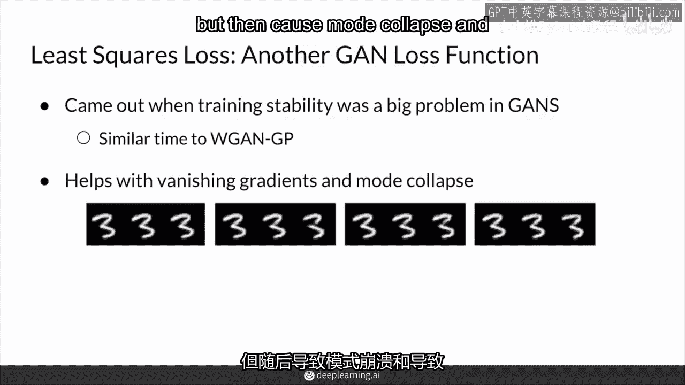

以及其他问题导致学习结束，这是您可能遇到的最糟糕的事情。

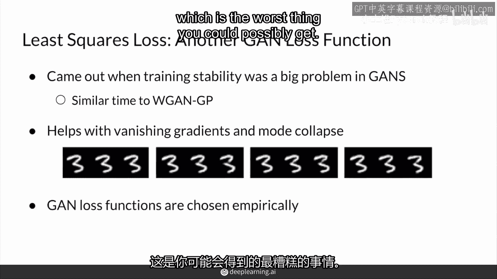

在深入研究之前，请记住，有许多GAN损失函数，特别是为了帮助训练稳定性，人们通常会这些损失函数进行经验实验，因为某些数据集实际上使用某种损失函数比另一种更好。

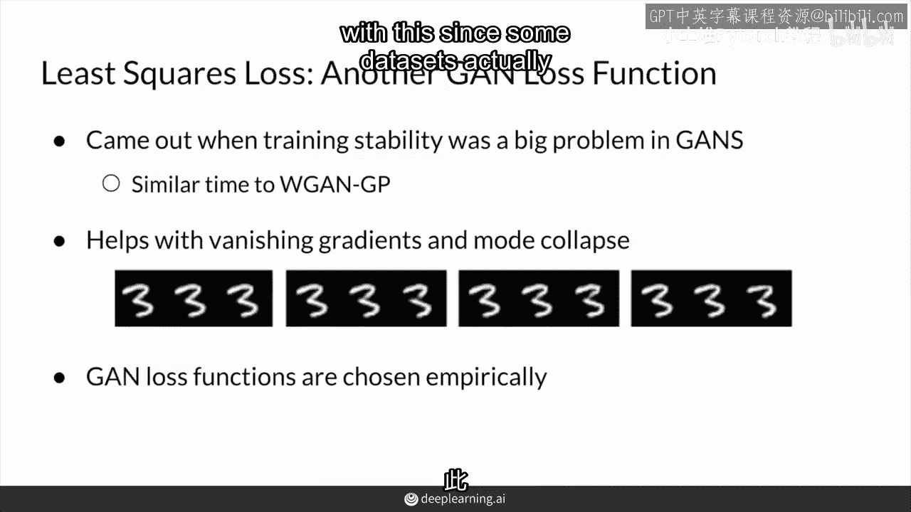

即使在同一模型上，记住这可能也会引入偏见，因为人们有不同的观点，关于什么是引用的更好，和不引用的更好。

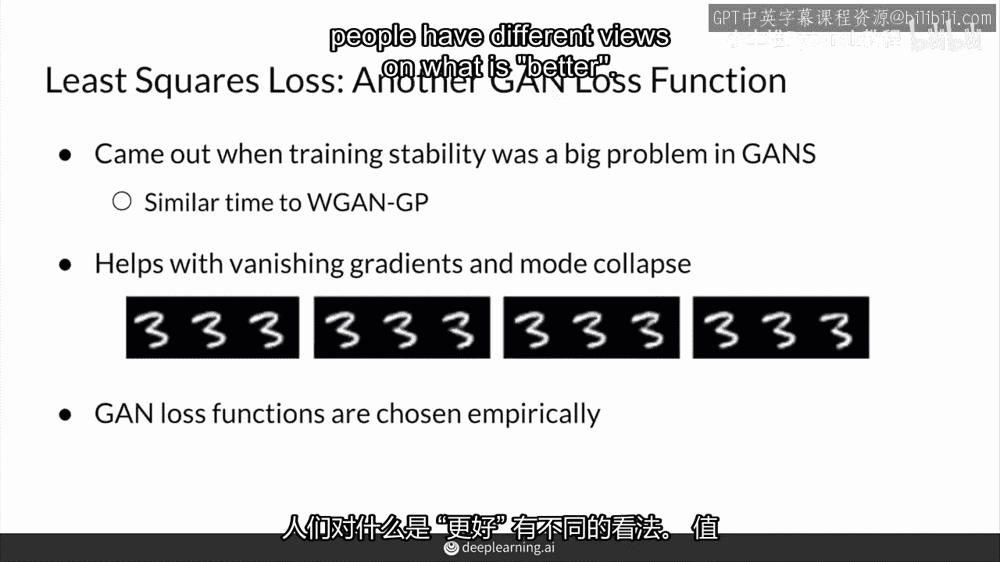

也是需要思考的一点，训练时间是人们训练生成对抗网络（GANs）的巨大组成部分。

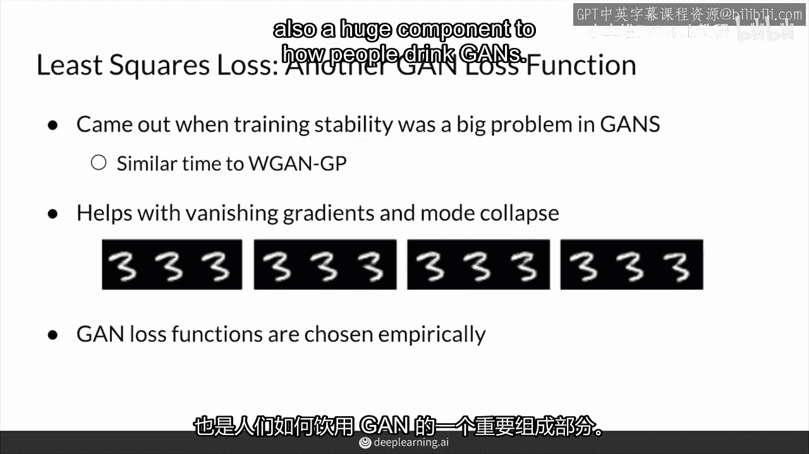

你可能注意到wmgp慢了一点，因为计算稍微复杂一些。

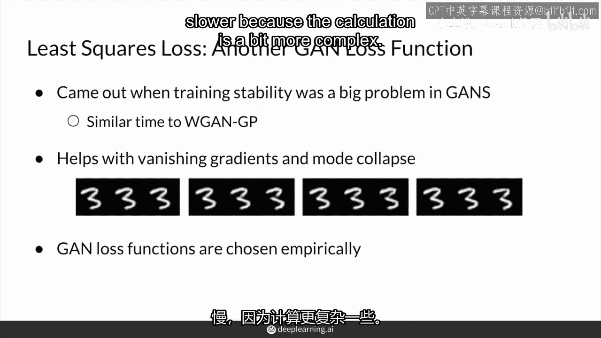

你可能在你的作业中注意到了这一点，因此这也有时会促使人们使用特定的损失函数而不是另一个。

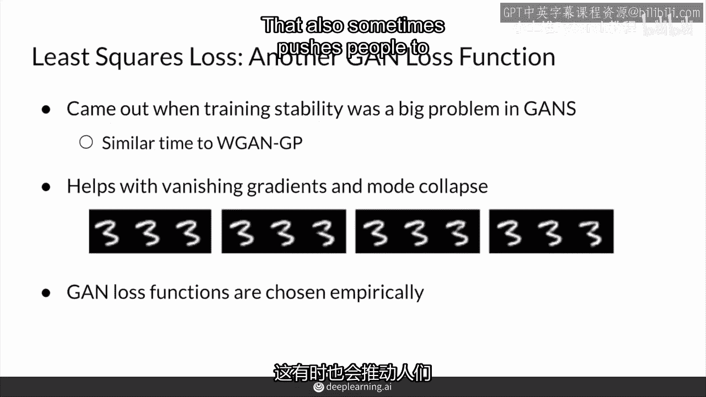

好的，最小二乘法是统计学中的一个很简单的概念，它是一种最小化平方残差的方法，这意味着它试图找到最佳拟合线，这条线与所有数据点之间的平方距离之和最小，这里有一个三个不同点的例子，你想通过它们画一条直线。

好的，酷，你可以通过找到每个点到直线的距离来做到这一点，所以你首先画一条直线，然后你找到点到直线的距离，具体来说，你想要查看它们的平方距离，你想要最小化那个平方距离，好的，所以你想要找到最佳拟合直线。

所以你画一条像这样的直线，这将比你看到的这里紫色的其他直线有大得多的平方距离，所以你得到平方和，总距离或每条线的成本，你是试图去做的，你通过最小化平方和来找到最佳拟合线，这就是最小化平方残差的意思。

这就是你看到的点与线之间的平方距离，通过计算所有数值的平方和并最小化这个值，你得到了你所能得到的最佳拟合线，所以，这是一个非常简单的概念，用于在几个点上找到最佳拟合线。

这在Gaman中的含义是你的线现在是你的标签。

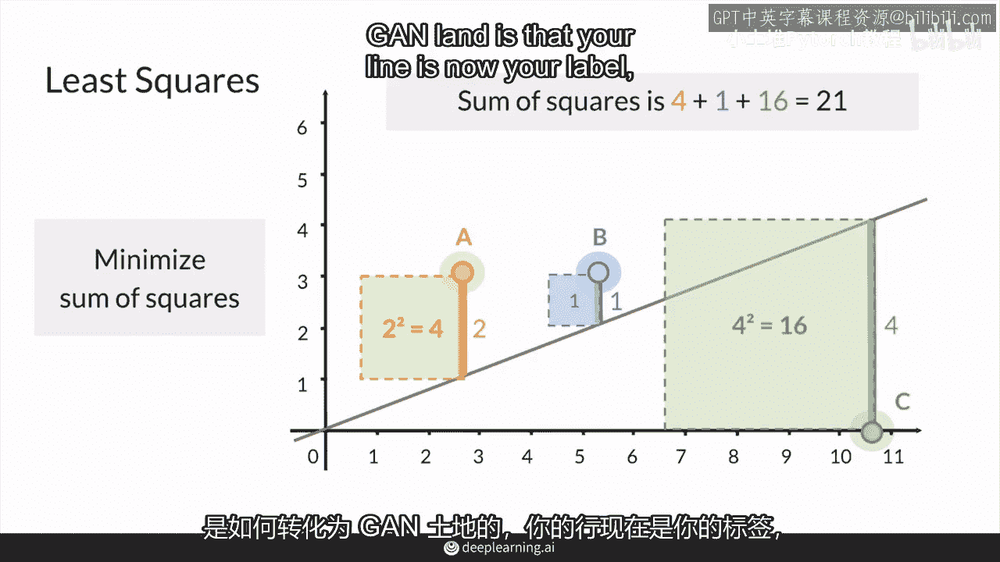

换句话说，你的真实或假的标签，所以从判别器的角度来看，标签1是真实的，而与这条线相对应的点，是你的判别器对真实图像的预测，所以点是预测，而线，你想要找到这个距离，基本上是那个标签。

你想要得到预测到标签的平方距离，并且你要做这一点，在许多不同的点上，所以你可以取许多真实图像的期望值，对于假图像，情况相同，但它的标签是0，这是非常一般的一种表达方式，当然。

cyan期望她正在输入真实图像，而判别器正在评估假图像，然后你做同样的事情，你在多个假示例上做同样的事情，这仅仅是多个z值传递给g，其中z可能是不同的斑马图像，你可以通过去掉那个0来简化这一点。

因为那就是零，这就是你的判别器损失函数，在生成器一侧使用最小二乘对抗损失函数，它与你看过的其他情况非常相似，生成器想要它的假输出看起来尽可能真实，它实际上想要了解它与1有多远，总之。

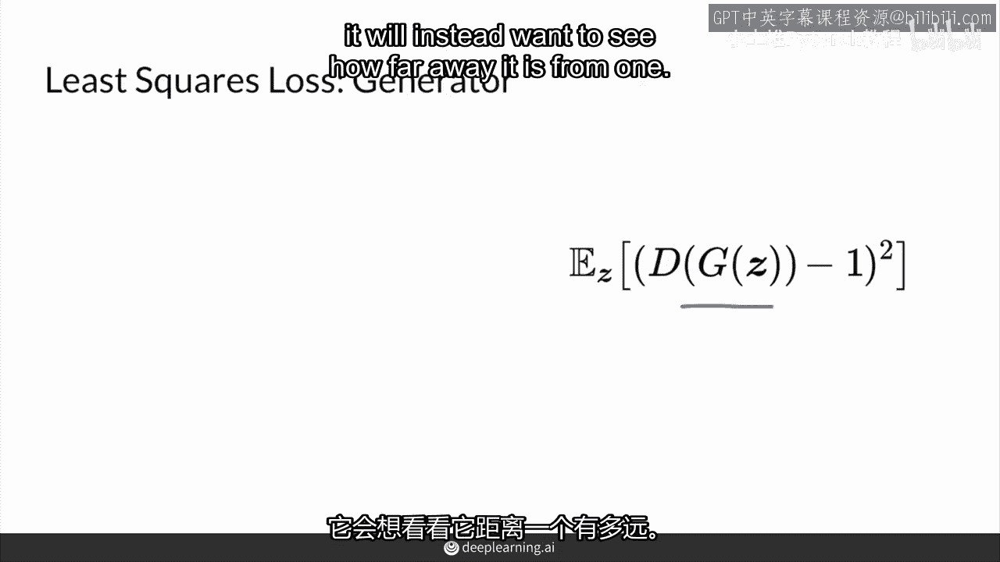

这些是在最小二乘对抗损失下判别器和生成器损失项，这可能看起来与你之前见过的损失函数相似，特别是BCE损失，但重要的是，你会看到这种损失并不平坦，就像你在BCE中的sigmoid中所看到的那样。

因为只有在判别器的预测恰好为1和0时，损失才会平坦，对于假情况，这里是0。

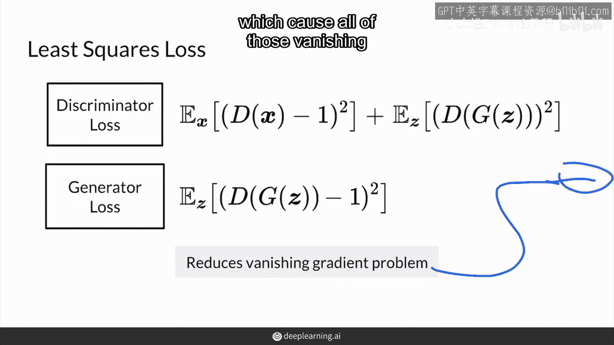

否则，它将采用平方距离，使用最小二乘损失不会导致BCE损失中看到的那种梯度消失问题。

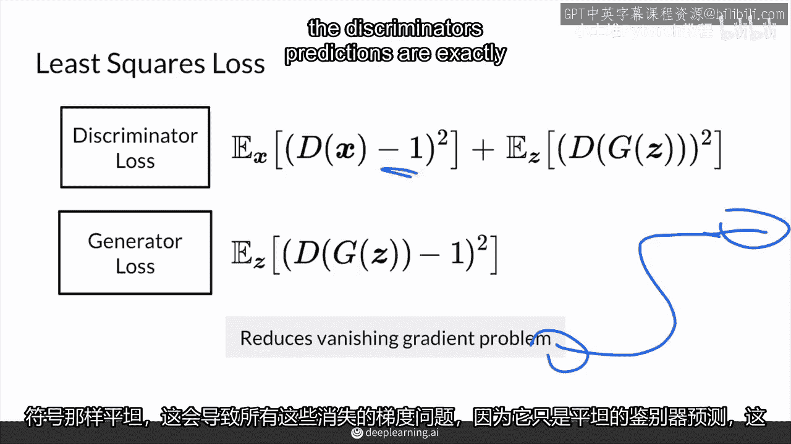

因此，最小二乘损失函数在大多数情况下，有助于解决BCE损失中看到的梯度消失问题，并且随着这个问题得到解决，GAN的训练稳定性得到了改善，对于那些可能熟悉的人来说，对于BCE损失中看到的梯度消失问题。

并且随着这个问题得到解决，GAN的训练稳定性得到了改善。

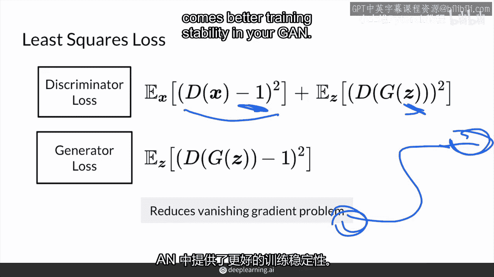

对于那些可能熟悉的人来说，这也被称为平均平方误差或msse，别担心，如果你不知道msc是什么，只需将其与您可能已经知道的主题联系起来。

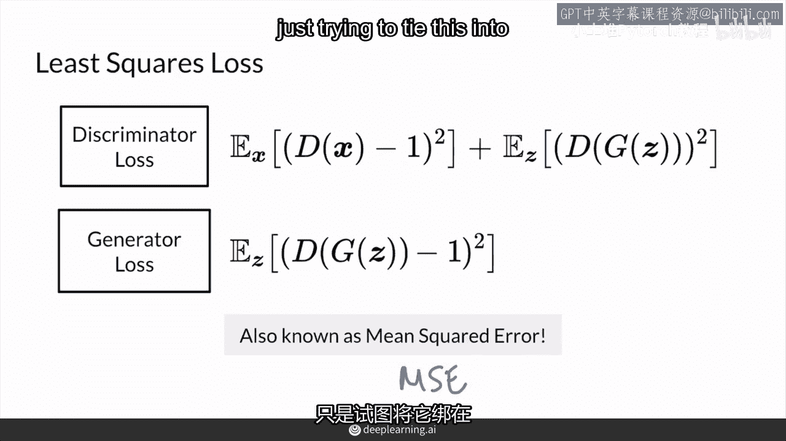

在循环gan的背景下，这看起来您有一个循环一致性损失项在这里与lambda，但您的逆向损失是您刚刚看到的最小二乘损失。

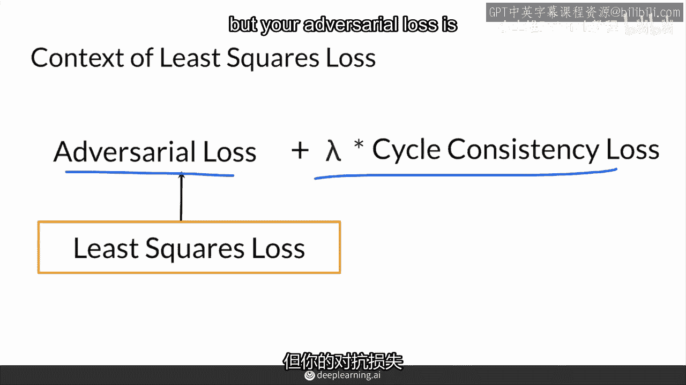

总结，您学习了最小二乘损失以及如何计算平方距离，这种损失在循环gan中用于其逆向损失，它比bce损失具有更少的饱和和消失梯度问题，因为它只在您的点在直线上时才平坦，这意味着您的预测是完美的，例如。

一表示真实，零表示伪造，任何其他地方，都将是平方距离，因此它没有饱和问题，您也在这个视频中看到了，最小二乘损失在生成器和鉴别器上的方程，但请记住这不是最终的损失方程，还有您之前学过的循环一致性损失项。

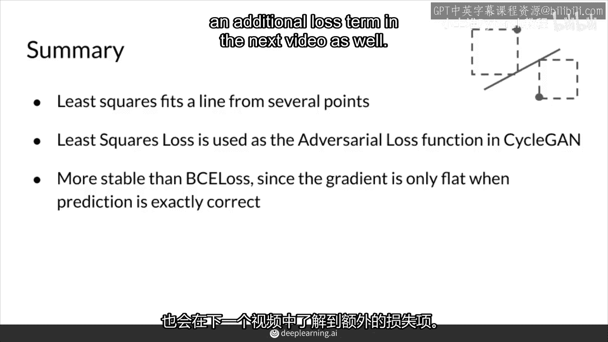