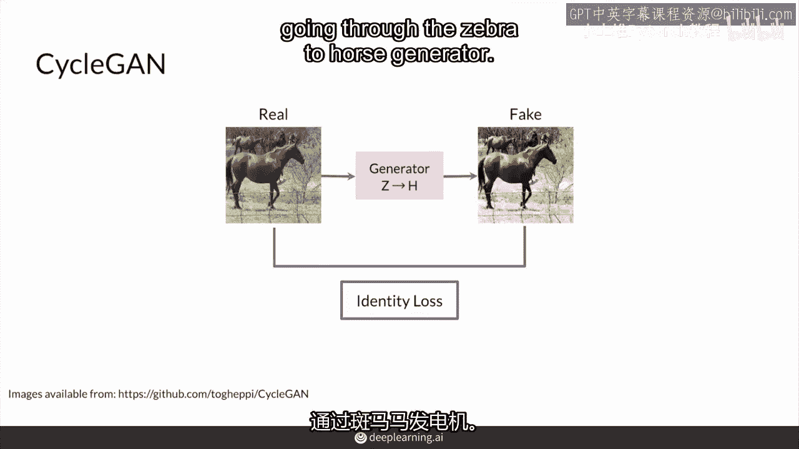
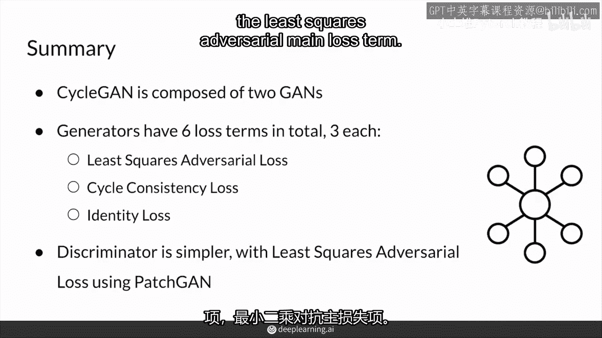

# P82：【2025版】82. CycleGAN把各部分结合起来.zh_en - 小土堆Pytorch教程 - BV1YeknYbENz

好的，现在是时候把你们的循环生成器组装在一起了，这由两个不同的生成器组成，带有循环一致性损失。

在循环生成器中加入了最小二乘对抗性损失。

这是您的主要损失项，然后是可选的身份损失项。

首先，我将以示例的方式展示这个过程，从真实的斑马到假的马这里，但这也是相同的，只是反过来，相反的方式，因此，首先输入你的斑马图像。

你用从斑马到马的映射器生成的是一个假马。

你的马鉴别者，然后看看这张假图片以及真实图片，它不知道哪些是哪些，输出。

一个分类矩阵，显示其真实或虚假的程度，它认为那些图像的补丁是。

这里使用的方法是最小二乘损失。

特别是对于真实的东西，这张分类矩阵充满了1，对于伪造的则充满了0。

这就是如何计算最小二乘对抗损失。

这是对判别器的，这是对生成器的，这个分类矩阵实际上全是1。

好的，除了最小二乘对抗损失之外。

你还想要把你的假马喂给另一个生成器。

这是从马到斑马的生成假斑马，以便你可以计算这个方向的循环一致性损失。

通过计算真实输入的像素差异来实现，并且这个生成的假zebra，因为它们看起来应该一样，因为你只应该在这两个生成器之间转移风格。

同样，反向方向也会这样做。

所以这是从马到zebra，然后回到马以保持循环一致性损失。

然后当然他们的zebra鉴别器也会应用。

如果你选择为你的任务使用身份损失，你也想让你的zebra通过后向生成器。

从马到zebra以得到一个zebra，你计算像素差异。

并将其保存为身份损失，同样，你应该对通过斑马到马的生成器进行相同的操作。

哇，添加项到损失函数的美丽之处。

它如此简单却如此有效，总共有六个损失项，都在青色中。

你有你的均方根对抗损失，适用于你的两个生成器。

还有循环一致性损失，这适用于两个方向，最后，你有每个生成器的身份损失。

这就是整个生成器损失函数的构成。

这适用于你们两个生成器，所以两个生成器，同时每个判别器将专注于这些中的一种。

这个适用于马判别器。

这个适用于斑马判别器，因此，总结来说，Sean由两个GAN组成，它们形成一个循环。

它们依赖于彼此来尝试计算所有不同类型的损失项。

实际上，生成器总共有六种损失项，最小二乘对抗主损失项。

循环一致性损失，每个生成器的可选身份损失。

而判别器则相对简单，仅使用补丁的最小二乘对抗损失。

