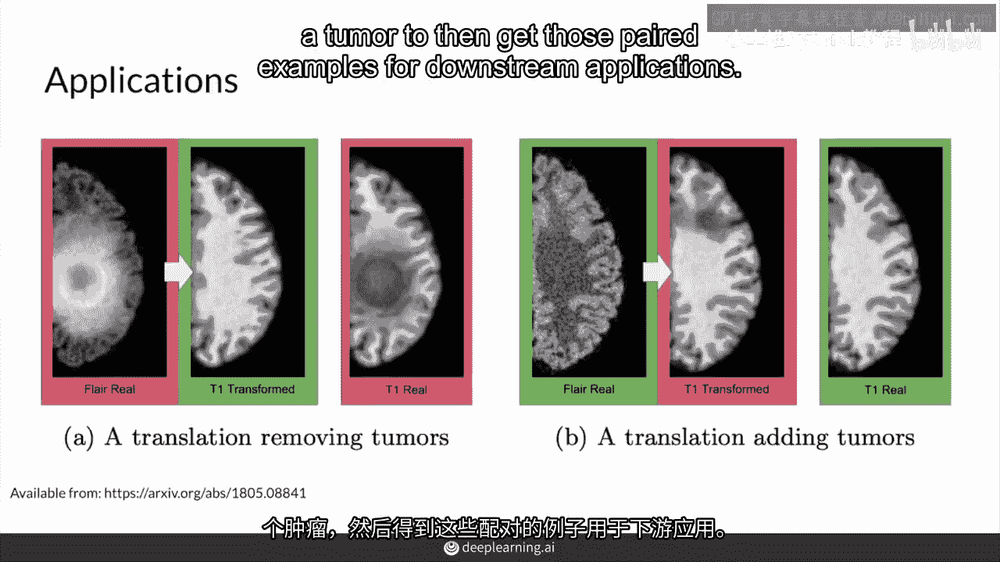
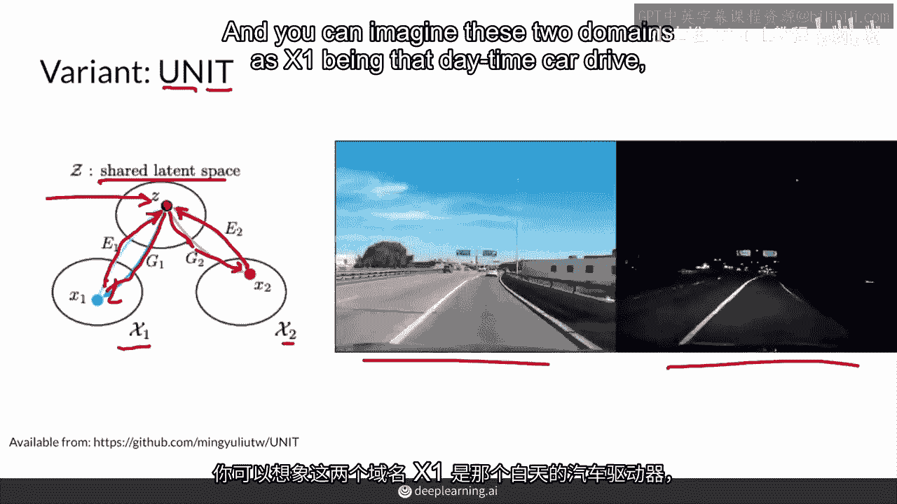
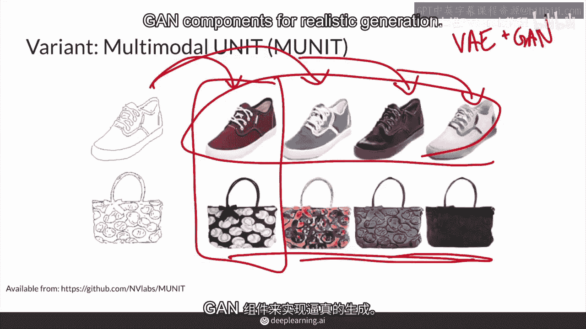

# P83：【2025版】83. CycleGAN应用及变种.zh_en - 小土堆Pytorch教程 - BV1YeknYbENz

现在你已经了解了关于缝合的知识，这个视频是为cyclogenapplications及其变体而制作的。

首先，你将看到一些cyan的应用，然后，你将看到一些未配对图像翻译的变体。

所以，can可以用于许多不同的事情，包括你在snapchat上看到的各种滤镜，变老，改变某人的性别感知，使一匹马变得神奇，改变场景的不同季节，创造一种特定的绘画风格就是风格迁移。

就像这周一开始时你看到的莫奈风格的照片那样，或者反之亦然，这也意味着场景中物体的改变相当可靠，而我认为这个马到斑马的GIF真正引人注目的地方，是它确实在整个GIF中保持了这些条纹，非常完美。

几乎没有干扰到栅栏，所以除了即时的媒体应用，青也是一个常用的数据增强技术。

例如，现在找到有人患肿瘤的配对图像真的很难。

但同时还要找到没有该肿瘤的图像。

这种预知能力我们现在可能无法预测，所以这可能是获取一些数据增强的方法。

所以你可以，当然可以，创造一个肿瘤。

或者消除一个肿瘤，以便为下游应用获取那些配对示例。

用于分类、肿瘤分割以及监测肿瘤的生长。

这在医疗应用中非常重要，首先你看到移除一个肿瘤。

使用循环可以移除这个大块，然后这里你正在添加肿瘤。

再次在数据增强中，Sean能够生成极其逼真的示例，例如，这里有一个ct扫描，你有一个专家做了正确的分割。

Segogan能够很好地产生这些分割，在使用标准增强时，你根本无法到达那里，实际上你根本没有正确分割地方，Sean并不是唯一能够进行无配对图像图像转换的模型。

有一种变体称为Unit，它代表无监督图像图像转换。

你可以认为无配对图像图像转换是无监督的。

因为你没有标签，这是白天和夜间场景中汽车驾驶的转变。

这个模型中的关键洞察被称为共享潜在空间。

这基本上意味着给定潜在空间中的噪声向量z。

它可以在域x中生成图像，因此它可以生成那个图像。

并且有一个映射回那个延迟，例如，同样的潜z也能映射到另一个域。

说x2并且也能映射回那个潜。

你可以想象这两个域作为x1是d时间的驾驶。

而这个x2是夜间的域。

并且x1和x2实际上只是共享潜空间中的风格。

就是说，我们可以共享相同的潜，相同的z并且还能产生那两个不同的风格。

我们可以销售相同的内容，并且还能产生那两个不同的风格可以来回映射。

不仅限于一个方向并且更进一步是多模态单元或多模态单元，而多模态的意思是从一个域的草图。

到第二个域的多种模式，单元不仅能找到这个映射。

还能找到这些其他的。

并且真的很酷，实际上你从来没有告诉模型关于你所有的不同风格。

例如，它能够找出你所有的不同鞋类风格。

并且能够映射这个不仅限于一个而是两个，并且再次，这真的很酷，因为它是无监督的，你不必标记鞋子之间的差异，它自己找出。

作为一个快速说明，这两个技术单元和单元依赖于编码一个图像或风格。

所以它们从vae方面获得灵感。

同时使用gan组件进行真实的生成。

总结，循环的扩展存在，包括单元和单元，它们使用共享潜空间的假设。

以及慕尼黑案例多模态生成这真的很酷，GAN有很多应用，特别是在艺术，医疗领域。

视频和视频游戏，我迫不及待地想看你生成什么，我希望你推特我们deep learning。

