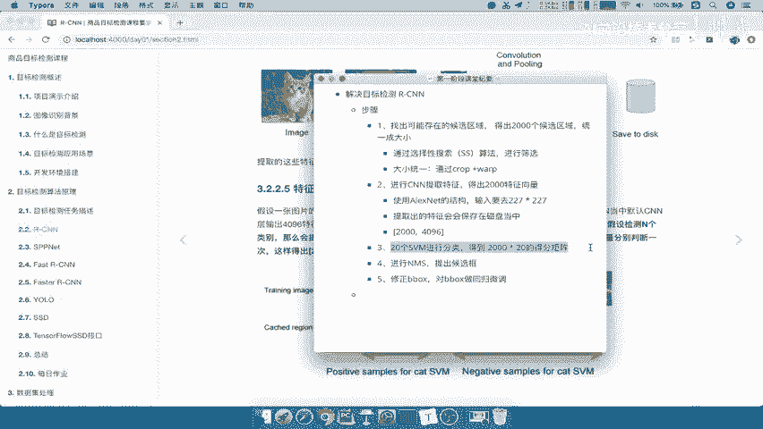
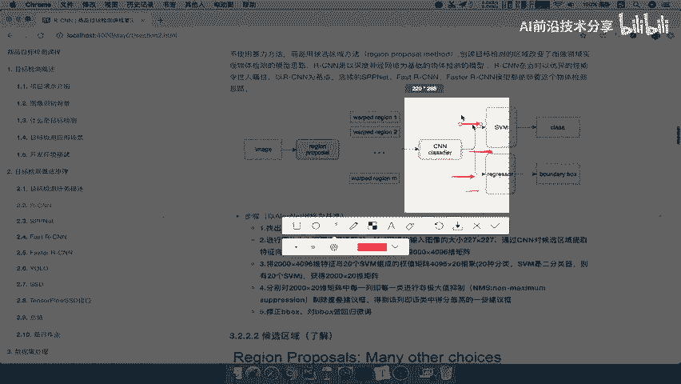
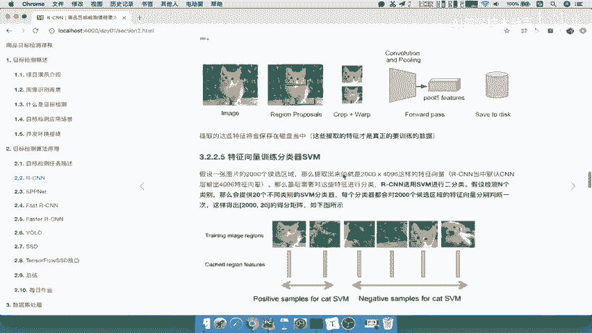
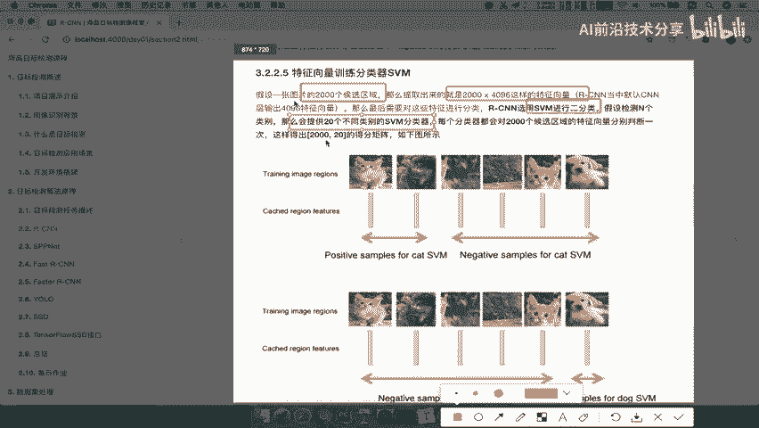
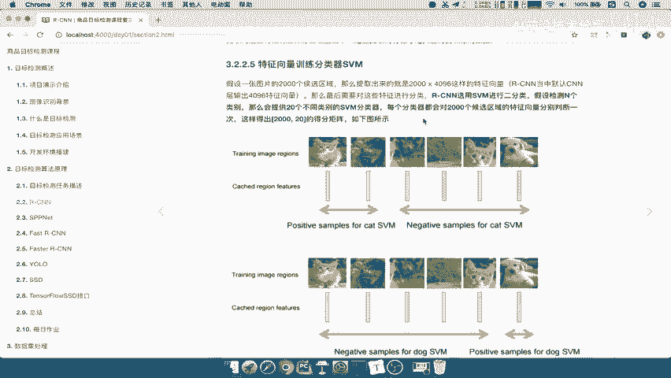
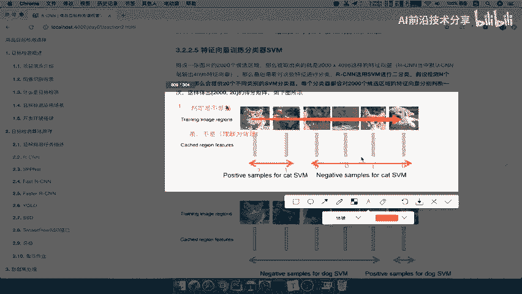
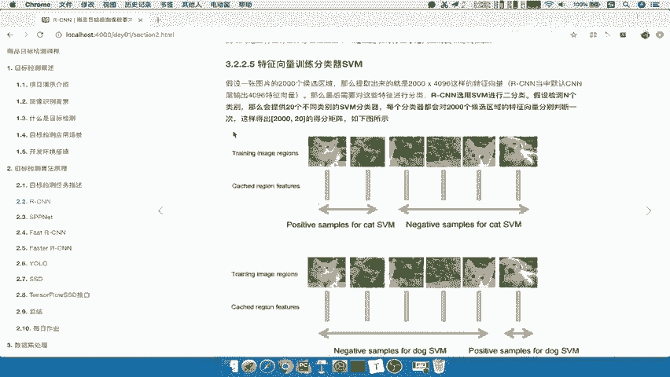
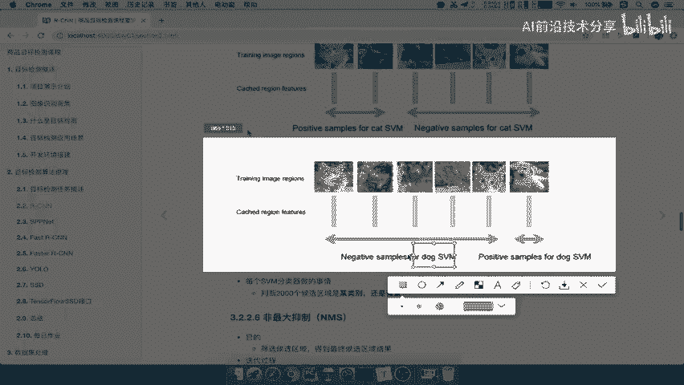
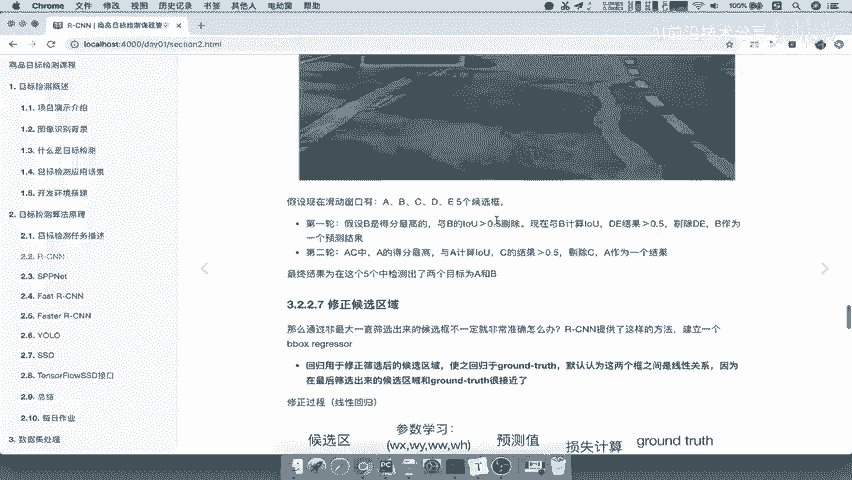

# P11：11.04_RCNN：SVM分类器11 - AI前沿技术分享 - BV1PUmbYSEHm

好那么接下来呢我们进入第三步，那么第三步呢是进行一个SVM进行分类，那么这个步骤呢是我们的啊，这个算法当中的一个重点。

它是怎么去做的啊，好，那么也就是说我们的这个结果已经到了，这个地方，是不是这个地方提取出多少个2000个特征吧，2000个特征，然后每一个候选区域的特征是不是要经过SVM。

经过regression，它也是它也是好，那我们来看SVM到底在做什么事情，那么也就是说我们一开始提出了，就是说把它变成了候选区域，然后定义为一个什么分类问题的吧。

那我们来看特征向量，我们先简单的啊看一段这段话，然后看一下这个图什么意思，等下我们去详细去解释，假设你有2000个候选区了，提取出来4096的特征向量干什么呢，我要对这些特征向量进行一个分类。

怎么进行分类，用SVM对每一个特征向量都会进行分类，它是一种二分类，我们说了SUV嘛呢，主要是一种二分类，那么假设N个类别，那么也就是说啊，我们最终目的里面一共有多少个类别好，那么所以有同学就问了。

刚才那个20是怎么来的，就是这么来的，为什么会有20啊，因为我们RCN当初在测试的时候，定义的就是在20个目标类别的时候，就是说目标检测啊，一共检测20个类别，没有其他类别了好那么这就是20的来源。

然后每个分类器都会对这个2000个候选区域，进行特征向量，分别判断一次，这样得出2000和20的得分矩阵。

什么意思呢，我们先把这个20这里先写的啊，20代表什么，20代表代表你的目标，检测当前数据集一共需要检测20种类别，我们可以知道啊，有比如说你知道这个熟悉啊，CRFAR数据集有100类别的对吧。

有十个类别的哎，这个就是你要检测类别好，那我们接着来解释这个过程，它有20个类别，具有20个分类器。

20个分类器，SVM分类器到底干什么呢，它要区分这样，首先第一个分类器，第一个分类器他要去对2000个，注意了一个分类器对2000个候选区域，比如说这里列举的啊，这个地方列举的是2000个候选区域啊。

那么每个候选区域都要进行一个SVM分类，他要干嘛呢，比如说这个SVM是判定是不是猫的，它只有两个类别，就是是不是猫呢，我们把它称之为背景，也就是说它是猫或者不是猫啊，或者称之为背景也可以啊。

你不不称之为背景也可以，理解为背景，好是就是猫对吧，比如说这一只好，我得出是猫是那比如说记为1GV1，然后呢这一只也是好GV1，这一只呢不是啊，这个图片不是对吧，这个图片也不是这个图片哎是一。

然后呢这个图片啊不是，那么也就是说这个SVN，第一个SVM分类器干嘛，主要是不是去进行判定，是不是某个类别啊，是不是猫的好，这个记住啊，这个分类器判定好之后，它会得出这样的一个结果，S v。

我们知道S变量，就是利用特征值和目标值来进行训练，然后得出我们的这样的一个，SVM的一个分类器吧，哎然后去进行一个分类好。

那么这个地方呢我们把它保存一下，SVM分类器，这个对啊，候选区域分类介绍，那我们再来看。

那么这是一个分类器吧，那还有第二个分类器呢，比如说第二个分类器专门用于哎狗的，那所以我们能理解了吧，每一个分类器，每一个类别的分类器，会对2000个候选区域特征进行哎，进行一个这样的一个分类。

那所以SVM它得出的就是一个概率，假如说SVM的这样的一个分类器已经训练好了。

那我们来看一下，这个过程得出的结果会是怎么样的，首先我们来写一下你的特征，是不是候选区域，现在已经变成了2000个，2000×4096，那么这个地方呢我们大概啊画一下。

比如说这里是这里是第一一个候选区域啊，比如说这是第一个候选区域，2345好，我们再标记，一直标记到2000，那么这是我们总共的候选区域，那么我们的SVM看一下有第一个SVM好，比如说SVESM2好。

一直到多少呢，SVM20好，总共也就是说你是类别判断类别一的类别一，比如说这里是猫啊，这里是猫，那么然后呢这里是类别20，比如说吧他这里是一个车啊，比如说是车啊，好那么每一个SVI。

这个SVI对我们刚才比如说在测试阶段啊，你是不是输入了这样的一个，2000个候选区域特征，然后SVM他已经训练好的啊，假如训练好的SVM是不是就可以给你一个评分，给你2000个评分，哎SVM1的一个。

比如说P1吧，他得出的是一个概率值对吧，一个概率值，好这里是P2，那么这后面呢我们直接省略了啊，不写了，一直到P2000好，那么这样的话我们得出了一个什么，我们得出了是一个2000×20的一个矩阵吧。

哎看到是不是，又得出了一个2000×20的得分矩阵，能理解吧，这里含啊，这样含20个，这里啊2000个好，那么得出这个得分矩阵干什么呢，就是进行筛选的，就是进行筛选的，大家理想啊，这个得分矩阵哎。

就是我们每个类别的一个可能性了对吧，那接着他要进行一个筛选，所以我们这里写一下，得出两千两千乘以20的得分矩阵，接着呢他就会在后续的操作进行，我们来看一下得分矩阵之后呢，它是要经过一个非最大一次。

也就是在我们的第四步，在这里分别对2000×20的矩阵中，进行非最大抑制啊，非极大抑制，剔除一些重叠的候选窗，那么NMS也是一个非常重要的一个过程，好那我们接下来啊。

