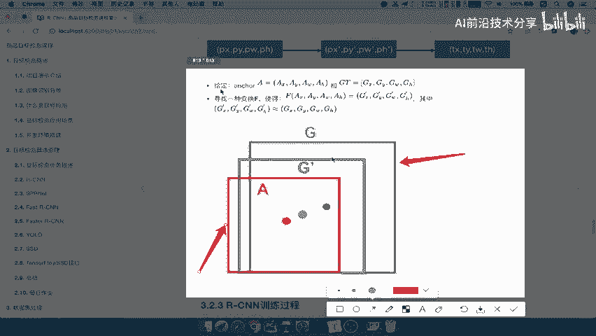

# P13：13.06_RCNN：候选区域修正13 - AI前沿技术分享 - BV1PUmbYSEHm

好那么接下来我们来看一下修正候选区域，那么这里遇到问题是什么呢，我们的候选区域都是由这个选择性搜索，这样算法来推荐来这候选区，然后到我们的这个CN啊，选出特征，然后分类，然后NM。

但是这些候选区域就一定准确吗，哎不一定，即使他的得分或者他的结果是比较好的，那是呢我们的这个候选区域的这个框，跟我们的gt啊，就是说grand choose这个框可能还会有点误差。

所以最终我们要自己去手动的啊，或者说自动的去调整啊，调整一下这个框的一个它的一个位置，使得这个位置呢，能够更接近于我们的ground truth，那么这个过程呢我们可以称之为回归过程啊。

就b box的regression，如果你了解这个回归啊。

这部分就非常简单，什么意思呢，这里就用回归啊，用于修正筛选后的候选框，使之回归于ground truth，就是回归于它与之对应的那个ground truth，默认这两个框之间是线性关系的。

那也就是说默认这两个框肯定是比较相近的啊，之间是一种线性关系的简单的一个偏移。

那所以呢我们来看一下。

这里就是修正的一个这样的一个啊过程，我们的ground truth是我们的目标候选框啊，我们把它变成红色啊，目标候选框，这里呢就是我们的目标值，然后呢这边左边是我们的啊，候选区域，那么我们要用互选区域。

跟目标值进行一个什么呢，回归的一个计算啊，或者建立一个回归方程，然后回归我们知道学习的这个参数是什么，哎就是这样的一个几个参数，然后这参数拿来跟它进行一个运算，得出一个预测值。

使得这个预测值呢跟目标值非常接近的啊。

就无限的一种接近好，那这个过程怎么理解呢，我们可以通过这张图就知道了。

假设你的gt是这种绿色的啊，注意了，gt是绿色的，A是你的select serve search，它返回的这样候选关，你只要利用回归这部分回归做什么呢，就是使得这个框能够达到跟G能够接近。

唉得到G1撇啊，使得得到这种变化嘛，就是一种线性回归变化。

得到这个记忆撇好，那么所以这就是我们的修正候选区啊，这个过程呢就是一个回归过程，所以呢修正b box，对这个b boss进行回归的一个填微调，所以我们就是通过哎线性回归，我们的特征值是我们的候选区域。

然后呢我们的目标值是哎gt啊，对与之对应的啊对应的gt，然后建立回归方程，建立回归方程学习参数好，那么这就是我们最后的RCN当中的最后一步啊，修正b box以及对b box进行调微调好，那么这样的话呢。

我们将RCN的整个啊过程给捋了一遍，然后呢对于每一个过程的细节都给讲解了，那我们来看一下啊，最终总结一下啊，简单总结一下，第一步我们是不是要找出候选区域，通过这些算法，然后把大小调整。

然后候选区域呢通过训练好的这CN得出特征，特征得出之后呢，啊我们就可以进行DSVM打分了，打分好之后哎进行NMS，然后呢修正我们的这样的一个啊我们的b box好。

