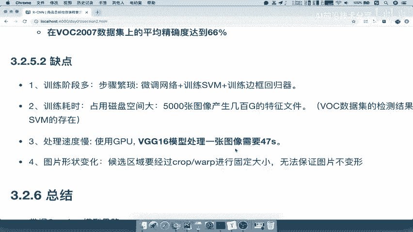
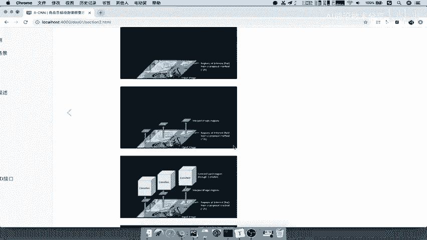
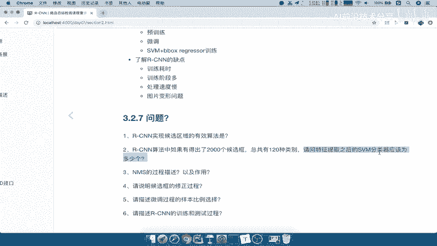

# P15：15.08_RCNN：总结、优缺点与问题自测15 - AI前沿技术分享 - BV1PUmbYSEHm

好那么讲完这么多对吧，我们最后来总结一下RCNN啊。

最终来总结一下它的整个流程，这个流程必须清楚啊，看到我们这里放大的图。

首先第一步输入图片，第二步在这个基础之下使用SS方法，是不是选出候选区域啊，好选出候选区域呢，这也叫regions of interest啊。

你的感兴趣区域候选区域，比如说好选好之后。

每一个候选区域都要经过web image regions，然后把它弄成一个大小是相等的一个图吧，哎每个都是特征向量特征相等的。

然后每一个特征经过我们的卷积神经网络。

是不是就要输出特征了诶输出我们的特征。

然后到我们的SVM，然后到我们的regression能理解吧，这就是RCN的整个过程能明白吧，啊一定要把这个过程搞明白，包括我们这里面的细节啊，细节清楚那些数字大小，包括SPM这个分类器怎么去筛选。

NM怎么去筛选啊，一定要理解好。

那么他的表现呢，就是他呢这个14年被提出对吧，在work2007数据集这个后面会介绍数据集，他的一个精度也就达到66%，你可以把它理解成就是一个准确度了啊，可以把它理解准确度66%啊。

好虽然说这个准确度并不是特别高，但是也是突破，相比之前没有用这种深度学习网络的时候呢，啊它的效果要好很多很多好，但是啊我们但是RCN的缺点也非常明显。

我们自己来想一下缺点有哪些，从我们刚才讲的整个过程，我们来仔细想一想，我们有哪些缺点，我们提个问题啊。

你想一个明显的就是这个训练是不是很麻烦。

训练要训这么多，又要去干嘛呀，正负样本准备对吧，哎预训练UV调SVM还要单独训练，b box单独训练，是不是呀，而且SVM训练的时候我们说了。

你的特征都要先去保存在本地的，所以刚才这个过程当中，你为什么这个地方要保存到本地，就是因为啊我们SVM的训练啊，他需要这个特征都是要放到本地，然后再读取的好。

那所以我们来看一下这里举的缺点啊。

训练网络阶段太多了啊，非常麻烦对吧，你自己要做一个这样的一个网络的模型，要去训练，要一步一步的训练，训练耗时不用说了，它呢占磁盘用户空间大，5000张图片就会产生几百G。

这是在work数据集里面的一个检测结果啊，因为SMVM的存在，需要把特征保存在这个本地，因为SVM存去训练，肯定要读取这样的一个这个特征啊，它不能跟这个CN一起去训练的，然后呢这是他的一个。

然后他的一个消耗耗时对吧，处理速度呢也非常慢的，它使用GPU啊，在work on0407的这个数据集上面呢，VGG16的模型呢，处理一个数据集需要47秒，也就是说测试一张图片，从输入到输出。

预测结果就是你预测这个候选框有哪几个，他需要47秒，这个时间是不是太长了，这用户能等待吗，肯定不能等待，然后以及图片的形状的变化，即使你已经使用了比较好的方法，但是还是不能保证图片不变形，能理解吧。

哎所以这种方式呢的缺点太多太多，正是因为RCN的缺点有这么多，是不是肯定有改善的空间嘛，才要一直到我们的什么哎，比如fast s n faster s n u l SSD才有这些好。

那么这就是我们的这个总结，好我们自己呢也写一下啊，RGCN的，我们这里就直接写它的缺点啊，缺点，其他过程就不说了，缺点就是一个我们就几个关键词吧，训练速度慢，然后还有什么占用空间大，磁盘空间大。

然后还有什么呢，你的这个图片的变不变形呀，啊还有你的处理速度慢对吧，训练阶段多图片，变形好，那么这就是RCNN的一个总结过程好，那么这样的话呢，我们这部分呢把RCN的整个过程讲完了，最终啊我们总结呢。

我们来看一下自己这一部分啊收获了什么东西。

第一个就是我们说了解决思路，是不是对目标检测怎么来提出解决思路，是不是一个o over feit模型，提出了滑动窗口的一个概念吧，然后我们的RCN的整个过程流程啊，不再重复了，掌握它的训练过程。

预训练微调这两个什么意思，SVMREGRESSI这个预训练重点啊，重点是这两个啊，这两个好，那么了解SAV啊，这个RCNN的一个缺点啊。

训练耗时阶段多啊，图处理速度慢，图片就并行，问题好，那么讲完这么多，肯定有同学说我这里面到底该掌握些什么，或者说我记住了哪些东西，那如果啊我们这样的话呢，我们通过一些问题。

如果你不知道自己啊应该哪些东西是记住了，没有记住，那我们通过一个一些问题来自己去检测啊，这几个问题就是你能不能对着这几个问题。

把你的答案回答出来，这里面的答案都在这前面的介绍当中能理解。

比如说实现获取区域的算法啊，你刚才虽然知道哦，有ss select search，那么RCN当中提出，如果有2000个互选框，共有120个类别，请问特征提取之后，SVPM分类器应该有多少个。

我们说来SN分析有多少个这个地方的答案。

我们把在这写一下，是不是120个，我们需要120个SVM分类器吧，NM的分这个描述过程不说了啊，这个我们说的非常详细了，后循环的修正过程是不是一个回归过程对吧，请问微调过程的。

微调过程的样本比例选择是不是一比三啊，啊一般的是一比三一是什么，是不是正样本，三是负样本吧，描述RCN的训练和测试过程，这个我们不用说了啊，对着上面去行行行讲解，所以你拿到这些问题啊。

你去自己去测试一下，你就知道好RCN5应该掌握一些什么东西好。

那么这就是我们的结果，我们把这个这个刚才写的这个答案啊，我们写在这里。

我们把它保存一下。

好那么我们再来看的啊。

这样的话RCN都结束了啊。