# P16：16.01_SPPNet：与RCNN的区别、网络流程16 - AI前沿技术分享 - BV1PUmbYSEHm

那么接下来我们就要看s p p net，这个呢也是一个改进的啊，在RCN的基础之上改进的，那我们就想到啊，它需要去改进哪些地方，或者说他已经呢改进了哪里好，那我们来看这个。

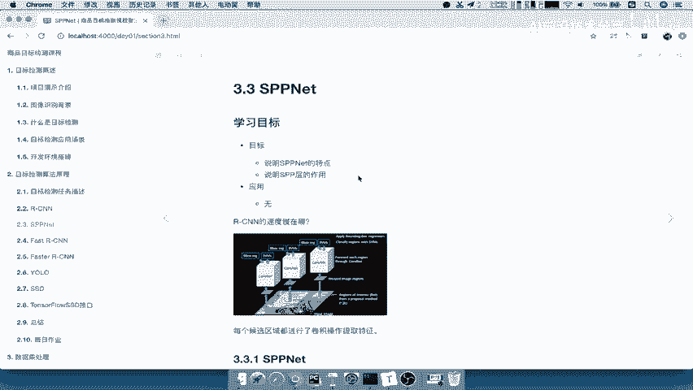

那么这地方的学习目标呢，就是说明s p p net一个特点。

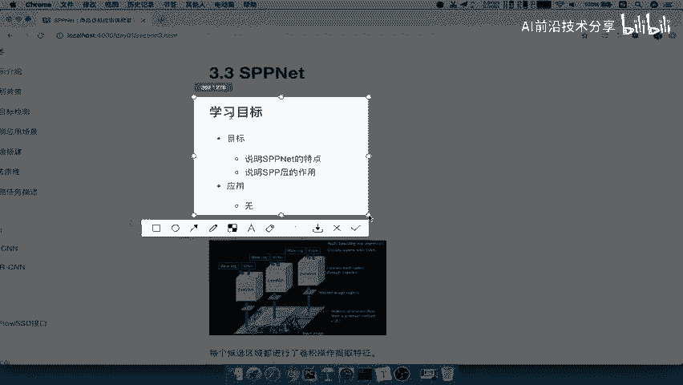

以及SPP层的一个作用，那么我们来看，首先我们来提出一个问题。

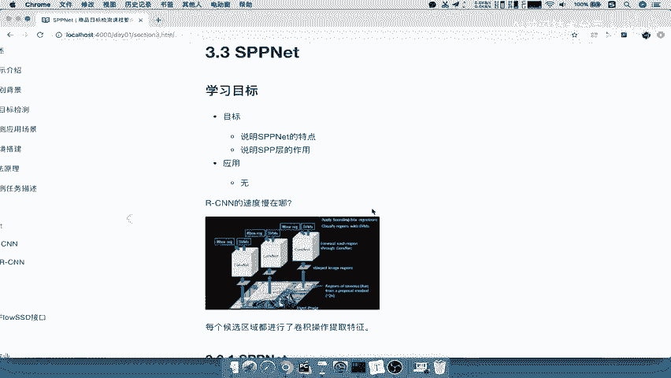

来看到RCNN的速度慢在哪里啊。

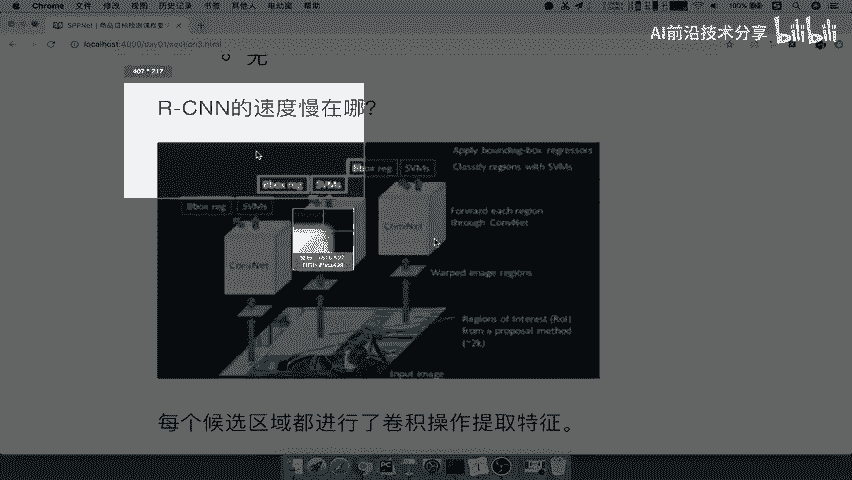

我们这个地方应该再往上翻一点啊，好。

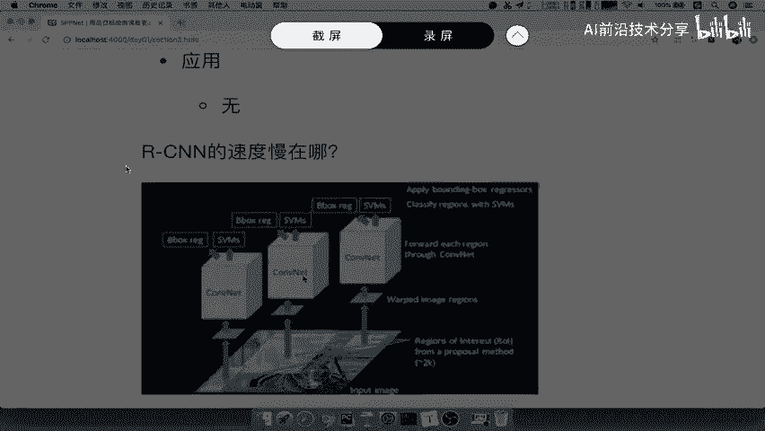

RC的速度能慢慢慢在哪，我们从这张图里面，你看到这张图，你觉得哪个地方最慢，很多同学呢这应该啊应该能猜到哪个地方慢，哎应该就是我们的卷积，我们说深度学习的卷积层啊，卷积的网络CN它呢就是你训练慢的原因。

你想想这个地方哎就是啊它的原因了，那么为什么呢，我们再仔细想一想，再深入想一想，你提出的候选区域一般多少个，我们说了RCN单独定义的时候呢，就是说定了2000个，2000个候选区。

每个候选区都要经过卷积，你想想这跟一张图片经过卷积，你想哪一个是省时间，哪一个更省时间呢，唉肯定是一张图片更省时间，你这个参数量也不一样了，你的这个啊，并且你毕竟2000个候选区加起来的面积。

肯定是要比你的这样的一个啊，总的图形面积也多，而且你的计算量也大，所以s p p net呢它的一个出发点，也就是在这个地方先去把RC的速度给提高啊。

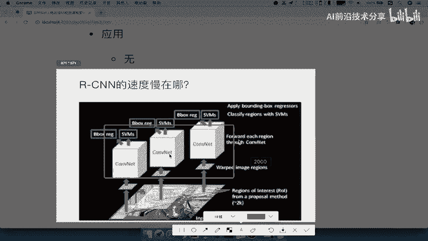

RC的速度提高就是他的一个出发点，好那么我们来看s p p net，先来看下它与我们的RCN的一个对比。

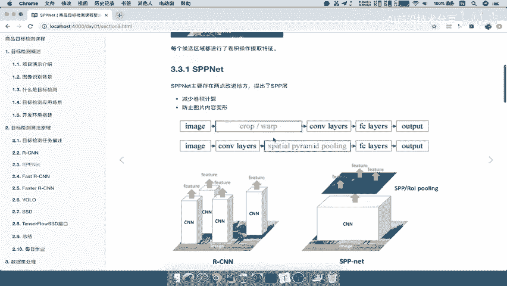

他提出了两点改进的地方啊，一个是减少卷积计算，一个是防止图片内容变形，我们大家就都会去讲啊，好我们来看RCNRCN是不是每个候选区域，是不是都得出一个feature，Feature。

feature feature好，但是呢我们的s p p net右边是s p p net，那么你看下它，它一张图片先去经过CN得出一个特征图，哎得出一个特征图，然后这个特征图里面又有一些feature。

Feature feature，也就是说不是每一个候选区域都经过这个吧，你看一下这个过程，RCN是这个上面的image，这上面应该是我们的RCN啊，RCN啊，image候选区域是不是要把它调整大小。

然后经过卷积，而我们的s p p net是不是经过直接经过卷积，然后通过一个s p p ping啊，就是说这个SPPPY呢我们也会说的啊，到全连接层，到输出输出，然后再进行后面的训练。

这就是s spp net，所以s spp net跟我们的CN的一个区别在于，两个地方减少了卷积计算，以及将我们的图片的变形的一个操作啊。

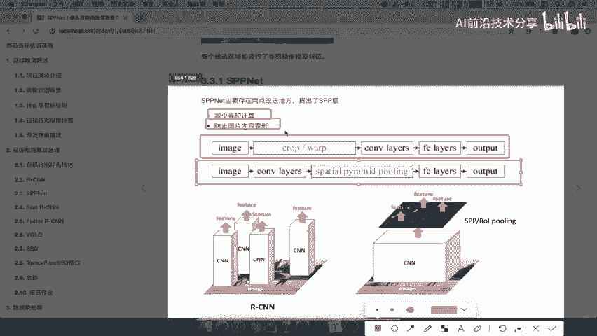

去除了好，那么所以我们在这里总结一下，我们在这里应该写上啊，我们的好RCNN的问题解决一方法一，或者说一个思路一吧，就是说我们的这个速度慢啊，怎么解决，还有我们的图片变形。

好那所以提出了SPP网络对吧好，那么这个网络呢前面的名字啊，就是这个spider parrot啊，这个地方啊，好那么我们来看一下sp net它防止什么啊，防止所有就或者是说他怎么去做的吧，一张图片啊。

直接直接全部减卷积计算，然后呢去除我们的这个什么呃，crap加上WARP操作好，这就是s spp net的它的一个改变思路啊，跟他的一个区别，那我们就要去看了s spp net这个改善啊。

改善这几个步骤，他是怎么具体怎么去做的呢。

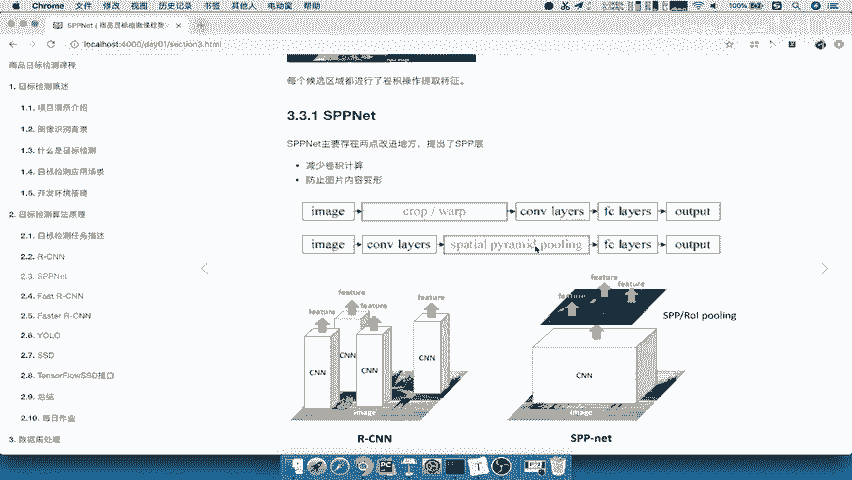

我们来看一下SPPDT的一个，它们之间的一个流程，首先sp net会把全图塞给CN得出一个feature map，是不是一整张啊，哎就相当于前面的CNN网络只得出了一个特征图。

那么它会让候选区与特征图进行映射，候选区怎么来呢，注意的还是通过SS去进行筛选出候选区域，注意这个SS对原图筛选，那什么意思啊，原图相当于被分成了两部分，一部分用来，当然这肯定是一张图啊。

一张图我们就相当拷贝一份吧，一部分用来用SS选出候选区域，一部分用来哎，另外一个图还是要用来进行特征图，那是不是你已经得出了两个部分，是候选区域和特征图，它们之间要进行映射。

不然怎么知道这个候选区域的特征是什么呢，你的目的不就是RCN是不是得出每个候选区域，经过卷积得出一个特征图啊，特征向量吧，4096，而我们现在候选区域跟特征图不是在一个地方，所以它进行一个映射。

把我们的这个什么得到一个候选区域的映射，特征向量，这个我们等下会说的啊，会重点强调的，然后映射过的特征向量大小不固定，会通过一个SSPP层啊，又是一个重点，所以在经过啊SPP收任意大小的一个输入啊。

就可以输出大小特固定的一个特征向量，所以我们说了，他这个过程里面重点有哪一个，候选题也不用说了吧，特征图也不用说了，而重要的就是映射，然后映射好了之后干嘛，哎进行s pp的一个啊层的一个这个设置好。

所以它的重点就是映射加SPP层，为什么要加SPP层，因为映射过之后的特征向量大小还是不固定的，因为你特征区域就不过定的不固定大小的，因为你的全连接层的输入，全连接层的一个输入啊，你要输出特定的一个大小。

你前面的输入就要进行一个固定啊，这就是我们为什么也为什么前面RCN。

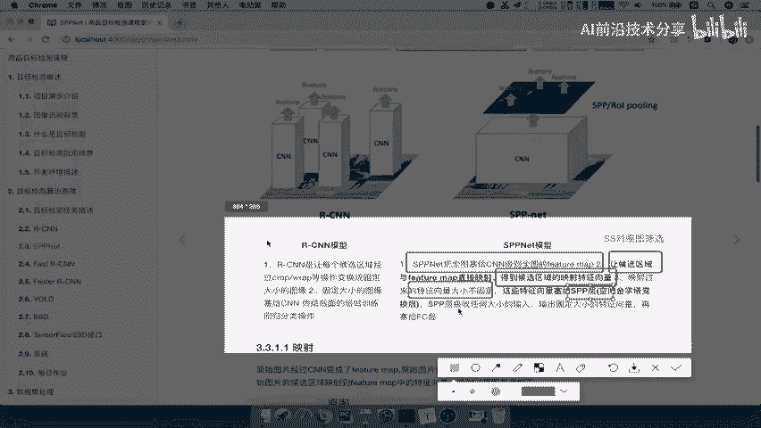

为什么大小固定好这里呢，我们写一下啊，sp net的啊，流程分析好，那我们这个，接下来就要对我们的映射和SPP层。

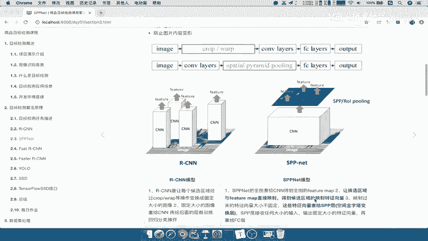