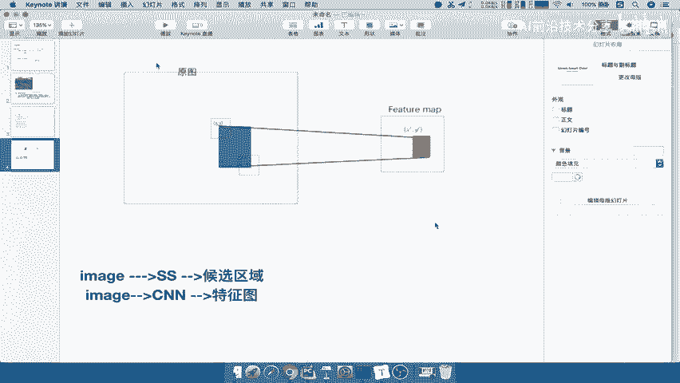

# P17：17.02_SPPNet：映射17 - AI前沿技术分享 - BV1PUmbYSEHm

好，那么首先我们来说一下，这个映射到底是什映射呢，它就是原始图片变成了一个feature map。

然后原始图片又得到了一个选择性搜索的，候选区域，那么也就是现在你得到了两个东西，那这两个东西呢，因为你候选区域最终要得出的是一个特征向量，所以它需要有个映射过程，那么映射过程如图所示。

我们把这个啊我们直接复制过来，我们在这一个地方去进行讲解，现在给你的有两个东西，一个是什么呢，候选区域候选区域，一个是啊，经过这个特征图，候选区域是什么，是通过你的image得到的好。

通过SS然后得到的一个候选区域，而我们的特征图还是image啊，相当于是拷贝了两份对吧，通过CN得到了这个特征图，那你想我们前面RCN的时候就说了，我们最终是要得出特征区域，候选区域的特征向量。

候选区域的特征量，那候选区域已经知道了，它的特征向量怎么得呢，哎所以sp net提出了一个映射的过程，这个映射非常重要，什么意思呢，假设说啊我们现在得出的候选区域在这个地方，在原图当中候选域。

你候选区域是不是基于原图去搜索的，SSS原图搜索的吧，而经过CN得出的T特征图啊。

肯定跟原图不一样了，因为这里面都是经过卷积运算的。

得到一个新的特征图，大小也不一定了对吧，我如何将这个候选区域映射到什么呢。

右边特征图当中的一个位置。

那这个过程啊怎么理解，我们把它理解成相当于是，比如说我有一根长度的这么长的，当然这个过程没这么简单啊，我们只是比喻一下啊，比喻一下这根长度这么长的好，中间我有一个特征点在这里，特征点在这里。

那么当我把这个横线这个东西变换，经过渐变换对吧，然后再缩小好，我经过一个简单变换之后，请问我这个点，它如果说也作为一个CN的输入特征，应该得到的feature map在它某个地方呢。

哎是不是你应该找到映射到这个特征图，跟原图不一样了吧，原图是这么长，特征图变化了，变成这个样子，你是不是也要找到这个点，点的大小也肯定也不一样，变了对吧，当然我这是比喻一下啊。

好有可能在这个位置能理解什么意思吧，这就是映射的过程，那么这个映射过程呢，那我们想要去怎么去做呢，对吧，哎他这个过程是怎么做的，其实是有特定的公式的，哎我们只要把这个公式看懂了就OK了啊。

或者说只记住这个公式就OK好，这个我们举个例子呢，我们放到这里啊，当然也留下来好，我们把它保留在这里，那我们来看一下这个公式长什么样，具体的映射公式为这个样子。

假设啊X1撇和XYY1撇和XY代表啊，分别代表XY为特征区域的这个位置，坐标位置，注意啊是相对于这个原图来讲的啊，X1撇Y1撇也是啊这个feature map的坐位置，那么它们之间有一个S的映射关系啊。

S的映射关系怎么映射呢，X到X1撇怎么到SX除以X加一好，然后呢右下角的点注意了，右下角的点在这里，X除以S减一，因为你是不是只有两个点啊，极坐标啊，左上角是什么，再想一想左上角我们提出的这个极。

这个极坐标的表示方式对吧好，x mini和y mini，还有我们的x x max和y max，那么这两个点映射到X1撇，Y1撇和x max，一撇和y max1撇，左上角这个点用的公式是这个。

这个点用的公式是这个，我们对应一下，好，那么所以现在的问题就是，你当中这个S怎么来啊，S怎么来，那么S就是CNN当中的所有stress的乘积啊，就是所有的步长的乘积，包括池化卷积的步长。

那么默认来讲当初提出这个sb net当中啊，用的也还是原始的RCN对吧，它的过程呢的网络计算出来等于16，所以如果让你去计算，你能不能算出S1撇，Y1撇的这样的一个坐标是多少，能不能算出来。

肯定是能算出来的吧。

哎所以这个公式坐标有了啊，我们的映射公式，映射公式讲解，这能理解吧，所以我们的映射速干什么事情，是不是把特原图当中筛选出来后。

选区域映射到特征图当中的绘选区，那么对于这个特征图来讲，是不是它就有了自己啊，这个候选区域来讲，是不是有了自己的特征图了，那所以对于比如说原图当中，还有其他的候选区域，我们有2000个嘛。

当然我们不画2000个这里这里，那么它映射到右边是在哪里啊，我们画一个大一点的，比如说这个地方这个地方这个地方对吧，这个地方好，那么你映射到原图应该映映射到哪里，我们标记一下啊。

好比如说你这个地方映射进行发映射，映射哪里，是不是每一个候选区域优先设置过去，是不是2000个或取区域都映射的话，是不是都映射了2000个特征向量好。

这就是SPP啊，这个映射的这样的一个过程，好映射，他的过去问题解决的就是映射加上SPP对吧，我们讲的是映射，映射的就是我们的image得出的这个东西啊，这两个东西我们把这个呢划掉啊。

好那么得出了这两个我们要干嘛呢，将候选区域，将将候选区域映射到，特征图当中得出每个候选区域的特征向量特征，向量啊，特征向量，然后进行后续的一些操作好。

