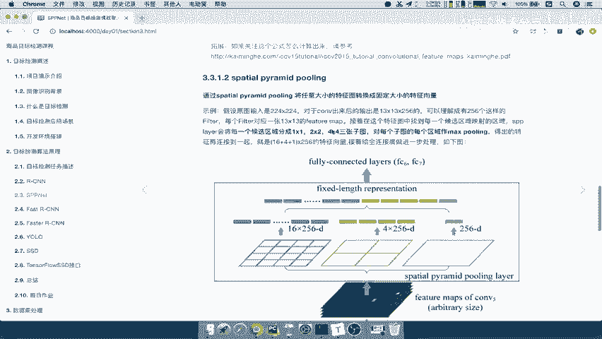
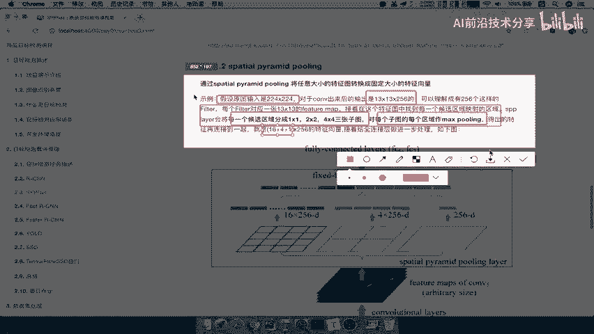
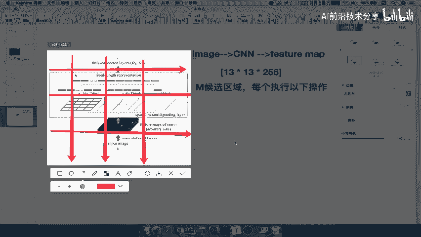
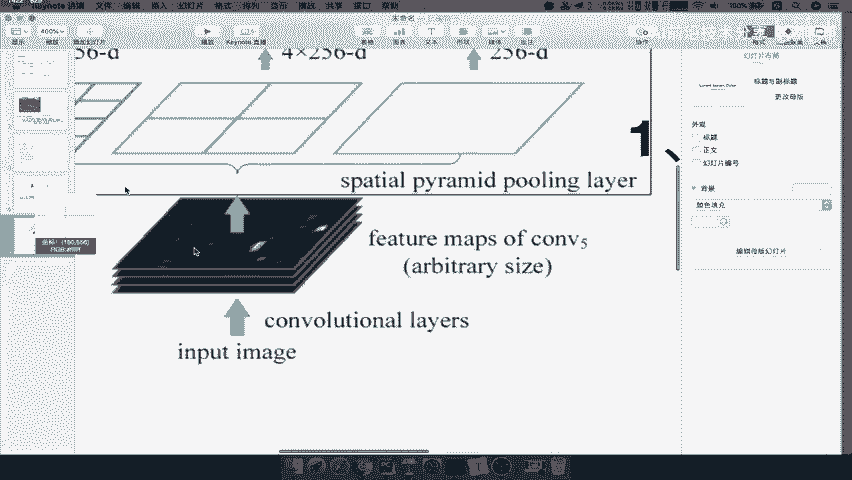
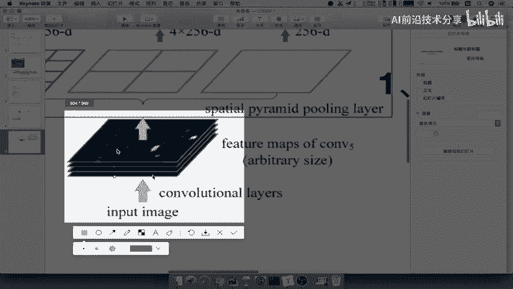
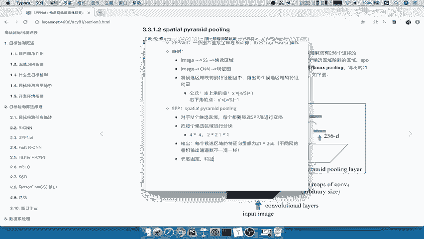
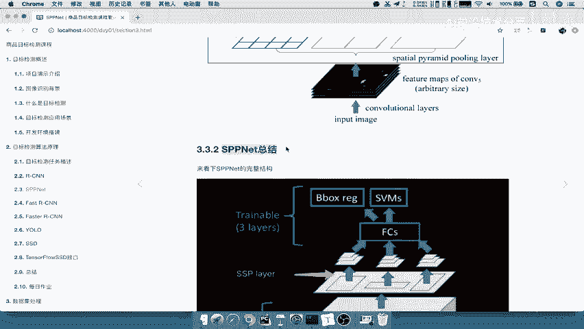

# P18：18.03_SPPNet：SPP层的作用18 - AI前沿技术分享 - BV1PUmbYSEHm

好，那么刚才呢我们这个地方的这个公式啊，我们也把它粘贴过去，左上角右上角的这个点，我们都把它粘贴，这里有一个具体的公式，这个是左上角的点，的点，然后呢这边是右下角的点好，那么接着我们来看啊。

映射之后干什么呢，我们来再看一下s spp net这个网络的一个步骤，这些映射过后的特征变量大小是不固定的，是不是固不固定啊，但是RCN的大小是不是固定的，我们来看一下RCN得出的。

在这个地方每一个是经过固定大小227的吧，然后得到的特征向量也是固定的4096，所以我们前提是你必须是一个固定的大小，那么这个地方怎么使得我们的这样的一个输入，特征的特征向量的大小固定呢。

来塞给我们的SPP层就够了，那我们来看一下什么叫SPP层呢，它也称之为空间金字塔变换层，他接受任何大小输入输出固定的特征向量，再给我们的FC层好，那我们来看就要看到S啊，PP啊，层就是这样的一个缩写。

好我们写到这里，那么这个过程啊，注意它是怎么发生的，对于我们前面筛选出N个候选区域啊，对于M个候选区域，对于M个候选区域，注意啊，是前面的候选区域，但这个候选区域不一定是2000个。

那个2000是RCN当中规定的是2000个，其他算法就不一定了啊，好M个候选区域干嘛呢，每个都要经过SPP乘进行变换，所以说M个都要去进行变换吗，你变化我变化，大家都一起变化好。

那么所以就关键在于这个变换过程是怎么样的，我们来看到这里的一个解释就是什么。

我们把这段话先理解呗，第一个就是输入图片，假设是2242×24的，就是你的候选区域是24×24的，对于卷积出出来的一个这个13×13，乘以256的feature map。

注意这是feature map啊，这是你的卷积得出feature map，那么你映射的特征向量是不是在你的候选区，这是特征向量是不是在这里面啊，哎然后呢，在这个每一个候选区域都要经过什么呢，来看到这里。

sv layer会将每个区域划分成11乘22，4×4的三张子图，对于每个子图执行max polin，还记得max poly吗，在卷积里面的时候，max poin是不是池化层，将这幅这里面的池化。

里面的这个区域里面的数字最大值的取下来吧，所以得出的特征再连接到一起，最终得出16+4加1×256，的一个特征向量传给全连接层处理，然后接到后面的一些其他的好，那所以我们重点来理解这个过程。

我们把这个，复制过来，接下来我们讲解啊，是SPB层的这样的一个过程，那么SPB层呢，假设啊现在你的image，输入到CN得到我们的这个特征图，Feature map，Feature map。

我们一般知道他的这个通道数是非常多的，对吧啊，比如说他的这个地方呢，就是我们所刚才看到了，13×13乘以256，就代表我们的长宽是13，一共有256个通道数啊，256张这个13×13的。

那么这里面呢会有来M个候选区，好M个候选区域的，每个候选区域执行指以下操作，每个啊候选区每个执行以下操作，怎么执行呢，来看到这张图就OK了。

它呢对于这个候选区域呢，干嘛呢，用四个4×4的一个方块，2×2的方块，1×1的方块就是一个方块去把你这个东，把你这个候选框分成4×4，2×2，那什么意思啊，是不是对于这张图，假设说对于我这张图来讲。

就我现在啊标记这张图来讲，4×4是不是一个两个好，三个是不是分成了这样的一个三四块，然后呢竖的再来四块，一个两个三个是不是变成了1234123，46块了吧，就这一张图是66块了，16块的话。

每一块我们说要进行一个吧，Master polly，是不是取一个值，请问经过4×4这个地方只得出几个结果，是不是一个结果，两个结果，三个结果，四个结果，五个结果一共16个结果吧。

那所以啊我们把这个写一下啊。

我们的4×4影视4×4方块，好那么所以呢进行14×4的分割啊，一共16块16块，那么每一块进行谁，每一块进行这个啊，max polling好，那么所以最终得出16个值吧，但是每一个这样的一个啊特征图啊。

每个特征图它的深度都是五百二百五十六，所以你现在16个应该不是16个值，应该是乘16×256，能理解什么意思吗，就是比如说我们把这张图啊拿过来。

这里就是我们把这一张整图啊，这一张整图就当做一个候选区啊，我们现在不不在这里面划分选区，是不是有一张两张，三张四张，一共有256张这个feature map吧，啊假设他得出的就有这么多。

那所以对于这一章进行分成四块，是不是得16值，下面这张也得16，只，是不是一共有十六十六十六，一共有多少个16。

256个16吧，能理解吧，哎能理解这个过程啊，好那么所以说是16×2 16%，这还没有完，SB3还干嘛进行22的分割，2×2的分隔，哎然后呢分成16块啊，分成了一个四块，每一块呢进行max splin。

你一共得出多少，4×256的这样的一个特征向量吧，4×256的，然后还有一个1×1呢对吧，1×1，那就一块进去，Master polin，所以就把整个候选区域进行选择，一个像素最大的那个像素对吧。

哎那么这个地方呢就得出了一个1×1的，1×1的啊，一共就一块，所以得出1×26，所以你可以把它加起来，就相当于16+4哎加一哎，一共21×256，每一个注意的是每一个特征，每一个候选区域都得到了啊。

每一个我们是假设这个地方是这个4×4啊，4×4我们是每一个获选区域，每个候选区域得到什么，21×256的特征向量，所以不管你任何候选区域，你只要用这几个是不是得到的都是21，得到的都是21吧。

21×256好，那么这就是我们的SPP层的这样的一个，过程的详细讲解啊，好，那么这个这相当于是每个候选区域，得出的这个结果，那么最终我们这个每个候选区域的特征向量，固定长度了，哎然后输出。

所以我们这里总结一下，他会把每个候选区域，我们把这个啊八总结一下，八每个候选区域啊，这个进行分块有哪些分块啊，4×42乘21×1，所以最终输出的就是输出的，就是每一个每个候选区域的特征向量。

都为21×256，当然这个256呢，是你自己的不同网络的定义啊，不同网络这个卷积输出通道数就不一样啊，卷积输出通道数不不一定一样，不一定是这个256啊，有的不同的alex net啊，什么其他的VGG啊。

你输出的有可能是21乘以别的好，这就是我们的SPP层，能理解这个意思吗，所以你现在特征向量是不是有了长度，是不是固定了，哎所以你的长度固定了啊，特征向量。

有了那么后续的操作就不用再说了啊，所以我们趁此呢，就直接把我们的s p p net进行一个总结啊。

总结好。