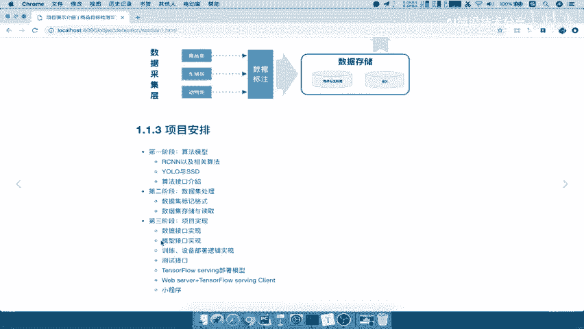

# P2：2.项目结构安排2 - AI前沿技术分享 - BV1PUmbYSEHm

好，那么接下来呢我们就去介绍一下，我们这个整个项目的一个结构是什么样的，那么对于这一张图呢，我们现在呢只需要去达到一个了解啊，知道这样的一个整个过程就OK了，后面我们还会去详细去对着每个结构。

为什么这样去设计去进行讲解，好。

那么对于这张图呢，我们有这个哪三个部分，第一个部分就是数据采集层，那么数据采集层干什么呢，就是要去将我们的很多图片数据给采集过来，然后呢对这些数据进行一个标注，哎我们知道深度学习要训练模型的时候呢。

是不是要去进行标注啊，把这个图片来标注什么类别，这个图片标注这个类别唉，标注好之后，我们才有这样的一个数据进行去训练好，那么这个标注的数据呢，我们会相应的那我把它分到分为这两部分，以及你标注数据和图片。

数据呢存储到我们的这样的一个啊，这个本地磁盘里面好，那么这就是我们的数据，那么第二部分就是深度模型层，深度模型层干什么呢，是将你的数据输入到我们的这样一个模型层，先经过一个简单的一个预处理过程。

然后输入到你的算法啊，你的这个图片的数据已经处理好了，那么就可以输入到我们的算法当中，那么算法输入进去了这个数据输入的算法之后，他要去进行一个哎训练，那么我们的项目当中也会使用多PU进行进。

多GPU进行一个训练，训练，目的是为了什么，得出模型，这个我们都知道对吧，那么得出模型呢，我们说了模型哎，它只是一个这样的一个文件，模型文件，那么我们想要去用的话呢。

哎我们得去进行把它部署到我们的TENSORFLOW，serving服务器上面，部署好之后，我们需要去获取这个模型的啊这样的一个结果，然后我们会搭建简单的搭建一个web后台。

当然这个不是我们这个项目的重点对吧，我们是在这一块这一块的重点好，对于web后台呢，我们提供接口给这样用户啊，用户通过前端的交互，使用这个接口输入一张图片，使用这接口进行一个预测结果的输出。

好这个就是我们整个项目的一个结构好。

那么我们简单的啊把刚才的这个结构呢，这个过程呢简单的总结一下好，我们把这个呢点过去，嗯在这里啊，我们把这个显示的不显示这个结果好，我们把这个课堂既要打开，那么我们后面呢。

就是在每一每次讲解知识点的时候呢，我们都会通过记客单价啊去进行记录，就是这样的一个啊风格好，那么对于这个项目的一个架构的话，项目架构我们要了解的一些呢，就是基础的这三层要知道对吧，数据采集层，然后呢。

采集层，然后就是我们的深度模型层好，然后就是用户存，那么这每一层干什么，其实就是啊我们这里有一个数据标注，包括数据的格式的一个存储，存储格式，好，那么深度模型层呢，主要是哎我要去进行一个数据。

前期的一个预处理，数据预处理以及我们的模型的一个啊多GPU啊，我们可以说多GPU训练，还有接下来就是我们要得出啊，得到这样的一个模型，得到模型，那么得到模型还不够，我们需要去进行什么呢。

我们在这个地方呢其实就要去部署啊，其实它也可以说属于这个深度模型层对吧，那部署使用的是TENSORFLOW的一个serving，进行部署，好部署之后呢，我们提供一个这样的一个模型的一个输入。

输出的接口给啊，这个加这个web web吧，web后台好，那最后呢，我们用户层通过我们的网页或者小程序对吧，通过这些小程序网页去进行一个啊，进行一个接口的一个数据输入结果的获取啊。

获取预测结果或者识别结果吧，识别检测结果好，这就是我们的一个项目的架构啊，简单了解一下这个过程就OK了，好，那么接下来我们来看一下我们整个项目的这个，项目安排对吧，我们接下来是通过怎样的一个流程去讲解。

这项目呢，我们把这个项目呢分为三个阶段去讲解，第一个阶段在我们介绍相关背景知识之后啊，我们会第一个首先就去讲算法模型，由首先我们先得知道我们算法到底怎么去识别，这样的一个啊这样的一个什么呢。

我们的图片对吧，那么识别这是一个最重要的，我们算法是核心的部分嘛对吧，包括这里面RCNU了，SSD都是当前效果比较好的一些，这样算法模型我们都会去讲解的，那么这是算法模型。

第二阶段呢我们就会重点着重去处理我们数据，数据的处理呢有也是啊要标记呀，包括你存储格式的决定呀，怎么去存储啊啊好，那么第三阶段，就是说我们知道前两个模块怎么去做之后，哎，接下来就简单了。

你就可以去用项目实现了哎，整个实现就包括每个接口，数据接口。

模型接口，以及我们的训练设备的一个逻辑的不，这个实现，还有我们测试接口，包括我们的server端的部署，还有我们的web server和这样的一个客户端的编写。

还有我们的小程序最终的一个测试好，这就是我们项目安排分为啊这样的一个项目啊，安排三阶段，我们在这里呢就不写了啊，三阶段好，这就是我们对于这样的一个项目的啊，进行一个介绍。

