# P25：25.02_FasterRCNN：RPN网络的原理25 - AI前沿技术分享 - BV1PUmbYSEHm

那我们来看一看RPN区域生成网络，到底这个部分啊在干什么，那我们来看啊，这里有两个步骤啊，就是它的主要作用是得出比较准确的候选区域，也就是说你训练好之后，我要得出什么一张这个特征图进去了。

我能够得出一些候选区域，并且这些候选区域到底是正样本还是负样本啊，这个就是我们的这样的一个作用。

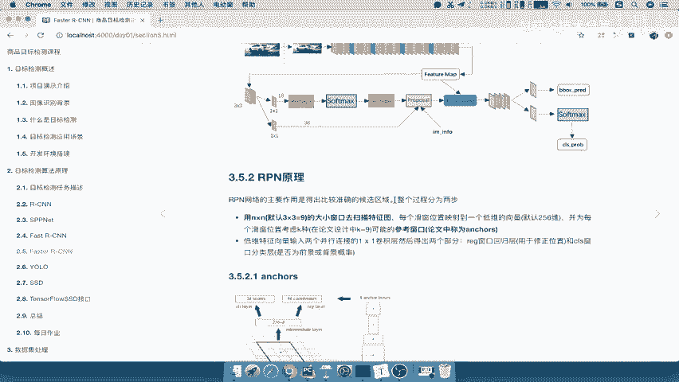

那分为两步，是这样的，用一个默认窗口啊，就是3×3啊，在这个原来的这种faster r cn的，刚开始的论文当中，就指定3×3去扫描特征图，每个窗口映射的一个低维的向量啊，默认是一个256维的may。

每个滑动窗口考虑注意K种，默认也是九种的这样的一个啊参考窗口，那么我们把这里称之为anchors啊，注意啊是anchors，这也就我们在faster r cn n当中呢，我们就把这种候选区域呀。

还没有这个得出来候选区域呢，我们称之为anchors，那么得了安X之后怎么样呢，我们再进行regression啊，regression的一个窗口回归层，用于修正位置。

class窗口分类是否为前景还是背景的概率好。

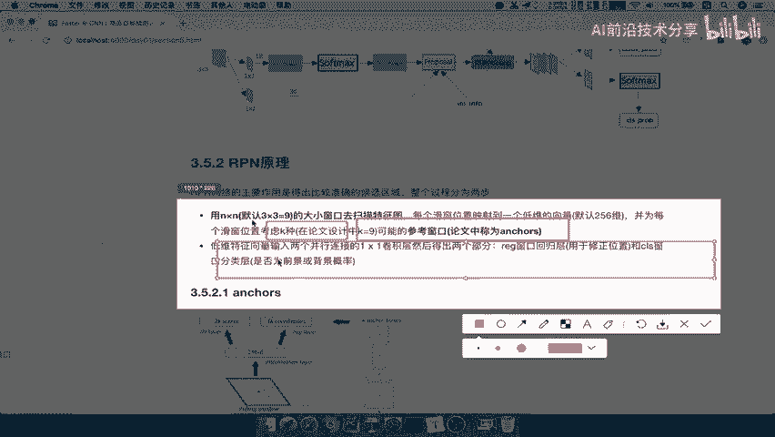

这就是RPN的这两个过程，那么怎么理解这两个过程呢，我们来看这张图就行了，我们说输入的RPN当中的是什么，是不是卷平之后的特征层啊，特征层，那么是不是它有这样的一个特征层的大小好。

那么假设特征值大小它3×3的窗口干嘛呢。

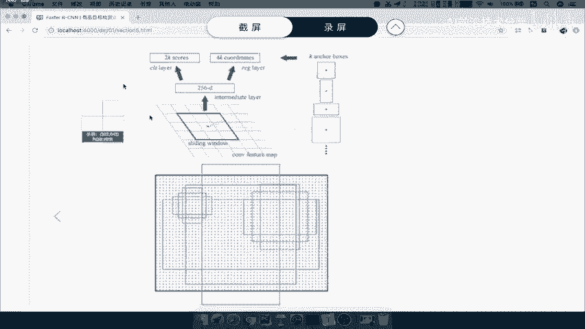

滑动每一个像素，每一个像素，每一个像素，每个像素好，对于滑动窗口中心的每一个像素，比如这个滑动窗口中心是这里，比如它滑到这里来中心这里再往左滑，就是这里他会得到多少呢，会得到7K个ankle box。

K个anchor box，那你想想这里得出K个anchor box，如果说他总共得出多少个，就每一个点它会有预测K个安le box，那如果说1010的图是不是100乘以K个，这anchor box啊。

能理解什么意思吧。

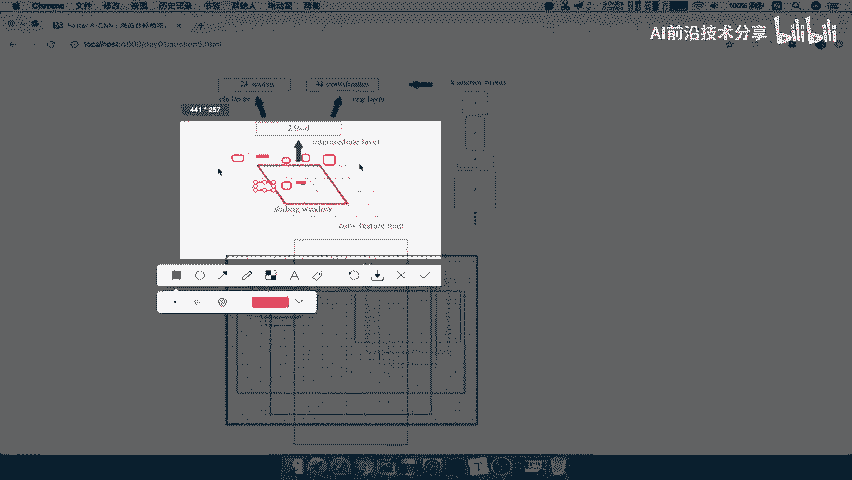

也就是说每一个点啊，每一个像素点它会遇得出K个ANKBS，这个anchor box呢，等下我们再说怎么得的啊，好那么得出来之后呢，它它就变成了这样的一个啊，相当于是若干个候选区域了吧。

啊若干个angle box，好，angle box呢，然后会得到这样一个2K的这样的一个分数和，4K的这样的一个regression layer，2K的分数就是你是前景和背景的概率。

以及你的这个这个位置啊，四个位置，那么怎么得到这K个angle box呢，对于每个像素点，它怎么得到ang box呢。

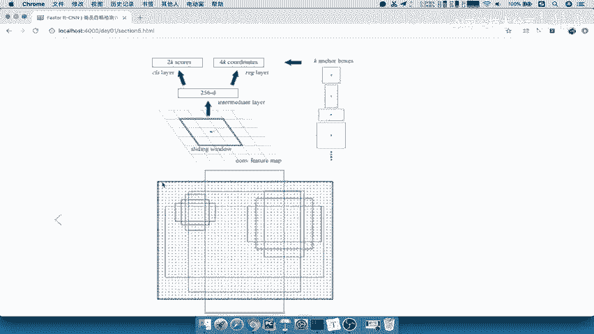

看到了3×3的卷积中心，对应的图像的位置会作为中心点，会得到多尺度多长多种长宽比的anchors，那么这种尺度在原有的论文当中已经指定了，尺度有128×128，256的，512的。

还有三种长宽比的一比一，一比二，二比一的，能理解什么意思吧，那所以它已经规定了这九种啊，一共是九种，3×39种这样的一个长宽大小。

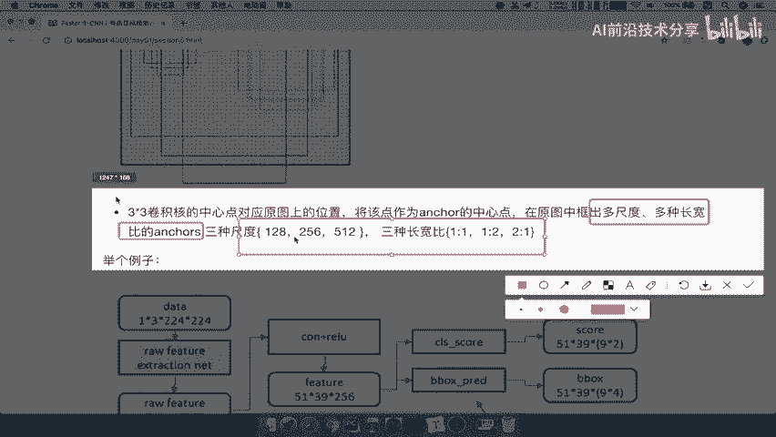

也就是说比如说这里有九种啊，123123123，当然这九个应该是对于每一个像素点都有九个，那所以我们举一个例子。

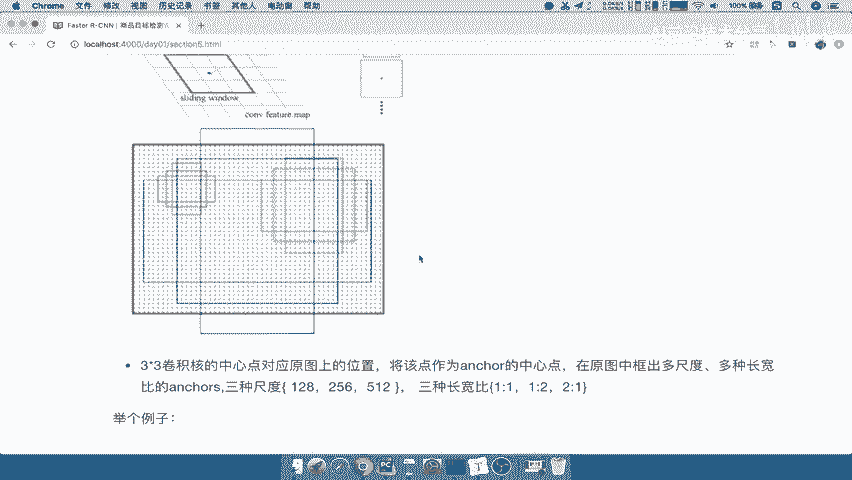

什么意思呢，经过我们的RCN好，经过我们的CN啊，CN得出的特征图是5139，乘以256，那么每一个这样的一个二百五十六四深度吧，是我们的通道数51×39，那意味着你一共得出多少个。

是不是51×39乘以再乘一个九，是不是一共得到这么多的ankle box啊，是不是这么多的angle boss，那这么多的angle boss呢，每个unk boss呢我们都会有它的一个长宽的。

都有长宽的，因为这长宽通过这三种长宽比去进行分配的好，那么所以就你的这个结果。

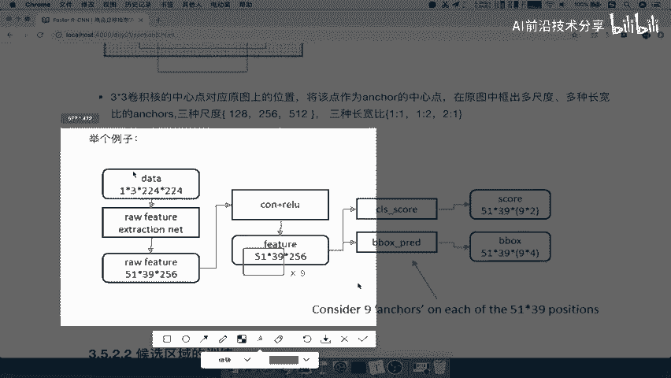

我们先把这个保存一下，Ano box，好boxes，那么他的这个分数当然就有两个对吧，他b box就是四个，那我们只反正呢我们只知道是51×3，199就OK了。

所以我们来看一下rpn faster r cn，它这里面的RPN候选区域怎么来，是不是通过选择性搜索来的，不是，而是通过像素，每个像素预测九个anchor，能理解吧，滑动窗口的中心。

每个中心预测九个N个，所以我们这里地方来了，第一步就是划3×3的滑动窗口，滑动窗口，那么每个中心点，得到得到我们九个an克，boxes这九个安科boxes的长宽啊，长宽通过，通过我们的这个地方。

也就是说，通过我们的这个尺度和长宽比进行计算，尺度和长宽比进行一一对应计算，比如说尺度尺度为128的，那我的宽比为123，就是这有三种，这三种，这有三种，一共九种吧，好也就是说这就得到了最原始吧。

得到最原始的我们的ankle boxes，我们其实也可以把它理解成候选的候选区域了，但是这个东西呢我们并没有准确吧，你说你自己生成的这九个长宽比不一样的，难道它就准确了吗，肯定不行。

所以对于RPN网络来讲，它需要一个候选区域的这样什么呢，或者说我们的把它理解成啊一个校正过程，过程或者说让他呢变得这个他得出来，angle box更加好一些，能理解它能够以SS就是选择性搜索能够媲美啊。

好那么所以呢，最重要的就是候选区域的也是要训练的，注意这个地方候选区点训练是RPN网络的。

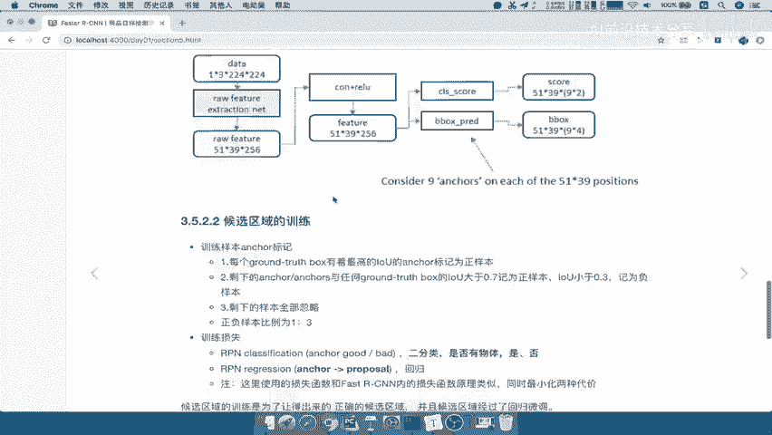

这一块的训练，跟我们总的网络没有关系，它的训练为了使得你的一个特征图输入进去，能够得出一个比较准确的边界框啊，就是你的每个angle box的四个位置，以及我们的啊两个位置。

以及我们的这样的一个分数能理解吧。

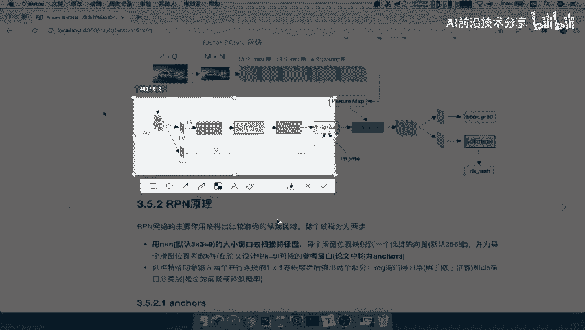

所以候选区域的训练就是RPN的训练，RPN网络的训练，他的训练呢还是一样，也要去标记，他得出了这么多的样本，你得去进行标记，比如说与grand truth box有最高的。

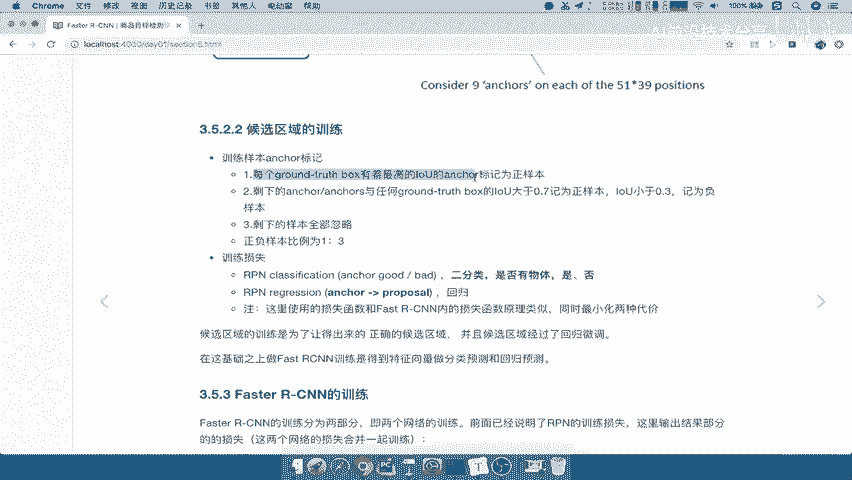

我们来看下怎么标记啊，Ground true box，与每一个啊，有最高IOU的angle box都标记为正样板，也就是说有多少个对象，就是说你这个图片当中有多少真正的对象，有五个。

那么肯定有五个angle boss都会被标记为这样的，剩下的angle boss与任何的grand robox，IOU大于0。7的，由，只要有IO大于0。7的正样本，我们都标记正样本啊。

那除其他的小于0。3的啊，我们就标记负样板，如果说有一些都小于0。3。

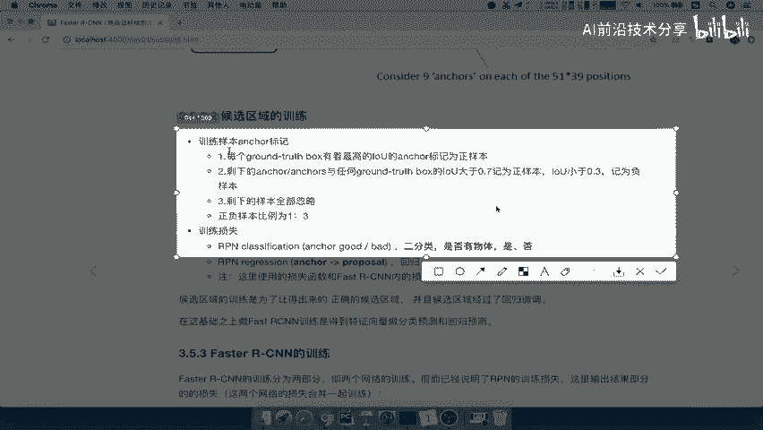

说明我们得出的这些是不是都不好啊，都小于0。3的，这些我就忽略不计了，能理解什么意思吧，所以呢我们来看一下训练样本标记，就是你在训练的时候，你肯定先得去标记样本，训练样本标记。

来看到第一个就是每个ground p choose啊，这样的一个box与它有最高的LU标记这样本，然后呢第二个就是剩下的大于0。7啊，我们都标记这样吧，小于0。3的标记一样的，在0。3之间啊。

应该是在这个0。3，大于应该是大于零，这个0。7啊，大于0。3，小于0。7，小于0。7的标记为负样本，最后剩下的全部忽略，也就是说这些意思，就是有一些这个我们的anchor生成的anchor吧。

有一些生成的anchor太差了，不用再去训练这些样本，负样本太差了对吧，所以我们直接去进行忽略啊，好那么这是训练样本的一个标记啊，注意了，那么训练样本标记好之后呢，对吧，我们有了这样的一个目标值。

它是哎标记为是背景还是分类，所以注意了，在这个地方训练的损失就是一个分类，一个回归分类就是能够预测这个angle box，它是这个有物体的概率，或者说它不是物体，是背景的概率。

就是说背景还是不是背景是有物体的，所以在RPN当中的分类是一种二分类，RPN当中的分类是二分类，区别于啊我们的物体和背景，那么regression呢RPN的这样的一个regression。

它是什么意思呢，它回归主要就是去修正我们的哎修正，建那个b boxed的预测宽，或者说它的一个宽的，坐标，那我们来想想一下啊，那么RPN网络在训练好了之后，我RPN呢假设现在已经训练好了。

训练好你一个feature map输入进去好，它得出他首先得出多少，是不是5139乘以九个这uncle box，然后会得出每个uncle box的这样的一个概率，哎人它属于有物体的概率。

也接我们每个anchor box的一个最终的一个结果，就是说这个回归之后的一个结果，这样的话我们是不是得出了一些比较好的，这样的一些uncle box候选区域，那么这个过程我们可以称之为啊。

我们可以用一个形象的词来理解，RPN的这个过程相当于是训练好的网络，用于海选，用于海选，还选uncle box，能理解吧，用于还选uno uncle box，我们把这个呢复制过来。

也就说明说你有几千个哎，先去呢得出一个一些这个分数比较高的啊，然后呢再把它的位置调的比较好，好这些里面我再进行后续的啊，这个fast r cn的这这样的一个训练了，能理解什么意思吧。

所以RPN网络就是这么得出我们的angle box的，一个是angle box，直接通过这三种比例，三种尺度不同的地方，你也可能有不一样。

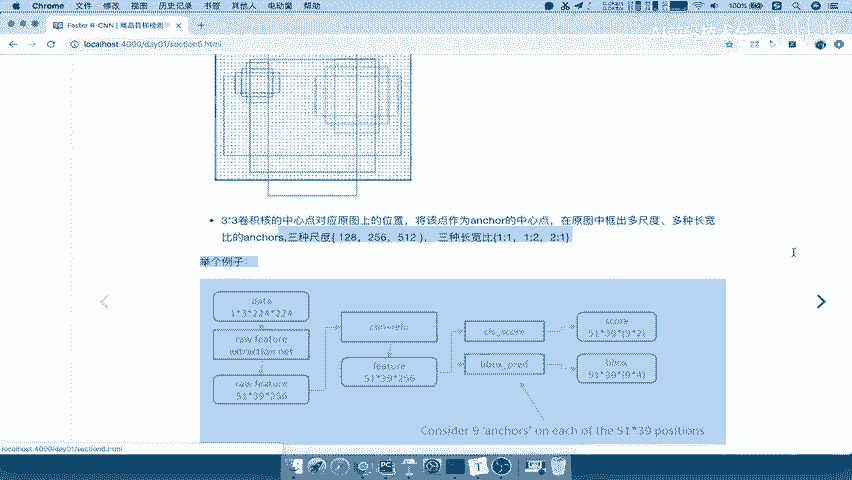

得出这些好，那么这就是RPN网络，所以RPN网络的训练，为了得出正确的候选区域啊，比较好的候选区域，并且这些候选区域进行了一个微调，好这些候选区域，然后再输入到fast r cn。

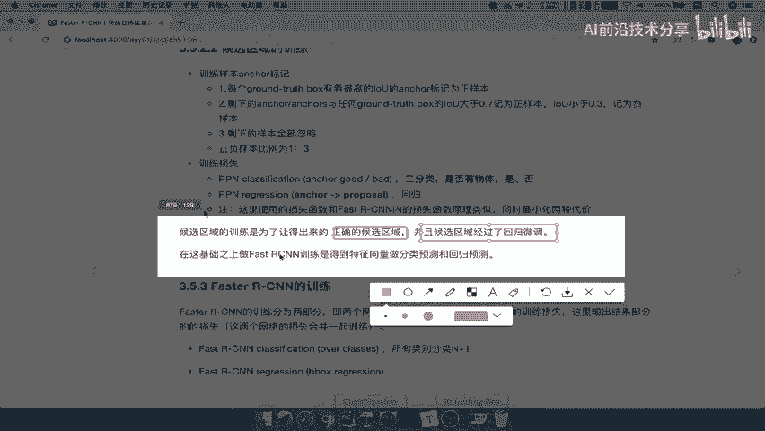

当中得到特征向量，然后做分类预测回归，那里面当然也要训练，那么所以我们接紧接着呢，我们直接来说一下，faster r cn当中的另外一部分训练，就是fast r cn当中能理解吧，它分为两个网络的训练。

前面呢已经说了RPN的输出结果损失啊，他们进行一个预测好fast r cn。

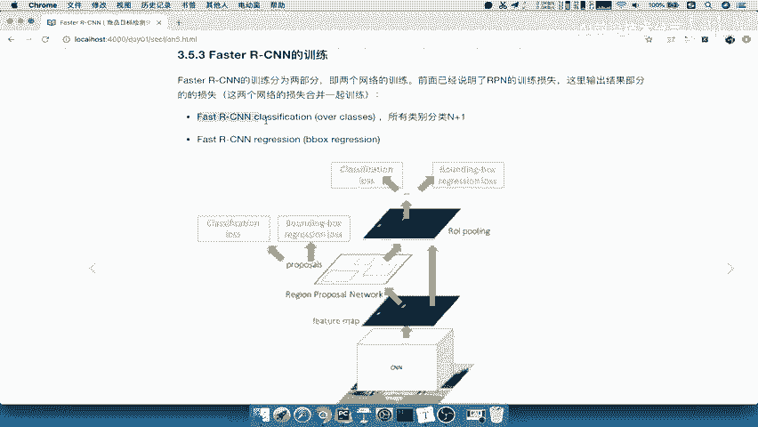

也就是说后面这半部分的一个网络，除了推荐区域进去，除了特征图进去好，这两个进去之后，我们要进行一个分类。

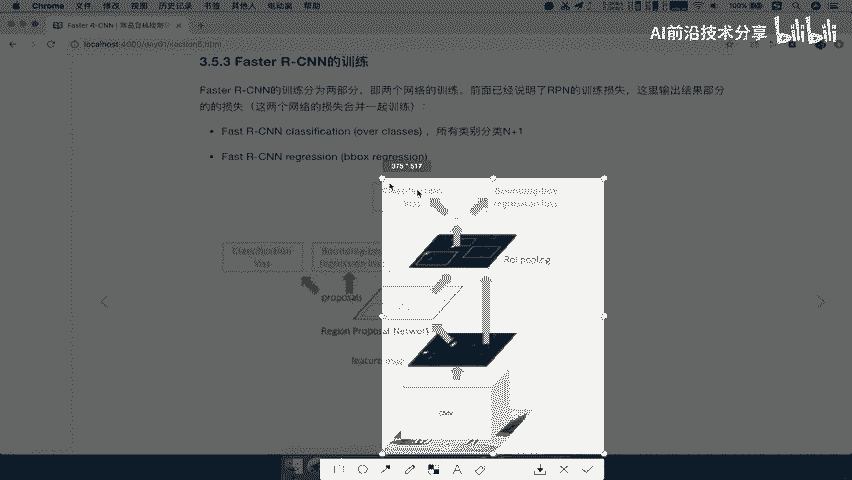

那么进行一个回归，注意这里的分类就不一样了，这里的分类就是N加一啊，也是一个soft max分类，不是我们这个地方的二分类了，因为在前面，我只要区分它是否是有物体的就行了，是一个粗略的一个序列。

能理解吧，哎粗略的一个训练，而fast r cn呢是要得出你具体属于某个类别的，概率的啊，你属于这20种里面哪一种好，那这个就是faster r cn的训练。

那么这样一来我们就把faster r cn的讲过，过程讲完了，你想想是不是很简单，前面理解了之后，你只要理解RPN就OK啦，后面不用再管了，只要理解RPN就是选出候选区域，由自己的特定的一个公式计算的。

能理解吧。

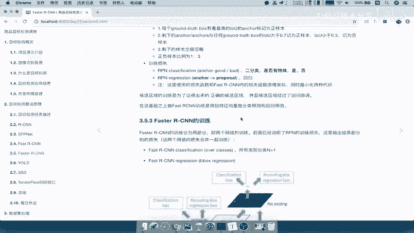