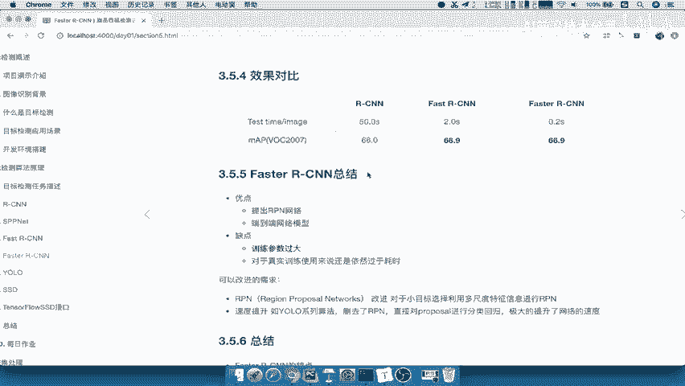
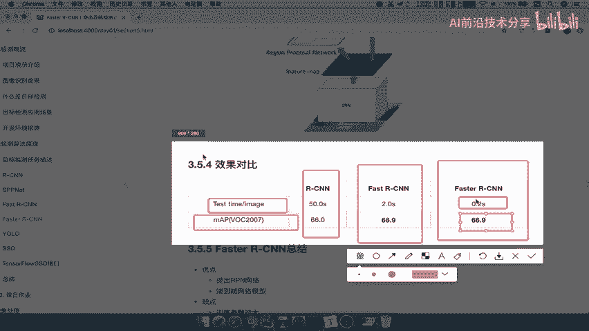
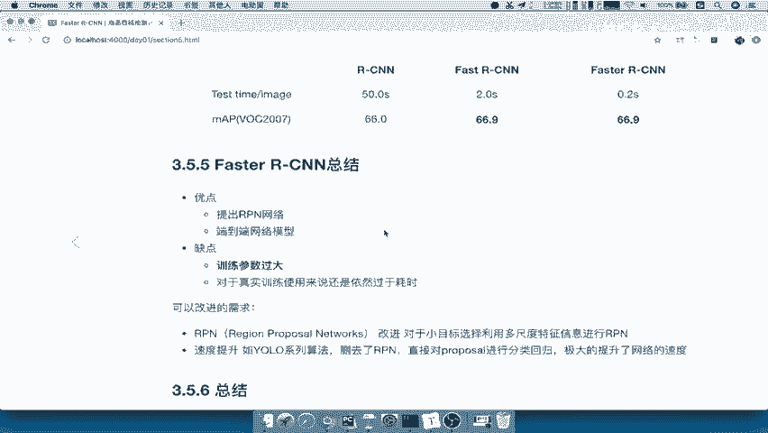
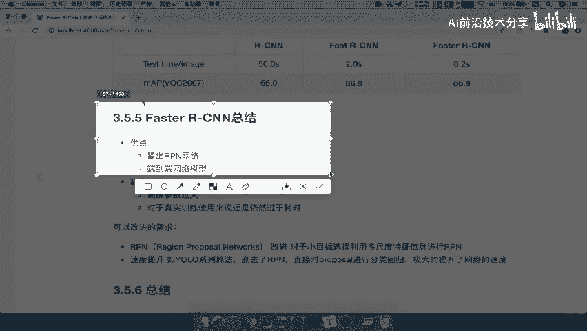
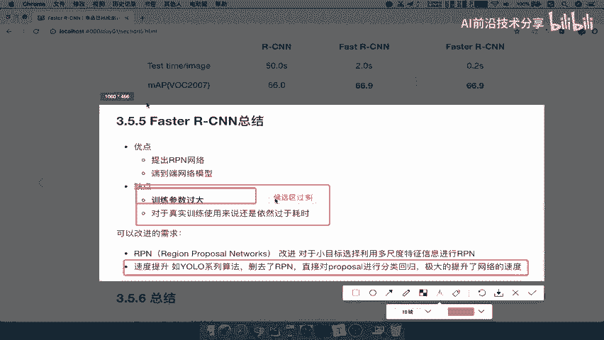
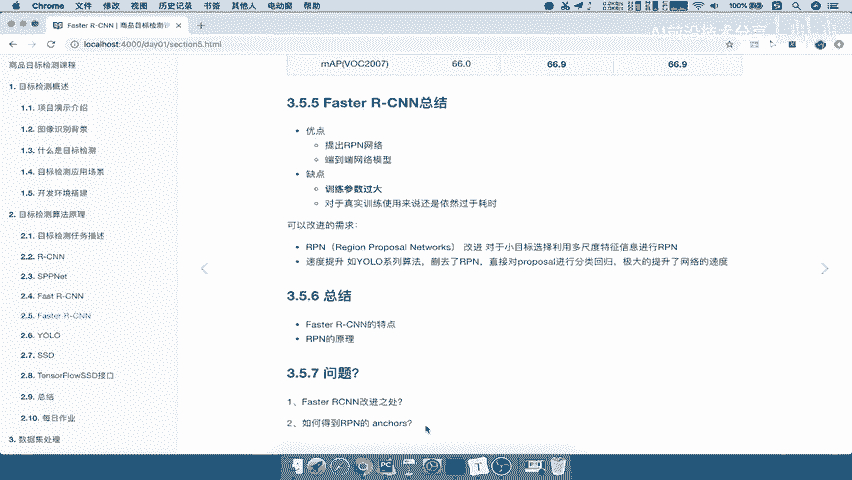

# P26：26.03_FasterRCNN：总结与问题自测26 - AI前沿技术分享 - BV1PUmbYSEHm

那么我们来看一下fast r cn的对比，这里只给了这样的一个测试的速度，以及MVP的准确率，那么RCN啊，这个我们不用说了，fast r cn它的重点2。0秒，在测试的时候，那么66。90大准确度啊。

这个里面呢可能跟刚才的这样的一个数据集，不一样啊，这里是2。0秒，而faster r cn啊，它的速度又提升了，相对于它来讲提升了，那也是提升了一个档次对吧，哎又但是准确率呢还是差不多的，66。9啊。

他这样的一个准这样的一个精确度好，这是它们之间的效果的一个对比啊，可以看出faster r cn主要在于什么。

速度上快了速度快，训练的速度快，测试的速度也快了好，那我们总结一下faster r cn，它的优点就是提出了RPN网络生成候选区域。

用自己训练生成候选区域，我们可以理解它就是相当于一个端对端的啊。

这样的一个网络模型，缺点呢训练参数过大，对于正式训练来说，使用依然过于耗时，就是说速度还是太慢了啊，对于我们这种人为来讲啊，就是说我们去拿这个这个真实企业场景的，一些数据。

拿去拿faster r cn训练，那你可能要等好久好久，那这个过程呢还是有许多人想把这个过程呢，尽量的还是要再减少好，减少这个训练时间，那么所以提出了一些改进的需求呢，我们对于RPN来讲啊。

IPN来讲呢，它对于小目标的这样的一个这个筛选呢，会有一个啊过滤的这样一个成分，当然这个地方呢我们等下提醒我们，主要是对于这个速度上提升，也就是说fast r cn的确速度已经快了一些。

但是还是不够快啊，也就是大多数呢就是说相对来讲呢，我们还可以做的更快，那么就有了这样的一个yo系列算法，直接删去掉了这个RPN啊，干脆不要这个候选区域啊，我们直接对proposal进行分类回归。

得到这样的一个网络能解吧，好那么所以呢这个对于faster这个RCN来讲呢，他的训练参数过大，怎么理解呢，这个地方就是你的这个候选区啊，候选区候选区过多啊。

或选区过多，我们把这个先保存一下啊，faster r cn啊一个总结，那么我们来看一下它的这个候选区太多了，你看一下51×39乘以九对吧，这个地方呢就是你总共的一个候选区乘出来。

你可以得到这样的一个大小啊，它一共有多少个会选框，好，那么这就是faster r cn的一个总结，最后呢我们这一部分啊，这一部分最重要的就是RPN的一个原理，过程是什么样的。

faster r cn其实就是它的RPN怎么去做的，那所以我们最后呢你提到给自己提的问题呢，就是说fast r cn对于fast r cn它的一个改进之处，如何得到rpn anchors。

它的训练过程是什么样的，是不是这样的话，就知道faster r cn的改进之处了吧。

