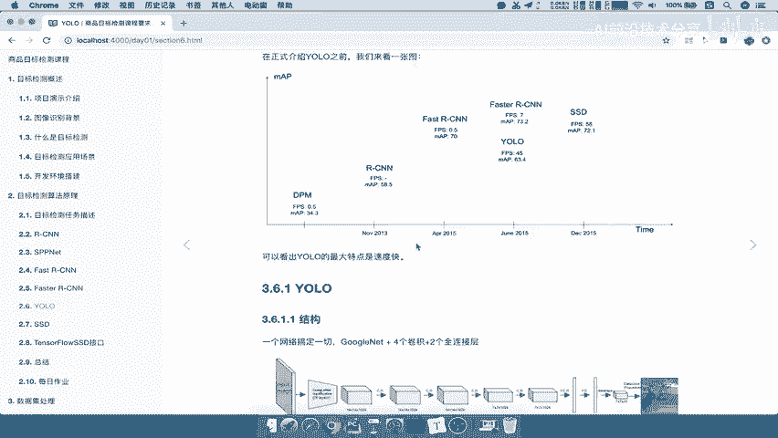

# P27：27.01_YOLO：算法特点与流程介绍27 - AI前沿技术分享 - BV1PUmbYSEHm

接下来我们就要讲另外两种这样的一个算法啊，我们称之为一个全面的一个端到端的网络，那么到底为什么他们呢，唉它的这个效果好一些呢，然后呢这个为什么也是完整的端到端啊，我们第一个呢首先说一下YELO算法。

那么对于yo算法呢，我们要这个学习目标，就要知道yo的网络结构以及单元格的意义，还有YOO的这样的一个损失计算啊。

那么yellow呢它的全称叫做you only look once，即只要看一遍啊，非常就意思呢就是快速啊，非常方便的意思，那么在正式介绍优菈之前呢，我们来看一张图，这张图当中啊花了很多的算法。

纵坐标表示我们的精确度，然后呢右边是这个出现的时间，那么我们主要关注这几个算法，我们可以看到这个算法fast r cn和fast r cn，我们说fast r cn会速度变快了。

所以我们可以看到它的FPS，S的值比我们的fast r cn要高吧，哎WIFBS你可以去了解啊，它就是体验了这样的一个运行的一个流畅啊，运行的这样的一个速度，那么我们再来看准这样一个map的一个值啊。

mmap faster sn呢会比它要高啊，那么我们的yo呢，看到FPS是不是显著的高很多啊，说明它的速度呢是非常非常快的，而我们的准确度呢会有一定定一定的，这样的一个啊削弱了削弱了。

那这就是YOO的这个特点，所以我们从这张图当中可以看看到，YOO是什么特点，就是它的速度特别快啊，特别快，但准确率呢它可能会有一些打折啊，好那么这就是它的一个特点啊。

它的一个特点，一个直观的感受，那所以接下来我们就要去看，UO算法的整个结构。

那么这个结构呢我们先看这个上面整个结构呢，它通过一个网络就搞定了，一切不需要RPN啊，加上fast r cn这样的一个两个网络区域生成网络，加这样的一个两个网络，google net加四个卷积。

加两个卷全连接层就OK了，就是在这个地方得到我们的最后的特征图，就OK了，他一个网络输入进去特征图得出来，然后进行一个预测就OK了，所以这就是我们的这样的一个啊，网络优乐网络的结构是不是非常简单。

那么对于这整个流程怎么理解，我们接下来就要去详细的去讲他怎么去，或者说它的整个过程是怎么去进行一个预测的，能理解吧，好那我们这个下面图先不看，我们来理解这个流程，对于原始的图片呢。

我们一个网络啊肯定是缩小到固定大小，448×400，48×3的，那么经过卷积之后得到7×7乘30的结构，第二步呢对于这个7×7的单元格，这里我们没有这个49，没有把它划分成这个49个单元格啊。

我们直接用3×3简单一点啊，那么这张图输入进去好，我把目理解就是把它换成33个单元格，每个单元格里面预测两个b box关，哎预测两个b box宽，然后进行NMS筛选，然后再进行这样结束。

是不是你会发现他直接把faster r cn里面的RPN，这样的一个网络去筛选候选区域，都不用去筛选了，他不去筛选了，直接就每个单元格预测两个，然后得出一个结果啊，得出这个结果，这就是优路啊。

它的整个流程的一个理解啊，从前往后输出7×7乘30好。

