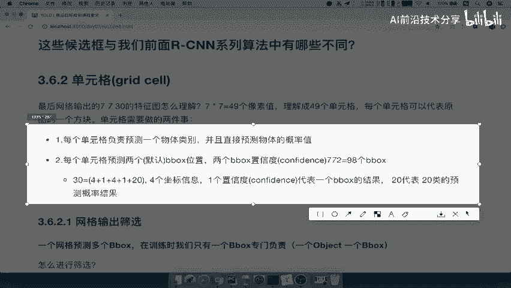

# P28：28.02_YOLO：单元格原理过程28 - AI前沿技术分享 - BV1PUmbYSEHm

好，那么接下来呢我们就要去看这个七乘，7×30啊，到底怎么理解对吧，那所以我们就引入了一个啊，这样一个单元格的概念，也叫grade cell。

那么这里呢我们把这一张图啊，我们先把这张图呢先复制一下。

截个图啊，我们要在这个PPT当中去进行讲解，好我们来看一下这个great cell啊，他怎么去理解grade sound。

也就是说最终我们输出是多少，是不是7×11乘30啊，这个7×7呢，我们是得出的是7×7=49个像素值啊，7×49个像素值，那么我们可以把它理解呢，原来的一个图被我们划分成了49个单元格，能理解吧。

一个像素我就代表一个单元格啊，这是我们这种啊能理解啊，以这种方式去理解的，注意啊，这个像素肯定不是单元格好，那每个单元可以代表每一个图的最后方块，单元格需要做的两事情有两个。

一个是每个单元格只负责预测一个物体类别好，并直接预测物体的概率，物体的概率啊，然后每个单元格会有两个默认的b box位置，那么这两个b box的位置呢还有一个置信度，每一个b box有一个置信度。

那么一共就是98个b box，那我们来看一下这个地方怎么来理解啊。

好我们来看到，在这里面，我们说每个单元格负责一预测一个物体类别，直接预测这个物体的概率值，那7×7乘30，我们来拆解7×7乘30，我们说了7×7理解成一个像素。

代表一个单元格，相当于把这里是我们的特征图吧，原图是不是这个原图是这个吧，相当于把原图呢划分成了49个单元格，每个像素代表的一个单元格，是不是正好49个吧。

好这样我们能理解啊，这是一个单元格，那么每个单元格来看这个30是什么意思呢，每个单元格每个像素所在的位置。

来看到这个地方的它既然是30个通道，那所以这个像素点它对应的是不是有30个值。

能理解，是不是有30个值啊，7×7乘30嘛对吧，一个相当于是49×30，49×30，每一块啊，每一个单元格啊有30个值，每一个单元格相当于是像素代表吧，代表有这样的一个30个值。

那所以我们接着就要去理解，30到底是什么意思，那么这30他说了，每个单元格还要预测两个默认的b box位置，那么两个b box的位置呢，我们的位置有几个坐标啊，我们的位置是不是有四个坐标啊。

啊一个b box的坐标位置啊，位置是不是有XXYXYW，H是不是有四个值啊，那一个这样的一个单元格，预测两个是不是一共有多少了，八个值了吧，哎两个b box一共八个值，两个别告诉是八个值，好注意啦。

这是八个值了，然后呢每个b box会随带着一个confidence，就是我们的知心度啊，我们可以称之为知心度，这个也是两个值，那么所以两个啊两个置信度，我们先不管置信度是什么，两个两个值。

那还有剩下多少呢，30个值吗，30个值还剩下我们20个值哎正好，那么如果说正好是20个分类嘛，那么最终20就代表了我们的预测概率，结果也是每一个这样的一个单元格，它预测哪个类别好。

那所以这个地方就分成两个部分，哪两部分呢，一个就是来看到右边的这个东西。

右边5+5加20是不是正好30啊，五是第一个b box的位置加置信度，第二个b box的位置加执行度，这是一个部分啊，专门是用于b box的好，这个20是用于这个单元格预测的，20个概率值。

它会得出概率值，然后从这个概率值当中去，找到一个代表性的概率值，最大的好，能理解这两个部分过程吗，好那么所以我们回到我们的课件当中，所以网络建立一个单元格的理解就是这样，7×7乘三十三十就是这么理解的。

所以我们在这里啊总结一下，对于啊yellow算法，那么改进速度上面的一个算法叫做YOLO，You only look once，那么它的结构我们就不说了啊，一个网络，解决，那么它的输出是7×7。

7×7乘30，那么这个7×7呢理解成了我们的啊，49个单元格，而我们的30，这个30等于两个b box41加加41，是不是一共十个了，再加上一个20能理解吧，两个b box，注意啊。

这些值都是网络直接输出的，不是我们自己生成的，不是不相当于是RPN当中自己用一个长宽比，或者说我们的这个select search search，它直接得到候选区域啊，不是这样的。

这个BBOX是网络直接输出的，结果是要训练得出来的，20就是单元格的概率，单元格代表概率的，代表该，概率好，这就是30的这样的一个理解，那我们说了yellow的整个过程，刚才在说这个过程。

两个b box y呢他需要去进行一个筛选，就是说一个地方呢，我不可能让两个b box框呢都统一的存在，它会有一个进行筛选的过程好，那么有一个筛选就是一个网格输出开始，那么我们来看一开始七乘七四十九个。

每个单元格都有两个输出框，是不是一共有49×2，等于98个b box，能理解吧，哎俩这个98个b box y，那么我们来看怎么宣选呢，一个网格预测多个b box在训练的时候。

我们只用一个b box双负责去进行训练，什么意思呢，也就是说它会进行一个筛选，你得出来的筛选的依据是置信度大小，也就是这里面的这个一啊，筛选一个b box作为啊作为，训练。

那那么我们来看这个置信度是什么意思呢，每个bbounding box呢，它都会对应的一个置信度，如果网络当中没有object，这个置信度是零，那如果有我们的confidence school。

等于我们的grand choose与这个b box的IOU值，能理解什么意思，相当于就是如果你看一下这个候选框，或者说7×7乘四九对吧。

这个里面没有物体，那我这个地方的confidence，所有的confidence都等于零，能理解吧，都等于零，也就是说它没有目标，我就给它设定一个目标值就零，那如果说有物体的哎。

我就可以把它设置成为一啊，设置成为一，那么所以这个里面啊，注意了这个地方的所说的有没有object啊，等下我们再说，那么如何判断有没有object呢，就是我们刚才说的吧，怎么判断object呢。

如果一个object grand truth的中心点，坐标在一个grand cell当中，那么这个grand cell就是包含的这object由这个里面负责，注意这个地方呢就代表着并不是所47×7。

等于49个候选框都会有唯一的啊，大部分都不是唯一，什么意思呢，如果一个object的grand truth，中心点在于这个grand sell当中，什么意思，我们来看一下这个图。

对于这个狗来讲，对于这个狗来讲啊，对于这个狗来讲，它的中心点在哪，它的中心点是不是在，假如说啊，这个狗的候选框的中心点在这个的位置，那么这个位置的话，是不是我们的ground truth或中心点好。

正好在我们哪一个候选框，是不是标红的这个候选框，那说明这个候选框的地方我们标记为一，标记为一，就相当于样本标记一样的，它的这样一个b box的目标值标记为一，然后其他的再看，再看这里自行车的中心点。

这个候选框的中心点，比如在这里好，那么所以对于这个候选框，我们啊对于这个单元格，我们是不是要把它标记为一，训练的时候，它就有了一个目标值为一。

其他的地方都为什么都为零，比如这个汽车啊，也可以标注为一，所以我们来看confidence也是得出的一个概，我们可以理解成它是一个概率值，对吧好，那所以呢通过confidence进行筛选，好进行筛选。

那么这个confidence由网络，由网络输出，那么它输出凭什么它输出，你的结果比较高一点呢，哎你这个地方的这个单元格结果高一点呢，因为我们含有物体，还有物体gt吧，直接把这个复制过来。

会进行我们的YM或者说进行标记吧，进行一个标记，如果说这个物体呢中心点在某个单元格，那么这个单元格的分这样单元格的目标值为一，所以他训练的时候就得出这样的一个概率值，会越来越高。

而其他的候选框的概率值会越来越小，那这就是一个这样一个啊，b box的一个confidence的一个筛选好，那么其中还有20个类别概率代表什么呢，就是这个候选框它会代表什么，哎。

这个候选框会选择一个物体的概率，作为我们的预测结果，也就是形成了这个样子，7×7的四十四十九个的这样的一个单元格。

它会每一个单元格会选择一个类别，作为自己的预测结果，看见BYCLE哎，这个这些会这个单元格都是bicycle，这些单元格是dog，这些单元格是car，这三个是我们其他的能理解吧。

所以也相当于是它会预测一个类别，以及一个这样一个我们的位置，所以，每个单元格啊，我们应该在这里写啊，刚才我们所说的就每一个单元格，它所要做的事情是预测一个b box输出，一个b box的位置。

输出一个b box，分数高的啊，高的b box单元啊，这个位置以及一个概率大的类别能理解吧，我们中间这里就不看了，相当于是这个东西输入进去，它就会得出一个b box的位置，一个概率较大的类别。

confidence较高的这个b box好，那输出的这个位置呢我们怎么去理解啊，就是说输出的每一个单元格预测的位置呢，它其实相对于我们的中心是有一个偏移的，什么意思哎，看到XYWH是我们输出的值。

XYH为中心，相对于单元格的offset w h为b box，这样的一个宽高，相当于整个图片的这样的一个占比，什么意思呢，我们来看到这张图片。

这个单元格输出的s column和y colon。

看到啊，这是输出来XY啊，输出来XY等于XC1，除以WI乘以X减去x column，我们来看一下这个单元格预测的。

红色这个单元格我们只指的这个红色单元格，他预测的XY怎么理解呢，是由XCXC是怎么来的呢，物体的中心点，物体的中心点啊，注意啊，物体的中心点就是这个gt的一个中心点。

这个外面黄色的这个框的中心点SUYC，然后呢即除以WIWI是什么呢，整个图片的宽和整个图片的高，乘以SS就是我们我们多少个网格，那么这个地方就是七啊，就相当于是XC除以我们的这个图片宽。

然后呢乘以一个什么呢，乘以一个我们的七能理解吧，乘以一个七减去SCOLN，Coln，就是这个单元格，在我们整个49个单元格的一个位置，比如说这里是在零啊，这一根音是在第二列啊，列第二列，12345。

第五行啊，也就是说这个地方呢相当于是s corner，就是啊五行二列啊，五行二列，那么最终得出这样的一个结果啊，得得出这样的结果，那么我们再来看Y啊，Y的结果也是一样的计算啊。

这这个计算啊计算的结果都是一样的好。

那么这就是我们的这个XY的理解，那么长宽的理解呢，长宽的理解也是一样的，就是WB啊，WB就是你的这个gt的WB和HB，除以我们的这样的一个WI除以hi，就相当于是我们整个这样的一个输出的。

WH的一个理解，能理解吧，相当于是它的这个长宽，相对于整个图片的长宽的一个比例好，所以呢这个地方的位置啊，位置理解呢我们可以啊，可以这个不用太关心啊，不用太关心这个位置。

我们只要知道前面这个过程就OK了，前面这个过程就是筛选一个b box作为训练的，这样的一个结果，就是每个单元格会输出一个b box位置，和一个概率较大的一个类别好，那么这个我们就到这里啊。

就是关于单元格的介绍。