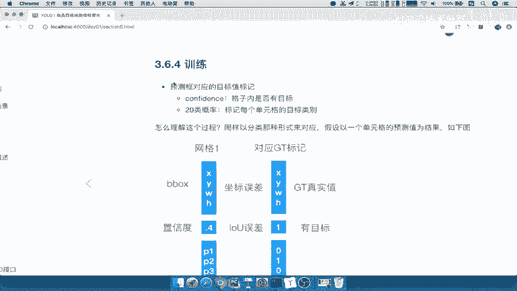
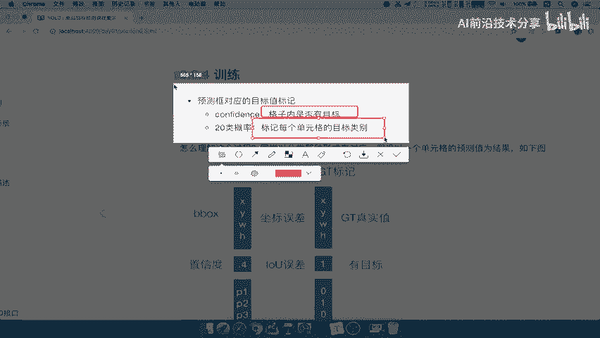
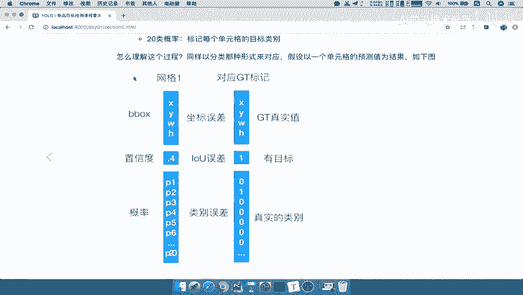
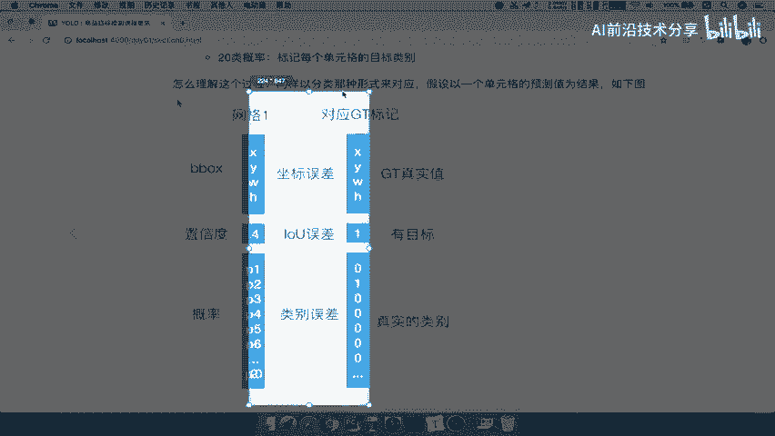
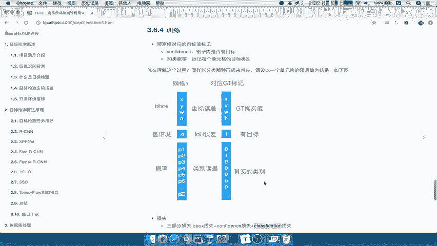

# P29：29.03_YOLO：训练过程样本标记29 - AI前沿技术分享 - BV1PUmbYSEHm

那么接着后面的单元格我们已经这个得出来的，那最后面的还是一样，测试阶段还是要紧接着NM的啊，NM进行一个输出，好这个地方我们前面已经讲过了，这只是测试的流程啊，就是测试的时候你需要去筛选的。

但是我们接下来重点就是要讲他的训练，因为刚才我们一直在这个地方对吧，这个地方训练是怎么去进行一个哎标记的呢，哎所以我们把这个部分拿过来好，训练过程，训练过程，训练过程的一个标记，就是判定你这是否有目标。

来看到预测框与对应的目标标记。

也就是说标记一下你的目标值，格子内是否有目标，以及20个概率的每个单元格的目标类别，那么我们来看怎么理解这个过程。

我们以两个部分。

一个是假设啊，假设一个单元格得出了一个预测值，和我们的对应gt呢就是我们的真实值，那么它就会与对应的gt进行一个什么。

进行一个这样的一个对比训练，那么它们的节点误差，就是b box与真实的gt真实值之间，之间的一个误差，衡量坐标误差，然后置信度也就相当于是否有目标哎，有目标的就是gt呢，就是对应的单元格就是一哦。

标记为一，那你这个地方呢，就是预测一个IOU的一个值啊，比如说你IU是一，那说明你预测准确了呗，那你可以把它理解成一个概率啊，就是它与这个gt的和之间的，IOU值的概率为一或者是为0。4对吧。

那然后剩下的这个单元格，还要去与真实类别进行一个误差衡量，能理解这个意思吧，我们样本标记是不是就这样去标记的，每一个网格对应的会都会对应的一个gt标记，你有的有目标的标记为一，没有目标的就标记为零。

那你训练的时候它就不会训练出目标出来了，能理解吧，它的知名度肯定是比较少的啊，比较小的，所以这就是我们的网格与对应的标记啊，标记的之间的一个训练过程，所以训练过程呢一定要理解啊，一定要理解。

所以我们把这个关键的是，把这个图能够理解出来，把这图啊我们复制到这里，这个应该直接不行啊，直接这样不行好，那么这样的话呢，我们的这个训练过程也讲完了啊，训练过程讲完了，重点在于它的三部分损失。

