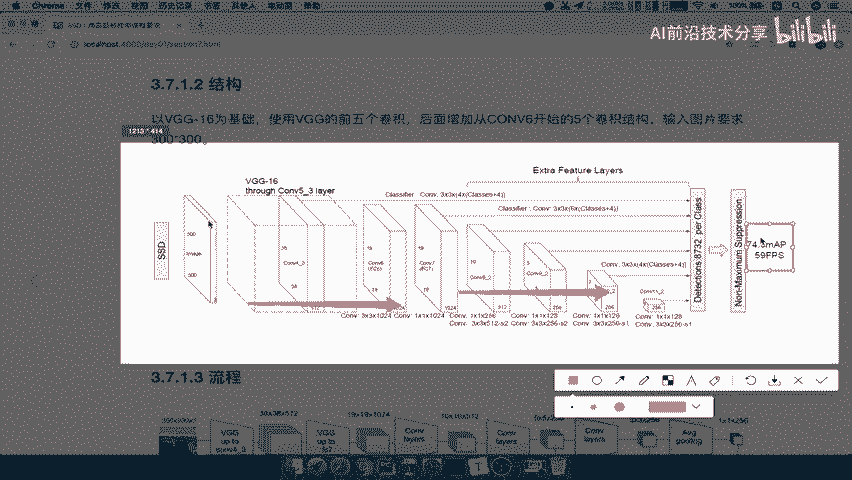
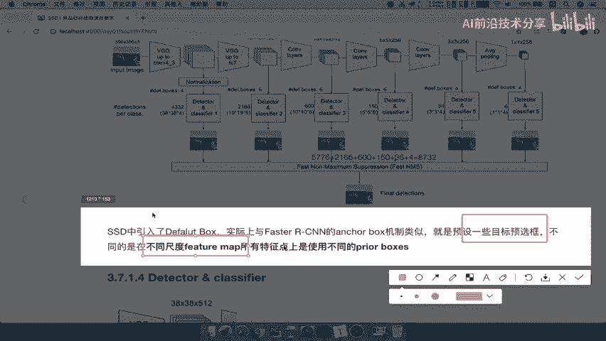

# P31：31.01_SSD：网络结构与Detected结构31 - AI前沿技术分享 - BV1PUmbYSEHm

那么看了这个优乐呢，它的速度已经达到了一定程度了，那么有没有一种算法呢，它的速度和准确度呢能够兼顾哎，那肯定是有的，那就是我们哎，在项目当中也会去使用的一个模型啊，这个非常重要，那么叫SSD。

他的英文名叫single shot multibox detector啊，那么这里的学习目标也是一样，知道SSD的结构，以及它其中有一个叫做detector和classified，的一个作用。

说明一下SSD的一个优点，那我们先来看一下SSD的简介呢，也就是说它是在于，12016年发表的一个论文啊。

这个完整呢其实你可以自己去看它的特点，我们要来看一下它结合了yo当中的回归思想，以及faster r cn当中的ankle机制，注意啦，anchor机制，那么这两个机制结合在一起，保持了一个准度。

又保持了一个速度啊，这就是SS的的特点好，那我们所以呢在这里写一下，那么兼顾兼顾速度与精度，那么SSD不是你所看到的那种啊，那个固态硬盘对吧，当然名称虽然都一样好。

那这里它是结合了我们的u solo的回归，和我们的faster r cn的anchor机制，还记得安个机制吧，那么它就是啊提出这样的一个候选框啊，候选框，那么我们来看一下SSD的。

它的整个结构是什么样的呢，这是它的一个网络结构啊，就是里面的一个每一个有哪一个结构对吧。

有哪一个这样的一个网络，那么对于SSD来讲，我们的输入图片要求是300×300的，注意啦，所以我们一般要处理的图片，要处理的图片呢，你必须得是300×300的大小。

否则肯定是不行的，那所以这里地方呢输入之后呢。

经过这样一个啊，经过这样的一个网络，其实很多网络都差不多对吧，那中间有很多很多层啊，包括这样一个全连接层啊，这个我们的这个卷积层等等，那最终这里它的一个算法的效果啊，在我们的这个某个数据集上面测试效果。

那么它的速度59fps，它的精度啊七十七四。3啊。

相对于其他的应该都是比较高的了，那所以我们在这写一下啊，SSD要求的图片输入是多少，300×300啊，这样的一个大小好，那么刚才呢我们yo这个地方呢我们没写对吧，它的一个四是八啊。

乘以448这样的一个长度好，那么我们来看一下它的流程是什么样的。

那么当一个图片输入到我们的这个网络当中，300×300乘以三的一个图片，好，从右左到右，从左到右，它每一个地方都会有一个向下的线的标志，能看到吧，好每一个向下限的标志经过干什么呢。

经过一个叫detectoral classify，Detector，Classify，Detector classifidetector，好，最终他要得出的就是呃。

每一个detector classifi得出的一个预测框，然后经过我们的fast ms啊，就这NM就是非极大一致啊，非极大一致，最终筛选出你这个图片当中有哪些候选框啊，有哪一些这个物体进行预测的结果。

这就是这个流程，那所以你看到这个流程最关注的是什么，是不是叫detector classify这个东西在做什么，每一层都在做吧，哎所以呢我们重点是关注它的一个啊。

Detect class f，这就是它的流程。

那么SSD当中呢就引入了这样一个东西，叫default box，实际上与fast r cn当中的anchor box机制类似，就是预设一些候选框。

不是在只不过啊SSD在是不同尺度的feature map上。

都有一个这样的一个default boxes好，那么这里也会提到其他词啊，我们大家说，那么所以我们现在的重点呢就在关注于，detector和classify好，这个是我们的关注重点了。

那么这里它的这个结构啊，这里结构什么意思呢，看到这里有一个叫做四三十八乘以38。

什么意思啊，就是说经过卷积的某一个部分，它输出是38×38的一个特征图大小，每一个像素点我都会预测四个默认宽，注意用词default box，每一个这样的一个地方有四个默认框。

那么所以中间会输出多少，38×38乘以四，等于5776个box，那么这里的位置是选出了四个box，那我们再看刚才这张图当中是不是有很多box啊。

来每一个地方网络的结构，来这里有一个box，这里有个boss，这里有个box，这里有这里有这里有，看一下38×38乘以49×19，是不是这里的图的大小，然后乘以六就默认是六个，这里六个六个六四个四个。

那你可以看到不同的这个层级的网络层级里面，不它的这样一个default boxes数量啊，默认一个像素的几个box的数量定不定哎。

是不定的啊，所以呢这个地方要记住注意啦，那么最终我们整个SSD它会得出多少呢，这第一个5776，加后面2166，一直加到这一边，就1×1乘以就一个像素了，再乘以四个default box得出8732个。

也就是说共同的候候选官呢，一共有8000多个候选框，然后进行啊进行后续的筛选，那这就是detector classify，那这只是我们知道了，这个东西得出来就是这些box吧，哎这些b box。

但这个结构只那么简单吗，你中间怎么去训练啊，你中间怎么去利用你的这个微调啊，或者说分类啊，怎么去进行训练，那这个的话就说明detect classify。

会结合uncle b box和YLOAD里面的回归。

来进行统一的测试，好那我们在这个地方写一下，会结合YLOAD回归和我们的fast r CNN的这样的一个，n car机制溶于一体啊，就融于一体吧，好那我们仔细的去分析detector classifi。

那么我们看它有三个组成部分。

来看到default boxes，就是你得出的默认候选框，默认获取方非常简单啊，就是进行一个预测，进行一个计算嘛，然后localization4个位置偏移，还有confidence。

Confidence，就是我们的这样一个20一个类别的执行度，因为他要把背景给区别开，20一个类别的执行度，那么我们来通过这个图来理解这三个部分啊。

来看到这一张图，我们把这张图呢给截图过来。

好，那我们把刚才的这三个部分呢来解释一下，它到底是怎么去做的，这三部分粘贴过来，那我们看啊我们以某一个结构的中间输出啊，比如说是5×5乘以256，也就是在我们这个图当中的这个部分啊。

5×5的256的这一部分，那么我们来看它呢，会先生成一个default box的一个generator，就是相当于是生成b box，我们说这一层呢它有几个呢，默认有六呃，六个啊。

六个就是说呢五乘以乘以六啊，一共有多少根称宽，那么这个地方算了75个啊，因为它是默认的以这个5×5乘以三啊，5×5乘以三了，当然这个图跟我们的这个图呢，可能这个地方标记的这个六啊，是不一样的。

那么我们来看啊。

这就是默认框了，默认框已经出来了，当然我等下我们会说这个默认宽什么意思。

然后对于这个5×5乘以256呢，它会去进行一个3×3的卷积，注意256变成了这样的一个东西，5×5乘以12，然后这边呢也会变成5×5乘以63，的一个结果，就是两个卷积好，两个卷积好。

那么这是它的整个结构当中的这四个部分，就是说每一个地方都会用到，5×5乘以256，这样的一个结果能理解吧，那首先我们这是对于detector里面，三个东西的一个介绍，包含了三部分。

好我们放置放到这边来啊，我们把它翻翻下来好，那么这里呢我们写由于一提，那么这三个东西，这三个东西默认获取环四个偏移位置，而是一个类别的知名度啊，都能好理解啊，都能好理解。

那么我们先来看第一个default boxes，default boxes候选框怎么生成，哎faster r cn的候选框我们知道啊，通过这样的一个长宽比对吧，你的比率得到九个，然后进行修正。

那我们的SSD当中的default boxes怎么生成，它也是通过一个滑动窗口，只不过也是通过一个固定的公式，它的这样的一个过程，我们可以这样理解，对于5×5的每一个位置。

它会预测三个或者六个或者四个啊都可以，这是按照算法来讲的，那每个点有三个，每个点有三个能理解吧，那么他预测的这个候选框如果超过位置呢，到时候呢它会进行一个输入这个图片面积，一个比较啊，这个我们不用管了。

就是它会自自动的去把这些，这里面的这个超出部分呢算到图片里面，这就是滑动窗口的每个每个像素点有三个，那么我们想这个候选框怎么生成的，好生成有特定的一个公式，注意啦，有特定的一个公式。

这个公式我们作为了解，作为在这里我们公式作为了解，那么其中我们要关注的是两个参数，两个参数，一个参数呢就是ratio长宽比，也就是在这个里面的这一部分啊，长宽比它的比例是多少。

然后呢还有一个s mini和x max，是最底层的特征图的计算参数，和s mars最顶层的这个特征图计算参数，你看到这里面就OK啦，你不用去关注这个公式，怎么计算得到这几个宽的啊。

你只要看到这ratio长宽比还有大小，就知道什么意思了吧，然后呢你默认的跟这个K个默认宽的，它的图大小是不一样的，所以你会有一个这样的一个大小的计算公式啊，每个大小是不一样的。

好那这个就是它的一个作为了解内容啊，这个不用不要求掌握，不要求掌握好。

