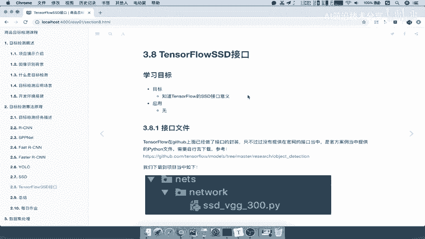
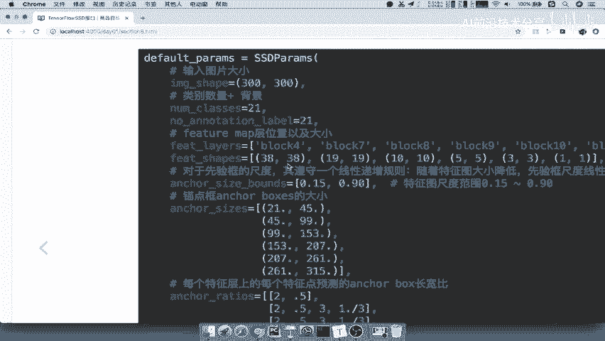
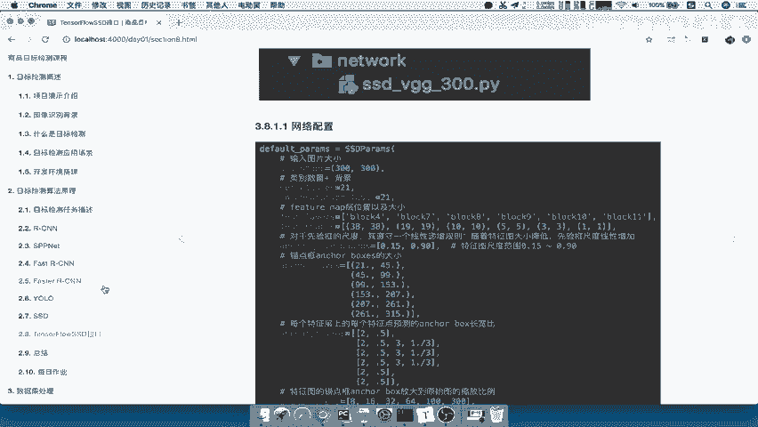
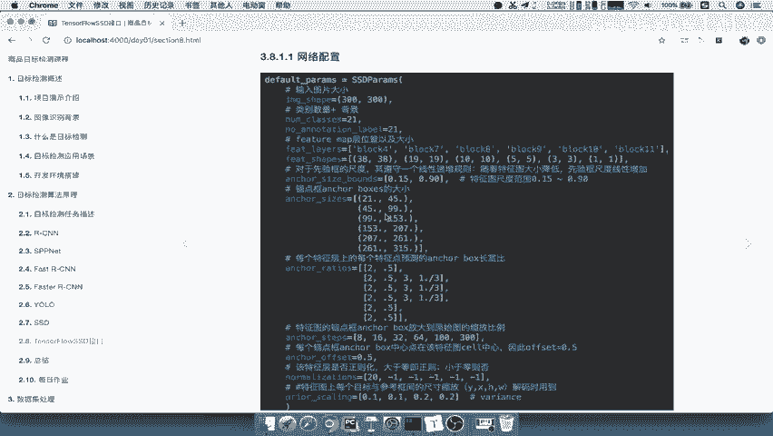
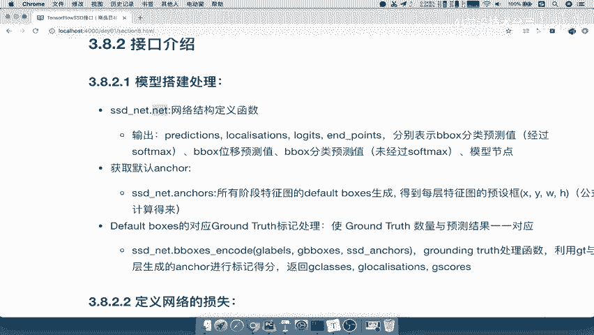
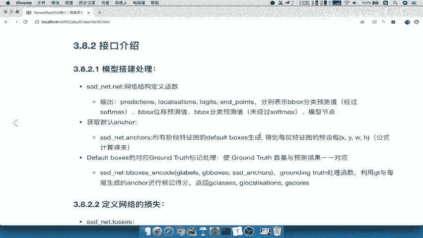
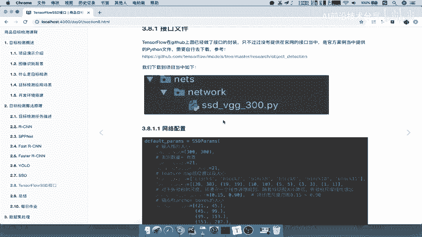

# P34：34.04_TensorflowSSD接口介绍34 - AI前沿技术分享 - BV1PUmbYSEHm

好那么这样的话呢，我们终于把这个目标检测的这个算法，从RCN啊，到faster r cn以及优6SSD的这些改进部分，都一一介绍完了，那么这个相当于是一个啊，目标检测的算法的一个发展历史对吧。

你要把每一个算法的这个结构啊，这些他的几个特点以及它的一些优势啊，都得去搞清楚了，这个等下我们再总结一遍，那我们接下来呢就要看一下，其实对于网络来讲，我们一开始就去说了啊，对于学习这些算法来讲。

我们的目的呢，并不是说我们自己去把这个实现一遍，没必要吧，哎实线面肯定是没必要，我们的目的就是提高我们了解这个算法，哎我知道他是什么样的一个结构，他怎么去做的，能够很快的入手。

熟悉我们的相关的API的使用，这就够了啊，这就够了，所以呢这是一直我们在强调的东西，但是里面的要求掌握的一些基本概念啊对吧，提到东西你得知道好，那么所以我们的TENSFLOW呢。

也提供了一些算法的这样的一个啊接口，那么我们当然是以目前来讲比较好的效果，比较啊，速度比较快，效果比较好的这一个算法的接口，SSD接口，那么知道啊。

TENSORFLOW相关于这个中间的SSD接口的一些意义。

那么接口的文件，那在我们我们已经下载到这个项目当中对吧，在我们的next当当中啊，这里面有一个叫SSDVGG啊。

300，那这是其实是它的一个源码，那么这个里面呢它的一个源码过程当中，你可以自己去这个网站去看啊，那么对于这个SSD的这个TENSFLOW接口呢，它会有两个部分，一个就是接口介绍和一个网络配置。

网络配置什么叫网络配置呢，就是定于我们每一层的网络怎么设置的，每一层网络的特征的大小，我们一看这个，你再与我们的这个结果去一一对应，你就知道了，比如说image ship。

它的网络参数image shape，300×300，能理解吧，是输入的时候要求300×300吧，然后你的类别数加背景是不是一共20一个，你输出要区别背景的吧。

好那么比如你的feature map的位置以及大小。

是不是跟我们的38×38，一直到1×1啊，我们来对对应的再看SSD当中的一个结构，来看到这里是不是38，三十八十九十531是不是这样的一个结构。

那如果说接口有一点改动呢，也没有关系。

但你知道是什么样的一个结构，包括你的尺度特征，尺特征的这样一个图的尺度范围，就是你的default boxes的一个最大值。

最小值什么意思呢，就是与之对应，注意啊，0。15和0。91。

对应的，就是我们这个地方的公式当中的s mini和s max啊，就是这个默认框计算大小的这两个值。

生成一个默认框大小，那还有其他的我们就简单说一下对吧，以及你每一个层上面的angle box的长宽比，是不是RTUS啊，这个RTUS还有其他的一些结果，那所以这就是如果你已经知道了。

这个网络长什么样子对吧，你也只知道他怎么做的了，其实看这几条API是不是你就很容易看懂啊，否则你看这些啊，每一层呢很难去知道它代表什么意义。

那么其中TENSORFLOW的SSD它的提供的一些接口呢，我们后面呢将会用到的有这么几个，一个就是SSD的net的net哈，网络函数，这个就定义了我们的啊整个网络结构的啊，里面的一层一层给他写好了。

在这sd net里面的一个net，它呢这里面具体返回值我们不会过多再去测啊。

我们用的时候呢再去说啊，好，那么这个地方呢就相当于这里面的，有一个net参数，我们可以看到在我们找这里啊。

在这个地方net s d net，我们可以看到这个net参数，是不是定义了我们的整个网络，每一个结构的哪一块吧，哎在这里在这里包括，比如说你的这个128啊，256啊等等，好这就是我们的一些深度啊。

好那么这个里面获取默认的ankles，这个地方获取某个默认的ANX，是获取每一个阶段的default boxes生成，也就是说一共有我们看一下一共有几个阶段呢。

我们看到它的一个参数就知道了，参数也写了一个两个三个四个五个六个，也就是说第一个比如说有5786对吧，最后一个有四个，所以你就相当于一共有六层吧。

每一层的angle box我们是都可以去进行获取的，每一层的angle box都是进行获取的，然后默认的我们说了，你这个网络训练的时候要进行一个标记，要用你的default boxes。

与我们的grand truth进行一个标记处理啊，每个这样进行一个标记处理，当然这中间过程呢可能不会说，把所有的8732个框都拿来标记对吧，可能会筛选一些框进行标记处理，能理解吧。

然后包括定义网络的一个损失，我们这个损失怎么计算，就是我们的预测结果与标记结果，与这个真正的一个结果啊，进行一个损失计算就行了，就是你标记和我们的这个输出啊，default box之间的一个损失，好。

那么这就是ss tensorflow or SSD网络当中的啊。

一些这个结构啊，当我们在用到的时候呢。

你就知道它每个参数的意义代表的是什么啊，比如说prediction啊，localization啊等等好，那么这样的话呢，我们这个TENSORFLOWSSD的这个接口呢。

我们就介绍到这里，等用的时候啊。