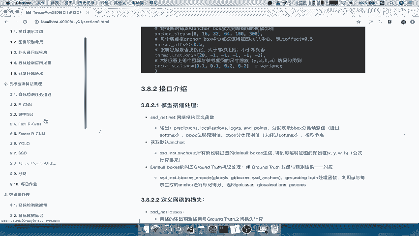
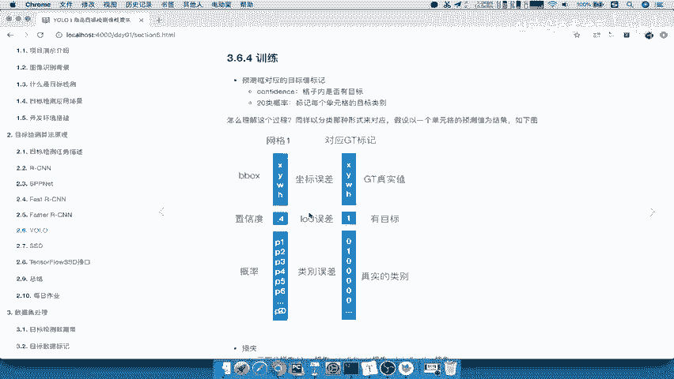
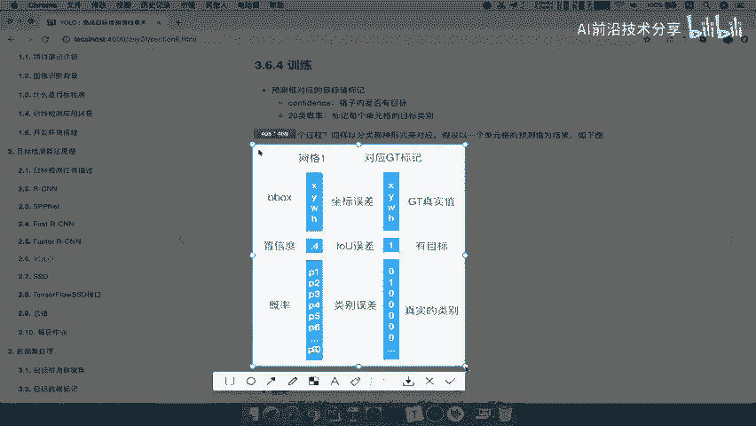
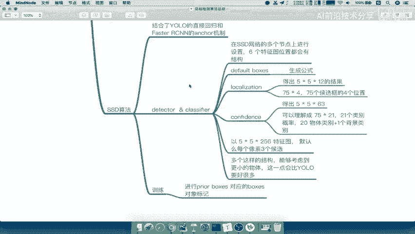

# P35：35.05_第一阶段算法总结35 - AI前沿技术分享 - BV1PUmbYSEHm

那么这样的话呢我们第一个阶段啊，我们第一个阶段的这些算法的原理介绍。

就讲到这里了，那么我们接下来呢总结一下啊，我们这个整体的一个概念啊。

就整体的有概念，我们来总结一下，我们新建一个啊好，那我们新建一个这样的一个思维导图，我们来总结，那么我们这里就写上啊，目标检测算法总结，好首先我们提出第一个问题，就是我们在开始讲的时候讲的目标检测。

这个问题怎么去解决，目标检测问题解决的一个初始方式，初始方式是什么方式啊，我们说了分类加定位，就只有一个目标的时候，你是采用的方法哎，直接限定回归哎，直接一个输出FC就行了吧，FC输出位置。

那么如果有多个对象怎么办，我们是不是提出了一个叫over feat，over f e a t fit模型，那么其中就有一个滑动窗口的概念，滑动窗口，它这个窗口的一个设置就相当于有K个啊。

比如说K个不同窗口，每个有比如说每个这个滑动吧，没有滑动这个M个结果，那所以你总共总共，K乘M个，那这就是它一个解决的一个方案吧，啊我们的这个over feit模型解决方案，那所以接下来就演变出来。

我们第一个算法R杠CN，他是第一个使用这样的一个神经网络啊，以及其他的一些部分的，那我们直接写它的结构的组成部分，它是不是有我们的候选区域筛选，然后还有什么做成候选区域筛选之后。

然后要经过我们的哎我们的这个特征图了，就相当于卷积网络一，一般我们会采取alex net啊，或者我们的这个其他的VGG结构，那么提取的这个特征啊，我们说提取的这个特征，你要去直接经过我们的什么哎。

直接SVM吧，进行分类，二分类要清楚了，这个我们就写一下它的测试过程啊，就直接写在测试过程，测试过程，测试过程啊分两部分，那么我们的SM进行一个二分类之后，我们要进行哎非极大抑制。

非极大抑制筛选极大的一个抑制，啊极度，抑制，好那么这个是NMS啊，N m s，接下来你是不是要进行b box这样的一个回归吧，对吧，候选框候选框回归修正好，那我们说这过程呢在这个卷积网络之前。

候选框筛选之后啊，候选框的这个生成啊，候选框生成之后呢，我们有一个图片大小的哎大小的这个调整好，那么候选框生成我们用的是SS选择性搜索啊，搜索算法，那我说这个卷积网络就不用说了啊。

得出的特征我们以这个RCN为主吧，RCN为主，他得出的这样的一个特征呢啊这个在这里啊，卷积网络得出呢是啊，比如说2000个啊，乘以4096，这是它原始网络啊，4096，那进行二分类呢会得到啊打分啊。

你的这个2000个啊乘以，20个打分矩阵，接下来会得出你的face u大一致，每对象啊预测多少个对象，回归修正，回归修正就是我们的线性回归方法，线性回归，好这是它的测试过程，那么我们的这个训练过程呢。

我们测试怎么来的，是通过训练得出来的，训练的话我们分为哪几个部分啊，是不是第一个我们的这个微调啊，我们训练直接这里吧，训练过程，一个就是我们的这个微调吧，你要在什么的基础上进行微调啊，原来有网络。

我们应该是在这个RCN当中，你应该是有一个这样的一个基础的模型来看到，是不是也要预训练啊对吧，预训练的这样一个模型，所以我们在这也写上啊，相当于是应该先去预训练，预训练，然后微调在这基础之上呢。

微调的主要是卷积网络，然后呢我们的SVM也是需要去训练啊，训练这样的一个分类器啊，一共有20个分类器，我们这都是以默认的啊，默认的20类的分类的这样的一个结果，然后还有我们的b box回归训练。

b box回归训练啊，得出模型好，这就是相当于测试和预测的一个过程，那么这其中呢我们的这个样本标记啊，样本标记就是我们的这个样本标记，这些东西我们就不讲了，就相当于是那把这个b box啊。

对应的这个gt结果给它进行一个处理好，那么这是我们来总结一下啊，我们的RCN的它的一个缺点是什么，优点我们都不说了啊，你应该这种过时的算法了，肯定就是对于当时以前来讲，有时有电量。

那么它的这一个什么训练速度速度慢，对不对，模型需要多个这样的一个训练，需要训练多个模型吧，然后呢你的这个什么内存，是不是要你的这个特征存储到我们的磁盘当中，为什么要存盘磁盘当中，因为SVM的一个需要啊。

一个需要需要读取去需要这个，而且呢这个里面呢其实还有很多很多的，这样的一个缺点，我们可以再看一下，这里面我们再看这里包括你图前变形问题吗，哎这个地方的图形变形问题好，那这就是RCNN。

那我们接着来看我们的什么s p p net了吧，建立网络结构，它呢我们就不列举什么训练测试过程了啊，我们直接就说它改进于那RCNN的有哪一些，是不是提出了什么提出SPP存，然后还有一个重点的啊。

就是我们的这个映射，或者说吧减少减少这个候选区域的卷积计算，减少卷积计算，那么他呢这个提出的这个改进方法啊，方法就是一个，就是把这个图片直接经过卷积得到啊，特征图我们来看的一个方法过程啊，直接切断过程。

直接得到一个特征图之后，我们直接在啊通过通过SS搜索的，你想SS网络呃，这个搜索性算法呢，它得出的这个候选区域干嘛，与我们的特征图进行映射吧，那这里面有一个映射，哎公式能理解吧，哎映射公式你要去掌握的。

那么这个映射之后呢，得到一个特征的一个职级结果，它如何避免输入这样的一个图片，需要去变形处理的呢，哎它不需要就通过SPP层，这SSPP层呢我们说了，它是把对每一个候选区域进行分块，分块有哪些呢。

在这里啊直接写上4×4，哎2×2，1×1这么几块，那么最终你得出的是16+4加一，等于21啊，21的这样一个特征的一个长度向量，然后呢假如说你的这个深度啊，深度我们就不说了，因为不同网络是不一样的。

这就是s pp层，这样的话是不是我们的sp net是不是就解决了，CN这里面的一个计算问题和一个图形变换嘛，哎图形图形的变换，所以因为正是因为我们的SPP层能够啊，目的呢就是目的得出统一大小的输入入。

输入任意大小区域，得出统一大小的特征向量，给我们的全连接层使用，好这是我们的这样的一个总结的这个sp p net，那接着我们来看一下SSPINNET，接着来就是fast哎，Fast r cnn。

那我们说fast sn，它嫌弃或者说他嫌弃s p p net什么东西啊，sp net也就是说s spp net一个缺点是什么，是不是它的速度还是慢吧，哎速度还是慢，而且训练是不是还是训练分成多个模型啊。

哎还是分成多个模型训练，那faster fast s e n呢它的解决办法是什么，哎它的解决解决s spp net的缺点，怎么去解决，速度慢，还有包括分成这个多个模型，我们说了。

他呢把提出提出了R啊OI的一个概念啊，roy pr这个POLLY啊，PY的这样的一个概念，然后呢把SVM替换成了SVM，替换成了这个SOFTMAX。

那么所以我们来看一下o i pulling是什么东西啊，ROI啊，Pulling，Air polling，Air polly，就是一个简化的s p p net吧，简化的SPP啊，SPP层。

那么这个简化SSPP层呢是分成了它分成了坑，分成了K乘以M个这样的一个块这么一个块，那么也是同样目的还是一样的啊，我们直接输出输入一个任意大小的区域，输出得到一个特征向量，那么它还有一个它的优点。

就是相对于相对于SPP层来讲，它是不是的，这个可以进行反向传播，反向传播这一点就特别重要，使得网络统一了吧，哎使得使得网络统一进行训练好，那么还有一个就是提出来就是soft max。

这也是相当于是能够啊，能够它的soft max输出是多少，是不是你N个类别，你输入N个类别，加上一个背景类吧，哎因为它没有，啊背景类，背景里边好，那么这就是soft or max啊。

它的一个作用也是为了统一的这样一个训练，那我们说fast r cn它的一个缺点是什么，就是因为区啊这个候选区域，候选区域耗时没有统一啊，我们可以理解啊，它相当于是一个伪的啊。

相当于是一个为end to end模型，为端到端，其实你可以称之为它端到端模型啊，端到端模型不彻底吧，不彻底，好，那么所以接下来我们的faster r cn就上涨了对吧。

r cn fast su呢就是因为这个候选区域，候选区域不是通过通过SS啊算法搜索了，算法，那么他提出了一个什么哎，相当于是一个区域生成网络，生成网络加上网络加上我们的fast。

注意的是fast r cn是不是加两个，所以我们这个地方主要关注的就是唉，他的这个RPN网络是怎么去做的吧，那么RPN网络，我们说faster里面提出了一个什么东西啊。

哎我们说网络自己呢共享与啊与这个什么呢，或者把这个过程写上来，我们过程写到这里啊，也就是说它的步骤吧，fast r s n的步骤呢就是输入图片，输入图片，然后得到啊，通过卷积得到特征图。

那么这个特征图呢分为两部分，特征图用于RPN啊，得到候选区域，然后呢，第三就是我们的特征图与我们的这个候选区域，进行哎映射哎进行映射，然后呢这个通过，进行一个映射啊。

然后后面就是经过啊类与与fast fast r cn啊，一样的结构了，好，那么RPN呢我们说这个RPN呢它是得出目的，得出候选区域，那所以他怎么去得的呢，会对于特征图的长和宽，这个长和宽。

那么它这个所有的啊，这个大小的啊，大小的像素，大小的像素得出啊，每个像素经过滑动窗口得出，得出多少个K个K个这样的一个候选区域，当然默认呢是九个啊，九个，那所以假如说你有一个特征图，特征图是M乘以N的。

那所以你总共有M乘以N乘以乘以N，再乘一个九，一共是不是这么多了一个anchors吧，那么我们说这ANX肯定不行啊对吧，他这个自己去计算的，它有一个固定的长宽比，长宽比，还有我们的这个大小。

那所以我们需要经过我们的这样一个位置修正，和啊，位置啊，位置的一个修正啊，以及你属于，进行一个训练吧，训练训练你需要去修正位置，然后呢去进行你的这个属于背景还是，背景还是我们的这个物体好。

这个就是它的一个训练过程啊，需要把你的提供更好的一些候选区域拿出来，那接着呢它就会经过fast啊，fast啊，这个经过最后啊经过fast r cn，那fast i c n呢它的一个训练呢就是啊还是一样。

Soft max，只不过这个地方注意啊，soft max这地方是20类，就是你没有这个N加一了啊，只有N类，然后呢还有你的这个回归啊，位置回归好，那这是faster r cn。

那我们说fast的SEN呢，其实还有很多改进的地方，只不过呢没有更比，他，就是说RCN这个代表的算法没有更多的出来了，那所以就是说它的一个速度啊，还没有达达到啊满意的结果，但是呢准确度准确度比较好好。

所以我们由此提出了这个U漏算法，我们YOLO算法的特点是什么，哎快快到，没朋友对吧，那么yo算法呢它是什么一个网络搞定吧，那么我们要知道这个一个网络里面重点是什么，它的输出是什么。

7×7乘30的重点就在于7×7呢，相当于是代表我们的每一个啊，这个图片当中的每一个单元格对吧，那么所以我们的这个地方的这个七乘七三十啊，这个30包括他这个网络怎么做呢，7×7理解为49个单元格。

理解为49个单元格，网络直接计算出每个单元格的结果，哎30个，注意啊，30，那这个30组成是4+1加4+4，再加一，再加一个什么20，你的类别数吧，哎类别数那么会直接选出选出一个候选框。

然后一个这样的一个b box啊，里面通过一个confidence，CONFIDENCE啊，比较就是网络输出，它会比较，然后呢输出每个单元格所属类类别的概率，这只网络直接输出的结果啊，如果你训练好了。

它输出这个你只要比较哎，它也是比较概率最大的一个就OK了，那所以这里面呢它的这个啊yo算法呢，它的这个地方的一个一个网络，就搞定了我们所有的一个事情对吧，最终得出我们的这种计算结果好。

对于这个网络呢我们再看啊，在我们的课件当中，对这个网络他的这个训练的一个什么呢，就是样本标记啊，包括他怎么去进行训练呢，就是对于标记怎么去进行标记啊。

我们把这个呢复制过来看一下。

看看我们能不能粘贴到这边啊，那这边就是他的训练样本标记，啊应该是复制啊，可以复制过来好，我们可以把它放到这个旁边，属于它这个网络好，也就是说它会对于啊这个或者说啊输出的，对于训练过程呢。

b box对应啊标记一个对象，标记一个对象，就说这个网格格我要看一下它是否有标记，那这里面涉及到你的这个是否有目标，真实的目标啊，这个过程好，那么我们说了这个UO算法呢，它就是快。

但是呢但是准确率低的太多了啊，但是准确率太低了也不行，准确率，准确率太低好，所以我们也就是说提出了一个SSDSSD算法，SSD算法，那么这个算法呢我们说了，它就结合了什么YLOAD直接回归方式啊。

直接网络输出对吧，直接网络输出我就用回归直接计算，然后呢下次直接测试的预测结果就行了，那还有什么呢，和啊我们的faster r cn的什么呢，我们的这个uncle机制。

只不过我们SSD算法呢它并不是叫angle机制对吧，它称之为一个第default，A u l t default boxes，我们说这个default box boxes呢应该是default啊。

Default and，And detector，Detector，加上一个啊classify c l a s i f i e r，classify的一个结构，这个结构当中有三个东西。

一个就是d f a u LT default boxes，然后呢由我们的这个localization，Alization，T i o，还有我们的confidence好，那么对于detector来讲。

它是在整个网络当中的每一个啊，在在SSD，网络的每一个啊多个多个节点上，进行设置，我们一共有多少个哎，六个六个这个位置都会六个特征图位置，特征图位置都会有这个预测结果，都会有这个结构吧。

那么default boxes呢它有固定的一个生成公式啊，生成公式这个我们说当做一个了解内容就行了，它的生成重点针对一个什么啊，你的长宽比呀，或者你的最大最小的默认值啊，对吧。

那么对于localization来讲呢，它是得出啊，比方说我们以以这个5×5乘，这个256特征图，然后呢默认每个默认每个像素，像素三个或选宽来举例子，它会得出一个什么5×5乘以。

你一共是有哎得到一个72的结果，它可以理解成为什么呢，三个三个5×5乘以四啊，一共就是你的75个，75个候选宽的四个位置，是不是这样理解啊，四个位置啊，那么confidence呢。

它又是哎你的这个每个候选框的一个概率吧，哎得出5×5乘63，你也可以理解成我们的多少个哎，应该是这样的啊，75个四，75×4啊，75个获奖关四个位置，然后呢我们得出55×5乘63，你也可以得省成。

可以理解成75乘以多少12哎，一共啊20一共呢就是75个，每一个这个物体应该是21吧，我们这个21×3嘛对吧，二十一七十五乘以21啊，这个20一个20一个类别概率，其中是20物体类别。

还加上一个背景类别，好我们说了，在这个SSD算法当中，多个DETEXT的一个什么多个detector，多个detector，多个这样的结构，它的目的是为了什么呢，能够观察的仔细一些对吧。

能够啊这个考虑到更小的物体这一点，这一点呢会比我们的yo yo要好很多，所以我们YOO呢它的准确率太低了，就是因为没有像b box这样的default box对吧好，那么它的这样一个结构。

重点就是它的这样的一个结构了，那所以它的这样的一个训练过程啊，包括它的物体标记啊，那这个地方也是一样的了，包括训练直接去进行啊，我们的这个B应该是d prairie的一个boxes。

对应的这个gt box，对应的对对应的这个box对象吗，对象标记啊，这个是一模一样的了，好，那么这样的话呢，我们这个地方呢，就把我们的所有的每一个算法啊，都进行了一个总结，要知道啊。

每一个算法它自己的一个特点，以及它的一个改进的结果，那么这样的话我们就清楚每个算法的一个流程，他怎么去做的了，好那么这个我们总结呢就到这到这里啊，目标是检测算法的一个总结。

