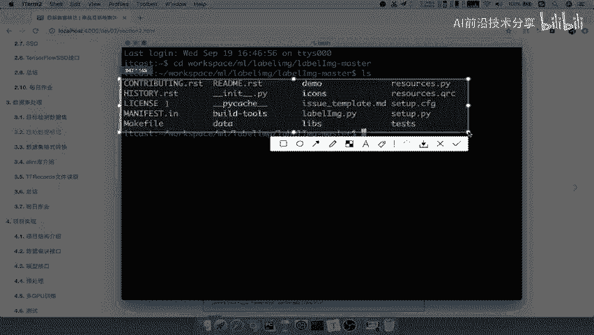

# P37：37.02_商品数据集标记37 - AI前沿技术分享 - BV1PUmbYSEHm

那么接下来呢我们就要去自己去进行，数据集的一个标记，那么此次的我们学习目标呢，就是要了解标记需求，以及呢，我们使用这样的一个叫label，image的这样的一个工具。

最后就是我们想要自己去应用这个LABEIMAGE，完成商品数据集的一个标记，那首先第一个明确的问题就是，为什么我们要去进行这样的一个数据集，标记过程，那第一个点呢其实就是我们在训练的时候呢。

需要图片对吧，你输入图片，然后包括你的这个这个图片当中有哪些物体，标记的，这个物体是不是要拿来作为你的目标值，去进行一个训练，有目标尺，你这个b box才能对应这些目标值计算，IOU啊对吧。

计算或者说标记这些b box样本吧，好那所以这是第一个，第二点呢，就是很多一些特定场景的，都缺乏你的标记数据集，你别看这个past work work这个数据集，以及image net这些数据。

但其实它都是一些比较哎，或者说你通这个通用的一些场景对吧，就拍一张照啊，这里面有哪些东西，但这其实没有实际意义吧，如果说你在某个公司当中，你需要去识别啊，比如说我需要去识别具体的这个啊，我的这个人啊。

这里面的人物是哪些，然后呢或者说其他的一些商品是哪些啊，那你这样的话呢，其实你的数据集呢你就得自己去准备好，当然这个准备过程等下我们再去说啊，好，那么所以呢，这是我们说为什么要去准备这个数据集。

那么接下来呢我们要去标记这个数据集呢，其实就有一些比较好用的一些工具，那么我们其中呢介绍一个工具就叫做label image。

它就是一个数据的一个啊图形图像注释工具，他做用这个qt啊作为这样的一个界面，用Python编写的啊，它主要保存的格式是XML格式，跟image net呢，这个格式呢跟ige net的比赛啊。

当中的这个格式是一样的，但是呢跟这个谷歌那一个数据集是不一样的。

那么这个你可以去他的这个官网啊，相关的官网介绍去可以看一下，这是他的一个啊源码的这个官网，你可以去进行安装，包括一些安装过程，那么这个安装的过程呢在这里我都给写上了，那么这里可能这个图不太清楚啊。

那你可以进行它的官网，来看一下你的这个安装过程，包括你的乌班图LINUX，包括你的Mac os以及我们的其他windows的教，这个安装教程其实都有啊，都有，但是呢由于这个啊我们我当初在安装的时候啊。

这个遇到了很多坑啊，所以他这上面的介绍啊非常的模糊，所以呢我给大家呢也准备了一个两个安装的，这个教程，这个教程呢就比这个网上的要细致很多啊，他这个可能会遇到很多bug，这也提供到了我们当中的这个啊。

我们第二阶段在这个资料里面啊，在每一个阶段资料里面呢，都会有我们的这个标记啊，标这个PDF啊，它的安装PDF你可以根据这个PDF去做好，那这是我们的一个安装，那接下来呢我们安装好之后啊。

安装好之后，它就会在我们的这个目录里面，我们比如说啊进入一个进入我们的这个目录啊，我们进入到我自己的这个目录好。

安装好呢，它就会在你的这个本地呢。

有一个安装的一个文件对吧，你set Python seaver点PY什么就可以了，那么其中就有一个啊label image点PY，你就可以去运行，去安装好。

那么我们来看一下，接下来我们就要去自己动手，去做商品数据集的一个标记，那么我们现在有的呢就是什么呢，就是我们的帕斯卡work，Image pasta work，这里面数据集。

那我要去自己做一个commodity，因为我们是一个什么商品检测项目吧，商品检测项目，那所以我们自己要去标记，图片当中的商品是有哪一些，那么记住了我们自己做的这个标记过程，只是体验这样的一个过程。

这个过程啊就是数据打标签的这个过程，非常耗时耗力的那个，那么这个过程啊它是有专门的团队去做的啊，有一些专门的众包服务的这些数据服务的平台，它有专门的几几百个人对吧，每个人1100天打个几百个。

你差不多就几万张图片出来了，那所以呢他这个有专门的数据团队去做的啊，所以我们只是体验这个打数据标签啊，俗称的一些打标签啊，数据标记师啊，特别是缺乏一些具体应用场景的数据，很多公司他没有自己的数据训练。

怎么办，要去包给别的团队去做，那我们商品数据集标记呢就要提出的需求，你想识别什么，你想检测什么，是不是也这样的一个目的啊，也就是说我们作为这样的一个啊，我们在这里呢进行一个课堂上记要啊，纪要把它打开。

我们保存一下，保存到这个桌面，我们的第二阶段啊课堂纪要，那么我们的这一个商品数据集的标记，首先第一个啊商品，确定设位要标记哪些东西，要标记哪些物体或者类别，有人说帕斯卡word里面有20个类别数据，哎。

他知道要标记这些，那我们要做这个项目的话，你要确定你要标记哪一些吧，对不对，那这个商品的这个什么类别就特别多了吧，那比如说你又有什么生活类的呀，又有衣物类的，又有这个家具类啊等等。

所以呢我们因为这个项目呢，其实就是一个演示的过程，我们就没有必要去把所有的商品都加进来了，对吧，只是啊只是，只是体验这个故啊，或者说只是呢，知道怎么去标记啊，然后呢包括我们后面的训练模型。

要知道这个过程，过程，也就是说你假如说你在其他的这个公司，去做这个应用的时候，那你肯定要第一个确定，就是你要标记哪些物体吧，你要做这个里面的，所以我们这里做了一个简单的需求啊，我们的这演示呢。

包括后面的训练的项目，都是基于这几个物体去做了，包括我们一开始演示项目是不是识别出来，也就是这些物体啊，其他物体都识别不出来，那你想如果你想识别的更多，你能不能去做一样的吧，所以我们在这个课堂上。

就没有必要说把这个东西都做这个，把所有的物体都给标记出来了对吧，那所有的商品对吧，所有商品类别啊，品牌啊，什么都标记，那这个活啊，我这个一个人也完成不了这么大的一个活啊，所以呢这只是说教你怎么去做好。

那么这个地方呢我们商品图片啊已经有了啊，这个商品图片呢也是我去下载下载，去下载这里面的一些商品啊，比如说这里面的一些商品啊，衣服啊，你的衣物啊，你还有你的这个还有你的这个手表啊等等啊。

这个东地方都有了手机啊，还有电脑啊，就是一般来讲呢，就是我们确定了这些需求之后，再去收集我们这些相关的图片啊，比如说服饰类，我只去识别衣服裤子鞋子，如果我们的这个科技产品类，我去识别手机，手表。

音箱和电脑学习类呢，我只搞一个书籍，当然我给的这些类别啊，注意了，我给的这些类别呢都是比较泛泛的，如果你要做到某个特定场景的，比如说我衣服我有什么牌子对吧，衣服有阿迪的，耐克的或者HM的等等牌子。

那你是不是就要收集各这种牌子的图片，去进行识别，能确定这个我们所讲的这个东西，能理解什么意思吧对吧，这个过程需要理解的好，那么所以我们确定这八种之后，我们的图片已经收集好了对吧，哎这个图片收集好了。

那么接着我们就要去标记，那标记呢就要用到label image的标记工具，首先呢第一个我们叫运行这个软件啊。

Python在它目录里面Python label image好运行一下就可以了。

我们打开我们的刚才这个目录，直接Python注意了，它是在我们的这个环境上安装的啊，应该据你的虚拟环境当中去运行Python label image。

点PY派啊，那么这样的话呢它是这样的一个界面。

这个界面相关的介绍呢说open啊，这里面基本上打到打开你的DR，打开你的目录，或者打开一个文件，一个目录，然后以及上下的哪一个文件，如果是你目录的话，它可以自动上下哪一个图片，那么这里面verify啊。

这个VERTIFY，这个image就是相当于你给它进行一个啊，这个验证认证啊，就相当于这个这个按钮，其实没有什么太多作用啊，我们介绍这个吧，这就是你要储存储的啊，这个打标签的结果。

存储的格式默认的是XML的格式，然后你要去给它画框唉，就用create这个react的box啊。

react box好，这是它的一个相关界面介绍，那么我们接下来就要去对物体进行一个背景，好比方说我们打开刚才的这个软件，我们open一下，open一下我们的桌面啊，我们的这个在这里面啊，Detect。

还有我们的image上面的好，我们找到我们自己的删档这个物品的图片啊，那么比如说我们选一个后面的啊，我们选一个这个，好比如说就这一张啊，我们打开，那么这张图片就有了。

那么你首先就要看到这张图片里面有哪些，你已经确定需求的物体，已经是确定哪些物体啊，确定物体，然后呢确定物体之后，查找这个东图当中有哪些物体对吧，哎这个图片，查看图片图片的物体，这非常简单了啊。

直接说了啊物体，然后呢直接去进行标记就OK了，对这就OK了，好我们来看一下有什么衣服裤子鞋子手表手机，那么我们来看一下我们的图当中有这个手表，是不是有啊，呃手表没有啊，我们那有电脑手机对吧。

书籍这里也有书籍吧，那么比如说我们在这里点击create box好，我把手机给标记出来，这时候它弹出一个框，叫你去选择这个物体的名字是什么，注意了啊，物体的名字，所以你一定要与你刚开始定的名字一模一样。

否则你到时候你这个标记的时候，跟你到时候训练的时候，里面的名字的一些名称不一样，那就有问题了啊，手表我们选择了WH好好，那么这里WATCH好啊，这个地方不是watch iphone phone吧。

我们看一下是phone啊，phone我们直接p h o n e phone好，这样的话一个物体已经标记好了，就在这个地方，那么比如说你还想标记，再来这个地方是不是电脑，是不是我们创建的需求里面。

是不是有这个电脑啊，那么我们的物体框之间啊，其实重合尽可能的与这个物体框呢稍微靠近啊，重合一点没关系啊，重合的是没关系的好，那我们这个地方呢确定是一个电脑computer对吧。

c o m p u t e r computer好，确定了那两个对象是不是出来了，然后比如说这里还有一个书啊，当然这也不是书啊，你可以进行表把它进行一个标记啊。

这里比如说书就是我们用的是books box好，BOOKS好，它就显示了你这个图片当中有哪些物体，当然你如果还能找到其他物体就标记起来，如果说特别小的，就一般就可以直接忽略了啊，特别小了。

就说明你不你能这张图片的这个目标啊，不是在那个很小的物体上面，对吧啊，你要照的话也不可能照太小，好当你标记好了之后，直接按住CTRL加S保存，这个时候他会以你的图片的名字为它的，这样保存的文文件名。

然后你只要保存默认格式是点叉ml，如果你想去换，就点这个地方左下角看到这里，点这个地方去换好，就是这个地方啊，这个地方去进行一个切换，数据集格式好，我们就保存在刚才那个目录吧，好save一下。

这样你标记的三个物体都在里面了啊，当然如果你不想标记，你给它一删除也是可以的啊，直接删除就可以好，那么这样相当于我们把这个图片，是不是标记好了，Ctrl s，那么这样的话他应该是在我们这个目录下。

A名字是不是一模一样的，哎这个也方便你去读取这个数据了啊，XML的这个数据。

那你可以打开这里面的数据，你都可以去找到它当中，那这里面的b bounding box啊等等啊，包括你图片大小啊。

这些东西都已经有了，那么这个我们就不去详细介绍了，刚才说过了，这就是你标记了三个物体都有了对吧，Phone computer books，那么这个里面呢这个x mini y mini。

my max呢已经介绍过了，所以呢这就是我们整个标记这个图片，的整个过程啊，其实非常简单啊，他们这个也有可能啊，这其他团队的呢，哎一些团队形式的这种标记任务呢，他们可能用的工具不一样啊。

因为这个可能这个工具呢对大多数的需求呢，可能他们有一些更复杂的需求啊，去处理啊，哎就满足不了好，那么这样的话呢，这就是工具的使用，那么所以总结啊非常简单啊，就是你掌握这个label image的一些啊。

标注实用就行了，但是一一般情况下我们自己不会去做，那最后呢也给了一个问题，就是通过这样标记数据。

假如你想去做一个潮流品牌的一个潮流商品，品牌的一个识别，就是比如说衣服的或者潮流商品品牌的，你想你怎么做，首先确定需求，你想要识别检测哪些品牌吧，好比如说有1000个品牌啊，假如说你有1000个品牌。

那你接下来是不是要找，含有这1000个品牌的相关图片，你可以去网络去爬取一些数据，或者是你去人为下载一些数据，下载个几万张，然后一张一张去标记是不是就可以了，是OK了吧，所以你要做的目标检测的东西。

一定是要你先把你的需求给定好了，你要标记哪些物体定好了，所以我们这个刚开始演示的那个项目对吧，我们刚才演示的项目就是说它能识别的东西，因为我已经定好了，所以它只能识别这八种物体，那如果你想要识别更多。

是不是只要把数据换一下就OK啦。

模型再训练一遍OK啦，其他的代码呢我们到时候也会说的对吧好，那么这就是啊我们的这一个问题好，那么这个商品数据啊。

