# P39：39.02_格式转换：代码介绍39 - AI前沿技术分享 - BV1PUmbYSEHm

那么紧接下来呢我们就要去做一个案例了啊，我们要动手写一下work2007的数据解释转化，那么这个转换的效果呢，我们来看到这里，对于这种里面我们会看到word207杠test，000啊。

一直到test里面呢会有24个train，里面也会有很多，那么我们来看一下之前我们的数据集呢，是这个样子的啊，在我们的image下面有test和train，我们对于这两种呢一个训练。

一个测试都给转换成tf record文件，能理解吧，哎也就是说别人读取呢可以选择读是train，也可以选择读test啊。

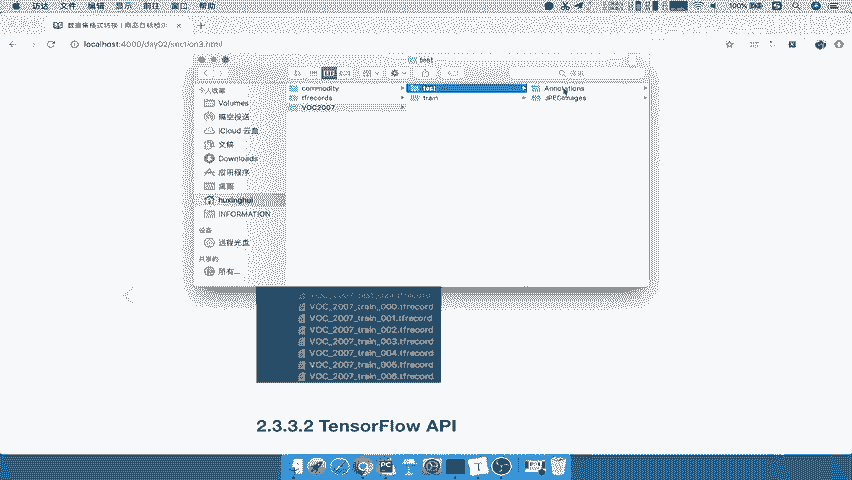

这是它的一个选择好，那么这是它的效果，我们当然在我们的项目当中呢，也可以去运行我们这样的一个代码，好比如说我们先来借看一下吧。

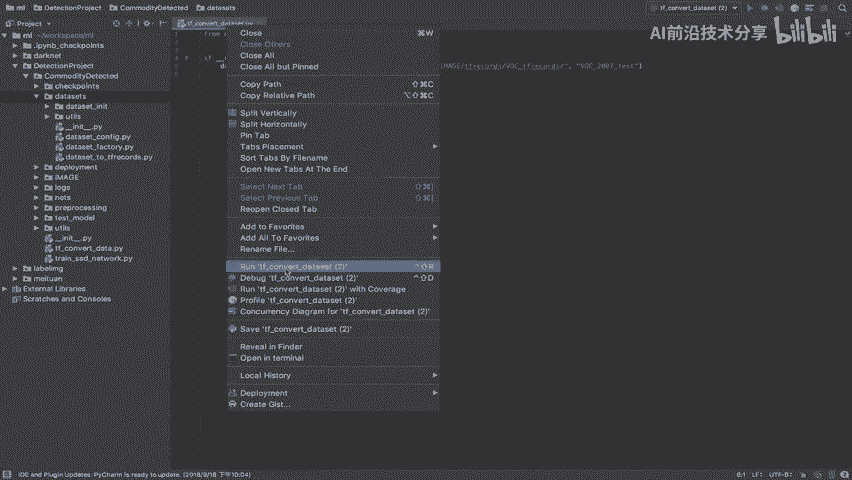

看一下这个代码里面直接我run一下啊，我调用之前写好的逻辑，Dataset to tf records，然后呢指定我们数据集的目录好，我这里只先转换test文件夹上的数据。

它会自动读取啊，刚才我们说的test里面的这两个文件夹。

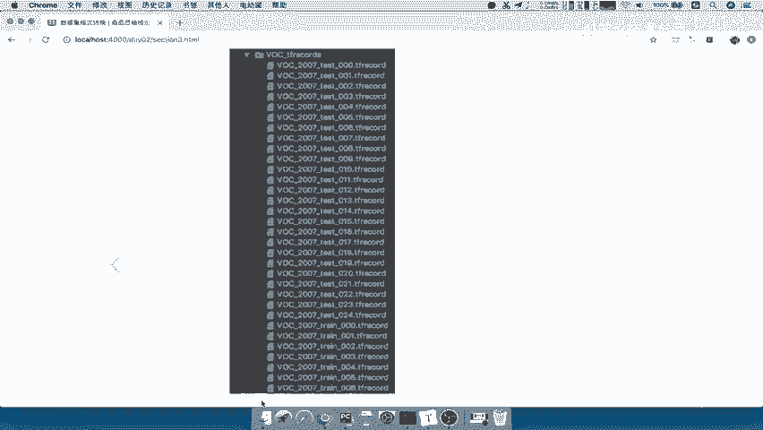

一个图片，一个XML，然后你的输出文件夹的目录，输出这个数据集格式的一个目录，以及我们指定一下你这个数据集的，它的一个名称，你是work207test还是word207train啊。

这是我们要指定的名称啊，好那所以呢我们接下来运行一下，我们看一下它的一个效果，好那可以看到呢它就在这里进行一个转换啊，从多少多少哎，一个一个文件进行一个读取的转换的一个进程，然后呢。

最终啊他这个测试的一个数据局，有4952张图片，好我们等他呢大概运行完，当然你如果想要这个输出呢，不这么频繁也可以啊，我们是一张一张图片转换的进度呢，可以打印一下好，转换好之后呢。

我们在这个目录文件夹下面，来看到TFRECORVOTF，RECOR里面就有了test文件夹啊，文件的这样的一个哎，在这里这么多TFRECOR，当然如果你想要保存train也可以。

你把这里改成train文件夹下面的啊，我们保存的文件目录也为文件名字啊，这个文件名字为train，然后呢它会在后面加上000001。

那为什么会出现这个000001啊。

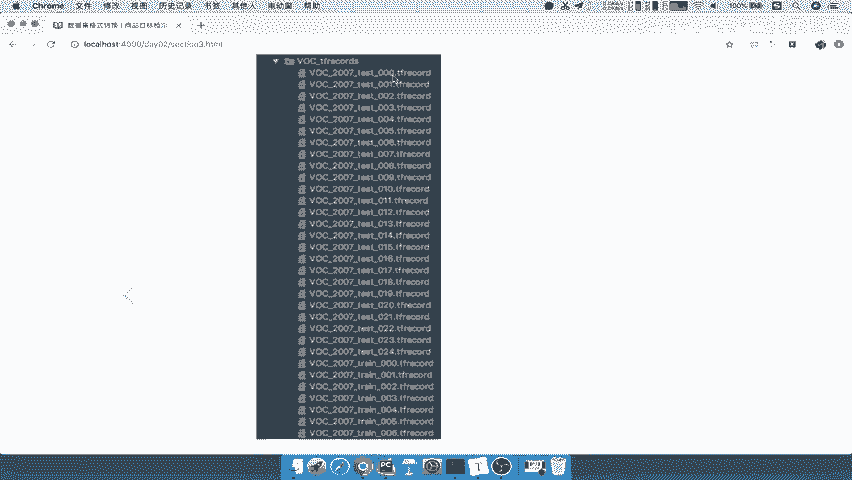

一直到24，因为我们在选择存这些文件的时候。

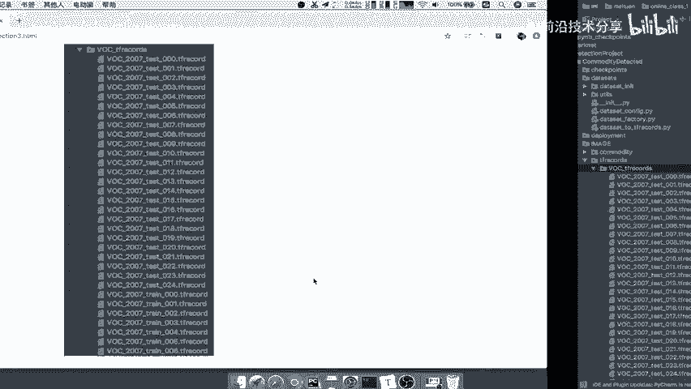

注意了，我们不会把4952张的这样的图片，以及它的XML文件的是一些相关的一些内容，全部都存储在一个tf records，我们可能会在一个tf records里面去存储一个啊。

或者存储200个图片以及TML信息，能理解吧啊不会把它全部存在一个TFRECOR好。

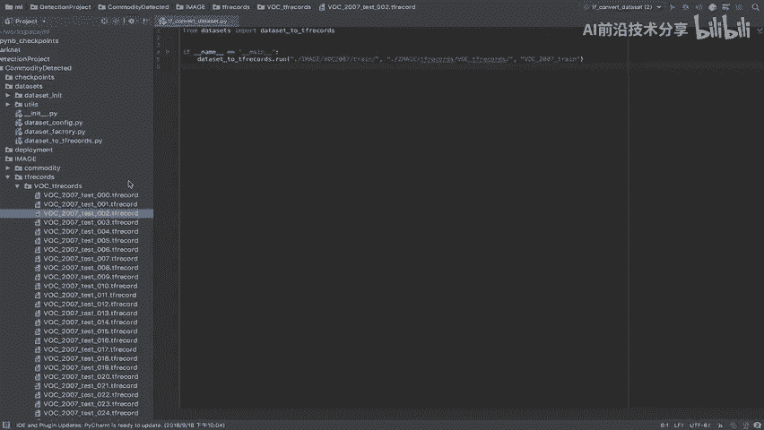

那么这是我们刚才读取的一个啊，这个进行转换的一个逻辑，所以呢接下来啊我们就要去介绍，我们怎么去做这个过程对吧，首先呢我们先看一下基本的一些API，然后再去看一下代码，那么我们的API呢。

有这个主要是TENSORFLOW当中的一些API，包括GB的一些读取模块，我们可以去判断文件存在啊，以及创创建一些文件好，那这还有一个就是我们要存储文件，什么意思呢。

就要去建立TF的record的一个存储器，那么这里面我们使用tf record writer啊，注意到这个API去写入到某个路径里面的，这些文件好，那么这里面我们会是将图片加图片啊。

和我们的这个XML的属性信息呢存在一个example，我们说了一个文件存储的一个example呢，我们会需要一些协议格式来制定啊，也就是说你存进去呢需要指定这些协议格式啊。

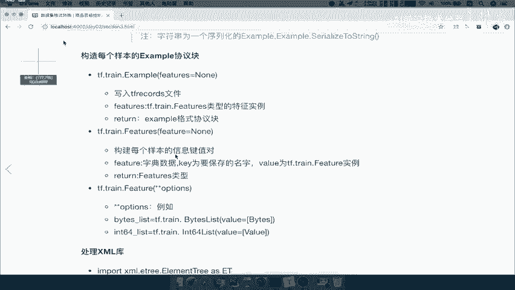

这协议格式啊，我们等到具体写代码的时候再去详细介绍啊，那还有一个就是处理我们的XML的一个库啊，XML的库怎么去处理这，XML当中的每一个这个根节点啊。

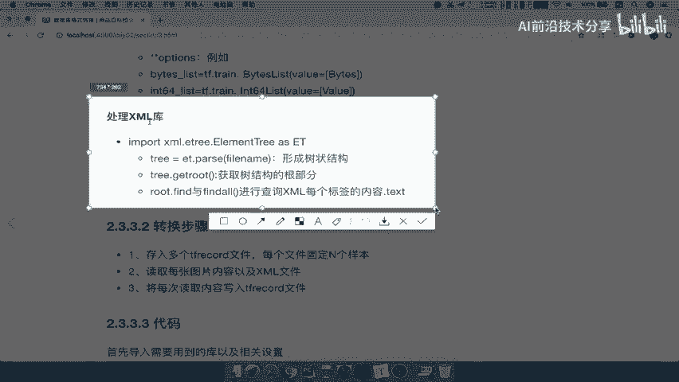

节点上面的一些数据好，这是我们相关啊要用到的一些API，包括这些文件读取等等，好，那么接下来我们就要去分析，怎么去做这一件事情啊，怎么去把这个东西转换好呢，我们在这里写了一个几个转换步骤。

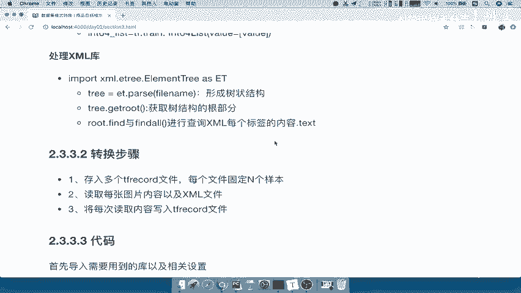

第一个呢就是你存入到多个tf records文件呢，你每个文件固定是N个样本，这个首先你定好，比如说我一个文件呢存储100个图片，和他的一个信息，我一个文件可能除200个图片，和它的信息也有可能吧对吧。

那这是我们的第一步啊，先你也要写一下这种这个步骤的一个逻辑，转换逻辑，然后呢紧接着我就循环的去，因为你已经写好了，我一张啊，每一个REX存多少文件，那你是不是就要去读取每张图片。

以及它对应的XML内容啊，我们说了，你要去一一对应啊，图片跟XML11对应，然后将每次的读取内容写入到tf rec的文件，就OK了啊，这个逻辑呢非常简单。

那我们来看一下我们的代码的逻辑是什么样的，这里呢我们将要用到的一些库啊，以及它的相关的一些配置属性呢，都放在了这样的一个啊导入等下我们会说的，那我们的代码结构呢来看到，我们要把它存储器存储到TFREX。

我们直接新建啊一个data size的这样的一个目录啊，这个目录呢也是按照结构，跟其他的一些目录分开，那么data size当中呢，我们会用到一些啊公用的一些组件读取的时候，然后以及我们把一些简单的啊。

通用的这些配置啊，放到一个CONFIG文件当中，还有我们的dataset to tf records，就是我们的主要的存储逻辑。

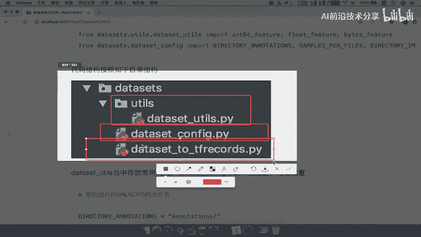

那么首先呢我们这个TDATASET杠configure，这里面是判放一些配置文件的啊，包括我们的目录啊，指定每个TFRECOR存储的一个数量，那么首先我们就第一个，先来看第一段代码的逻辑。

然后我们先把第一段代码逻辑先实现，能理解吧，第一段代码的逻辑是什么呢，我要去指定添加多个TFRECOR的文件，每个文件固定N个样本吧，所以我们在那个tf record的这个to啊。

这个to tf records文件当中建立一个run函数，来去实现这样的一个逻辑。

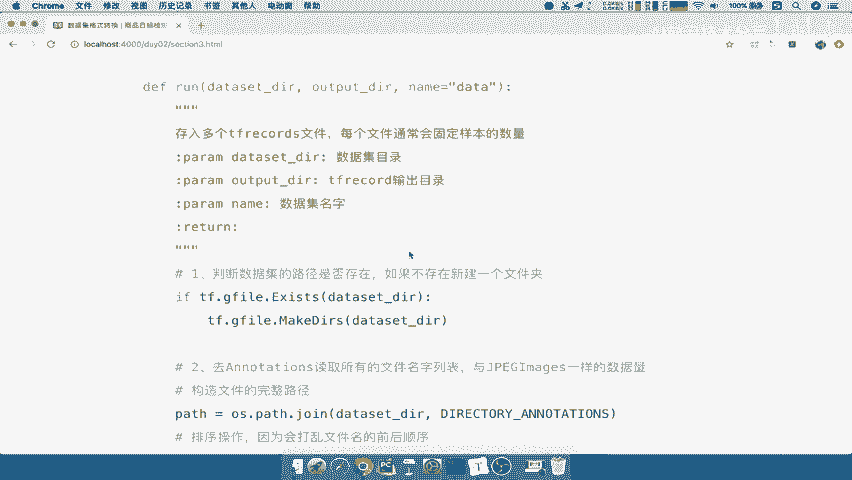

那么它首先第一步呢，判断文件的这样的一个路径是否存在，不存在的话呢，我们创建一个你的数据集的一个新的啊。

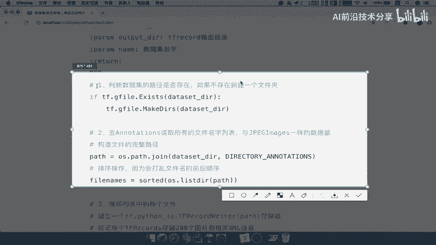

或者说你不存在，我就创建一个新的文件嘛，那么也就是说啊你的数据集的目录啊，要先判断存不存在，或者说你报一个错误也可以，然后接着我就要去annotation里面是什么。

是不是我们XML文件去我们的这个里面啊，我们这下次呢就不给它关闭了，好这里面annotation XML文件的目录，我们把这个呢构造好。

将我们的这个里面跟我们的数据集目录指定，注意啊，我们指的是数据集目录啊，以及数据目录下面有哪些文件夹，给它合并一下啊，我们一般呢指指目录就行了，然后合并好之后呢。

因为它这个操作OS点pass jo会会打乱我们的顺序。

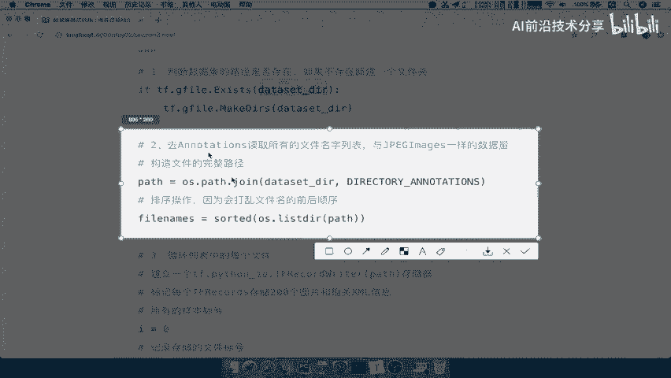

一定要把它进行一个重新排序，因为我们的文件是不是从按前到后，12345678啊，哎你的图片文件也是1234578吧，到时候你读出来2万1没有对应啊，就不太好了，所以把它进行一个排序啊。

排序进行的一个重新的打，把打乱的文件啊重新排序，第三个呢就是循环列表当中的每一个文件，我们是要从第一个文件的XML，或者第一个文件的图片进行一个一个的处理啊，那所以我就会记录一个所有的样本号。

以及记录一个存储的文件标志，什么意思呢，我去循环这个列表，文件名列表里面，然后循环之后呢，我们新建一个啊，获取一个图片的名字，什么呢，文件get output file names，获取一个文件的名字。

也就是我们在这里面构造的这个文件名字，在这个当中构造了这些文件名字好，那我们来看一下这个构造的文件名字呢。

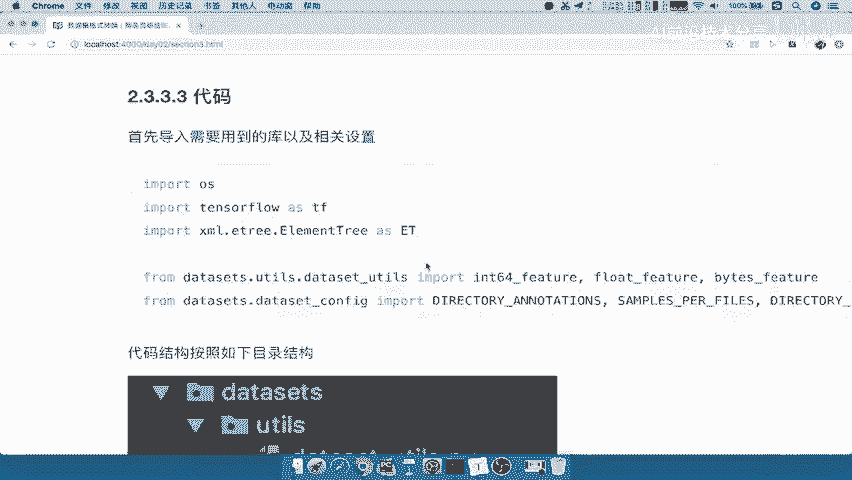

我们在后面有可以用这种格式，你的输出目录，你是不是要指定一个文件，tf records文件输出的目录啊，然后指定它的数据集的名字，以及你是属于第几个文件吧。

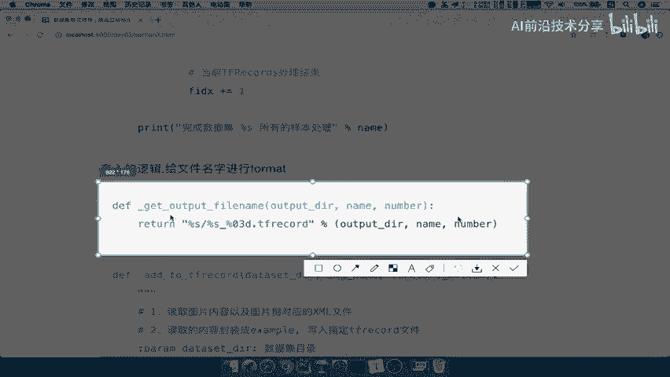

哎第几个TFREX的文件好，构造好之后，我们接下来要做的就是每过200个。

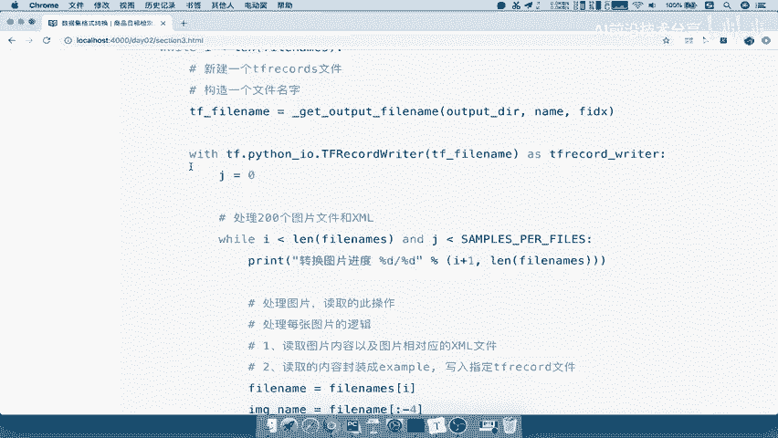

注意了，每过200个，当然我们这里是默认200个，你可以过100个，过300个，每过200个呢。

我们就构造一，我们把这个tf record writer就构造好了，然后200个存储一次啊，200个就是将图片一个一个的进行构造，读取每一个图片的XML，以及我们的图片文件的名字。

加我们的图片文件名字去写进去，然后呢再循环一次，200次循环之后，这个tf records文件写好了，就是第一个tf record文件写好了，接下来循环到这里，又要构建第二个tfb react文件。

能理解吧，也就是说我们会循环200个图片放进去之后，再构造一个文件，放200个，再勾一下，有一个文件放200个，不够200个的，我们会把后面所有的都会存进去，这就是我们的代码的一个逻辑啊。

包括这其中我们要用到的啊输出的目录，那么这个其中啊ADD to tf f record，就是我们后面的这个步骤了，我们先把第一步骤啊去进行一个实现好。

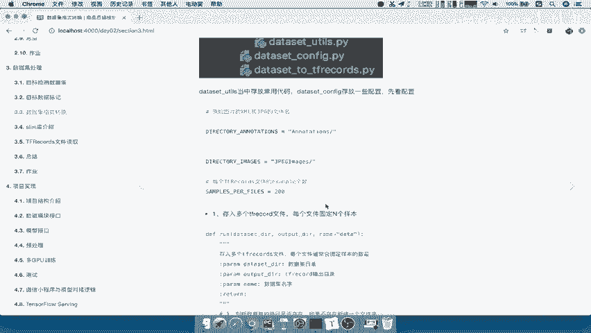