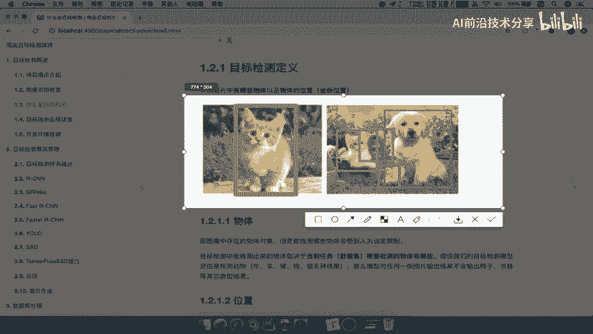

# P4：4.目标检测的定义和技术历史4 - AI前沿技术分享 - BV1PUmbYSEHm

好那么什么是目标检测呢，啊我们这里呢学习目标呢，是知道目标检测的定义，以及了解一下目标检测的技术的一个发展历史，那我们先来看目标检测的定义，刚才其实我们已经提到了，所以我们给一个完整的定义。

识别图片当中有哪些物体以及物体的位置，这就是它的定义好，那对于这个定义呢，我们就直接啊我们总结呢直接粘贴到这边来，目标检测它的一个定义为，识别图片中哪些物体以及物体的位置好，那么我们说了这个物体。

这个物体代表什么意思呢，哪些物体物体代表什么意思呢。

这个物体就是我们图像当中存在的一个物体吧。

这张图中有哪些，比如说我们看到这两幅图对吧。

比如说第一张图它存在一只猫对吧，那就是说这个图片里面存在一只猫，那第二幅图，这个图片里面存在物体就不止一点了吧，就是你所认为的啊，就是你所认为重要的，就或者说我们人类对吧，我们因为物体它有很多啊。

你树叶也是物体吧对吧，你不能说把所有的草啊，树这些对于我们来讲，是不是是不是无关紧要的东西啊，所以我们肯定是要抓住关键的物体吧，那么第二张图你可以用狗鸭哎猫，那还有比如说这个哎或者是一个这个水桶对吧。

那么我们要识别的物体，是要把所有物体都要识别出来吗，是要把这些东西都要识别出来，那肯定不是，所以一般对于我们要检测出哪些物体呢，是人为设定限制的，注意这个东西是人为设定限制的好，那么要识别哪些物体啊。

这个地方呢就是人为设定限制好，什么意思呢，我们就以这个商品目标检测，你想它既然是检测什么商品对吧，比如说电脑，手机啊，平板等等电灯，那么我说我把这个比如说把一个猫，那猫当然也可以做商品对吧。

哎我把一半房子这个照下去了啊，当然没有在淘宝上面去买房子对吧，好我照了之后呢，那你说我把这房子检测出来有什么意义吗，没有什么意义，我要检测就是很多人买什么东西呢，这些商品，也就是说具体你的业务场景。

又需要识别哪些东西，是不是要把它哎记下来哎，也就是说你的应用场景当中，应用场景答案中需要检测出来的物体，好这个啊一定要记住了，就是说它会失人为设定性的，比如说我要检测100种好，这100种我能检测出来。

但是如果说你还有其他的一些未啊，这个当前业务没有提及过的，那可能就检测不出来了，这个我们在讲算法的时候啊，再继续具体说明，那这是识别哪些物体，这是第一个啊，第二个位置怎么理解呢，我们来看一下。

其实就是它的坐标位置，这个坐标位置呢它一般有两种形式。

两种格式，一种是极坐标，一种是中心点坐标好。

那么极坐标表示什么呢啊它这有四个值，因为我们看啊，对于一张图片来讲，你画一个方框把它标记出来，检测出来，是不是就相当于有这样的一个几个点吧，但是几个点的的话，他不会把每个点都需要描述出来好。

它只得出这几个就行了，X mini y mini x max y max，那分别代表的是什么呢，XY坐标的最小值和XY坐标最大值，那么一般怎么去定义这张图片的呢，我们会把左上角视为原点，零零好。

那么我们来画一下，相当于是在这里左上角，然后呢竖的从这个地方是不是零零，然后从这里开始哎，从这里开始啊，分别代表你长度，当然我们这个地方呢就不会为负的啊，也是为同样为正的，那我们来看一下。

所以我们这个人啊，比方说这个人他的这所在的这个位置，我们以XY最小值在哪里，是不是在这个地方，我们圈一下XY的最小值是不是在这里，XY的最大值是不是在这个地方，对不对，你看这里。

比如说吧我们这个地方没有写上啊，这里比是X这表示Y那么同理X到这里哎，Y在这里，然后呢X又大了一些，在这个点这个点X大一些，Y也是最大的，所以一般呢我们就是这个极极值坐标了。

极值点坐标就是左上角和右上角，好，能理解吧，好那么中心点坐标呢它是什么呢，目标检测框的中心点坐标，以及目标检测框的宽和高好，那我们来看一下目标检测框，还是以刚才那个原点啊，左上角为原点。

那么它的中心点是不是在这个地方，比如说这个人，那么他的宽和高啊，比如说这里呢就是代表了这根粉色的啊，粉色的代表这个横的代表宽，然后呢这个纵向的代表高好，这几个坐标就能够描述出来。

那所以我们比方说看到这个例子，这里有三个对象，他们的中心点坐标，那比如说XY我们只看一个啊，比如说我们就看这个狗的了，狗它的XY是代表什么中心点坐标啊，XY100和600。

那么100就代表我在这个地方好这个地方，然后呢我们的100什么意思啊，是不是离这个地方这里是X吧，然后呢离Y是600好，我们也可以看出来，然后呢我们的box wiz150，Hi hate100。

所以这个地方的宽是150，然后呢这边是啊，这边呢是就是我们的100了啊，刚才这个取消掉了100这个数的好，那这是假设这个图片是1000×80的啊，那所以这个就是我们这个坐标位置能理解吧。

好那所以这个地方的物体的位置，这概念必须得了解啊，第一个就是我们的啊极值啊，极坐标表示法，极坐标表示，那么它里面有x mini，Y mini，还xy max和y max，还有我们的中心点坐标。

好那么这就是X干center，还有Y杠center，还有我们的宽啊，这个目标检测框的宽和高好，那么这样的话呢，我们就对目标检测当中这两个对吧，一个物体，一个物体的位置啊，要有一个这样的一个认识好。

那么这两个呢是需要掌握的，我们后续的这个标记呀，包括数据的处理呀，都会用到这这样的一个，其中的一些坐标表示方式好，那么接下来我们来看一下，我们的目标检测的一个技术发展历史，也就是说我们有哪些技术。

目前可以去用来去识别图片的，也就是我们后面会重点介绍的一些技术，那我们呢把它分为三种啊，三种阶段，一个阶段传统的检测方法，那这里面需要由我们去选项候选器意，加些手工特征提取，加些分类器一大堆对吧。

那这个里面的有些词不理解，没关系啊，后面会介绍的，那么第二种就是还是一样候选区域，将我们的CN分类哎，加入了一些深度学习的东西了对吧，然后进行目标检测的框架有这么多代表性的啊，这些我们都会去介绍。

那么端到端的一种呢就是比较简单的，或者说快速的啊，目标检测框架有YOLO和SSD啊这些，那所以我们分为三个阶段吧，哎这个技术发展历史发展历史，那么这里呢我们直接复制过来了。

好那么这也是我们要啊了解的这几个部分，好，这样的话呢我们对于目标检测一个简单的定义，以及它的发展历史进行历啊，或者说它技术历史啊。

不是发展历史。