# P42：42.05_格式转换：example封装、总结42 - AI前沿技术分享 - BV1PUmbYSEHm

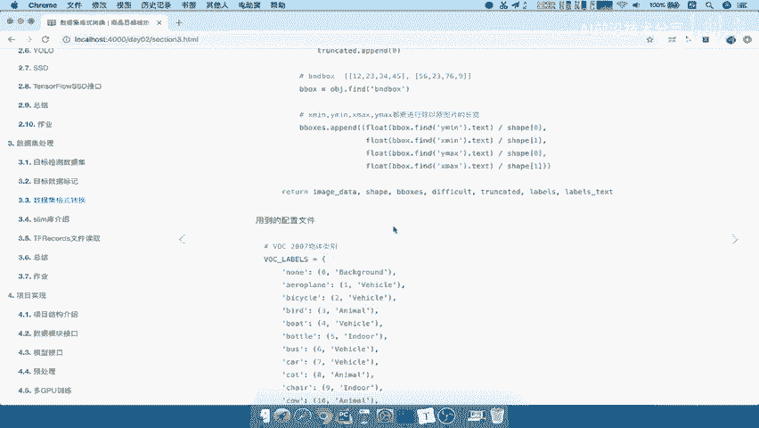

我们把这个XML以及图片文件读取之后呢，我们这个为了防止啊后面继续出错啊，我们看一下这个前面这半部分写的有没有问题，我们来测试一下，比如说我在这里打印一下image的data好。

那我去调用一下这个run函数，到底把这个图片的数据读出来吧，好那我们在online class里面，我们在整个DATASET外面啊，建一个这样的一个读取逻辑。

我们是要使用data size模块下的这些API，那所以呢我们在这里new一个，比如说data set guto啊，rtf record好，那对于这个文件呢。

我们要去导入的就是from我们的DATASET模块下面，import一下某个文件，import我们的dataset to tbreaks，这个名字啊，我们名字没有重复杠啊。

直接to gtf records好，那么我们直接进一个main啊，if那么may in呢，我们在这里面调用data set to tf recor，点我们的这个函数啊，叫做run函数。

好run函数第一个目录我们指定这些，其实你现在指定没有关系对吧，它没有真正写进去，只是说创建了一些目录，DATASETDR啊，我们就直接只见我们的DATASET，当前目录下的image。

下面的我们指定什么walk2007啊，VOC杠啊，杠2007下面的test好，然后指定第二个output dir，就是你输出的，同样在RMAGE下面的这个tf records下面的。

我们又创建了一个目录对吧，v o c gut f r e c o RDS好，这个目录，然后呢指定最后一个你的文件，你的这个文件的名字，那我们说直接用VOC杠2007杠啊，test是不是就可以了。

我们直接用字符串啊，字符串VOC杠2007杠test好，那么我们来运行一下这个函数，我们来看一下结果，好，那么这个地方呢，我们看一下他这地方报了错误啊，Test voc2007，下面没有。

我们看一下数据及目录，有没有对啊，我们的这个目录不对，不是VOC杠，注意啦啊，是VOC2007，这也是数据集名字，这是我们的目录，好我们再运行一下，Tube object is not coble。

他报的问题呢我们来看啊，在据我们写的代码的54行，这个地方我们看啊出现了一个问题，好，那么这个地方同学们想应该是什么问题啊，我们取出了work labels，点label，取出的是一个元组元组。

我们应该啊应该是这样去写啊，直接取出我们的用一个列表的形式去写啊，不是用括号的形式，不是一个函数那种形式能理解吧，好所以呢我们最后再来运行一下，好，那么这样的话，我们是不是把图片的内容打印出来。

说明我们读取没有问题吧，啊我们的整个读取已经到了这个地方了，是不是这里已经成功了，所以我们就不用管后面了，好我们把这个暂停，那么接着我们继续往后去写啊，那首先呢我们还是把读取图片的这样的。

一个逻辑呢总结一下啊。

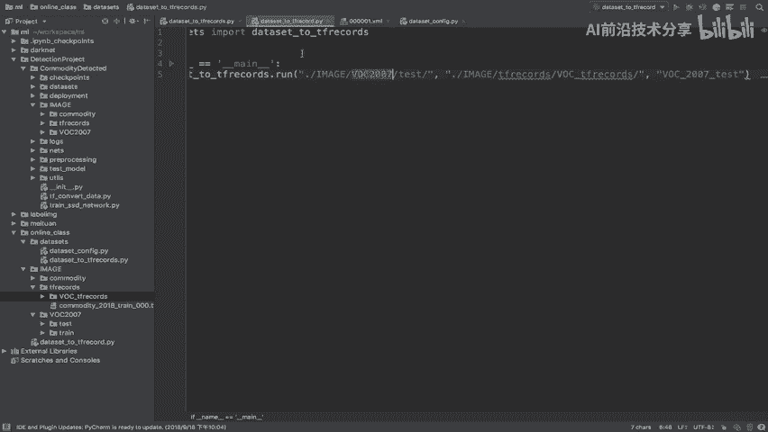

我们因为这个整个代码比较长，所以呢我们总结一下读取读取图片以及XML数据，那我们这个地方读取的逻辑就是什么呢，就是把啊利用利用这个T工具去读取吧。

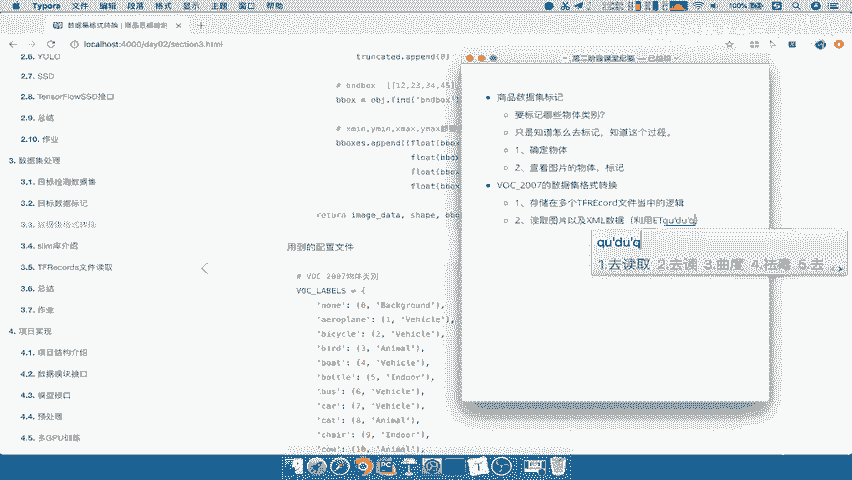

那么这其中涉及到我们读取图片，我们用到的一个API是什么。

来看到读取图片用到APITF点7file点啊，这个我们直接复制过来了，我们直接拷贝为粘贴为文本。

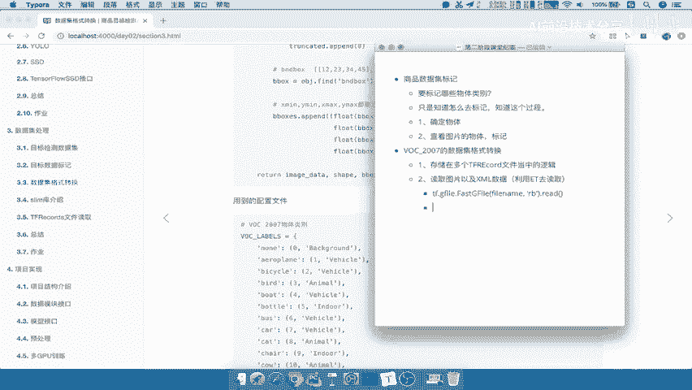

还有一个就是读取ET的啊，就是读取XML文件呢，我们用的ET点pass啊。

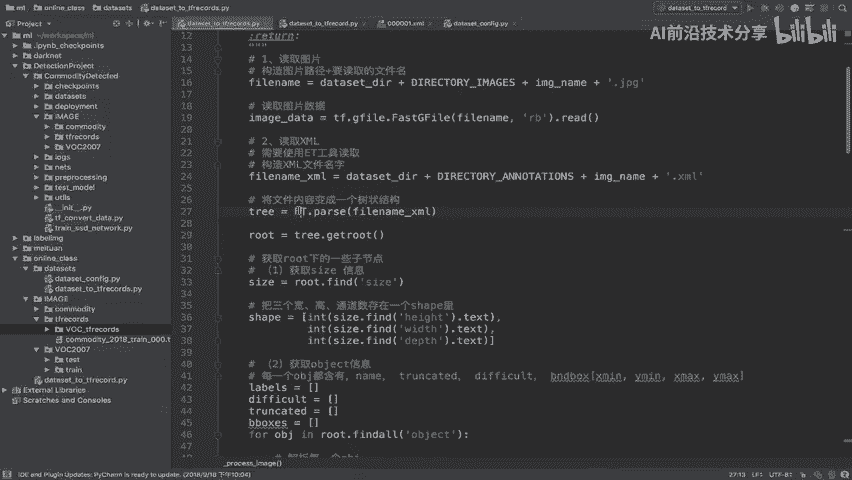

get root对吧，ET点pass粘贴纯文本点PARSE，还有包括点root点find这些API啊，必须得掌握了，然后呢root点我们的find哦，还有我们取出里面的内容，用text取出内容好。

那么这是我们的这几个工具啊，然后我们再说这里面的逻辑呢，就是说我们会在其中。

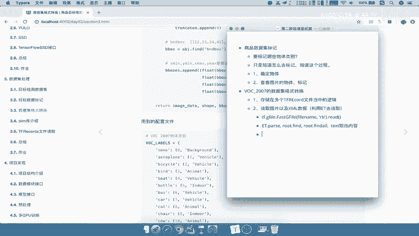

在取出这个长宽高的时候呢，啊还有我们的b box里面的时候呢。

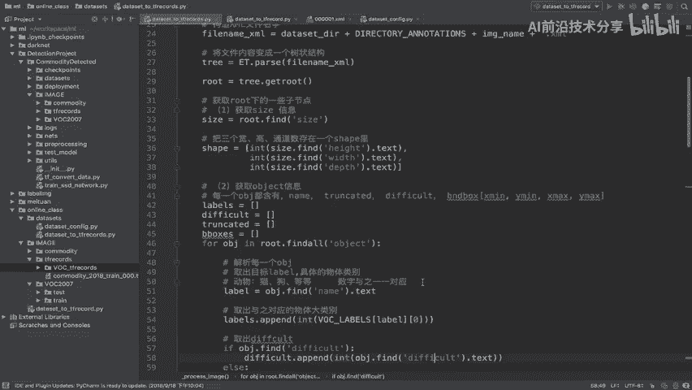

会做出一个规划啊，我们取出的数据做一规划，取出的位置信息啊，做这样的一个规划啊，我的标准化是就是啊，利用这样的一个与与原图片吧，原图片长宽进行删除，删除运算，那这里目的为什么呢，就为什么要进行转换呢。

我们一直说了，这地方是为了啊，算法的这样的一个运算需求需求，它不需要用这么大的，他要的就是一些这个正好是长宽的啊，它的运算需求，然后呢，也会按照你的这个指定的顺序去存储就行了。

好那么这一部分呢我们简单的就总结一下，我们这里怎么去使用这些函数的啊，包括我们把每个对象都给存储取出来存进去好，那么接着我们就要来来到第三步是干嘛，把取出的数据，把这个取出的数据存储吧。

数据存储的分装成一个example，那我们在这个地方还是一样的，example封装的，我们的原则是什么。

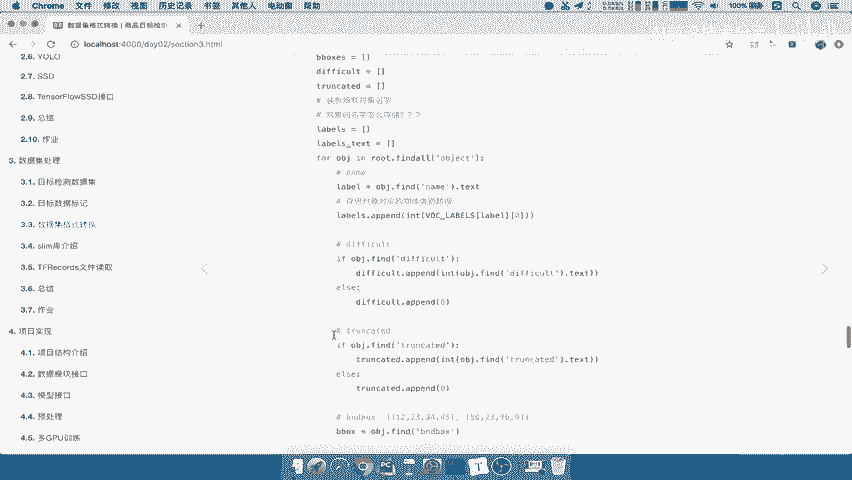

这里已经也介绍了，原则是详细的信息都可以存进去，你有什么存什么能理解吧。

哎方便后面的人读取，所以我们就按照我们这个图当中啊，这我们上课这种代码课件当中，代码去进行存储好，那么所以存储的时候一定要存储，知道我注意一个我们的代码逻辑。

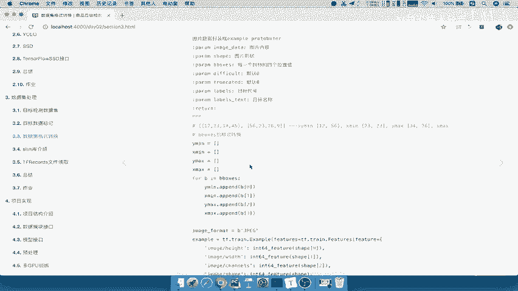

就是在我们存储到读取的时候，是不是一个图片呢四个属性啊，看到这里一个图片的四个属性。

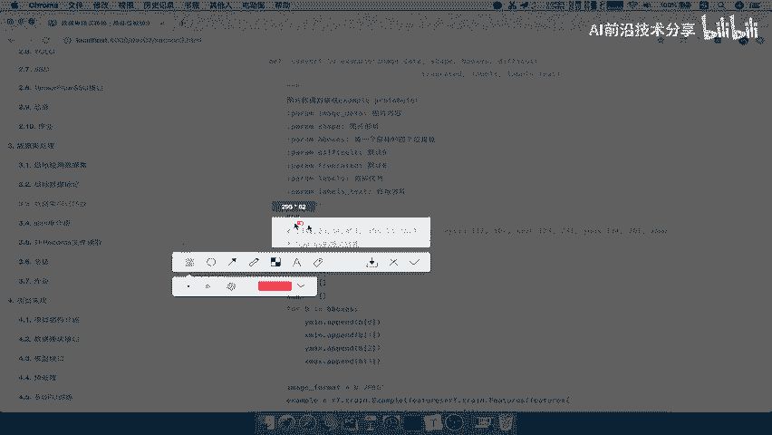

四个这个位置，一个图片四个位置，但是我们存进去的时候。

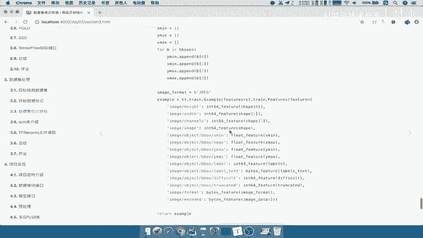

尽量让这个东西变得是这个样子的，这个样子也就意味着你的格式是这样转换的。

由第一个图片的y mini啊，X mini，比如说y mini变成了12哎，Y命令十二五十六，第一个图片的Y命令，第二个图片Y命令，第一个图片Y命令X命令，第二个图片X命令，能理解什么意思吧。

你要单独啊把这个s mini存取出来，你是不是要读出多个对象的S命令啊，然后呢X8X也是第一个对象，第二个对象，第三就这样的一个买smart，就是需要有一个这样的转换过程好，那所以我们的整个逻辑当中。

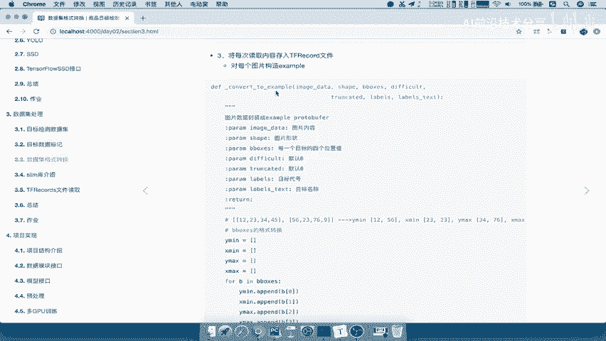

convert to example啊，我们把这个所有的数据都拿了过来，所以在这里分装一下我们的函数，Convert to example，我们直接将我们读取的内容放进去，所以我们要实现这样的一个函数。

好我们就在这里实现define一个这样的函数，这里呢我们就不把这个每个注释写出来了，这注释太多了，我们就读取就是转换，将图片数据转换成一张啊，将一张图片转换成我们的这个example格式。

EXAMPLE这样的一个格式，使用吧使用example转换成PROTOBUFFER格式啊，这个是比较好的，那所以我们接着呢在这里就要去进行转换，首先第一个我们要为了转换需求进行，为了转换需求。

对我们的b boxes进行格式调整，从啊一个列表，一个对象的列表，一个对象的四个属性列表，变成什么呢，哎四个位置单独的列表，那么这样的话呢，这个转换过程怎么办呢，我们单独新建几个列表就行了。

y mini等于y mini等于一个列表，y x mini等于一个列表，我们的y max等于一个列表，然后我们的x max等于一个列表，那所以我直接就去循环我们的b box啊，for我们的b in。

我们的b boxes等于，然后呢我们让y mini去取出我们的数据，取出啊，直接append啊，append我们的数据，B是一个对象的数据，所以我们在这里写了B是包含的，应该是这样去做的啊。

在这里写一下，应该是一个列表当中存储了多个对象的结果，比如说二十三四十四，二百五十六百二百三十四啊，13，然后呢，第二个对象是不是也可以用啊，我们用几个，好这是四个。

那么我们要转换成的结果就是我们打一个箭头，打箭头，然后转换结果呢就是y mini应该是什么呢，哎应该是23和34组合，然后呢y x mini应该是46和564组合，564。

然后呢我们的这个y max y minux命令y max啊，y max应该是我们的，234和二二百三十四二，最后一个x max应该是我们的哎，13和465，也就是说我们要从这个格式转换。

这个格式存储进去，能理解吧，所以我们这里应该取出的是B0啊，B0，好我们再运行一下啊，在这个地方的复制一下x mini这个y max x max，这就是B1B2B三，取出来了，那接着取出来之后。

我们直接啊将啊所有信息分装成example。

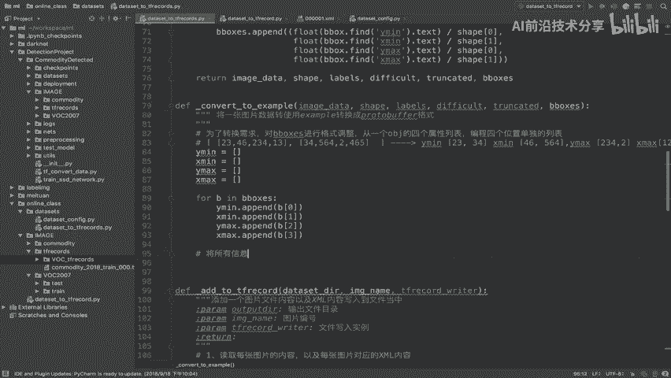

好，那么这个example呢我们说怎么分装成example，就要用到我们的API当中，在这个地方，tf train点example这个东西进行一个分装，那么这个封装的话。

features里面又要传到传入的参数是什么呢，我们的tf train点features features一个实例，然后里面有feature，feature是一个键值对字典。

那么这个地方讲的是比较复杂的啊，那么所以呢我们就直接按照这个东西啊，我们把封装好的东西呢拿过来，这地方我们不自己写了，会比较浪费时间，features他呢传进去一个feature的子的一个实例。

那么feature当中又会增加很多你的存进去的属性，那么注意一点，存进去的属性一定要指定类型，每一个存进去的属性，每一个存入的属性都要指定类型啊，这一点是必须得注意的。

所以呢我们hit wise channel啊，shape啊，包括你的这个x mini y mini yy命令xy max对吧，那你的label label test等等，你都要指定它类型去存储。

比如说这几个我们是用关键的看这几个float，然后你的heat wiz和hit wise和channels，用这几个int类型，那么关于features当中封装类型呢。

它不是这样的int64feature，而是这样的结构，而是你要使用这个东西。

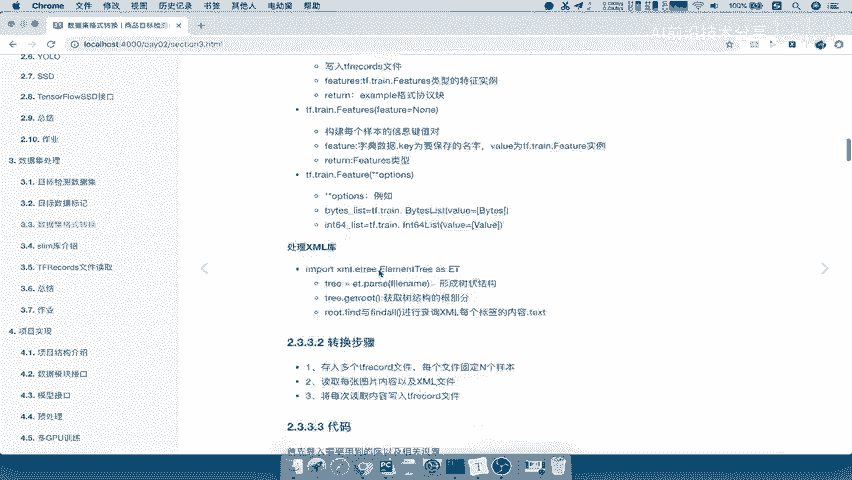

bs list等于TF等于缺点，bs list value等于你把东西传进来。

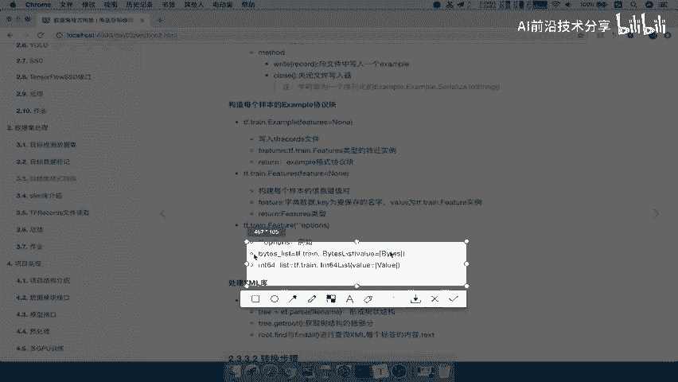

int64list把东西传进来，所以呢我们为了这些API呢方便简单，我们会把统一的及相关的一些函数呢，会放到啊一些简洁的公用的函数呢，统一的封装起来，也就是像这个样子，在我们的YOUTUS当中。

我们的YOUTUS里面指定了这几个类别，比如说这几个类别我们都会把它复制过来，这就是它公用的一些函数，好把它复制过来，那么在这里呢我们在这里新建一个注意了，我们把公用的这些函数呢。

都会放到一个叫YOUTUS里面的，所以我们在这里新建一个YOUTUS目录，U t i l s，然后呢粘贴到这个里面啊，我们直接新建一个吧，new一个Python file啊。

new一个Python file，那这里面是我们data set的YOUTUS公用逻辑，那所以我们在这里呢直接啊复制过来就行了啊，当然这也是他们这些源码当中的一些，这个封装的东西啊。

我们在这里直接使用它就可以了，所以我们的dataset to tf records，直接我们在这里，导入过来好，from我们的ut dataset data sets，点YOUTUS，注意的。

import出我们的DATASET，Youtus，或者直接从这里面导入四个东西吧，直接从这里面的data set杠YOUTUS，import一下我们四个结果。

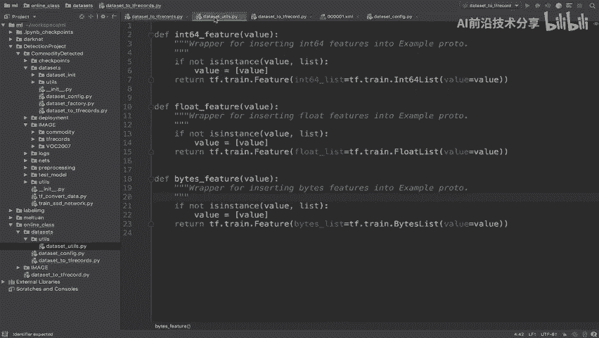

Int v 64feature，Float，64feature，还有以及我们的bts feature，好那么这样导出成功，这几个我们都有了啊，这几个函数都有了，这样的话呢我们把每一个函数啊，注意啊。

这里面还有一个叫format at啊，这个mage format image，format at指的就是你的图片格式，JPG还是什么啊，我们把这个也写出来，它是按BS存进去的啊，BS存进去的。

所以我们按字符串等于，我们写上去，那么以及这个image data我们已经读取出来了吧，这个image的，其他的，我们看一下我们的这个命名，有没有不一样的地方啊，trunk好。

那所以我们把这里return一下，我们来EXAMPLE，我们把example return出去了，所以在这个地方我们把example return到这里来，PLA那么我们最后一步就是非常简单。

就用tf record write直接写入进去，注意这是一干图片，写一次能理解吧，tf record write点直接write进去，注意write进去是example的一个序列化结果。

这也是固定的写进去的序列化啊。

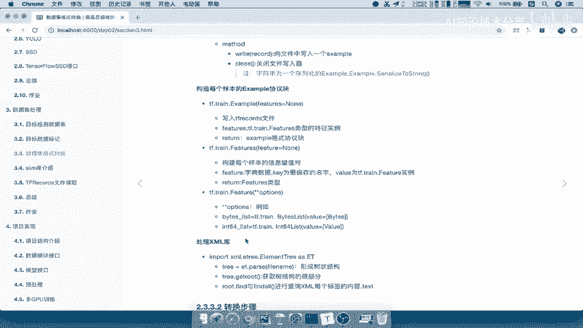

我们把这个序列化拿过来好，序列化结果好，这样的话呢我们这边也就直接return啊，我们下面呢也直接不return了啊，好那么这样的话，我们整段代码的这样的一个逻辑呢就OK了啊，整段代码的逻辑OK。

那所以我们把这个地方注释掉，然后我们来亲自运行一下，那么因为刚才运行的也会已经会在我们的TF，REX的下面啊，这个我们直接删除掉，work tfs里面会新建了一些代码，新建了一些文件啊。

我们直接删除掉好，我们紧接着这里呢在YOUTUS不管了，我们直接在这个地方好，在这地方运行一下，我们看一下能不能存储，好他说呢这里面有一个TF没有定义，所以呢在我们的YOUTUBE当中导入我们的啊。

非常简单，直接导入import一下我们的tensorflow as tf，好存储一下，它表示呢label labels text is not defined，什么意思呢，我们把这个注释呢再把它打开。

我们的CONSOL，刚才run的结果在我们的data to tf rex里面的data labels，Text labels text，我们没有返回，是吧啊，我们这个地方少了一个label text啊。

应该会将我们的label text进行一个存储，我们来找一下这里的label text，哦那也就是说我们这个地方呢会要把label text，进行存储啊，那所以呢这个地方是它是要求呢。

把我们的每个图片当中的什么目标进行一个，把它给存读取出来，每个目标是存储它对应的什么名字啊名字，所以呢我们把这个label啊，label给拿过来，labels呢label里面啊是存储的是名字吧。

所以呢我们名字还没有忘记构造一个啊，所以我们这个地方要再增加一个注意了啊，这是他要求有一个这样的一个属性啊，当然你不存储也可以啊，我们说你可以选择性存储label text，点append一下。

我们要去append我们的label，哎我们的label，那么这个label呢是一个string这样的一个格式，能理解string的这样一个格式，那所以我们要把这样的格式呢在存储的时候。

它变成了这样的一个BS格式，它存进去的是一个BS格式对吧，那所以我们在这里呢，你可以进行一个编码的转换啊，比如说啊我们把这个地方encode一下，cod encode一下。

我们的这个编码变成一个ask码ASCII好，那么这样的话编码成功，我们label text也要进行一个返回，请注意刚才这个地方没有去返回我们的结果好，我们啊这个地方顺序不对，在最后一个啊，在最后一个。

所以呢label test已经有了，我们再来去进行运行一次，我们的参数啊，因为我们的函数还没有进行一个修改，在label test还有在这个地方好，在这个地方我们的data size。

Dr image name，还有我们的这个label text，好，我们再来看一下，因为一修改的话涉及到函数的一些参数，还是在process image返回的结果啊，返回的结果在这个地方还要进行修改。

好那么看啊，这样的话我们就把这个内容呢进行一个啊，读取了，直接存进去了，能理解吧，好那么这就是我们程序的逻辑，我们不让它运行完了，好，我们把这个暂停掉，那么我们来看一下TFRECOR下面的VOC。

T f records，是不是有了TF这样的一个work，2007test000，一直到哎N个这样的一个文件嘛，好我们的整个代码逻辑就结束了，注意刚才我们遇到的问题，就是你要去存进去啊。

就是你要存进去的内容，比如说你这个东西可以选择不存，但是呢你已经写进去了对吧，那所以你要构造一个label test，也就是说把label它的一个名字给它进行存储，到label test能理解吧。

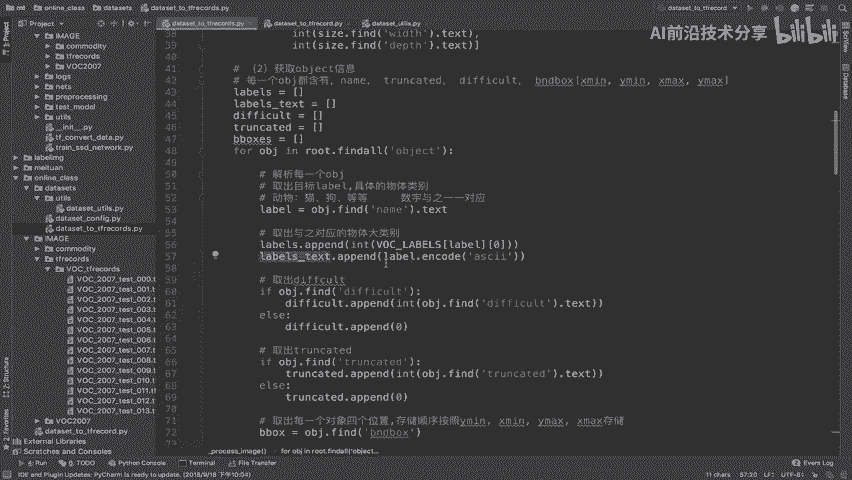

所以在这个地方呢，我们一定要去注意你所定义的有哪些存，那就要准备哪些东西好，那么最后呢所以我们在这里总结一下，把取出的数据分装成example，我们的原则是什么，尽可能尽可能所有详细的内容。

尽可能所有详细的内容存进去，比如说你一开始存进去的时候，我们读取的时候，你的b box是一个列表专注这样的吧，不详细不够详细，我们要把它分割成y mini x mini y max x max。

这样别人在读取的时候呢，你更加清晰的知道啊，你想要哪个东西，全都想要，全都把它弄出弄进去啊，那这次是我们的这个尽可能详细内容存进去啊，好那包括这个关键关键信息，必须关键信息必须存储，比如说你的形状。

还有你的b box啊等等，还有你的标签类别啊，你的这个数字列表，好，那么我们来看看这里面，其中有涉及到比较重要的API，我们就直接复制过来了啊，我们这个地方涉及到直接粘贴为文本，Example。

example当中的属性啊，这个地方的一个属性，一个字典，我们要把它粘贴过来，features啊，features的参数，然后一个字典，然后外面一个参数好，那么这是第三步，第四步呢。

也就是说我们要去分装1example，写入我们的文件当中，注意啊是写入序列化后的结果，是不是在这个地方读取返回的example，我们直接用TFREWRITER啊。

直接我们tf react or writer写入序列化，结果我们把这个API拿过来啊，比如说我写我在这里面显示的这些API啊，你一定要去掌握了啊，掌握了，然后呢包括我们把这个加粗一下。

API呢都给它加粗一下，加粗一下好，那这里面呢没有什么了啊，我们这里地方第一步啊，应该还有一个TF，好record writer，把这个也复制过来，进行一个加速好，那么这样的话。

我们整个数据集存储的一个逻辑就写完了，那我们这个地方每个步骤啊，我们都总结了一小块啊，好那么这就是我们的任务，那么紧接着呢我们可以去提出我们总结了啊，我们总结就是要掌握XML的一个文件读取。

掌握example的构造怎么去进行构造的，能理解吧，这个example怎么构造的，它里面的格式怎么去指定好。

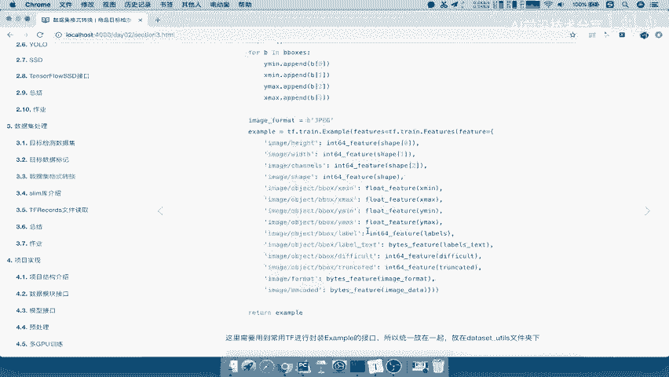