# P43：43.01_slim库介绍43 - AI前沿技术分享 - BV1PUmbYSEHm

接下来呢我们介绍一下slim库，那么我们这个数据存储好了之后呢，我们肯定还是要读取tf records，提供给我们模型的，所以你们还需要一个什么哎，这样的一个读取操作。

那么我们这里呢就要用到一个叫TENSORFLOW，里面的一个slim库，slim库呢它是TENSORFLOW的这个里面啊，定义了一个新的训练，评估复杂模型的一个轻量级库。

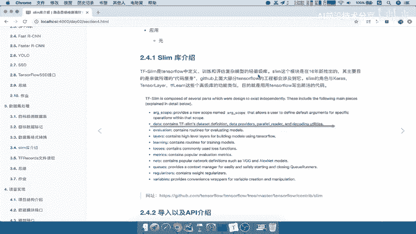

它这里面呢它类似于你所听过的啊，这种KERAS啊，啊TENSLAYER，tf learn啊，这些高级库的一些功能类似，那么它也就目的还是一样的，为了使我们TENSORFLOW写出的代码。

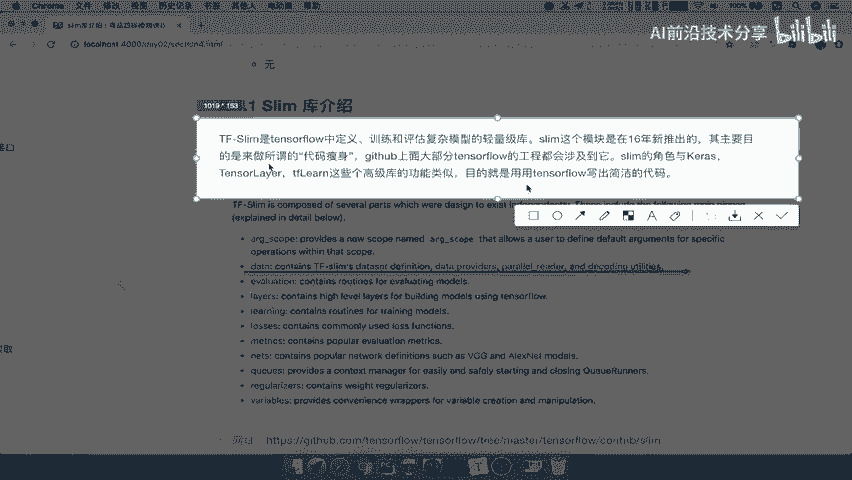

更加简洁一些啊，这也是它的一个目的，因为我们知道TENSORFLOW呢，他写代码呢太过这个步骤比较多对吧，而且你的这个是接近于算法的一些底层的好，那么它这里面的slim库包含了很多。

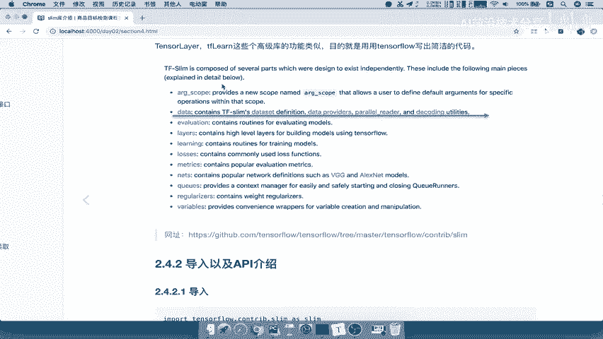

包括了比如说你的这个数据读取，包括你的验证，你的这个每一个网络的层，怎么去定义你的损失。

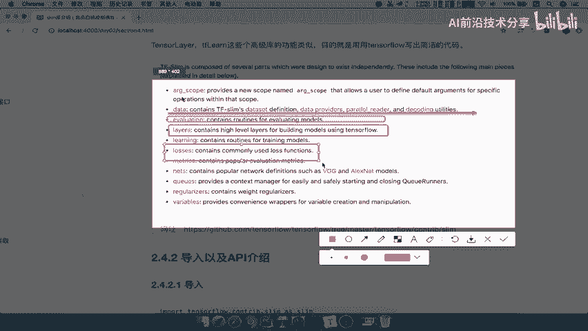

你的衡量工具，你的网络，那所以呢在TENSORFLOW这个slam呢，我们导出的时候呢，哎只要使用这样的一个import tensorflow，点control slim啊去导入就行了啊。

因为它是在这个TENSORFLOW内部当中的，那他这个API呢我们就简单的看一下就行了啊，API有layers，里面提供了一些，类似于TENSORFLOW的一些layers好。

那么以及它这里面提供了data啊，data provides啊，data的这样的一个parallel reader等等，那它的这个命名空间啊，他的这种空间呢会使得你的代码呢更加简洁。

比如说我们要实现这几个啊几个步骤啊，我们把这几个步骤呢，可以去合并到一个网络当中啊，在这里面就可以直接实现了这一个网络当中的，一个步骤了啊，这个你可以自己去详细看一下，VGG的一个这样的一个事例呢。

也就是说它写出的VGG，只要这么点代码就可以了，如果你用TENSORFLOW实现的代码呢，肯定不止这么多啊，非常庞大的一个这样的一个啊你的代码库好，那么train loop。

也就是说你在训练的时候使用的也是可以用learning，下面的train，这就是啊我们相关于这个slim呢，它下面有很多很多的这样的一些这个模块，可以去实现整个网络的训练，你的这个读取数据。

你的这个网络定义，那所以我们接下来就要做的是，用slam当中数据读取的这样的一个模块，去读取我们刚才存储好的TFREX文件，也就是我们的TFREX文件读取，那么这里我们的目标呢就是了解。

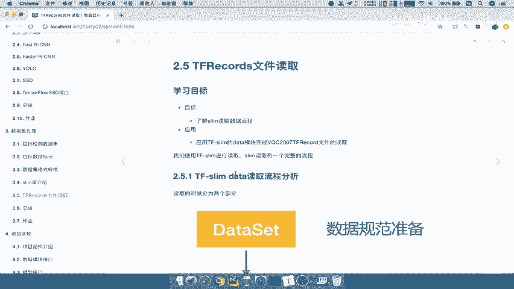

建立一个slim读取数据的一个流程，以及应用它的data模块，完成我们刚才存取的tf records文件的读取好。

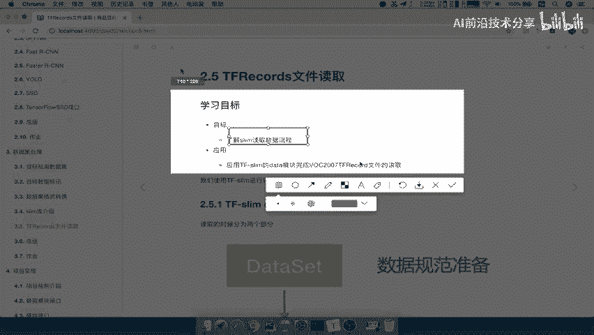

这就是我们目标，那么我们先来分析一下slam呢库，它的读取数据的流程分为两个步骤。

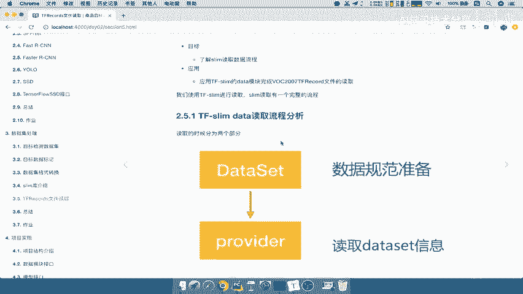

这两步骤要记住了，第一个就是数据读取的一个规范，是信息的一个准备，数据规范信息的准备，准备好我们这些信息之后，我们直接通过provider去读取我们准备的DATASET。

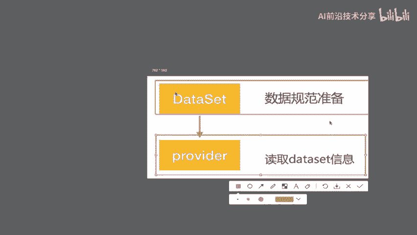

信息，就两步骤啊，分为两步走，那所以我们在这里写一下啊，那么我们TENSORFLOW的一个SLIN，slam读取读取数据流程当中，我们只需要进行两步走，第一步准备data set。

data set这样的一个规范信息，然后呢准备好了之后，我们直接通过provider p l o v i d e r，进行读取就OK了，那么这就是一个很很简单，就是它的一个步骤。

那么这个步骤包括这两步啊，里面每一步骤相关的API。

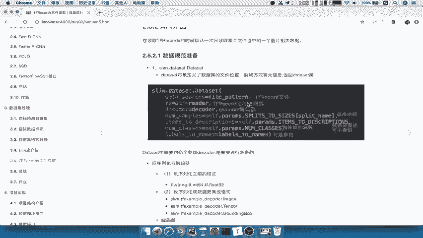

那么要这在这里呢要注意一点，就是TENSORFLOW这个slam读取的时候，跟TENSORFLOW当中其他的一些啊，我们TENSORFLOW本身也有数据读取的对吧，它的一些什么。

比如说fixed length recorreader啊，它也可以去读取，只不过它们都是读取，只返回一个图片的相关数据，也就是说返回某个文件当中，一个图片每次只返回一个样本，能理解吧啊返回一个样子好。

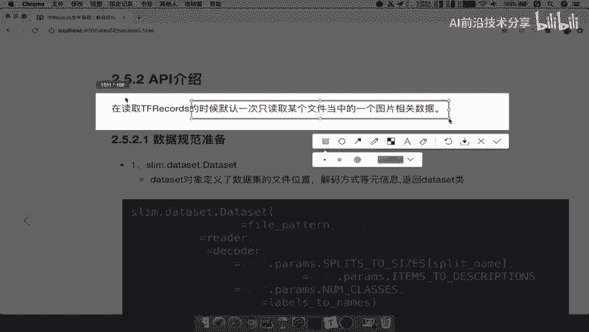

那么所以呢我们数据规范准备呢。

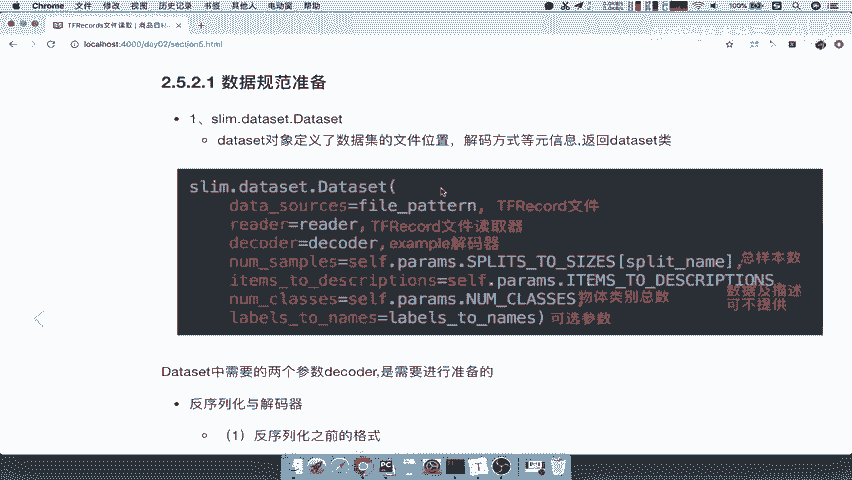

通过第一步，Dataset，其实就是相当于是分装一个这样的一个接口啊，分装这样的一个DATASET的这样的一个实例，那么其中我们想要什么数据，你给他什么数据就OK了，这就是这样的一个过程。

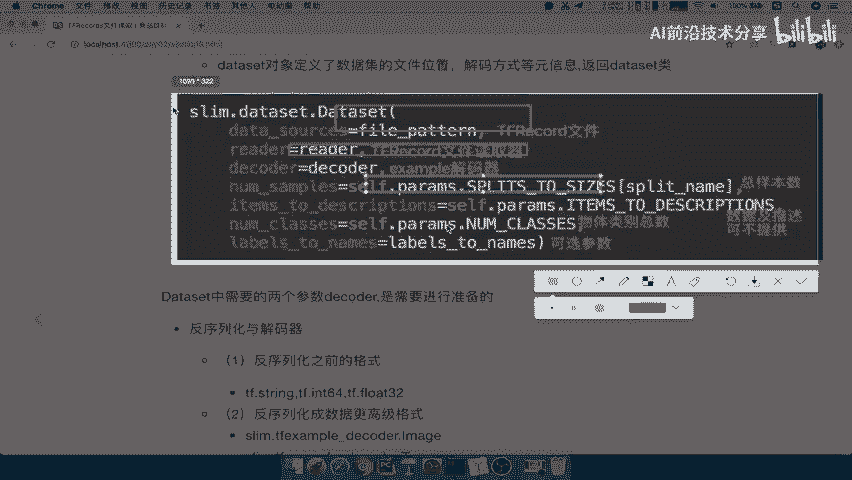

那么在这个DATASET封装的过程当中呢，有两个参数要注，有一个参数啊，要注意的就是decoder，decoder指的是我们要去准备的序列化的一个，反序列化的一个工序。

因为我们把数据存到了TFREX文件，那么它是以一种PROTOBUFFER协议存储的吧。

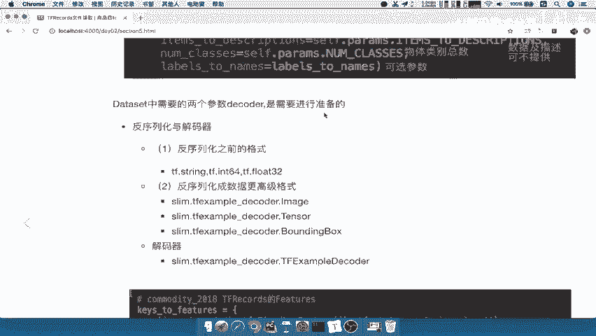

那所以我们要反过来解析这个PROTOBUFFER，解协议这个过程呢就是解析啊，Proud，buffer协议的过程。

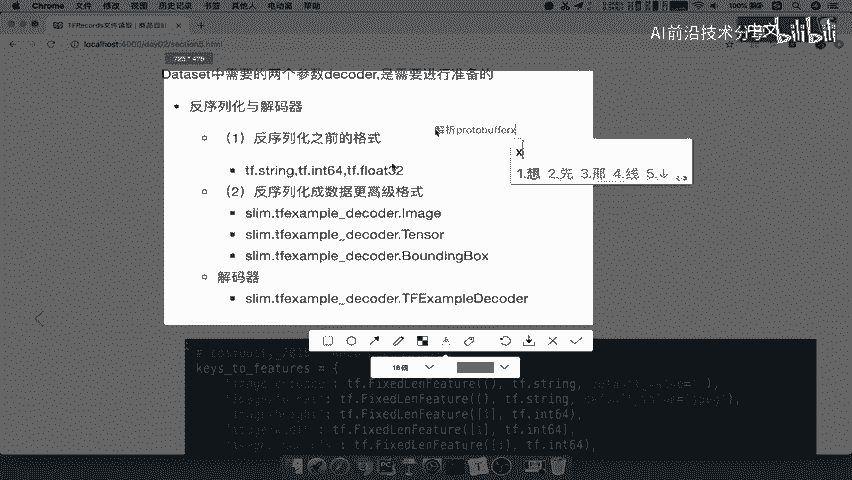

那我们把这个呢存储一下啊，解析过程，那这里面解析呢需要两步，一步是反序列化之前的一个格式，你之前的是什么格式，也B次以int64以float存储的，我反过来你应该已经变成了PROTOBUFFER协议了。

我现在以这种协议以这种格式给你反解析过来，能理解吧，哎就相当于是从JASON到dict dict，再转换JSONJDT，转换JASONJASON再转换dict，一个过程能理解吧。

哎相当于是这样的一个过程，那么这个过程呢分为两步走啊，一步是把所有的原来的数据由什么，就先简析成与固定的格式就OK了，那么我们称之为这样一个过程呢，叫做先反序列化之前的一个格式，然后decoder当中。

我们decoder它需要有两个东西，一个是第一个反序列化之前的格式，以及我们把它反序列化成高级的格式，这个高级的格式呢，我们称之为把它直接提供给我们用户使用的，或者说我们读取的时候。

直接是获取这些我们预定过的名字，我在使用的时候，我直接指定image好，他把image的encoder和format at给我，我指定sheep，他把我们的shape给我，我指定b box。

他把每一个样本的b box给我，能理解什么意思吧，然后呢把label提供了，他把label提供给我，所以这相当于是一个高级过程，把我们需要的数据进行一个，在内部再进行一个分装啊，固定的格式。

那这里面格式有什么，Image tensor，Bounding box，这里面有一个注意了，他专门把bounding box提供的，也就是说你提供给bounding box的必须是one minu哎。

X命令y max x max，也就是我们刚才所说的吧，为什么要这个顺序，也就是说他在帮你box提供的时候呢，必须提供这样的一个格式好，那然后最后呢就是使用一个tf example的decode。

进行一个解析好，这就是我们的第一步骤。

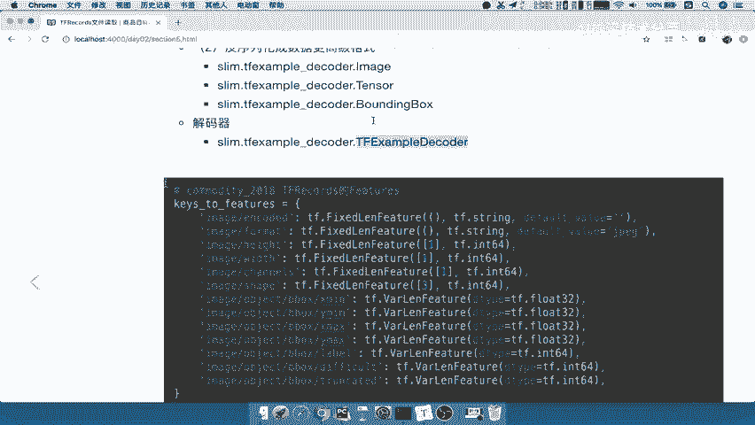

那首先我们就去实现这个第一步的，这样代码就OK了，第二步我们等下再说，那么第一步的代码呢就在这里其实十分简单，准备你的参数就行了，非要par的填到这里面。

然后reader就是我们的record reader啊，填到这个里面，注意了，不是我们的实例化的对象，而是一个方法，然后decode准备好decode，然后呢我们的一个数据集的描述，以及你数据集当中。

此次读取的数据集的总共样本数多少啊，4952，当然这里面我们就先不做那种啊，可以说我可以指定train的格式，train的这个数量也可以指定test的数量啊，这里我们就不去指定了。

好那么直接呢啊包括你提供的类别数。

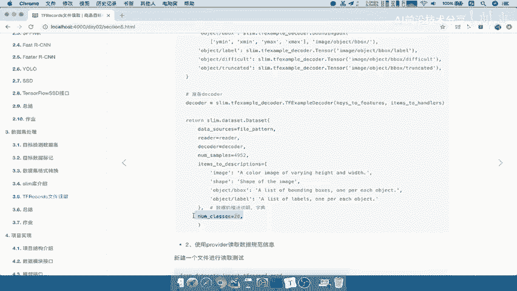

一共有20个类别，很简单吧，好那么我们提供好直接读取出来，因为需要这个slam data啊，get这个provider，所以我们在这里运行一下我们的这个plane，这个record这个reader啊。

read这个直接把它读取出来，我们运行一下，那么可以看到呢，这里面我们直接把这个数据读取出来，包括image sheep，我们来看一下image shape，image呢直接是一个问号，问号三对吧。

它的长宽以及它的通道数，然后呢包括我们的shape，它这一个三个这样的一个形状，然后呢以及我们的第三个b box，它是一个多少个object，每个object有四个值，是不是这样的。

然后呢以及我们的label啊，它的label就是若干个label好，那这就是我们读取的逻辑，这是我们的读取。

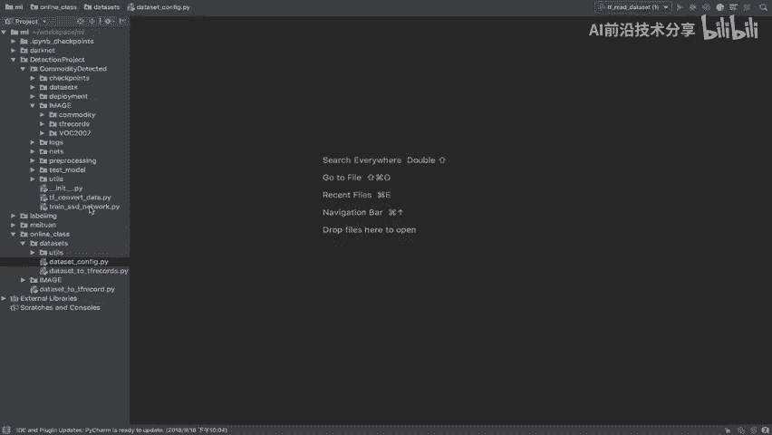

那所以我们接下来就要按照我们的格式，先新建一个准备数据规范的代码文件。

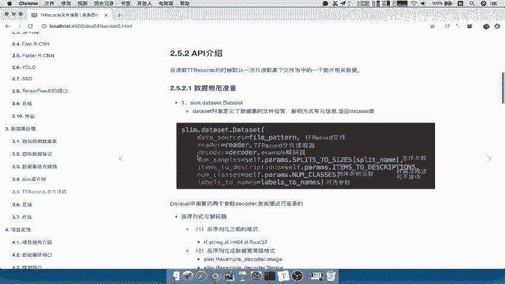

然后再去读取我们在online class里面啊。

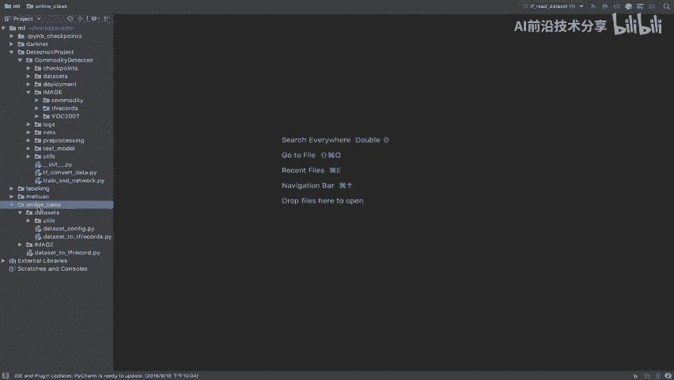

直接去新建好。