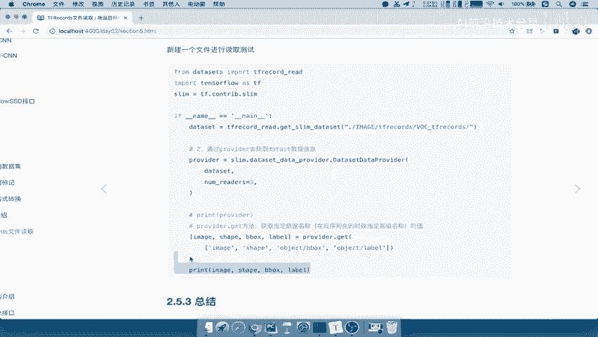
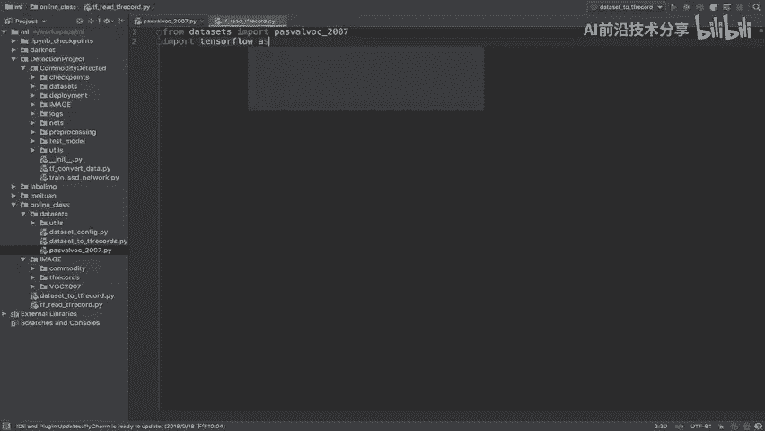
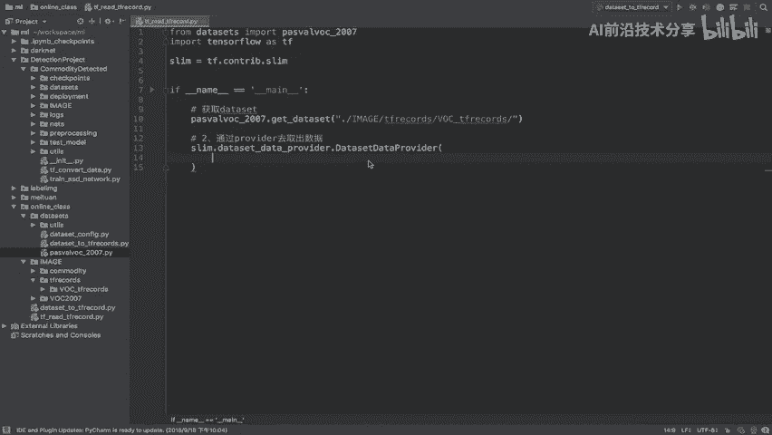
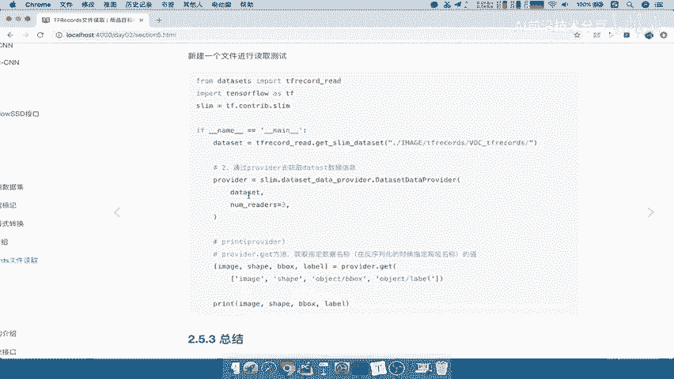
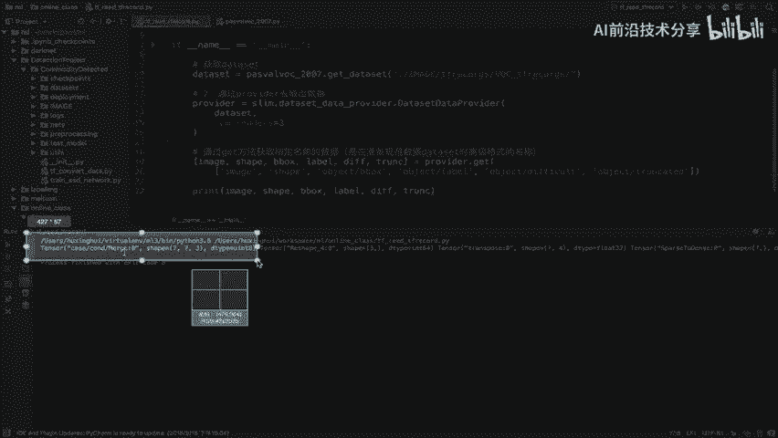

# P45：45.03_TFRecord读取：provider读取45 - AI前沿技术分享 - BV1PUmbYSEHm

那么我们的数据集规范已经准备好了，那接下来就简单直接去获取，我们第二步provider去获取我们的数据，provider呢它也是一样的，填几个参数，那么第一个参数就是指定我们DATASET。

返回的那个数据集那个规范吧，哎返回这里，然后指定你读取的时候线程数啊，包括队列大小啊，队列什么的这个容量，那么还有是否将数据打断呢，这些东西都是可选参数啊，这些里面呢你可以选择去进行一个这个指令。

你可以不指定好，那么接下来我们就来看一下，provider的一个逻辑啊，它的一个代码逻辑其实非常简单，我们来看到在下面直接导入，我们刚才准备data size规范的信息。

然后我们利用这个信息返回一个DATASET吧，然后我们用provider读取我们的这个东西，Dataset，那直接指定一个线程数，其他我都不指定了，那直接返回provider provider。

它是一个这种类，它可以由这种方法去获取，get方法，指定你要获取的数据的哪些，你返回四种类型数据，那么我就把这四种呢你可以全部返返回出来，你可以全部啊get。

你也可以指定image get和shift get，其他的数据不获取也可以的啊，那所以呢这就是get方法指定一个列表，你的名字好，那这个呢返回你的名字，最后我们知道这里的返回，是默认一个样本的数据啊。

好，所以我们接下来呢就去把这个过程呢进行实现，那我们在这里呢新建一个啊new Python，我们把读取的逻辑都放在这个根目录啊，那比如说就叫做啊tf read read的一个逻辑啊。

read dataset吧，data tf record c o r d好，那我们在这里呢，直接先把我们的函这个模块导入进来，在data set at里面，size里面的啊，这个帕斯卡work2007。

import一下，import一下PASVALPSVALVOC啊，然后in这个杠2007，那然后呢还有包括TENSORFLOW，Tensorflow as tf。

然后呢我们的slam等于TF点，我们的这个CONTRIB点slay啊。

CONTRIB点SL，好，那么我们接着直接，我们定义一个这样的一个主函数，首先第一步是不是获取我们的DATASET，获取data set吧，那所以我们直接PASSWOR点，我们直接调用里面的函数。

比如说get dataset，我们给它指定一个目录，那么这个目录在哪呢，当前目录下的image下面的是不是TFRECOR哎，当前image下面的TFRECORDS。

下面的v o c gut f r e c o RDS，好，在这个目录下，DATASET准备好了，我们接着是第二步骤哎，通过pro y的去取数据吧，去取出数据，那所以我们直接调用slam点。

我们来看slim点，直接DATASET啊，Dataset data provider，点我们的provide直接DATASET啊，这两个函数比较大啊，注意前面是小写的，后面的这个是大写的啊。

前面后面的这个首字母都大写的，那这里面直接指定什么呢。

你的DATASET是不是就可以了啊，将我们的DATASET参数直接传进去。

然后指定一个你读取这个数据集的时候，你指定多少个这样的一个线程，那么我们直接data set返回，data set等于它，那我们把这个呢复制过来，那么其他参数你可以指定啊，那我们这里就直接返回。

我们直接就定一个name th啊，这个地方我们因为这个提示都没有啊，我们这参数也不可能去记它啊，直接提供一个啊，三个好，那么这相当于是一个provide了，返回PRVDUR。

那么provider提供好了之后干什么呢，我们直接去进行一个啊获取就行了，通provider通过get方法，通过get方法获取指定名称的数据，注意这个名称是在准备这个规范数据啊。

DATASET时候的高级十啊，高级格式的名称好，那么所以呢我们在这里直接啊pro y的点get，那么我们要获取的是一个列表对吧，那我们直接返回，比如说我们在这里呢。

看到我们的DATASET里面的这个返回，应该是在password2007当中啊，把image拿过来看image，注意啊，是一个列表image，然后呢是一个shift吧，好我们把shift shift。

然后呢把我们的这个也拿过来，b box啊，还有两个，我们再进去啊，指定一下，字符串再复制一个，好以及最后一个这样的一个TRUNKET啊，trunk好，我们把这个，那么这样的话呢。

我们get里面呢是指定了这样的一个列表，我们要去进行读取的，那所以呢我们可以在这里直接通过哎，这个列表去接收我们这几个，同样的我们就因为啊我们就直接image吧，Image shape。

然后呢object gu b box，B box，这应该是我们看是object吧，啊object object的b box我们直接用b box就行了啊，然后呢然后我们要label，然后我们的DIFF。

然后我们的TRCTRUNC啊，trunk好，那么返回这几个数据给他，那么最终啊我们直接print int一下，我们的数据就行了，我们把这个地方的数据的变量拿过来，返回它好，那么这样的话。

我们就相当于把这些数据给读取出来了，那么你要读取指定，比如说你这里面啊不想要，你不读取也是可以的，好我们现在呢运行一下，看我们的读取怎么样，看一下是不是把我们的数据读取出来。

它也tensor的形式显示的吧对吧，包括第一个图片。

你的长宽哎三，然后呢包括你的这个三个形状等等，那如果说你不想把这么多都读出来，因为这两个东西好像我们都没有什么用吧，你虽然存进去的，但是我这边用户在使用的时候，我们训练时使用，我好像没有用到。

那我是不是就可以把这个删除掉，哎把这个也删除掉，哎我也把这个删除掉，那是不是相当于我虽然提供了那么多东西，但是我不一定把东西都读取出来，有可能别人有用，但是我这里并没有太多的多作用吧。

哎我们这样的话就只读取出来这四个东西，能理解吧，好所以我们对于刚才这个代码是比较简单的啊，我们直接把这个东西复制过来，我们总结一下啊，把这里我们get dataset，我们就不说了啊。

通过这个get方法好，那么也就是在这里对吧，好我们直接提供这个方法放到这里，这个方法也是需要掌握的，这里面要提供参数，就是你的data set协议以及你的N干thread吧，THREADS好。

name get thread threders啊，我们把这个复制过来，Threders，那么一般我默认指定三个，那么这里面呢这里你可以自己选择啊，这里选择你前四个五个。

超过不超过你的这个CPU的这样的一个核心数啊，那这里我们再怎么去获取，是不是要通过哎provider呀，provider好，所以你通过provider点get是不是就OK了啊。

那么这样的话呢我们这个provider啊，整个夺取逻辑是不是就结束了，那所以我们最后再看第一步，准备数据的一个规范信息，第二步通过provider去进行获取，是不是把我们的数据做会出来。

所以呢最后呢我们总结这部分啊，这一个完整的这部分的内容呢，就要掌握它的规范要求，以及provider怎么去获取数据好。

