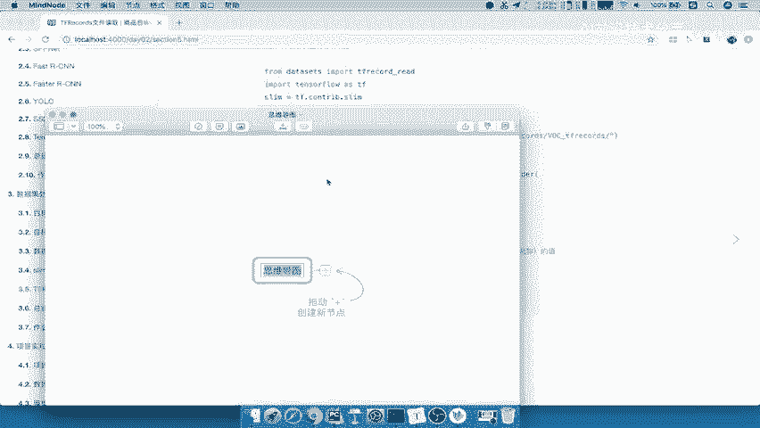
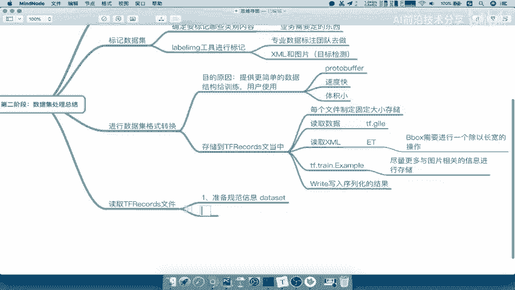

# P46：46.04_第二阶段总结46 - AI前沿技术分享 - BV1PUmbYSEHm

那么这样的话呢我们第二阶段呢，整个数据集处理啊就讲完了，那么这里面主要都是我们的一个代码逻辑对吧，怎么去获取这些数据，有哪些数据呢需要去获取呢，那么我们最后呢啊，我们总总结一下我们整个阶段啊，整个阶段。

那么同样我们还是通过这样的一个my node呢。

来进行总结，好，我们新建一个文稿。

那么我们这里呢我们就称之为数据集处理，第二阶段，第二阶段，第二阶段总结，那首先数据集呢我们介绍了啊数据集啊，包括它的一个类数据集的一个种类，我们说了常见的有一些啊，比如说VOC的数据集。

还有我们的image的这样的一个啊，谷歌提供的image的数据集V4啊，image v4版本，这我们就不说了啊，那我们数据集提供的格式，work呢提供的是这种XML格式以及啊以及图片。

那我们image这个V4呢它提供的很多是JASON啊，还有其他的一些格式啊，还有很多它分了很多的一些文件，那我们首先第一个要做的就是标记数据集吧，哎标记数据集，标记数据集，我说标记数据集呢。

你的目的就是说要确定你要标记哪些内容，要标记标记哪哪些数据，哪些类别内容，这是我们相当于是你的这个你的公司这个产品，对吧，你的或者说你这个经理经理跟人一起去啊，跟这个或者业务吧，业务需要定的东西啊。

需要定的东西，这不是你说我开发者呢定什么就是什么，不是的啊，然后那需要的话，那我们就需要一些label哎，label image的一些工具吧，IMAIMAGE的工具进行一些读取吧，啊进行一些这个标记。

当然我们说这个过程呢其实是有一些专业的啊，团队数据标注团队去做的，数据标注团队去做，所以我们一般的标记活呢，这个东西不是我们开发者去做的啊，都是其他部门或者其他的外包团队去做，那么数据标记之后存储之后。

我们形成了两个这样的一个XML和图片，至于标注来讲啊，对于我们的目标检测来讲，这两种好，那么所以我们刚才提到了哎我们要去干什么呀，读要进行数据及格式转换，我们转换了一个目的或者原因啊，或者是这个原因呢。

是因为我们一个提供啊，提供更为简单的更简单的数据即结构啊。

数据数据的结构啊，给用给这个训练，或者说给其他给用户使用，对不对，哎我要获取呢肯定要更简单一些结构，然后呢我们这个地方的使用的结构呢，它的结构是这种啊。

protobuffer pro buffer的协议的。

它的速度呢非常快，它的特点速度快，你的体体积小是目前呢很多在跨平台里面啊，经常用的一种协议啊，包括你的这个传输的时候，GRPC啊等等都会去使用它好，这是我们的目的原因啊。

然后呢我们转换格式的时候呢，分为这两种这种形式对吧，直接我们去存储到tf records文件当中吧，啊records，T存储到这种tf records文件当中，那么存储这个文件当中呢，一般来讲啊。

我们会这每个文件指定啊，指定这个指定啊不会特别大啊，你指定一个固定大小存储好。

那我们存储到这个里面的时候呢，我们要用到的工具，就是TF里里面的一个example吧，TF点train点example协议，那么我们说了，在这过程当中，你需要把数据读取出来，哎一个是读取数据。

我们在这里啊。

在这里写一下读取数据，我们读取数据呢，我们读取图片就是直接用TF点GFL的工具。

那么我们读取XML用的是什么，读取XML用的是ET工具，ET工具啊。

G file e t，那么读取好哎，我们用example封装好，然后我们直接写入啊。

用write方法写入序列化的结果，写入序列化的结果，那这个时候我们分装example的一个原则，就是说能够有多少啊。

尽量啊更多的信息多，更多与图片相关的信息都进行存储。

然后呢我们说了这个存储过程中，需要有一个地方处理的，就是我们的这个它的一个标签对吧，他的这个框啊，标记框，我们的这个b boss框呢，需要进行一个这样的一个除以长宽的操作操作。

以便于提供给后面模型进行直接的一个使用啊。

就是建立一个操作要注意了好。

那么这个是存储到我们的tf records文件，的一个过程。

那么我们存储进去之后，我们就要去读取读取tf records文件，t f records文件，它的一个流程两步，一个是呢直接准备规范信息啊。

这有个data set，第二步呢直接通过provider对吧。

通过PROVIDER使啊这个get啊，get数据，get我们的获取数据。

那这个里面包括DATASET里面准备的规范信息对吧。

我们在这个API里面呢都在这里啊，想要了解的这个API呢都在这里面。

然后呢，包括这个我们把它复制到我们总的里面啊。

包括里面又用到的这些，参数啊。

参数和函数，然后再来一个啊，就是我们准备分装这样的一个data data set啊，还有我们的准备decode。

好我们复制过来，那么在这个provider里面呢。

我们要用的就是这个工具，好我们把这个工具呢复制过来，还有一个就是我们的provide点get吧。

CTRLC一下。

好那么这样的话呢，我们就把我们数据这个处理的阶段呢啊。

进行一个总结，那么我们的步骤呢就是这么多好，那么这个我们到这里结束啊。

