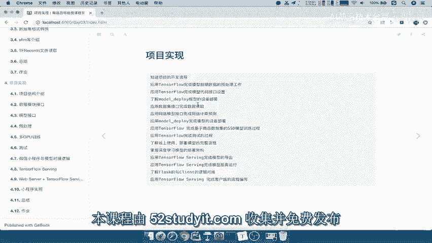
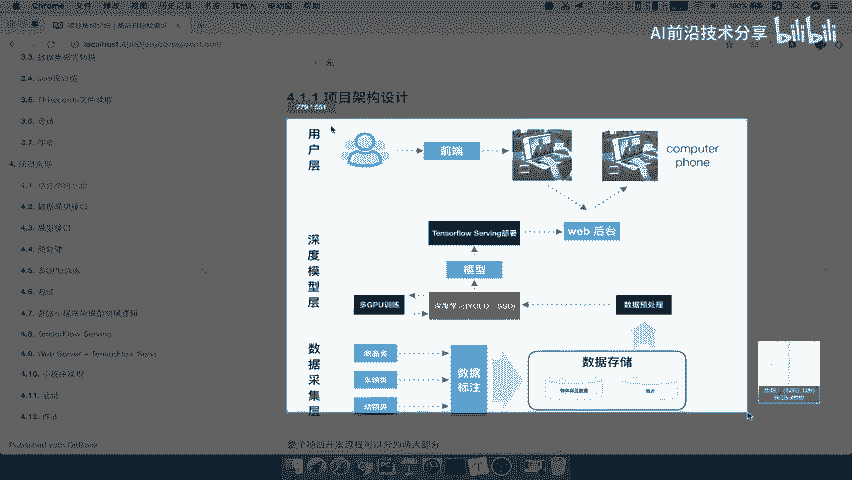
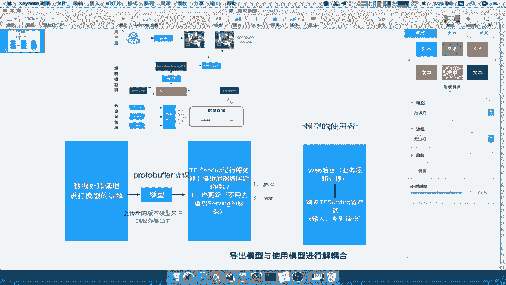

# P47：47.01_项目架构设计47 - AI前沿技术分享 - BV1PUmbYSEHm

接下来呢就到了我们项目实现的这个阶段了，那么前面我们已经讲过，算法的这样一个原理对吧，以及数据的一些处理的一些要求，那么我们在项目实现的阶段呢。

我们要掌握的这些东西啊，就在这里已经显示出来了，那么我们只要去看啊，大概看一下，包括你模型的一些接口的这样的一个读取，包括你的训练过程设备的部署，以及你使用我们的tensorflow serving。

完成模型的导出和部署，以及我们的web客户端啊，跟我们的模型的这样的一个交互。

提供给这个用户去使用好，那我们首先第一个呢就要来看一下，项目结构介绍，那么项目结构介绍呢在这里我们要知道啊。

或者说你应该能够说明项目的开发流程，然后呢。

应用TENSL完成这样的一个数据，代码的模块的编写啊，当然这也是我们要完成这个，代码模块的一个设计，那这个我们先来看项目集啊，go的一个设计，那么这里给的一张图呢，前面我们已经看过啊，简单的看了一下。

那么这里我们可以称之为呢，是一个这样的一个流程图对吧，或者一个架构图，我们把这张图呢给粘贴过来。

好我们在这一个keynote当中去打开，那我们首先简单的先，还是得先把这个图呢介绍一下。

整个模型呢我们分成啊数据层，数据采集层，我们的模型深度模型的训练这样的一个层，然后呢用户一个层，那么我们的整个过程数据采集层，就是我们之前说了，把我们的数据进行标注之后，然后进行存储。

里面包括了你的XML标记数据以及图片数据，将这两个数据弄好了之后，我们要把它固定在一个这种TF，records文件里面去提供吧，records文件，那么这个文件提供好之后呢。

我们就可以在深度模型层当中的，我们去进行读取这个文件去预处理，然后多到我们的模型当中，到我们的算法模型当中，利用多GPU训练提供出一个模型出来，训练出一个模型出来，训练模型出来。

我们用tensorflow serving进行个部署哎，那么这个部署呢，我们后台还可以使用这样的一个接口哎，进行提供我们的这个web的一个用户逻辑啊，业务逻辑，然后我们的用户只要去通过前端。

进行一个前端业务的交互啊，跟后台的一个交互就能够得到他想要的结果，这就是我们的整个一个逻辑啊。

那么这个过程当中啊，我们为什么要这样去设计啊，这中间会涉及到很多的一些技术点，那么首先我们来看一下啊，最开始啊，我们比如说在这里画一个这样的一个方块啊，最开始呢我们是要去进行一个数据的什么啊。

数据的一个处理解析对吧，数据处理读取，那么当你读取数据处理，我们需要去进行我们的啊训练过程模型的训练，那么进行模型训练，我们目的是什么呢，是不是为了导出一个模型啊，好为了导出一个模型。

我们重点呢就要要这个模型，这个东西好，我们把它缩小一些，导出一个模型，那么这里就遇到了一个问题，就是当我们如果我们就简简单单的，就利用训练的结果导出的这个模型好，我直接交给你的使用者去使用对吧。

我训练好了，我模型给你好，给你包括相关的这个接口，我给你介绍一下，那么它在使用的时候会遇到很多问题，比如说我在这边啊，我模型使使用的这样的一个人啊，我们在这里写一下，比如这个文本啊。

我们把字体呢调的细一点，那么模型的使用者，的使用者，那么他直接去使用这个模型的话呢，那如果你的模型有新的这样一个模型更新，那你的文件又要重新提供给它，他呢又要去重新读取一个新的文件，包括你的这个。

有可能你模型当中会有一些细节地方修改，那么我们使用者呢会比较麻烦，他呢需要去关心你这个模型第几个版本，你的版本有什么变化对吧，你的结果怎么样好，那所以使用者跟我们的这个提供的模型啊，这个文件啊。

你提供这个文件，其实你的这个业务呢关联性太大，你不能让使用的人会经常关心这个东西吧，所以我们的目的是什么呢，让使用模型的人跟我们训练出导出模型的业务，进行一个解耦合啊，也就是说。

我们的导出模型与使用模型进行解耦合，那么进行解耦合呢，那我使用者不用去关心你的这个版本更代啊，对吧，你版本迭代怎么样，你不用关心你模型训练的文件怎么安排，我们只要去模型使用就可以了。

那所以我们需要一个什么呢，我们啊在这个地方呢，中间会提供一个叫做TENSORFLOW，serving的一个东西啊，也就是说tensorflow tf serving survey。

拿它进行一个模型的部署，这个部署有什么好处呢，我们来举个例子啊，我们来说一下它的这个好处，第一点就是它能够进行一个模型的一个热更新，什么是热更新呢，当我去更新一个新的模型的时候。

我TENSORFLOW部署在固定的接口啊，部署在固定的接口，这个固定接口呢不会去改变啊，它不会变的在你的服务器上面去部署，那部署了这固定的接口之后呢，我们上传模型的人啊。

只要关心我们把模型文件啊替换模型文件即可，我们只要替换原来，或者说你只要上传啊，上传原上传新的版本模型文件编号，包括你的模型的内容，上传到这个服务器当中啊，上传到服务器当中，到服务器当中就OK啦。

我们把这个字体呢缩小一点，你只要负责上传这个文件上去，一切你就不用管了，tensorflow serving会自动检测到新的模型，会使用这个新的模型，能理解吧，这就是热更新，我们只要上传进去。

它呢会检测哦，新版本来了，我只要替我直接在线的替换，连你的这个服务都不用再重新开启，你这个TENSORFLOW这个server serving啊，这个模型的部署啊，它的这个服务器啊，不用去更新啊。

不用去不用去改，重启serving服务，serving的服务，服务接口呢固定的啊，注意了，这是在在线啊，这是线上的一个部署啊，这是在服务器服务器上好，我们把这几个字体啊也把它缩小一点，那么这是一个点啊。

那么所以呢我们只要把这个serving服务开，开启好之后呢，那么我们的这个web端哎，我们的这个用户啊去使用的时候，一般我们会把它分装在我们的这个web，那web后台，那web后台呢去调用这个模型。

但是呢，这个里面会涉及到它们之间的一个什么呢，进行一个交互，怎么去进行交互，使用什么协议进行交互，所以这个地方我们tensorflow serving，进行服务的时候呢。

它会把这个文件呢相当于是模型的导出的，模型使用的是PROTOBUFFER协议，那么TENSORFLOW把它进行一个模型的部署之后呢，它提供的接口有两种，注意了，它提供的接口有两种，我们把这个啊删掉。

把这个复制过来，提供的接口有一种是GRPC的接口，一种是我们的Rest for的一个分风格啊，restful接口，那就是说他提供这两口接口给外面的人使用，那这两种有什么区别呢，当你使用GRPC的时候呢。

你要去自己去进行解析，我们的JIPC的一个这样的一个协议啊，那如果你使用这个Rest这样的，一个风格的时候呢，那么你的这个逻辑相当于啊，你可以直接线上使用了啊。

你直接可以通过这个用web进行跟它进行一交互，那么我们gr pc就涉及到什么呢，我们的涉及到我们的这个逻辑啊，port buffer协议的一个解析。

那所以我们在这个地方tensorflow serving，他还得去进行编写一个TENSORFLOAT，serving的一个客户端，需要啊一个tf serving的一个客户端，这个客户端干什么呢。

这个客户端，这个客户端只跟我们的serving去进行交互，它只干嘛呢，输入只做两件事，一个是输入数据输入，然后拿到输出，这就是非常简单了对吧，tensorflow serving客户端呢。

它需要去哎拿到拿到数据输入，进去拿到这个输出结果，那么一般我们会把这个TENSORFLOW，serving的客户端呢，会进行啊嵌入到web后台里面啊，我们会把这个过程。

会把这个东西呢嵌入到web后台当中啊，嵌入到web后台当中，那你的web呢基本上就是属于你的前期的一个，比如说用户提供的数据啊，你的前期的一个业务处理，然后到我们的客户端里面去拿东西拿。

只要输入进去输出就拿到结果，然后特色包客户端这边只要跟它进行交互，那我们看这个过程当中，我们是不是不用管使用者，根本就不用管这个接口到底变不变对吧，你的接口不会去改变。

而且也不用关心你的这个处理逻辑怎么样，你不用关心你模型文件怎么样，他只要拿到拿输入进去输出，就相当于一个API就行了嘛，一个函数输入输出OK了，所以呢这就是我们说了啊，我们通过中间有一个GRPC啊。

进tensorflow serving进行模型的一个部署，固定部署之后，我们的外我们的这个用户呢去使用这个客户端，就非常方便啊，使用这个方便，那一般我们会把这个客户端啊，放到这个web后台嵌入进去。

只要web后台做一些啊业务逻辑处理对吧，我们做业务逻辑处理，然后呢拿到啊输入进去，拿到输出再处理返回给用户就好了，那这就是web后台的一个他的这个事情了对吧，不是我们的这个模型提供的事情好。

那么这样的话呢，我们就介绍完了整个啊我们的整个这个流程啊，我们的项目的一个流程，包括我们怎么去设计这样的一个接口，给这样的一个web后台的人啊，给那个前端的人去进行一个使用好。

