# P49：49.01_数据接口：商品格式转换实现49 - AI前沿技术分享 - BV1PUmbYSEHm

那么接下来呢我们就要进入到这个数据模块，接口的相关编写了，那么我们做了这个地方呢，我们的目的就是要去啊做一个商品的这样的，一个数据集的一个读取，所以我们之前读取的逻辑呢，在这个地方都需要进行一个修改。

那么并且我们还要按照我们刚才所说的，我们要做一个这样的一个数据工厂，去读取不同的一个数据集吧，啊它的一个逻辑是不一样的，那所以我们先来看到在这里我们的这个目标呢，唉就是完成这样的一个模块的编写。

那功能需求很简单。

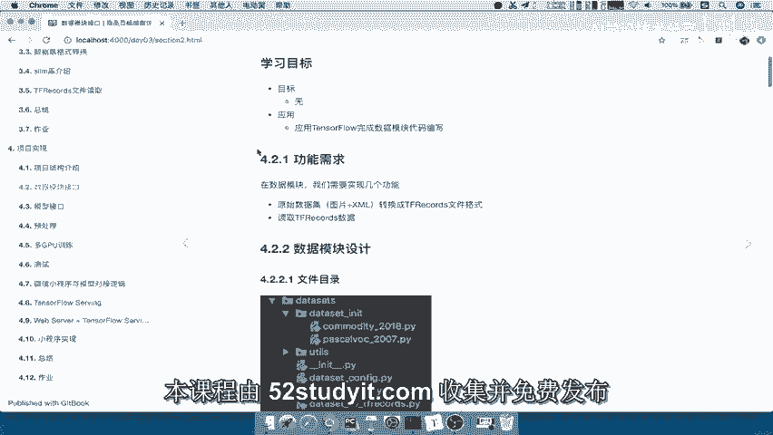

一个就是读取并转换数据集吧，然后呢并且要读取我们tf records的一个数据集。

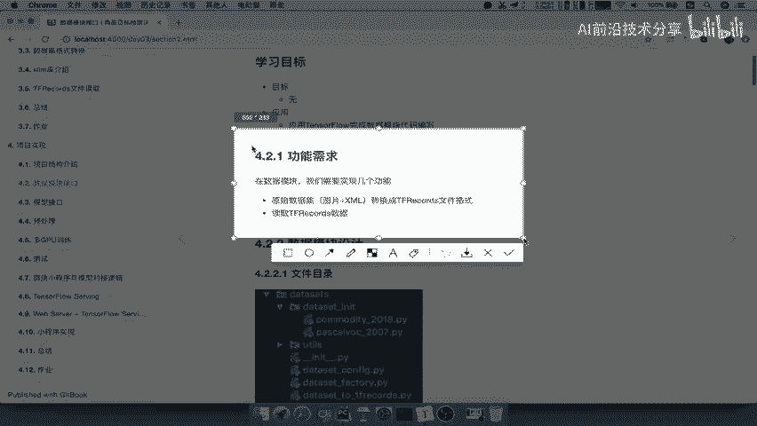

就这两个需求好，那么我们来看到。

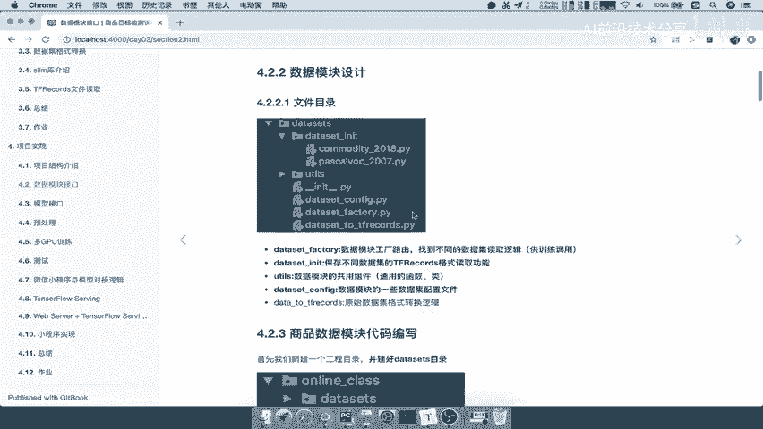

我们首先来看这一个模块的设计，那么我们的目录呢是这个样子安排的，首先呢这个第一个dataset factory，就是我们所说的这个数据工厂，它呢去相关于去取到不同的数据的，读取的逻辑啊，从这里。

比如说从这地方我们要读取到这两种数据集啊，或者更多的数据集的处理业务，那么相当于一个工厂一样的那dataset in it呢，他呢就相当于是保存了不同的数据，读取的逻辑啊，不同的数据读取的逻辑。

YOUTUS还是我们所说的对吧，它保存的一些公用的组组件，Data set configure，是我们在这中间呢会涉及到很多的配置啊，我们在这个CONFIG当中配置最后一个呢。

也就是说它呢是非常简单一些啊，它就是一个数据集的转换过程，那么这个转换呢，它涉及到这个逻辑呢并不是很多，所以呢它只要单独一个文件就OK了，我们直接放到data size目录下面好。

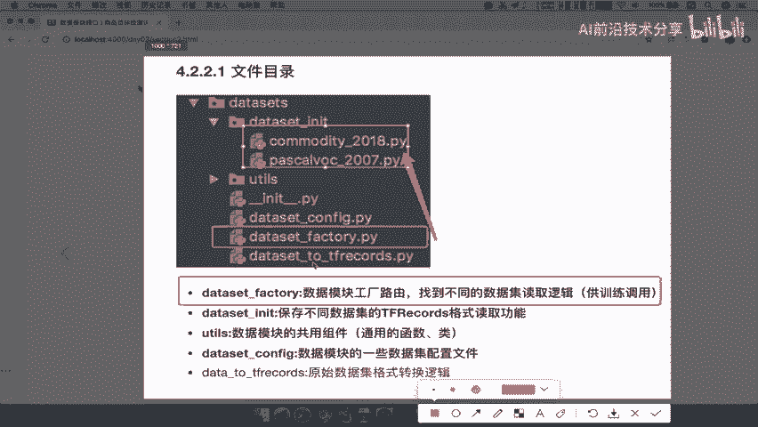

那么所以首先第一个我们来解决这个需求，原始数据集呢转换成tf records文件。

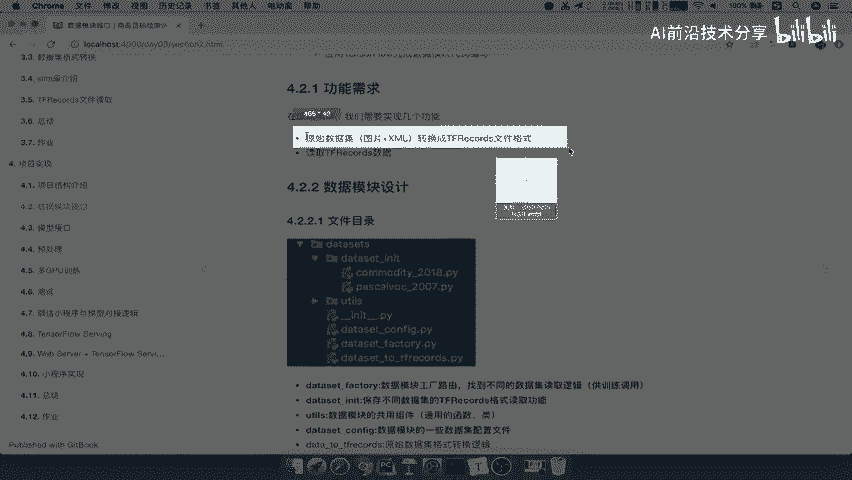

那么在这里我们还是一样，首先呢对于这里呢，我们新建一个这样的一个项目好，那么我们在这里呢直接啊就把原来的这个D啊，我们之前在讲数据这个集的模块的时候啊，我们这个第一个版本呢我把它直接复制过来。

但这中间的image里面的数据比较多啊，所以我们在这里直接新建一个文件夹，online杠CLASS，比如杠V2。0，然后我们将这个原来的相关的代码呢，给他拷拷拷贝过来啊，我们把这个这三个拷贝过来。

然后呢在V1。03中当中呢，我们把commodity和TFRECOR拷贝过来，641007啊，我们不用不到了，所以我们在这里呢新建一个image image好，然后粘贴过去。

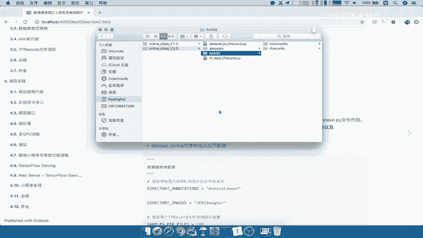

这样的话我们的整个目录就有了，那么我们来看到这边在这个online class2。0当中啊，我们的DATASET目录YOUTUS目录对吧，那么我们先来来看啊。

我们的整个dataset to tf rex，是不是我们数据集的一个读取啊，图片XML读取并转换的过程，那我们想第一个需求啊。

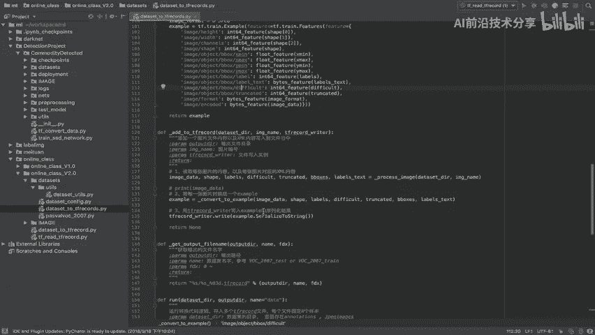

第一个需求要去改的话，我们这个地方有没有需要去修改的地方呢。

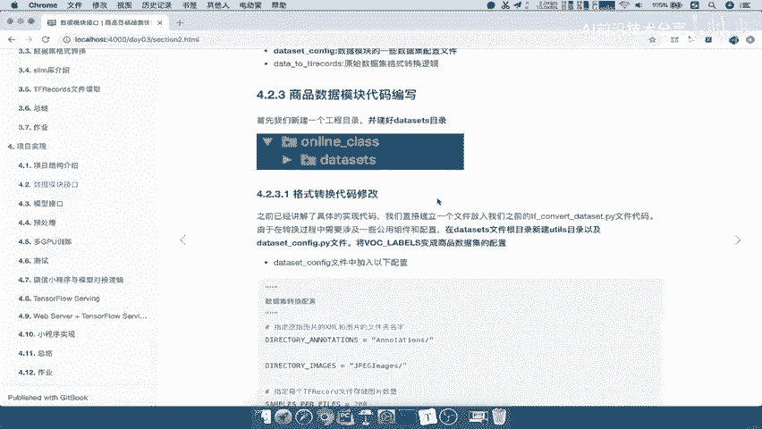

并没有太多吧，它们的读取逻辑呀，包括只要指定我们的目路径，数据集路径和输出路径是不是就OK了，所以我们在这里有一个地方就是work labels，就是我们在进行啊，我们把这个物体的这个名字。

以及它的数字进行对应的时候，需要用到这样一个配置，那么这个配置呢它原来是哦是我们的work，2007的一个物体配置，所以我们把这里注释掉，那这个读取逻辑啊。

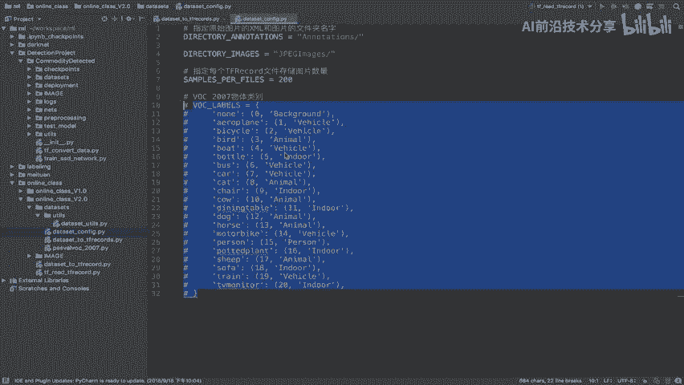

注意啊，读取转换的逻辑只需要修改的啊。

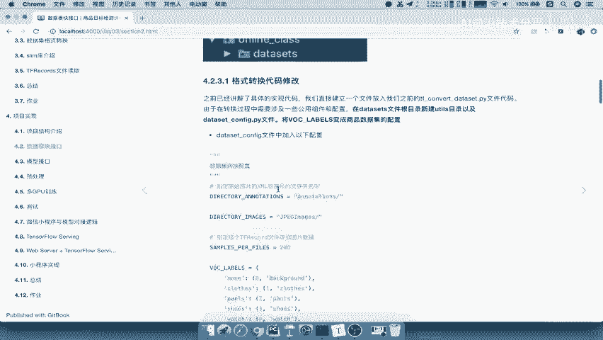

我们把这个我们的商品数据集拿到这里来，我们这里写上商品数据集的类别，商品数据集的类别我们粘贴过来，那么我们同样set to t f records呢，就直接从这里导入它的配置了。

那所以我们接下来看一下啊，能不能把我们image下面的commodity，这里面的啊，配置和我们XML和我们的图片转换成TFX，所以我们在这里的新建一个注意啦。

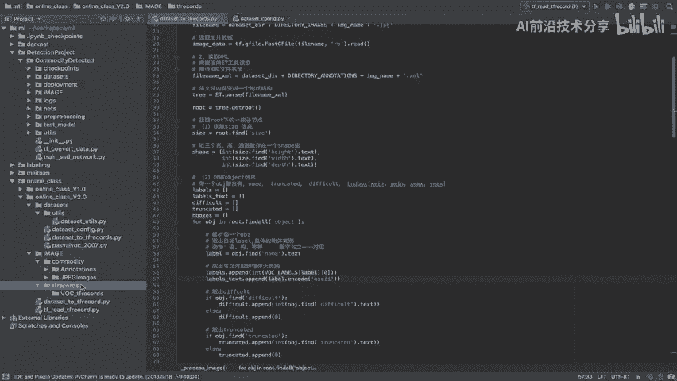

我们在这里新建一个这样的一个文件夹，专门存储我们的这个商品数据集的。

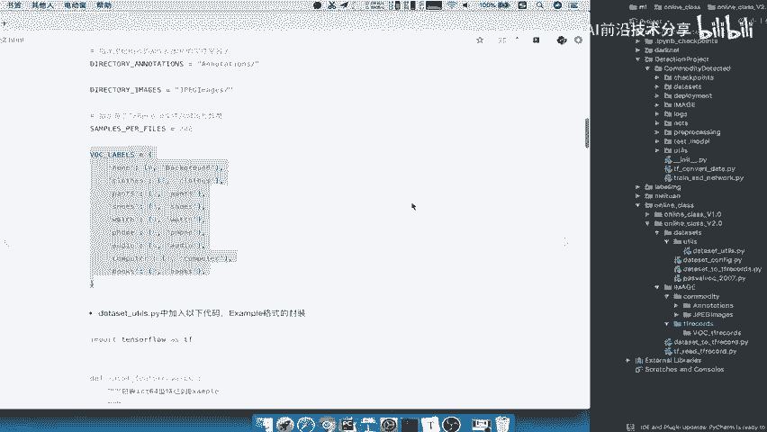

所以我们在这里新建一个new啊，Directory，我们比如说叫做c o m m o d i t y commodity，商品的意思，然后加TFRECOR能理解吧，那么我就把我们要存进去的这个数据集啊。

放到这里面好，那么我们还是用原来的这个代码啊，我们把这个dataset to t tf record呢拿过来，所以我们在这里导入的路径还是一样的，只不过我们要修改了我们的数据集在哪里啊。

image下面的commodity下面没有test啊，我们这因为数据节默认就只有一个好DITY，好放到这里面，然后呢我们的输出路径，输出路径要改了，输出到这个数据集能当中，我们把它名字呢给拷贝过来。

好TFRECOR下面的comedy ttf rex，然后给你的数据集起一个名字，这个名字是你啊要去读取的时候，以后再读取的时候，你也要指定的一个名字，所以呢我们就按照这个固定的格式啊。

我们把这个哎我们的这个数据集的名字，加上日期好，所以我们直接COMMODITY来杠，2018好，我们直接把它取一个这样的一个名字，那么这样的话我们来运行一下，看我们能不能把它转换过去。

好我们来看一下下面数据集的数据呢比较少啊，比较少，所以呢我们很快就转换好了，看到这里是不是有一个这样的一个文件，但是注意了，我们在这里存储的时候，名字呢最好要加上train和test。

因为我们即使这里啊，这个地方没有我们的训练和测试数据集，区分对吧，因为我们只有这80多张的一个照片，那么所以我们在这里最好取一个名字，叫做train啊，就是说我们存进去的是一个train好。

那我把这个删掉，然后呢重新我们再运行一下，到时候在读取的时候它会去过滤，这是train训练数据集，还是test数据集吧，好那么所以我们再来看到这里，就有我们的TRAIN啊，trainer好。

这样的话呢我们第一个需求就修改完了。

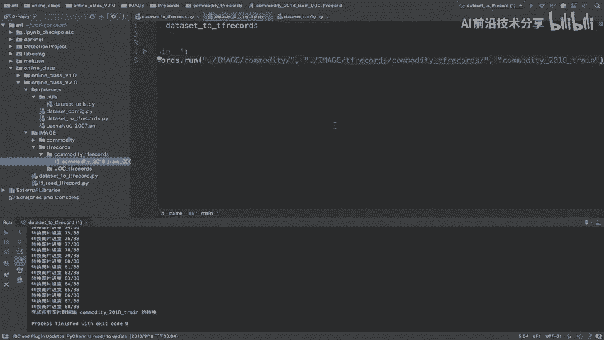

第一个需求因为比较简单，所以我们在这里呢简单的总结一下啊，我们数据数据模块接口，那么分两部分，一个就是读取图片和XML，XML的这样的一个数据和我们的这个XML数据，那在这里呢我们把之前的啊之前的这个。

之前的类别进行修改，然后呢我们的数据集的名字我们定义为什么呢，数据集的一个名字，我们定义成COMMODITY，com m o d i t y杠2018，然后呢我们会有干train，或者说我们干text。

能理解吧，哎我们把这个名字呢先定好了，后面我们就可以好写一些数据，这名字我们在这里呢，因为只有这个训练数据集啊，我们直接把这里放到这里，数据这些名字好OK了。

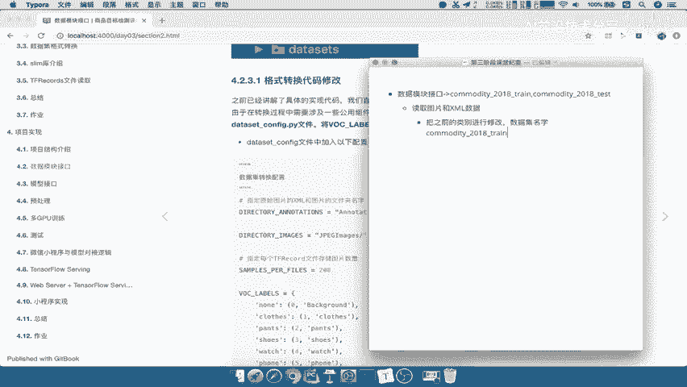

那我们的目录输出目录什么的，我就不说了啊，还是在我们的这个同等的image下面啊。

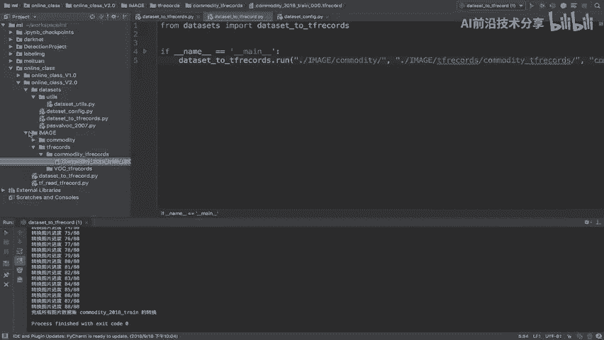

这些目录以及我们的DATASET目录好。

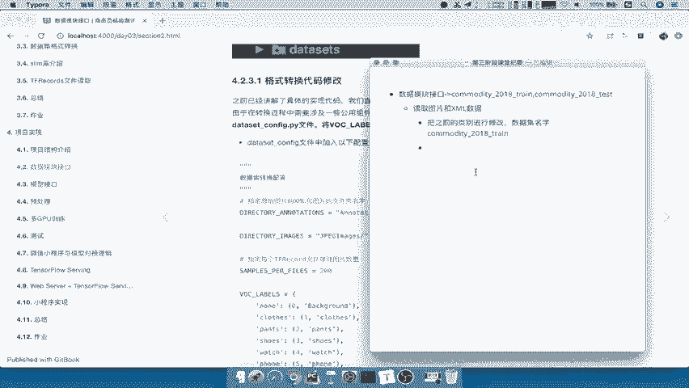