# P51：51.03_数据接口：商品数据读取子类实现51 - AI前沿技术分享 - BV1PUmbYSEHm

来看到我们刚才建立基类之后呢，我们要建立一个不同数据集的一个类，那比如说帕斯卡work数据集，我叫做这个类，然后呢comedy的数据集我叫做这个类。

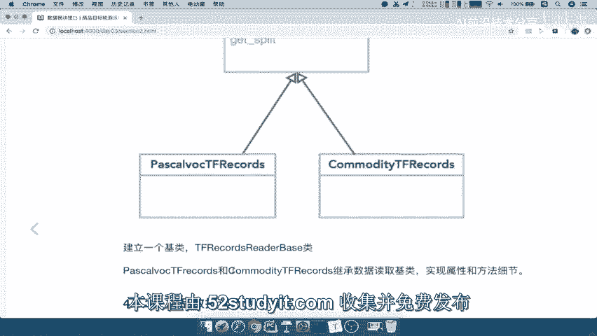

所以我们现在关键是这个类的怎么去做。

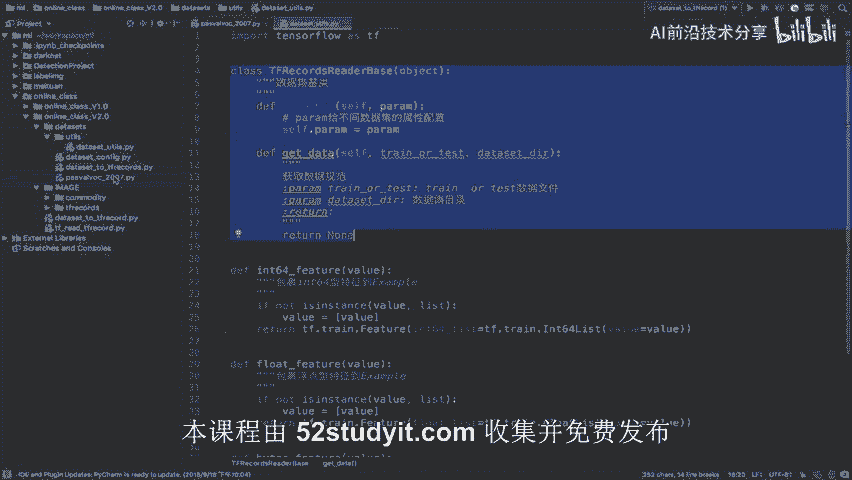

就是说帕斯卡work2007这个数据集读取，我应该放在哪里，那么一般我们来讲呢，data youtube我们要继承它对吧，我们会单独把数据读取的逻辑区分开啊，把所以我们按照一开始的目录来看到。

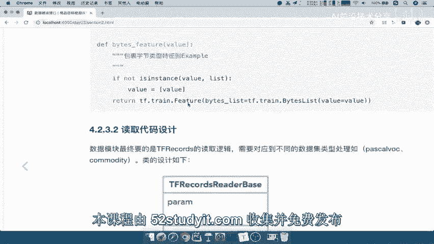

在这里我建一个叫dataset in it的一个文件夹，然后呢这里面就存放不同数据的读取逻辑。

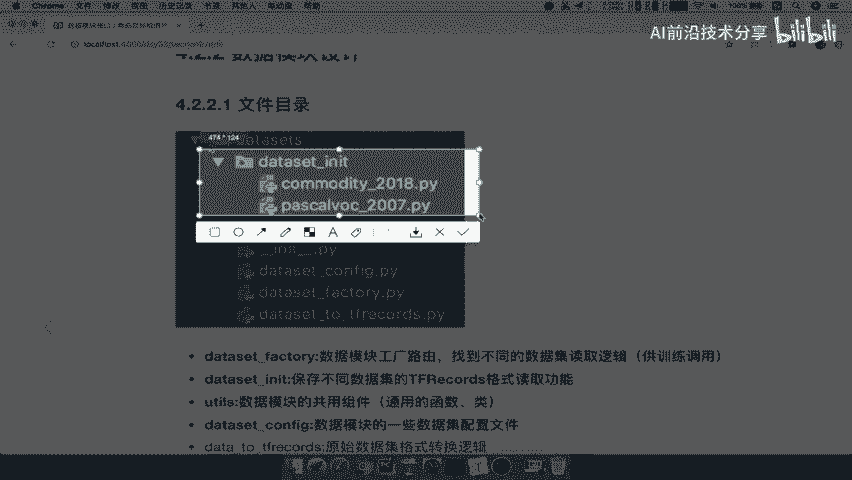

能理解吧，所以呢我们在这边来DATASET当中，new一个directory叫data set杠INIT文件夹，那么我们就把pasta work2007给搬进去，注意了啊，我们把它给进行搬进去。

那么我们的帕斯卡word2007就在这里了，但是现在呢我们就不去管这个地方的，就是说我们不管这个帕斯卡数据集了，我们就说我们要读取什么community数据集吧。

哎读取这个tf rex community，所以呢我们在这里啊再去，比如说我们再去复制一份啊，复制一份，复制一份呢，我们取名叫做COMMODITY，杠，2018的COMMODITY。

跟2018的一个文件好，然后这个文件就是我们要实现读取哎，我们的商品数据集的目录，那么想在这里怎么做，在这里怎么做，是不是要去导入我们的YOUTUS当中的这个鸡肋好，我们把这个鸡肋导入过来。

我们先把名字放到这里，那么我们导入了就是import from from，我们的根目录对吧，data size下面YOUTUBE是吧，Data set datasets。

点我们的youtus import一下我们的data set杠，YOUTUS看一下啊，我们名字有没有写错，DATASET杠YOUTUS好，那么这个正确之后呢，我们是不是要在这里这下面逻辑。

我们等下直接复制过来啊，我们是要建立一个类。

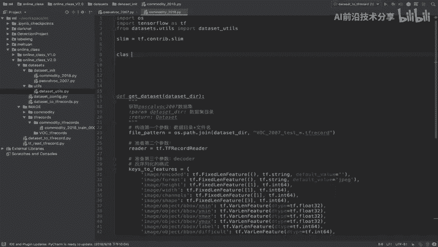

这个类叫什么呢，是不是要叫我们的哎子类啊，子类的话。

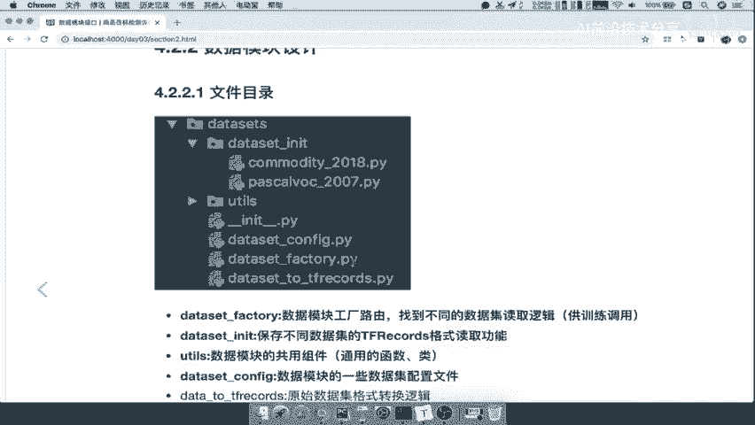

我们的名字呢，假如说就按照这个名字来，Commodity，TFRECOR好，这个类继承自我们的DATASET，YOUTUBE点拿过来继承这个类好，那我们在这里写上我们的注释，这里是商品数据及读取类。

商品数据及读取类好，我们来看一下两个方法是不是要都要去继承吧，哎杠杠INIT，哎，我们的self，我们这里呢先pass，然后呢还有一个什么defined，直接get。

我们看一下这个方法叫做data get data，然后呢self啊这里也pass，那首先我们来看一下你继承自这个鸡肋对吧，那我呢你肯定也要初始化一个参数，我们就把这个self点PARAM。

等于我们的PARAM传进来的，那重点就在于我们的get data获取数据，好我们把这两个参数也拿过来，这两个参数我们就不去解释了啊，在这里我们直接看一下，我要去获取，我们在这里把这个写上吧。

好那么我们要去获取这个数据集，逻辑是不是都在这里，是不是都在这里啊，那所以呢我们把这个地方呢，复制过来，我们把整个逻辑啊，注意了，把整个逻辑CTRLX复制到这里，这也就是获取获取数据方法。

好那我们来看一下，我把它缩小一点，我们来看啊，get data获取，我们是train还是test还是data set dr啊，现在关键是我们可以把这个参数传进去了。

然后以及train test我们也可以传到这里，做一个格式化，但是这里是不是PARAME就没有用了吧，你要使得我们这不同的数据集之间，能够隔开对吧，否则我们在读每一个数据集的时候呢。

那我们要这个类干什么呢，是不是要让这个类它的一些属性，我们每一个子类都能够去改变这个属性啊，那所以我们是我们接下来的任务，就是怎么去设计这样的一个属性，我们怎么去设计这个属性的安排，来看到这里。

我们仔细想一想，这个属性里面，是不是都是关于数据集的相关属性，是不是关于数据集的相关属性，所以我们的目的就是要把数据集相关的，介绍的资料给它放到这里，那比方说我们要去获取这里。

我们的这个用户指定的就是它在训练模型啊，就是我们开发者训练模型的时候，我指定是train还是test，所以我这个地方呢来一个什么呢，来一个匹配，比如说我匹配FS，然后呢我们已知这个地方哎。

我比如说我们与知这个什么train or test进行匹配，是不是就知道我们是哎是word2007train work，207test是不是就能匹配了，好那么这是一个啊一个这样的一个地方，我们要定一个。

接下来这中间都不用管，这中间都不用管，而要看的就是我们来看FPON，还是我们刚才说的NSAMPLES，也就是说我们数据集的样本要不指定，而且你要指定的时候，PARAMA里面是不是要包含数据集。

测试训练的这样一个样本数，和测试的样本数都要配置好吧，也就是说告诉别人要用的时候呢，也告诉配置文件哎，它有多少个训练数据集样本，测出水项目以及你的数据进行一个描述，对不对。

那以及我们的数据集的number class，所以我们这里接下来要做的事情就是去实现啊，去或者说去把PARAMA去进行配置，那么这个paramount，它既然是一个数据集的配置文件。

所以我们继续想到在data set configure，里面来进行配置，能理解吧，好所以呢我们在这里啊写一下，我们写一下注释，这里就是数据集这个格式转换配置，格式转换配置。

然后呢接下来我们在这里呢就写上，这里应该就是数据集读取的配置啊，配置文地方对吧。

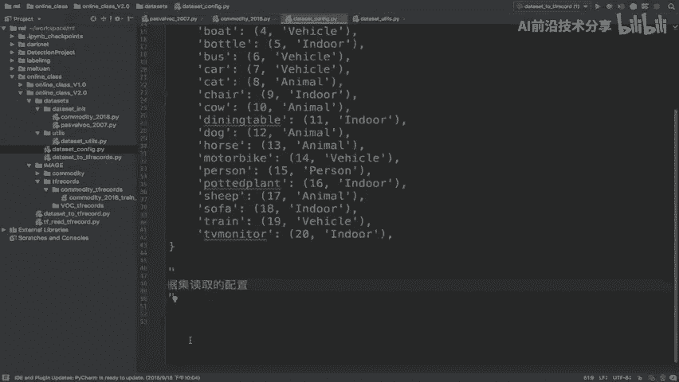

那怎么去，我们来看一下说明这个commodity，说明我们这里面有很多的属性要去配置吧，所以我们的配置呢最好做一个哎PARAMA，就是说我们的属性当中会存在多个，比如说NSAMPLES啊。

number classes啊，所以我们要想一下我们用一个什么去保存呢，来我们设置一个来看到这里，我们设计一个呢这样的一个元组去进行保存啊，这个命名字典啊，在CONFIG当中，我们使用命名字典去保存。

我们的数据集的一个配置文件配置的一个结果，那么这个name named tube呢是在collection里面的啊，要导入collection，然后呢返回它的参数，就是一个指定你的一个名字。

数据集的这个参数名字是你要接下来要用的，然后呢，这个名称列表就是你这里面有哪些属性，需要配置它的值，唉假如说我们现在呢就有这么几个数据。

这么几个啊，我们的属性呢进行要配置的好。

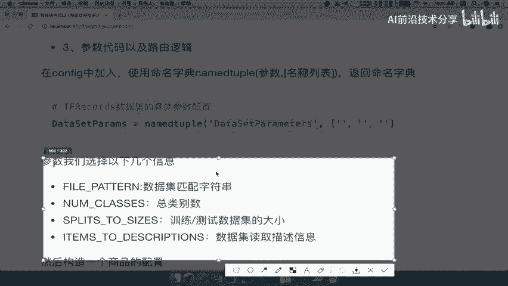

所以我们要去进行配置，那么我们在CONFIG当中首先导入我们的啊from，from collection点import我们的named tube，Name tube。

我们来看我们的这个commodity d i t y杠，2018数据配置属性配置，那么我们有一个named tube，第一个参数啊，就是我们随便取一个名字，就是说你这个地方的这个参数的意义是什么。

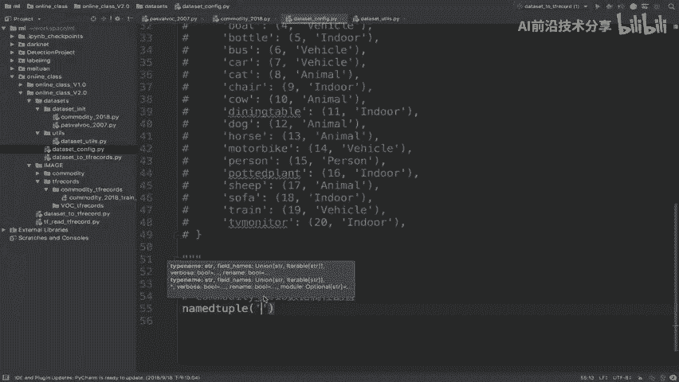

比如说我们就叫做dataset parameters对吧。

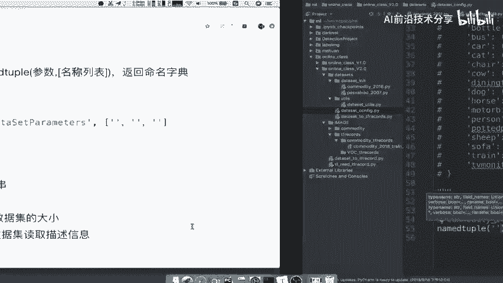

我们直接把这个复制过来，包括你这个配置的相当于是个字典一样，我的值键值啊，那你的键有哪些键啊，我们的属性我们刚刚说了，这个属性，一定要是根据你的这个业务需求来定的，一个是比如说FPATTERN。

我们可以通过一个匹配原则，然后我们的NSAMPLE里面的train和test，是不是要配置啊，还有描述，还有类别，所以我们一一的把这四个都拿过来，FPATTERN好，我们把CONFIG拿过来。

是字符串啊，这位对记住了字符串。

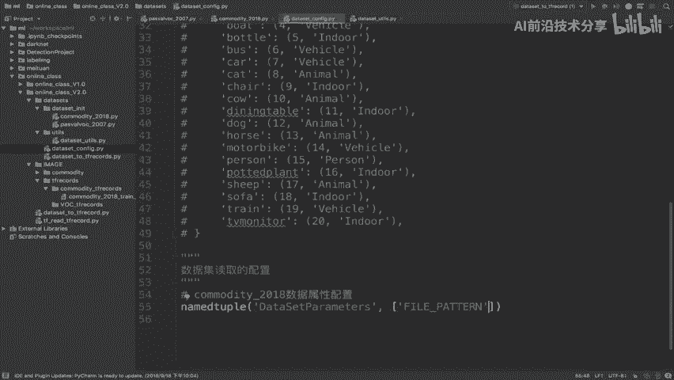

然后呢第二个我们把这个name classes拿过来。

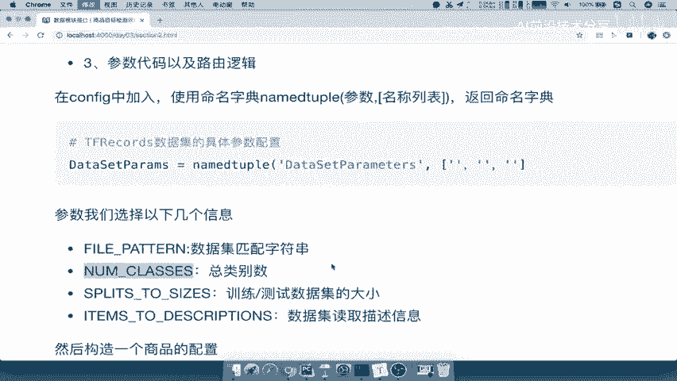

字符串拿过来，然后呢还有我们的sleep split to size。

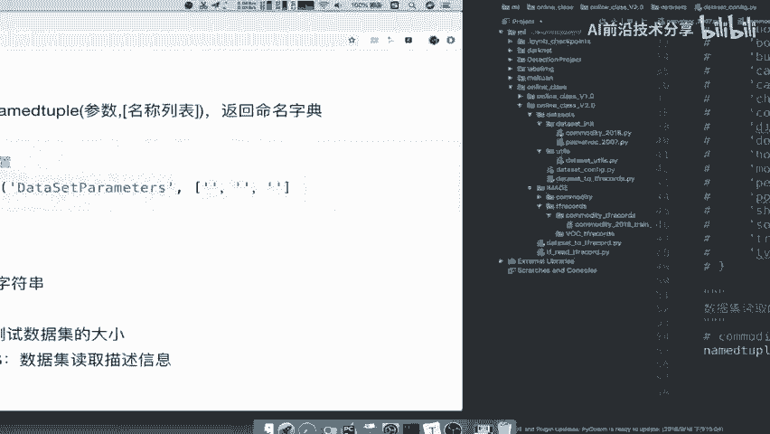

slide to size呢，指定我们的数据集的测试集和训练集的大小，这样的一个大小就是它的一个数量，还有一个最后的一个描述文件好。

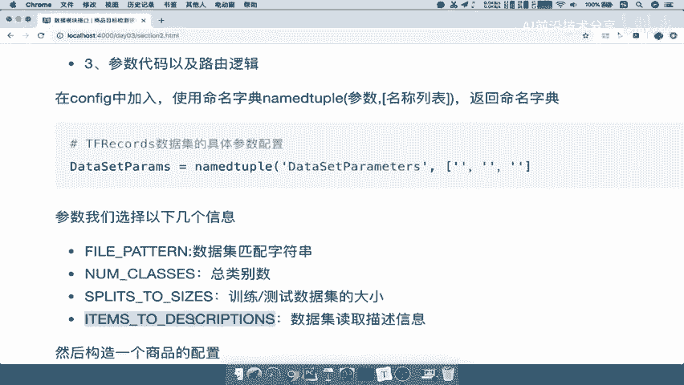

那么这就是我们配置的这样几个啊，配置这个属性，那么我们最终呢要取一个这样的一个名字啊，我们名字呢比如说叫做啊DATASET的一个参数，它返回的就是一个命名字典啊，那我们把这个呢再type一下。

再tab一下data，set data size啊，我们就用段写吧，set p a r a m s等于好，然后呢我们把这个复制过来，这个格式调一下，好我们往后呢加一下，好我们把这个呢再调整一下啊，好。

那这样的话呢我们就知道了，这几个配置的一个啊，它的参数，那么接着你的参数还没给呢，我们的commodity2018的参数你还没给吧，所以呢我们在这里直接好，我在这里直接定义定义我们的参数，定义。

然后这里是创建创建命名字典啊，命名字典，那么定义命名参数怎么说呢，DATASETPARAMA呢，它相当于是一个哎第一个字典一样，里面的键值对指令就行了，它用一个括号，然后呢比如说我们要指定啊。

我们接收啊，我为了方便啊，把这个参数呢接收也给接收一下，这里呢我们指定叫做cm啊，2018等于DATASETPARAMUS好，然后呢我在这里面指定我们的配置FPONS。

是不是哎我们的键FPATTERNS等于，CTRLZ一下啊，FPATTERN等于等于什么呢，我们的FPTON，想想我们的community数据集应该是怎么样的，来community，杠2018。

杠train，杠000点tf record，所以我们应该写成这样的一个格式来，在我们的CONFIG当中应该是一个字符串，我们要匹配的字符串COMMODITY，前面注意了啊，杠2018。

因为它要指定train还是test吧，所以我们用一个百分S过滤，然后呢干我们的新就是不是就可以了啊，干新点TFRECORD对吧，RECORD好，COMPMDITY2018这个数据集，这是第一个参数。

指定它的配置了，然后还有我们的nm classes，我们一共有多少个类别，哎，八个类别是不是指定一下八，这就是我们的属性了吧，还有我们的split to size，这里呢它相当于是复制一下粘贴直接吧。

Split to size，这里呢我们要指定一个字典指定，因为我们有训练集和测试集，不同的两个数据集的这样的一个大小吧，所以我们在这里我们指定一个train啊，train数据集呢我们的大小有多少个啊。

我们一共有88张啊，我们这个数据集比较小，因为是我们自己去制作的，所以呢没有那么大大的这时间和人力啊，我们没有这么人力去做一个几千，几百几几万张啊，几万张的这张图片好，test呢我们没有对吧。

我们自己没有做这个数据集好，那么这里呢就是好，这里呢我们split to size，准备好了，我们items to description啊，我们直接也在这写一下。

item to item t e m啊，我们这个逗号没打啊，然后item to description description呢。

我们这个描述呢，我们直接在下面去拷贝过来了啊，直接拷贝过来。

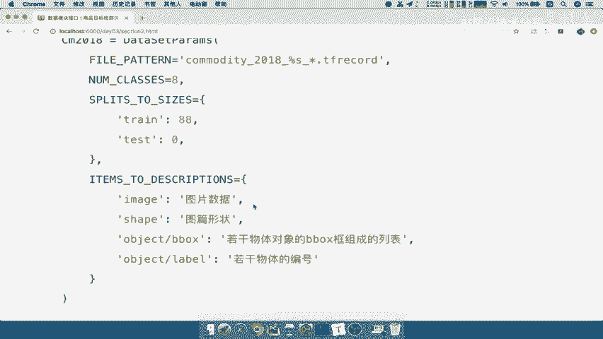

我们把字典进行拷贝好，在这里指定一下它的数据集好，我们这样的话呢，就把我的这个2018comedy，商品数据集进行配置了吧，哎说明这个数据集的属性，我们都可以在PARAMA里面去获取了。

所以我们PARAMA呢，相当于是就等于这个东西能理解吧，相当于就等于这个这个呢，我们就可以获取里面的fpattern number class，哎还有split itunes。

所以我们在这里来看一下这里匹配的train test，应该是self点PARAMA，点下面的什么CONFIG吧，是不是我们的file pattern啊，File pattern。

file pattern与它匹配，然后跟我们的目录进行一个文件吧，好这是第一个，我们来继续往下FPON啊，注意啊，这里的fu pa还是它，因为它有加了目录啊，因为我们这个地方没有加目录的。

还有我们的NSAMPLES，这个samples是不是要根据我们传入的参数来讲，是不是你传入的是train，比如说你传入的是train，你是train的个数，test是test数据集的图片个数啊。

所以我们应该是这个split to size好，我们在这里应该去指定，self点PARAMA点我们的lip to size，注意它是一个字典吧，那这个字典的话。

我们就可以传入我们的参数train或test，这样的话这一个参数也解决了，那么这里的参数是不是也可以删除了吧，啊我们打个逗号，那么在这里我们可以去使用，我们的第三个这样的参数。

Item to description，好，我们在这里复制item to description，等于self点PARAMA点来item to description吧，好接着呢。

Number 3number classes，我们直接在这里number classes复制过来，self点我们的PARAMA点NB啊，nb cases好，这样的话呢。

我们就实现了这样的一个参数的替换吧，参数利用我们自己数据本身带的这样的一个，参数呢来进行填充了，那为了完善在这里啊，我们数据集有可能为别人提供的参数呢，好有可能会有问题，所以我们做一些异常的捕获处理。

我们在这里，比如说在这里吧，做一个异常捕获，异常的处理，异常的一个好处，那么这个地方的异常的，比如说数据文件呢存不存在对吧，我们的数据文件，比如说你的这个train test，sleep对吧。

Train test，如果我们的train test，Train or test，如果它填进去的这个训练集还是测试集，如果不在哎，比如说不在我们的train或者test里面，我们没有其他了，对吧啊。

我们这里面，not in啊，这个地方一个逗号好，如果不在train test里面，我们就比如说raise一个error，我们的一个值error value error表示什么呢，我们训练数据集啊。

训练测试数据名称不指定错误训练啊，训练测试数据集的是或这个吧，J的名字，指定错误指定错误，然后呢他呢这个指定的是哪一个对吧，百分号S然后呢我们这里呢写上百分号，然后把这个匹配过来。

就是我们的train test，train or test啊，这是我们这个数据集指定错误，然后我们再来一个啊，比如说你的这个应该是啊，你DATASET别人传过来肯定是要去进行判断的对吧，好。

判断数据集目录，判断判断数据集目录，如果我们的TF点，我们的g file点exist，如果我们的数据集目录DATASETDR不存在，也就是说它是假的时候，如果not我们直接抛出来啊。

raise一个value error啊，也是一个value error，我们呢指定说数据集目录不存在，好这样的话呢，我们这个啊商品数据集的整个逻辑就OK啦，就写完整了，那么所以我们可以再看一下啊。

再次看一下我们的整个目录当中，在dataset in it下面是不是COMMODATE，2018是不是写好了吧，包括它继承基类里面的方法，还有我们的这个这个属性。

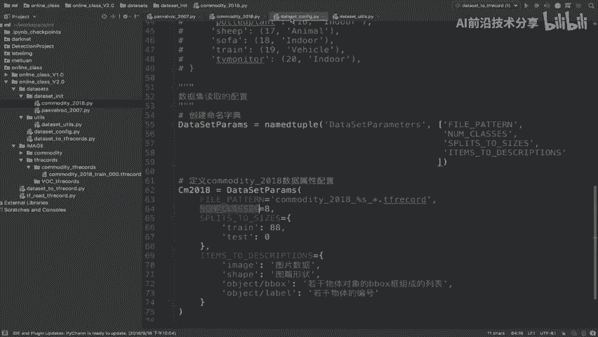

是不是都在这里面进行配置了对吧。