# P56：56.02_预处理接口：预处理工厂代码56 - AI前沿技术分享 - BV1PUmbYSEHm

接下来呢我们就要去说了，对于这种数据增强的方式呢，我们用不用自己去写这一大堆的方式，哎不需要，那么这里在这个TENSORFLOW官网呢，它的一些源码当中都是参考了VGG或者inception。

之前的一些论文，里面的这个数据增强的一些介绍，按照他那些提供了一些方法，那他们都是通过啊，这个对tf t image进行封装之后的API，对与每一个模型之前的一个数据处理要求，去做的，这样的一个是改善。

能理解，那我们接下来看一下，这个数据预处理的这个API呢，在这个SSD v g g preparing啊，PREPROCESSING这个文件当中，那么在这个过程当中，有两个函数是要许使用的啊。

那么通过prepreprocess image函数进行获取，这个函数呢，会让你指定你在训练的时候，是使用训练的预处理还是测试的一个预处理，为什么要有这两种区别呢，我们想训练的时候。

你目的是为了增加你的数据集，进行一个数据增强嘛，那你测试的时候你需要进行吗，不需要吧，你测试的时候只是一张图片，先输入进去大小给它调整一下，是不是就可以直接输入到模型当中，得到预测结果，你的你都变形了。

你怎你军训一个把这个图像变成翻转了，你得到预测结果，你怎么标记呀，啊包括你的结果怎么显示啊，是不是就在预处理阶段呢，我们分为两种吧，一种是训练的，一种是我们的测试的啊，测试的或者说验证的。

那在这个训练的过程当中。

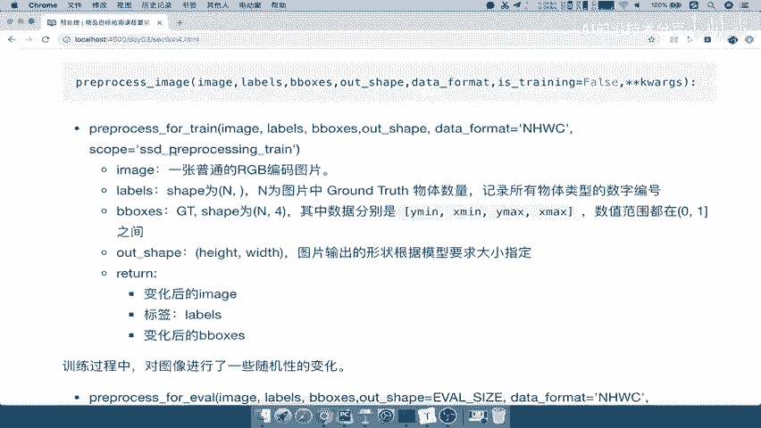

这相关的API呢我们不会去详细去介绍了啊，这个我们再去使用这个处理的预处理的时候。

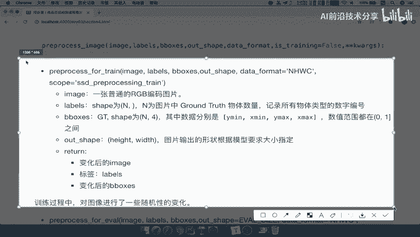

我们再去说这里面输入进去的都是什么对吧，还包括我们preprocessing evil，里面输入这些什么好，那么我们只要知道，就是训练过程中会对图像做进行随机性的变化，而在测试的时候。

我们不需要这个做变换，只需要在这个图片缩小到直径大小即可，不需要数据增强过程好，那么接下来我们要做的事情，就是搭建我们预处理的一个模块了，能理解吧，那搭建预处理模块还是一样。

首先把我们的预处理的这样的一个整个流程啊，整个这样的模块的这个目录来看一下。

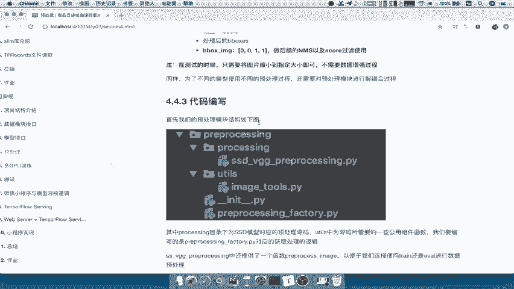

它的目录呢就是PREPROCESSING，然后呢这个根目录下啊，这个总目录下有一个PREPROCESSING的目录，这个就是我们存放我们处理不同的这样的一个，模型的预处理需求啊，对于不同模型。

它有可能处理过程呢数据增强过程呢不一样，那YOUTUS呢，就是我们的这个在处理这个图片的时候，需要用到的啊这样的一个啊图片工具，那这里面这是这两个目录，跟我们之前是一模一样的。

那首先我们先把这个目录以及相关的文件，先拷贝过来，注意了，这相关的API我们都不需要自己去啊进行编写了。

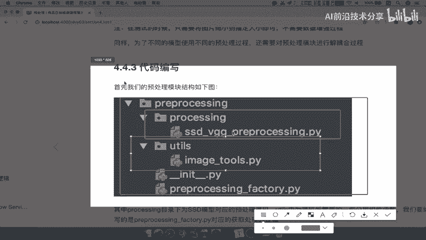

那所以我们在这边来，在我们的V3。0版本当中，新建一个这样的目录，叫PREPROCESSING好，那么这目录下面我们还有两个目录，那直接我们就把这两个拷贝过来就结束了吧，对吧，我们直接拷贝过来好。

那这样的话呢，我们就有了PREPROCESSING里面的SDDS，S d v g g preprocessing，还有我们的image tools，是它的一个这样的一个工具啊，那么对于这个模块来讲。

我们必须得新建一个这样的一个杠杠，INIT杠杠，in it杠杠PY，那么我们接下来要做的事情就是我们最后一步。

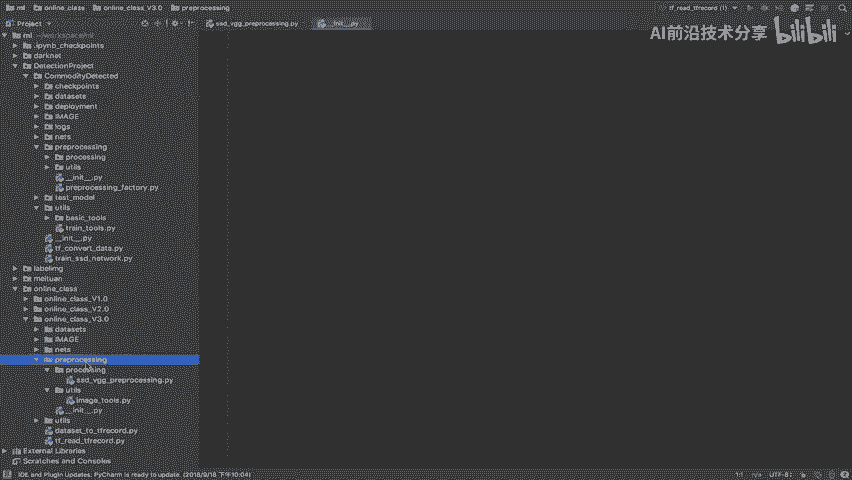

这一步干什么事情呢，来主要就是我们在这个训练的时候，选择预处理的工厂的时候，哎我就要去选择不同的方法还是一样的，在我们preprocessing factory这个目录里面，我们要呃这个文件里面啊。

我们要去进行编写的这样的一个东西，那么我们来看一下哈，这里的代码呢，介绍了我们怎么去写这样的一个代码，我们把这个哎该导入的包导入之后。

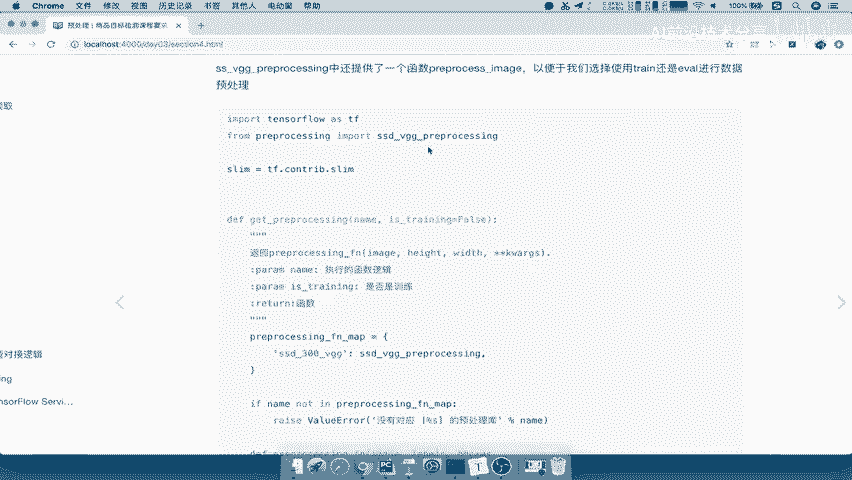

然后实现了一个方法，这个方法呢，我们直接返回的是一个PREPROCESSING的一个function，这个function指定指代的，就是我们把这个导入过来的这个模块啊，当中的这个name指定好之后。

Process image，然后用户提供的是什么呢，你的预处理的名字，以及我们的这样的一个是否在训练嘛啊，是否在训练，所以呢是否是训练过程把它放到这里面，然后包括指定这个参数呢直接放到这里。

这里就是也是我们啊对于返回的这个函数来讲，也是我们用户指定的这些参数能理解吧，好那所以我们根据这样的一个逻辑呢。

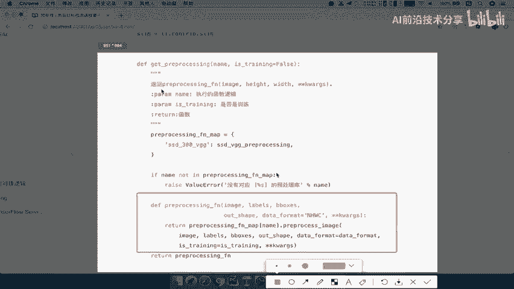

也去判断一下啊，去编写一下这样的一个这个整个过程好。

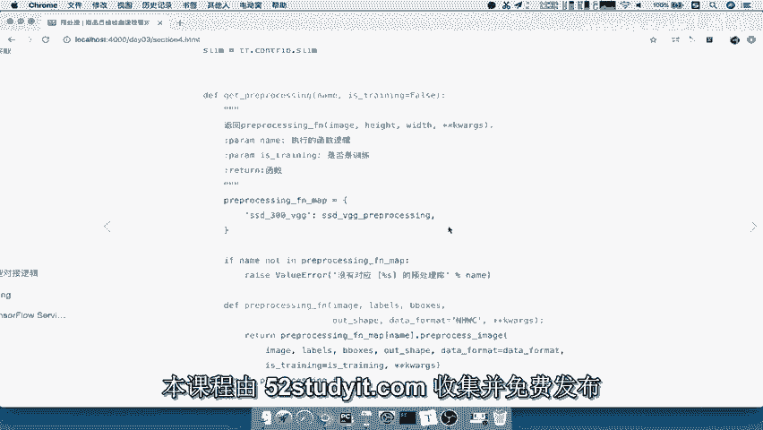

那么所以我们接下来新建一个。

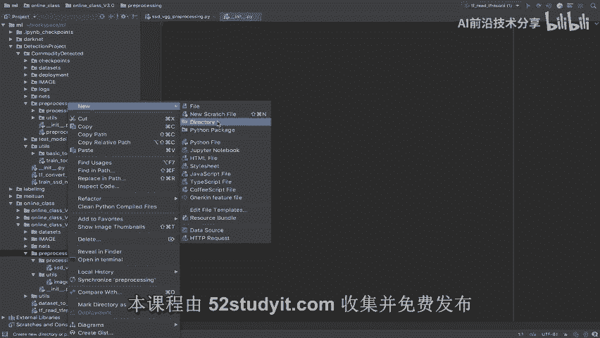

Python文件我们叫做PREPROCESSING，我们把这个名字也跟他一样啊。

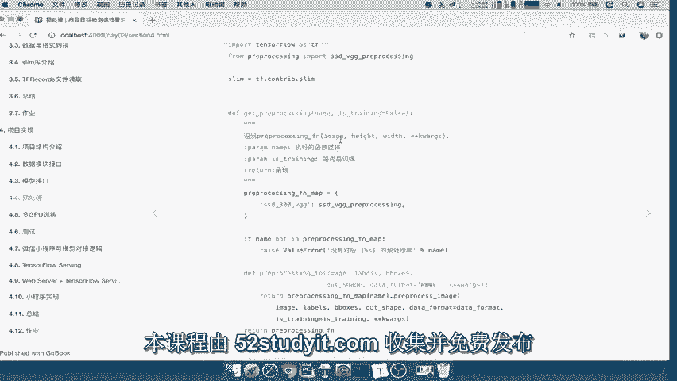

保持一致，Preprocess，Preprocessing factory，好，OK那在这里我们要导入，首先导入我们的模块吧，啊导入我们的这个代码处理的模块。

from我们的PREPROCESSINGPIECESSING点，我们的PROCESSING，import一下我们的SSD杠VGG杠，PREPROCESSING好，那么这个导入之后呢。

我们定义一个函数对吧，DE函数，那么我们定义这个函数，就要看到用户提供给我们是什么，用户提供给我们是什么，是不是要提供一个预处理的预处理的逻辑名称，以及我们是训练的预处理还是测试预处理吧，对吧。

好提供是否是训练的处理过程，这是他们这个用在训练的时候，我们使用的时候提供的一个这样的函数，这个参数啊，所以我们define一个get get pro啊。

Processing preprocessing，Paper size，直接用这个名字，那么我们在PREPROCESS里面直接提供一个name啊，我们还是用这个吧，proper cessing吧。

ING提供一个name，就是我们的名字以及是否是训练呢，哎is gun training，好我默认就是true好，我们把这个注释显示一下，那就是预处理工程获取不同的模型，数据增强方法。

数据增强或者称之为预处理方式，那么name就是我们的预处理这个名称，然后以及是否训练提供训练，那么我们在这里刚说了，我们首先呢进行一个判断，是你提供的这个name。

if这个name在不在我们的整个模型当中，整个有没有存在这个预处理过程对吧，我们所以我们定义一个prepar session，Preprocessing，然后干我们的FN啊，干map。

比如说我们叫做这样的一个名字啊，我们就称之为这个处理函数的一个映射，那么我们提供的就是SSD杠，VGG杠300这样的一个处理了模块，那么所以对应的就是它啊，对应的是它好。

那么这是我们定义的这样的一个处理的名称，的一个列表，如果你还有其他的是不是在这里增加就行了，那么我们if name，如果不在我们的PREPROCESSING这个mafunction map里面。

我们就raise一个error value error，你的值错误，你这个啊选择，或者说你的这个提供选择的预处理名称啊，你提供了百分之S不在，不不在啊，预处理模型，库当中吧，好所以呢请提供啊。

请提供预处理模型，预处理部预处理代码，该模型预处理代码，那么我们把这个呢，哎百分号这个地方提供的就是我们的name，好办法S那么如果说它提供了对吧，那提供了的话，我们就return一下。

那么这里呢我们在调用get processing的时候呢，我们想让他在训练过程中，我直接去返回我们的函数，返回预处理的训练函数对吧，预处理的函数，让它呢在这个处训练过程当中。

再调用具体的函数参数来去选择，因为我们现在在如果在这里啊，如果我们在这里提供很多参数了，PREPROCESSING啊，Preprocessing。

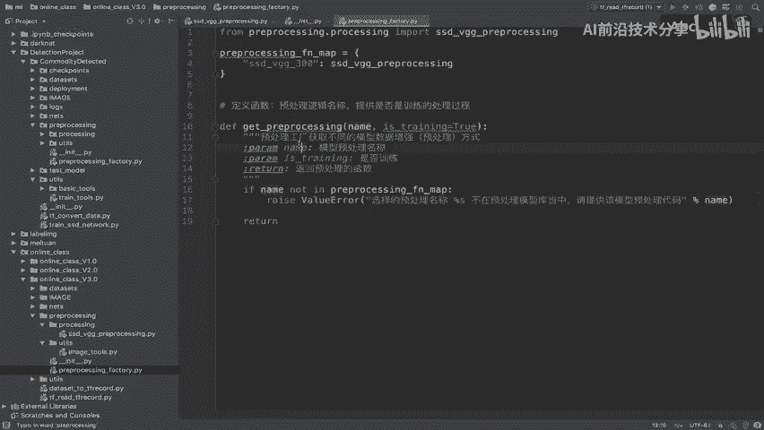

然后呢提供很多参数，你是不是要指定这么多呀，是不是什么image labels b box oshapes。

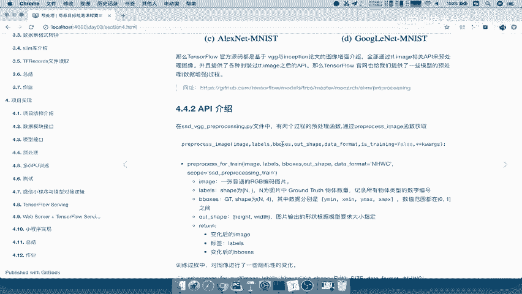

是不是你在预处理过程，图形刚输入进来，你就要给他处理了，那是不是你还要得提供这么多参数，太麻烦了，我们呢为了简化一下，在后续进行一个处理对吧，我们在这里直接返回一个处理的函数提供啊。

后续后续后续再去调用这个函数，再啊再去调用这个函数处理，那么所以我们在这内部的调定义一个函数，比如说叫做我们的define，一个PREPROCESSINGFN，那么这个函数要接收的参数就很多了。

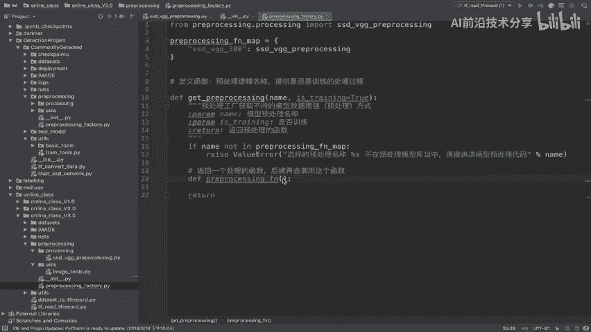

比如说我们举例子，就是这里面的这些参数，我们全部都拷贝过来。

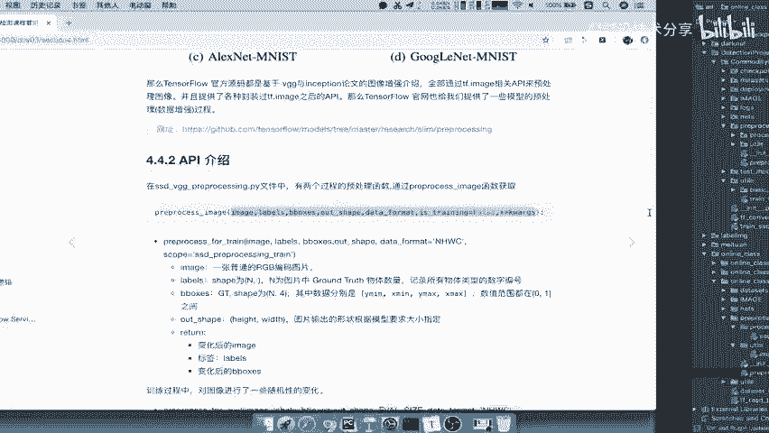

好拷贝过来，Images labels b box oship。

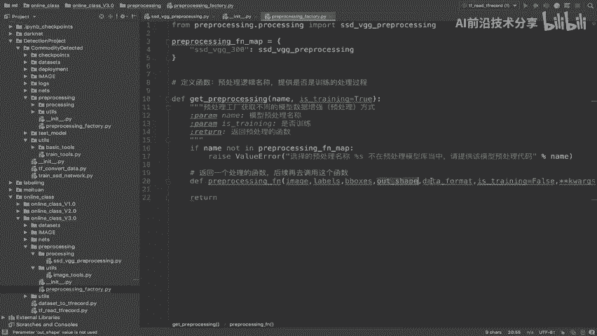

还有你的这个data format的这个格式，它的这个格式的默认的和。

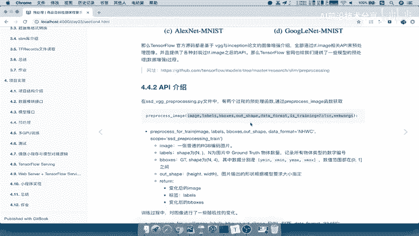

是使用NHWC的这样的一个格式，所以我们把这个呢复制过来，然后呢我们这个地方默认啊is train呢等于false，如果说你提供的is train，只有直接把is train提供进去就行了吧。

那这个地方呢我们把格式进行调整好，那对于这个函数我们要去调用什么呢，直接去返回我们的啊，pre processing这样的一个fn preprocessing map里面，我们提供的name。

是不是在这个map里面提供这个name好，我把name提进去，然后点preprocess image吧，就是我们在这个函数啊，这个模块当中的这个地方。

preprocess image选择is training是train还是evil好，我们在这里直接把这函数名字拿过来，在这里面去选择的时候，是不是就要提，直接把这个函数的名称给复制过去吧。

把名这个几个参数啊，我们把这个参数呢调整一下啊，调整一下它的这个形式啊，调整下格式，这里的空格，以及这个地方的空格，这里空格，好那么我们把这个呢往下进行调整，然后呢这个回车一下好。

那么这样的话就相当于我们提供进去了，这样的一个is training啊，包括我们这几个函数，is training哈，我们把这个复制过来呃，这个名称要一样，还有包括这个data map。

data format格式要一样，那么接着呢，我们就要去对于这个相当于是个B包对吧，我们要提供把这个函数呢进行一个返回，我们只返回这个函数，等后面这个训练过程再去使用的时候，我再去调用这样的一个函数。

能理解这个过程吧，好那么这样的话呢我们的预处理的数，预处理的这个过程，模型模块的这样的一个接口就提供好了，那这样的话提供给外面的就是别人写着写进去，你的名字以及是否进行一个训练过程吧。

哎把这个参数拿进来就OK了。

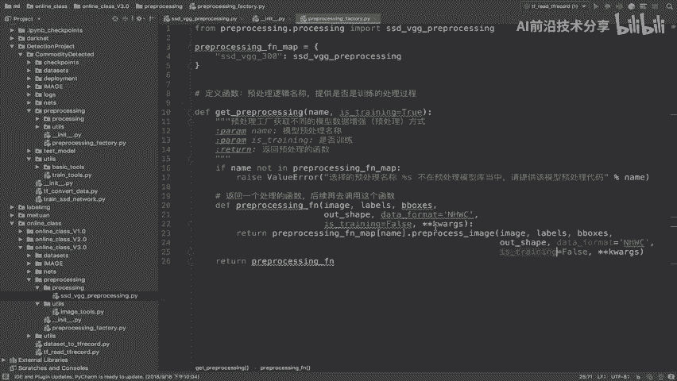

好那么这就是我们的整个过程，那我们简单总结一下，我们的这个接口的这个写的过程啊，我们这个数据数据预处理过程，那这预处理过程，那我们就有提供一个，提供一个啊PREPROCESSING的gun。

这样的一个factory给训练使用好。

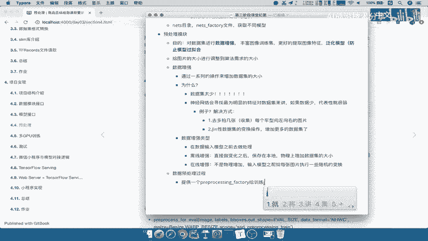

就是这样的一个过程，那这其中我们涉及到这些参数对吧。

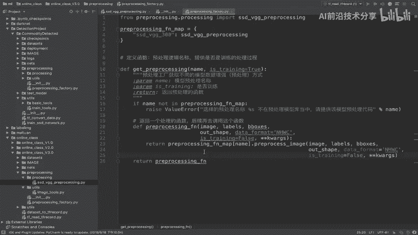

哎我们就在这里就不写了好。