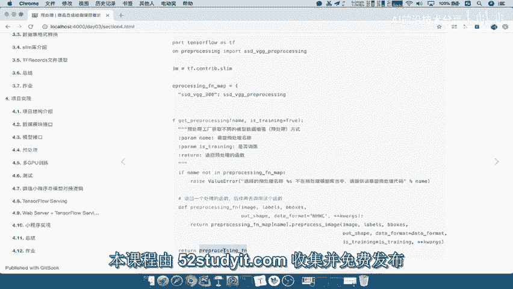
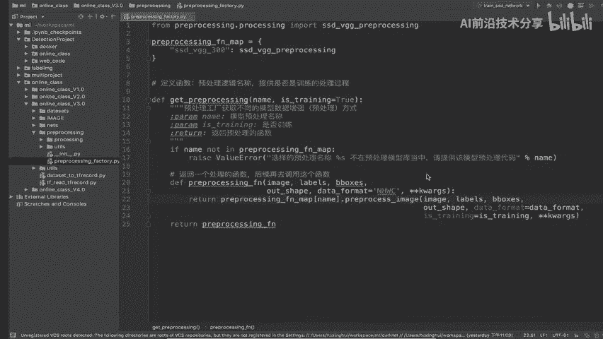

# P57：57.03_预处理接口：预处理工厂代码参数错误调整57 - AI前沿技术分享 - BV1PUmbYSEHm

刚才我们这个预处理啊，这个工程代码呢有几个参数有问题啊，那么我们这个地方来看到，在这里我们会在最外层提供一个is training，等于true，默认的true的一个参数，这个什么意思呢。

我是第一次再去获取这个函数的时候，获取这个函数的时候，先去判断你是不是是否训练吧，然后在这里面我再去调用的时候，我就相当于这个函数去调用这些参数了。

那这些参数就不用再指代的一个is training，所以我们刚才这个当中呢，我们is training进行一个删除，然后包括那你EXTRAIN传怎么传过来，是不是通过这个地方传过来。

那还有我们data format，Data format，既然我们在这个参数当中指定默认值，所以当然这个相当于是参相当于一个参数吧，我们就不需要去自己指定这样的一个值了对吧。

我们可以把data format放到这里来，因为你这个参数必须进行一个使用，这样的话呢。

