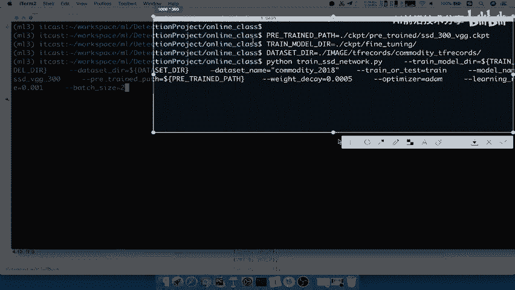
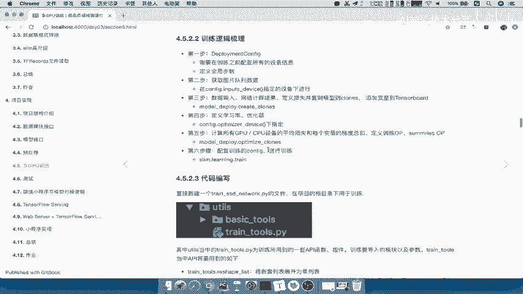
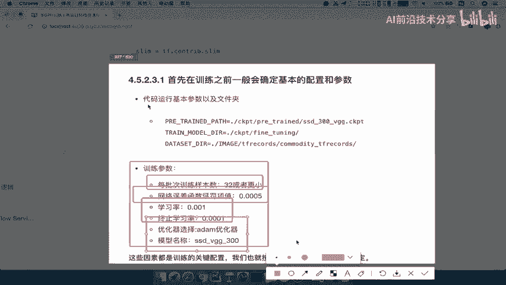

# P61：61.03_训练：训练运行结果显示与初始配置确定61 - AI前沿技术分享 - BV1PUmbYSEHm

那么接下来呢我们就要去实现整个训练过程了，那么我们首先来看一下我们整个代码啊，注意训训练代码的这样的一个运行结果，以及它的一个流程，那么首先我们来看运行过程呢，我们是在项目的根目录下啊。

输入我们的命令行参数好，我们先把这个参数复制过来，那么这参数呢运行好之后呢，运行的结果在上面打印了好，那我们先打开一个batch窗口。

那么我们在这个窗口上面呢，输入我们的这样的一个参数，那么这个参数我们简单的说几个，这样的一个配置。

那么我们的pre trained pass什么意思呢，就是我们预训练的模型，就是说我们拿到一些已经训练好的模型，拿来进行什么微调，那么微调的输出模型。

我们在点c k pd的fine turning里面能理吧，那么以及你的数据集放在哪里了。

我只需要读取这三个目录啊，通过这三个配置文件，然后我运行我们的Python train SSD network。

点PY，那么里面有其他的一些参数的一些设置啊。

那么我们来运行一下，好那么这个运行呢它就打印了一些，我们比如说我们网络当中的参数是哪一些，这是不是我们讲的SSD当中网络的一些参数啊，啊比如说你的这个长宽比好，那么以及我们的训练数据的文件。

数据文件在哪里啊，把它打印出来，那现在呢它就通过这样的一个读取，我们的参数从哪里呢，从我们调整之后的这样那个微调的参数图，如果你微调的这样一个发turning里面没有。

那么他就去投通过我们pre trade，就是说我们这个预训练的模型里面去读取，那么这样的话呢它就会进行第哎多少步，多少步的进行一个训练，保存的这个checkpoint呢也保存在model点c k pd。

也就是fine turning，就是微调之后的，现在我们是，现在我们已经在这样的一个微调过程当中了吧，好那这样的一个过程呢，因为他训练的这个运行的时间是比较长的，因为我们这里呢。

这个本地电脑当中只有这样的一个CPU，所以呢它这个运行呢可能会隔很长时间，打印一个结果好，那么这一部分呢我们就先暂停到这里啊，它会一步一步的去打印的，好比如说现在打印第这个每一步啊。

global step每秒多少步好，现在呢也就是说他将这个summary呢啊，在第几步进行了一个保存，那就啊比如说这是第五步了，然后呢它保存了这样的一个summary，能理解吧。

好那我把这个关于更多的这些打印的参数，我们就不看了啊，我们这个直接关闭，好我们通过CTRLC结束了，那么结束之后呢，在我们项目根目录下啊，这里呢是我们的这个训练文件，那么我们保存的模型都在CKPT里面。

我们进入CKPT里面来看，那么CKPD里有个FINTURNING和pretrade pre trade，我们刚说了，是我们预训练要的模型放到这里面，然后呢。

FIGHTNING是我们进行现在的一个训练的时候。

保存的模型，哎，在这个文件里面能理解吧，所以我们现在这个更新的参数呢。

都放到这个find turning里面了。

好那我们直接进出去好，那么这就是我们整个项目的一个运行结果，包括运行的这样流程，那么接下来我们就要去分析我们怎么去实现，按照刚才我们所说的设备部署，跟我们的训练逻辑之间来。

我们整理了这样的一个训练逻辑的一个梳理，那么首先第一步呢，我们会进行一些所有设备的配置，这个配置过程包含着你对当前训练环境的配置，当前训练环境配置，包括你有几台电脑，包括你有的这个。

比如说你一台电脑上有多少个CGPU能对吧，哎多少GPU，配置能理解吧，好然后呢一般在这个一开始定义步数之定义，这样的一个配置呢，我们会加一个这样全局步数啊，这个我们在训练过程中。

一般都会通过拳击步数啊记录，然后呢来达到我们来数我们训练了多少步对吧，那这个呢第二步，第二步是不是就我们获取数据了，所以呢我们第二步就要去啊，这一个步骤我们要去获取图片的数据队列，获取数据之后呢。

我们要把数据输入到我们的网络当中，进行计算以及定义，损失复制到这样的一个每一个GPU模型，GPU的设备当中，也就是说我们的模型会复制很多份吧，然后添加一些变量的观察到TENSB好。

那么我们使用可以使用create cross，那么第四步定义学习率与优化器啊，定义这两个好之后呢，我们就可以通过学习率优化器来去进行计算，优化我们的损失，计算平均损失等等啊。

返回我们的训练OP和summary apple OP，最后我们配置CONFIG来进行slam点learning，点train进行一个训练过程，这就是我们的完整的一个流程。

就是跟我们的数数据训练流程是不是一样的，哎，获取数据输入网络计算来看到这里，就是我们在前面讲的，是不是跟这个数流程是一模一样的吧，好只不过前面多一个这样的一个配置，那么接下来呢。

我们就要去看一下我们的整个项目啊，整个项目，那么这个项目在这里我们呢重新复制了一份啊。

4。0就从3。0复制一份到4。0，那我们来看一下我们的online class里面的这个，整个项目的一个结构，那我们已经到了3。0的时候呢，我们这里面缺少什么CKPD，唉包括这个deployment。

我们的这样的一个文件夹，是不是啊，唉包括我们的这个YOUTUS等等啊，YOUTUS里面的一些相关配置，还有我们的训练网络那么好，那么接下来我们就要去看一下，我们的训练网络的整个代码逻辑呢，就在这个地方。

这就是我们整个代码逻辑，那么包括你一开始的配置的参数，以及我们的训练的主逻辑啊，你这一个在默认图当中去进行一个获取训练好。

那么这就是我们的主逻辑了，那么接下来我们就要去实现这一步一步的啊，每一个步骤好，那么首先来看啊，代码编写呢，我们首先在D这个3。0版本上面啊，那么我们会去建立这样的一个YOUTUS当中。

我们会在整个根目录啊，创建一个train SSD network点PY。

所以我们在这个地方啊为3。0，我们直接复制一份到这个4。0了，那么我们会new一个啊，我们的这个，Python文件夹叫train gussd杠我们直接叫做network对吧，哎network。

那这是我们整个训练的这样一个逻辑，包括之前的读取呀或者什么转换呢，我们就不用管了啊，这两个逻辑呢我们直接关闭好，我们把这个呢调一下，打开我们的项目好，然后呢我们把这两个文件夹呢就删掉了。

我们就用不到了啊，好那么train点train SSD network点PY。

那么然后呢我们在训练的时候，我们会使用一些公用的组件，那么这个组件呢我们都放到了train tools，点PY啊，train tools点PY，那么这个公用的API函数呢。

我们的直接啊把这个train把train点tools点PY。

复制过来放到我们的YOUTUS，这是序列的相关逻辑代码。

放到我们根目录下的YOUTUS，能明白吧，好那么接下来我们简单的看一下train tools呢，里面会包含着一些训练时候使用的，一些比较方便的API，包括我们进行一些形状的改变。

包括我们去进行复制GPU的这些模型，然后配置学习类，配置优化参数等等，这些都是需要去进行这个使用的，那么这个详细之详细代码的一些参数啊，这些函数的参数返回值，我们在做这个整个训练写代码的过程当中。

我们再去仔细去看好，那么接下来我们来看，首先我们第一步做什么。

第一步呢我们会在训练之前注意了，我们要去训练这个模型，我们会在训练之前确定一些基本的参数，哪些参数呢来看到会确定参数。

比如说我们的预训练模型放在哪呢，你的这个我如果训练好输出模型放在哪，就是微调之后模型放在哪，以及你数据集的目录是不是要指定一下，然后这是一些基本的文件夹的，还有的就是我们的训练参数。

这个训练参数一般都是我们初始化的时候，或者说最开始在做项目之前，我们就要学好，学会把我们的训练的一些参数，比如说你的每批次训练多少样本，这都是我训练时候要指定的吧，以及我们的网络惩罚的一些参数。

防止过拟合的一些网络惩罚下，那么学习率终止的学习率，因为我们是一个动态调整的学习过程啊，这个我们这个亚单学机器呀对吧等等，这些是比较好的，这些学习器需要调整，包括你优化选择，优化器的选择。

以及你模型的名称，这些都是要需要确定的。

所以呢我们先把这几个参数呢，我们都把它复制过来。

我们在这里写上一个解释啊，解释我们的这个训练初始的这个确定事项。

好比如说这几个这样的一个输出目录，以及我们每批次训练的参数啊。

我们的训练学习率等值的确定，那么我们看啊，这里我我所列举的这些值都是通常一些啊，网络别人在训练模型的时候，他们使用的一些经验值，也就是说这些值并不是说凭空得来的啊，这些值呢都是一些网络啊。

我们这个在别人在训练网络的时候，比如说谷歌他在训练网络，通常使用的这些参数值是多少，他们的优化器选择多少等等，能明白吧。

好，那么所以呢，我们就要根据我们确定的这些配置啊，关键的配置啊，先去把我们的文件夹目录等等先给啊。

确定好，那比如说我们的CKPD文件，那我们在这里online class当中，是不是有一个CKPD文件，还包含了FITURNING和PTRADE，所以呢我们在这里新建一个好。

我们新建一个叫CKPT的文件，我们在下面再新建两个文件夹，叫fine gut u n i n g turning，这个by turning是我们微调的吧，然后呢再新建一个文件夹叫做pre trade。

叫我们的这个预训练的模型好，这个也就是我们的模型，那我们然后把已经训练好的这个模型，是网上从网上下载的SSD300的，这样在我们的work数据集里面去训练呢，我们把它粘贴了。

这里来说明我们已经有预训练模型了吧，哎然后在这个基础上进行调整好，那么我们然后再来看我们DATASETDR已经确定了吧，DATASET我们的DATASET应该是在image上面，Tf records。

Commodity，tf records吧，好这个我们就不用管了，好那么这样的话我们看一下我们的文件夹呢，已经啊基本上全部都确定好了啊，没有缺乏任何一个文件夹，然后以及相关文件已经确定好。

你的这个目录接口参数都要确定好了，那接下来你的这个是不是就要去编写，我们的整个训练流程了吧，哎编写整个训练流程了吧。

好那么这也是我们一开始啊，在这个编写代码之前呢，去进行一个相关运行结果，比如说一些配置对吧好，那所以呢我们在这里写一下啊，总结一下刚才这个讲的这个过程训练，这个编写训练代码，训练逻辑代码。

那么首先我们第一个要确定的就是啊，我们把训练的一些相关配置啊，相关配置，那么比如说你的输入输出模型文件夹，以及我们的预训练对吧，预训练模型以及微调模型文件夹好，这是一个，然后呢会确定一下。

我们会确定确定网络讯，你练时候的一些相关参数啊，学习率等啊，这些通过一些经验值，指令好。

