# P62：62.04_训练：1设备配置代码以及全局步数定义62 - AI前沿技术分享 - BV1PUmbYSEHm

那么接下来我们就要编写代码，我们按照刚才的步骤来进行第一个步骤编写，来看到刚才这里面的五个步骤，我们来看第一个啊，每个步骤的内容都是比较多的，所以我们一个一个步骤来写，第一步骤。

配置deployment config以及全部参数，那我们首先呢先把这些库啊导入进来。

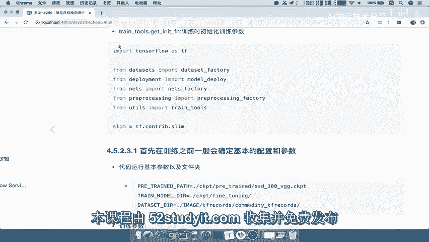

能理解吧，那么我们这里呢就直接从这个地方复制过来，我们的参数了啊，导入我们的参数，这个参数都是我们自己通过模型的接口，已经定义好了吧，是不是啊，包括这个模型的这样文件夹啊。

这些文件夹的名字一定要指定清楚了好，那么接下来我们第一步来干嘛呢。

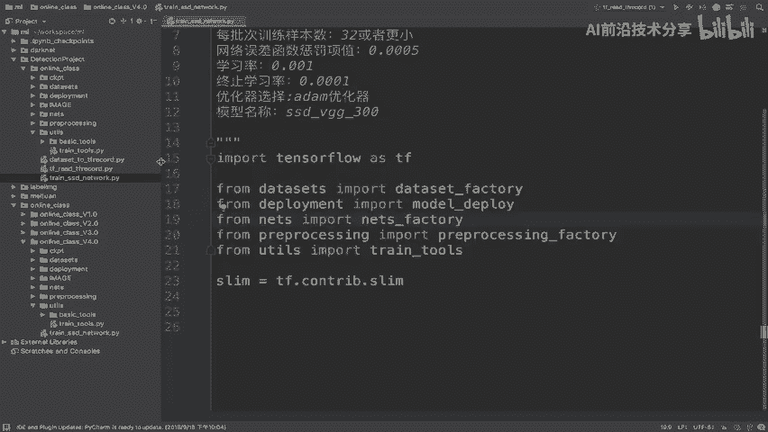

我们先来看一下我们的代码，非常简单，我们主要是呢通过一个这个在deployment configure，运这个配置之前，先我们定义一个我们的主函数，主函数逻辑。

就是在我们的这个使用TENSORFLOW当中的app点run，来进行定义，然后呢，在这个主函数来进行，我们的所有的函数的参数定义对吧。

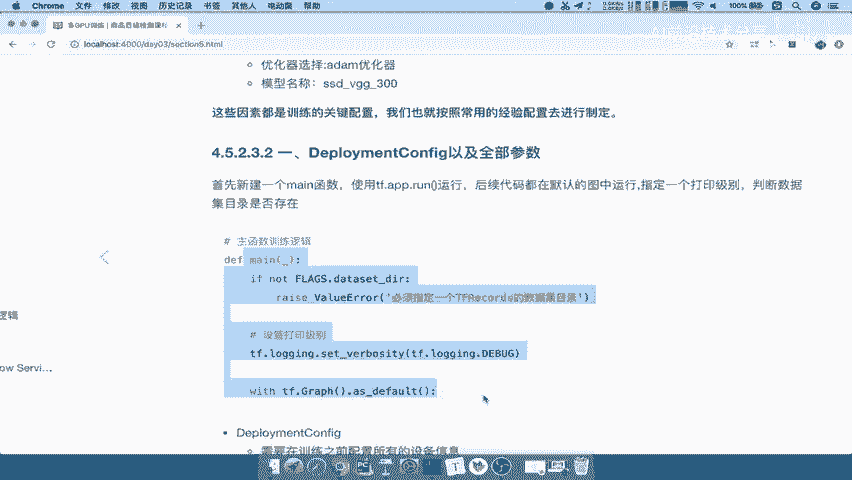

所以我们定义一个主函数来好，我们这里用main，那么我们会使用TF点app点run来定义，那么这个run呢，它会要求定义一个这样一个main函数，main函数当中也会接受一个参数。

好那么这个是我们的main函数，在这个main函数当中写。

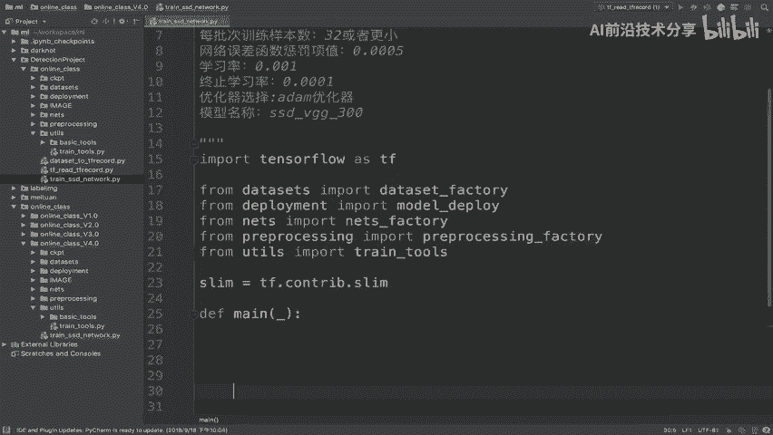

我们的逻辑能理解吧，好那么在这个逻辑当中写的话，我们可以看到啊，它一开始呢我们可以判断一个简单的文件夹，存不存在啊等等，以及我们设置一个打印级别等等，能理解吧。

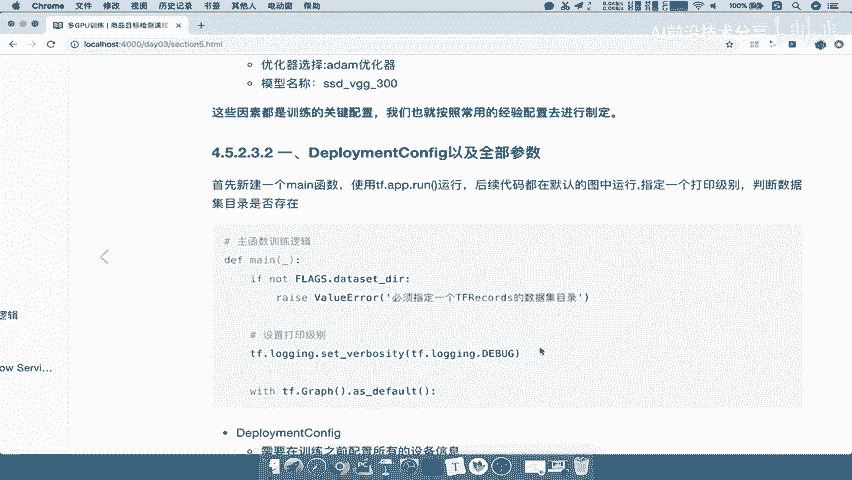

那我们把这部分代码就直接粘贴过来了，这也就是我们基础的一个配置，那所以我们这里面使用了一个叫flax data dr。

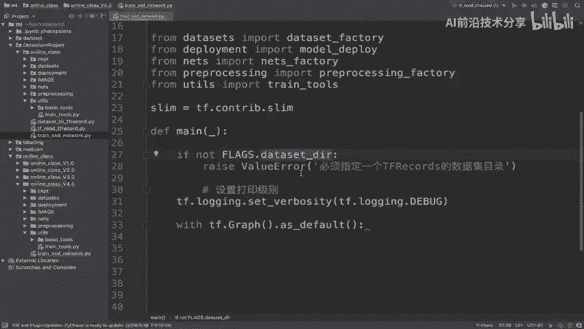

我们要配置一下我们整个网络，或者说我们训练的时候读取的网络文件夹。

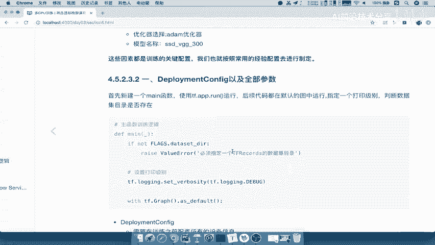

DIR的一个哎数据目录，所以我们在这里定义定义一个数据集，或者说吧数据集相关命令行参数设置，好那我在这里使用TF点A点，这个TF点flax点，那么这里面呢有什么的，有很多的这样的一个配置参数的。

它的一个初始化的一个名字，你定义string类型啊，还是定于我们的这个integer类型啊，啊我们应该是在app点flex点define一个string，啊flags点。

我们直接define f f i n e，干我们这一个data sdr是一个string类型的对吧，所以我们在这里写一下它的名字呢，就叫做这个我们的数据集目录，读取一个数据目录，然后呢我给他一个目录。

默认我为空，然后接着第三个参数写一下我们的这一个啊，他的一个介绍啊，训练数据集目录，训练数据集目录好，那么这也是我们的DATASETDIR，那么我们怎么去通过获取这个DATASETDI呢。

我们要使用的一个就是哎TF点P点app点flux，我们应该是在这个地方下面写啊，我们应该在参数的下面去进行编写app，点flags，点大写的flags，然后我们用一个名称啊，这都是一个常见的设置啊。

好那么接下来我们就要在什么呢，整个默认的图当中啊，我们的TENSORFLOW是在整个默认图当中去进行，训练的对吧，哎我们在默认的图当中进行编写训练逻辑，好那么接下来我们来看第一步。

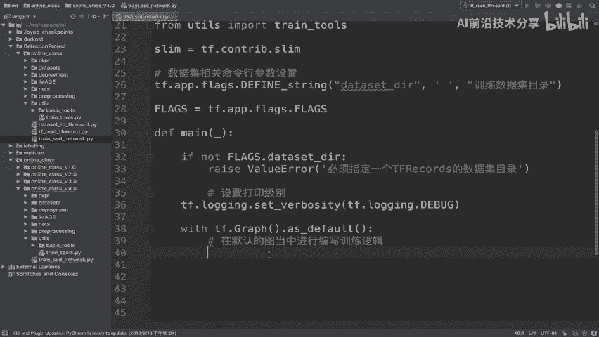

他的第一个PODEPLOYMENTCONFIG的配置。

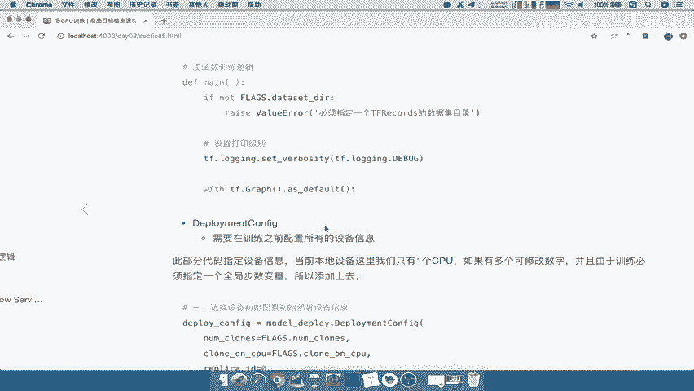

那么我们在这里呢，先把我们的这个配置以及全部参数写在这里好，那么这个配置配置什么，我们想他应该是在这里配置什么呢，我们写一个pass啊，配置的话一般会配置哎我们的，集群的属性或者我们的计算机的相关情况。

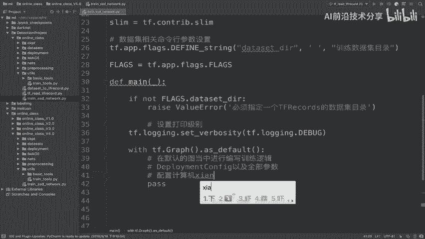

那我们在这里要使用的一个这样一个类，就是我们的d deployment configure，这样类，我们来看一下这个类有哪些参数来需要体验的，model deploy这个参数呢需要去填的时候。

你的总共有多少台这样的一个啊，或者说总共有多少个GPU设备，然后你是否只在CPU当中去进行一个建立，一个筛选，或者只进行运算，然后我们的默认的第一台的设备的id叫做零，然后你的设备有多少台。

你是有一个计算机还是两台计算机，然后默认的PS的test是默认第一，默认第一台啊，这些东西配置，那所以我们就去到通过model deployed，Deployment config。

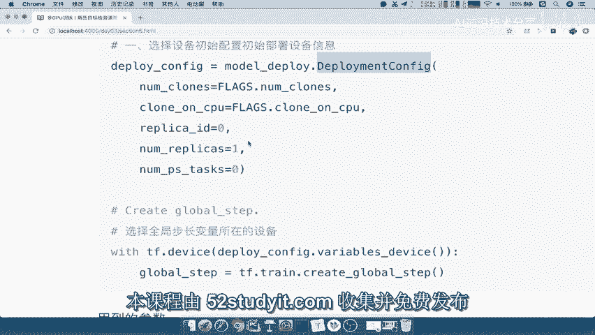

能理解吧，好，我们通过这样的一个函数，配置相关计算器的情况，那么model deploy呢我们已经通过这里导入过来了，来看到，它的第一个参数就是让我们配置它有多少个，Ncs。

这个number close就指定有多少台，那么这样的话我们要配置一下它参数的参数，那么这里面相关的一些参数，我们都把它放到命令行参数里面去配置，能理解吧，好那么这是数据集相关的配置，我们再定义一个。

还有设备相关配置吧，设备啊，设备的命令行参数，参数配置好，那么我们在这里也是一样，define一个，那么这个地方是一个整形类型啊，所以呢我们在这里TF0app点flags点define。

不是string了啊，我们应该是一个integer，指的是你的一个整形类型对吧，integer啊，INTEGER好，那么integer呢，我们要指定的就是你的non class的名字吧。

哎你的这个nb class，把这个呢我们都用都用单引号啊，都用单引号，这个地方我们就使用啊，Ng c o n e s name class，然后这个值呢我们默认为一。

也就是说我们默认只有一个GPU设备对吧，然后写一下可用设备的GPU数量好，那么这个呃GPU数量，那么在这里我们直接使用flex，flex点我们的nb class好，这是第一个参数。

然后呢我们看第二个参数啊，clown on GPU GPU对吧，C啊，CPUCLBGON杠，Cpu，那也就是说它指的是否只在CPU上进行一个，运行吧，所以呢我们在这里直接把CPU呢直接指定false啊。

我们不在CPU上面去运行好，那么所以呢我们在这里定一个TF点，app点flags点，直接定义我们的这个define，一个啊define一个，这地方呢它是一个true和false，它是一个布尔类型的啊。

B o o l e a n，布尔类型呢，我们的这个名字取的名字叫做，COCLONEGUO干CPU，然后呢是否在这里面呢默认啊我们就是否了吧，我们直接给一个FAFALSE。

然后呢指定我们名字是否只在指在CPU上运行好，那么然后呢，我们把这个参数flags点我们的CLOLAN，把这个直接复制过来，那么第三个参数呢它指的是你的这个republic id啊。

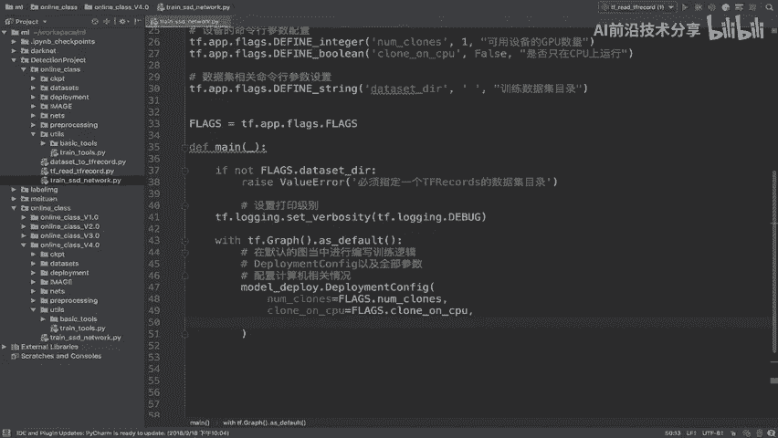

Republic id，我们直接把后面这三个参数直接拿过来了。

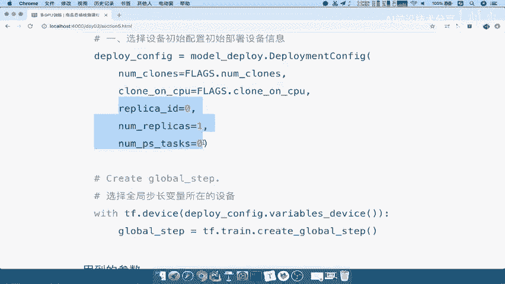

对吧好，我们把这参数拿过来，也就是说你的这个第几个设备，一共有多少个设备啊，我们在这里一共多少计算机啊，配置多少计算机，一台计算机吧，在这直接写上一台计算机，然后呢，你这里面啊GPU设备数量。

GPU设备，数量好包含了啊，包含了这个CPU一共多少份好，那么这个model deploy config呢配置好了之后，我们返回一个deport，DPLOY杠CONFIG啊，返回这样的一个配置文件。

那么这是第一步里面啊，我们还会通常会做的一个步步骤呢，就是会将我们的全局参数进行一个定义，将我们的全局参数，也就是说全局参数有哪些呢，比如说我们的全局步长是不是我们的参数啊，所以呢我们会定义一个啊。

定义一个全局布查，这个呢是一般啊，在网络训练时候都会统一默认啊，在网络训练都会这么去进行配置，能理解吧，不是说我们想到在这里配置了就配置啊，它一般都会这样去做的，那么我们说了，对于这种变量参数来讲。

我们会在设备指定设备上去进行配置吧。

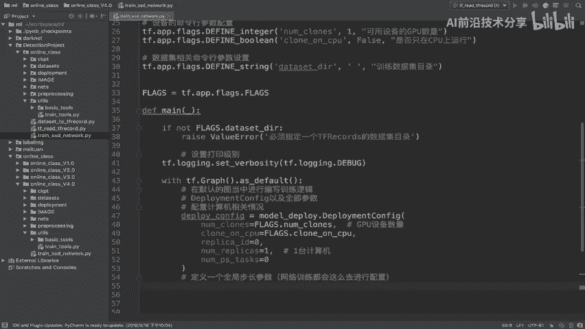

那我们这个地方指定什么设备呢，我们来回忆一下我们在这个地方的图当中，来看到我们说了这些设备，我们一般会把变量保存在一开始的时候，variable device吧，哎你的变量的参数等等能理解吧。

还有些变量，所以我们在这里会调用的是CONFIG里面的D，这个variables device这样的一个函数好，那我们所以呢，接下来就要去使用这样的一个函数，使用这个设备了。

那么在TENSORFLOW当中使用使用指定设备，我们用的一个函数是什么，是不是TF点什么函数device吧，D e v i c e，所以我们在这里构建一个上下文环境。

也就是说我们会在这个上下文环境当中去，只要在这个商标环境当中，定义的变量都会在这个设备上能理解吧，TF点DEVICE，那么其中我们会通过deploy config点。

通过它这里面的variable device，这样的一个函数指定好，那么这样的话我们可以定义一个全局步数，全局步数呢我们在TF点train点，我们的啊这个地方我们就不写了啊，直接通过这个复制过来吧。

我们在这里啊create global step tra点，直接create global step，创建一个叫GLOBL，然后呢干step等于好，这样的话呢，我们把第一个这样的一个配置环境给配置好了。

全局的一个步数记录对吧，你训练的时候要记录全局步数，以及你的CONFIG的配置情况好，那么这是我们的第一个步骤，在我们的第一帧这里，dep deployment config以及全局参数部位配置啊。

所以呢我们接下来就直接先总结一下啊，我们的这个步骤步骤编写一，第一个呢，就是我们配置我们的整个集群环境介绍哈，数量介绍等等，然后呢以及创建一个全局变量，全局的一个这个步长变量好。

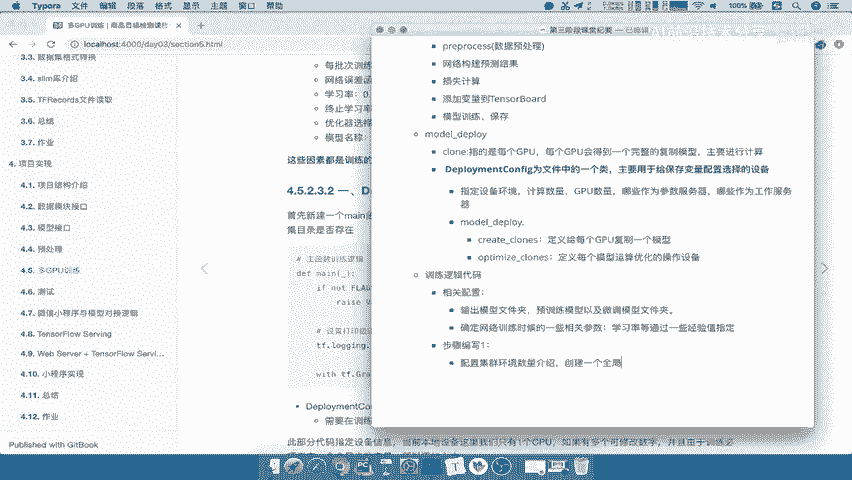

这是第一步。