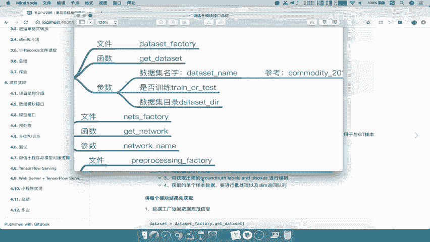
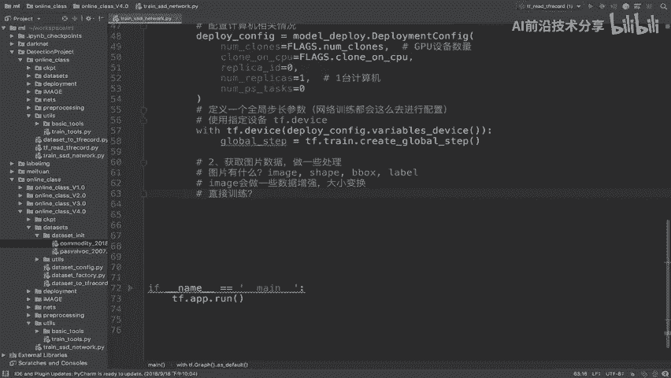
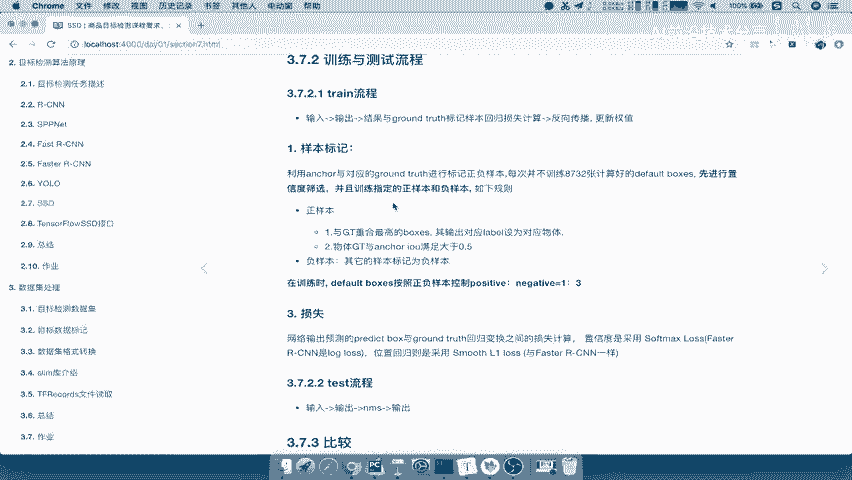
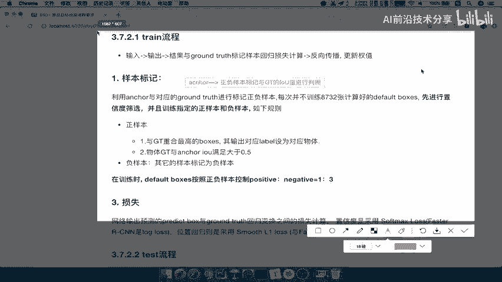
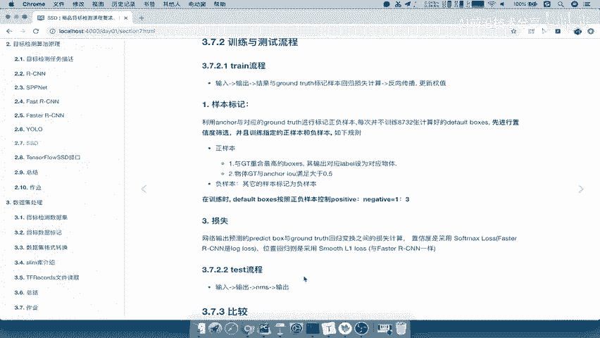
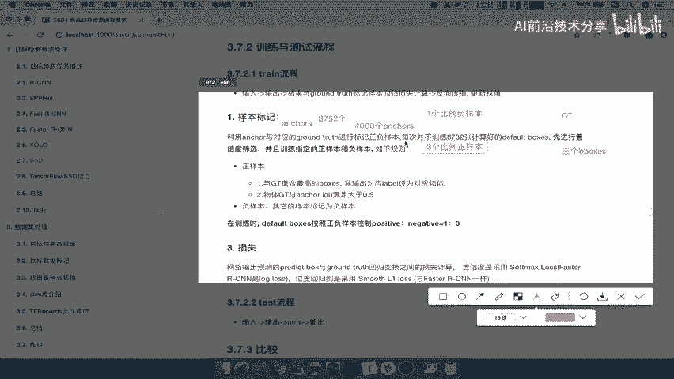
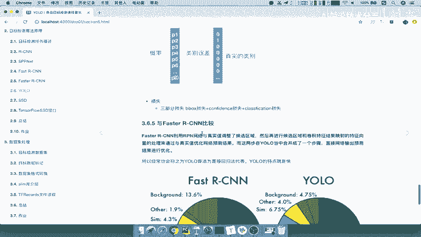
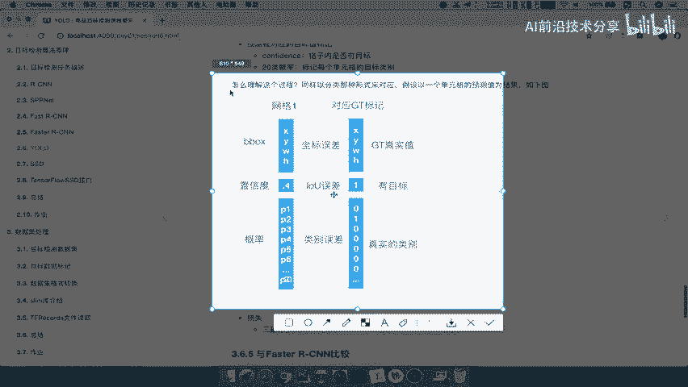
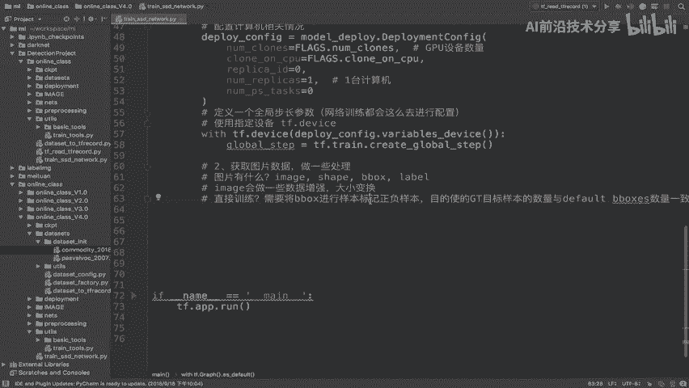
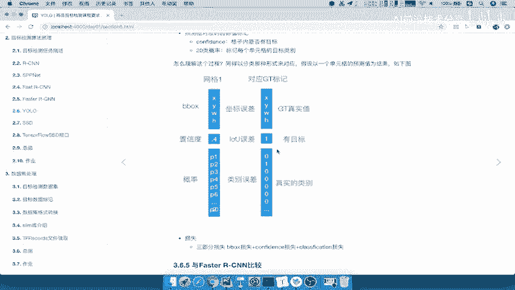

# P63：63.05_训练：2图片数据读取与处理逻辑介绍63 - AI前沿技术分享 - BV1PUmbYSEHm

那么我们来看第二步骤，那么这个第二步骤呢，我们要去做获取图片，队列数据以及处理样本的这样的一个标记，什么意思呢，首先在这里我要提个问题，也就是说我们第二步是不是要去获取这个数据，去进行处理啊对吧。

那么这个数据首先确定一下，我们这个数据拿到的是什么，拿到哪些数据，我们在这提个问题，也就是说我们在这里第二步，第二获取图片的数据吧，然后呢以及做一些处理，做一些处理处理，我们等一下说做间怎样的一个处理。

那我们首先这个图片数据有什么，我们提的问题，图片数据有什么东西，那就要回到我们说了这个接口，dataset factory里面提供的接口是什么啊，我们来看一下接口的相关介绍。

我们的数据集模块接口是通过dataset factory，然后get dataset获取的，这是一个什么，它获取的是一个DATASET的一个规范吧，只不过这个规范里面它会包含着它的一些内容。

图片相关内容，那我们就要去看一下这个相关内容有哪些，当初我们定义的数据集读取出来有哪些内容。

我们来看一下啊，从我们的这个DATASET进去，然后呢我们获取出来的数据集，在我们的commodity2018里面，我们获取数的数据集应该有哪些呢，是不是有图片以及它的形状，还有b box。

还有label，是不是有这些，那么有可能呢，我们这些有一些呢是不需要获取的，这两个我们就不获取了，在我们的训练当中呢是不会用到的，所以我们会拿到哪几个东西呢，Image sheep，还有b box。

还label好，我们在这里写一下，刚才我们所说的有什么呢，Image，image shape以及b box，还有我们的这个最后一个是label，好，那我们想啊，我们把这个数据进行一个获取。

然后进行一些处理吧，处理我们说了，只是说把图片做一些形状上的变化，图片的内容是不是做一些改变啊，图片上的这个形状大小，大小和内这个做一些数据增强吧，image会做一些数据增强。

那么我们的这个以及大小变换吧，好那么然后我们再想，我们提供我们直接从tf records里面读取出来的，B box label，什么东西，我们是直接拿到网络当中去训练的吗，请问直接去训练吗。

是直接训练吗，要不要做一些什么处理，我们在讲SSD网络的时候有没有说过。

那我们来看一下到底要干什么呢，SSD网络来看到这里我们说了他的训练过程，有一个过程是要干什么。

是不是要去做一个这样的一个train流程当中，我们输入的这个数据要做样本标记吧，什么叫样本标记啊，我们网络得出的这个anchors，网络得出的anchors，好。

网络得出的anchors是我们直接就这样训练的吗，怎么训练啊，你都没有目标值，一一对应的，怎么训练啊，是不是要有一个这样的一个进行正负样本标记，哎正负样本标记，然后呢是利用与gt的哎。

gt的这样的一个IOU值吧，IOU值进行判断，这样的话我们会对每一个这样的一个预测的框，Default anchors，注意啦，是default默认的这个候选框啊，候选框我们会对它进行每一个对一。

一对应的标记，那你想我们的总共的gt数量是不是很少。

对于我们来讲gt数量是不是很少啊，我们这个在。

还是在这里画吧，我们的gt数量，比如说这个图片当中，我有可能只有三个box，三个gt，三个gt，比如XES我们说了我们的anchor有多少啊，我们的网络的angle有多少。

SSACD网络计算出默认计算出的angle有多少，一共有8700多少，8752个吧，哎我们有8752个，那你想G之间怎么去进行一个误差计算，怎么进行误差计算肯定不行嘛。

那所以你要做的事情是把anchors，比如说过滤掉了啊，过滤掉了一些我们会得到，比如说我们得到这个4000个anchors，然后计算4000个anchors，4000N个符合安格斯的，符合要求的安格斯。

它里面的有1/3啊，比如说在这里写上一份啊，这个一个比例是负样本，然后呢三个比例是这样本，三个比例正样本，那么这样的话呢，我们这里面要一一对应的跟我们的gt11对应。

他之间每4000个ENLES跟4000个建立个目标样本，进行一一对应的进行损失计算吧。

这个计算过程又是哪一个一一对应的，我们把这个保存一下，这个样本处理标样本处理分析，然后再来看它怎么去一一计算呢，我们在yo当中画了这一张图。

是不是都会进行一一的，你每一个anchor对应会有一个uncle，对应的gt标记，就是说4000个uncle就会有4000个对应的gt，那这样的话我们可以一一对应，对应的计算损失吧。

哎一一对应三计算损失。

所以我们一定要参考这一张图，能理解什么意思吧，我们不可能直接把b box拿去训练的，会需要将b box进行我们的样本标记，这个标记呢我们的目的是，使得gt点目标值，目标样本的数量与我们的default。

f a u LT b boxes数量呢一致，然后呢，我们的标记呢主要是又对b box进行一个哎，IOU的哎计算，然后呢去进行说你是正样本正负样本对吧，哎进行标记，正负样已致啊，我们把这个地方的标记写下。

正负样本要理解啊，我们这个图片数据要处理做哪一些image也要处理，你的b box也要处理吧，那要不要处理啊，肯定是要处理的好，那么这就是我们分析第二步骤，我们要做什么事情，先分析了。

为什么要在这里要做这些东西，是因为我们输入的数据要训练。

肯定要去标记样本，然后肯定要去做数据增强的好。

