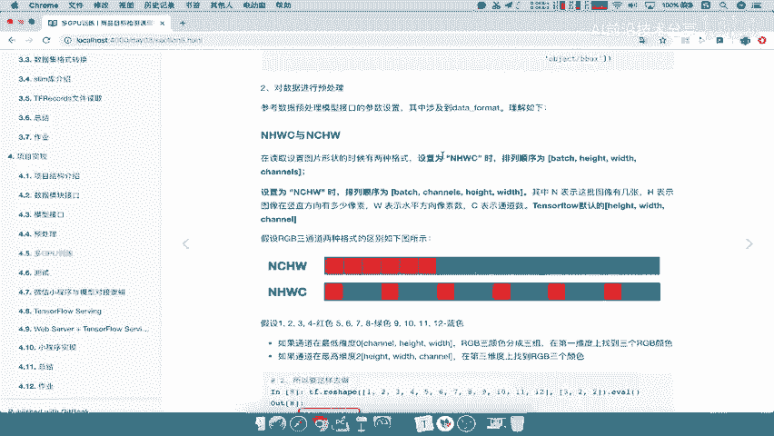
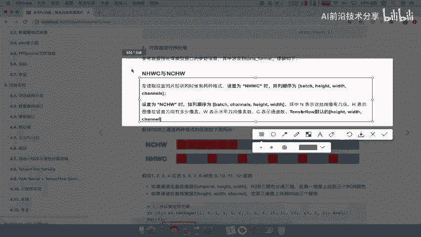
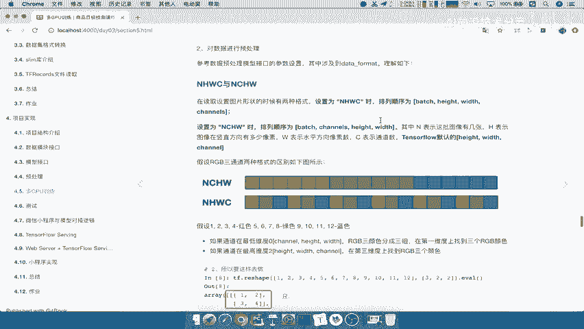
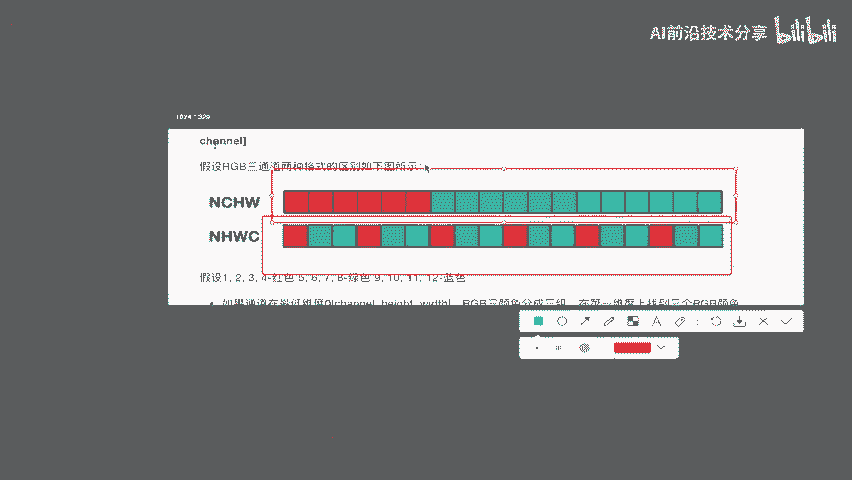
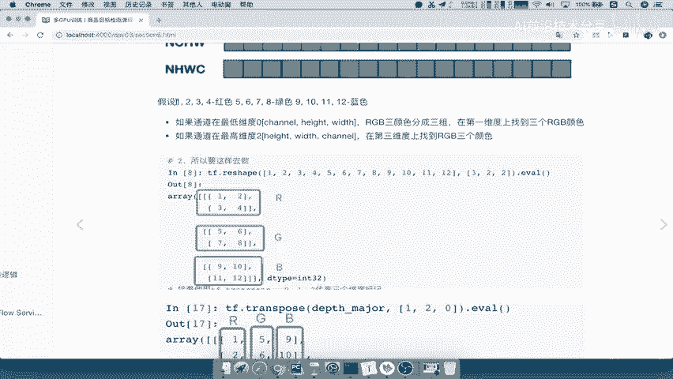
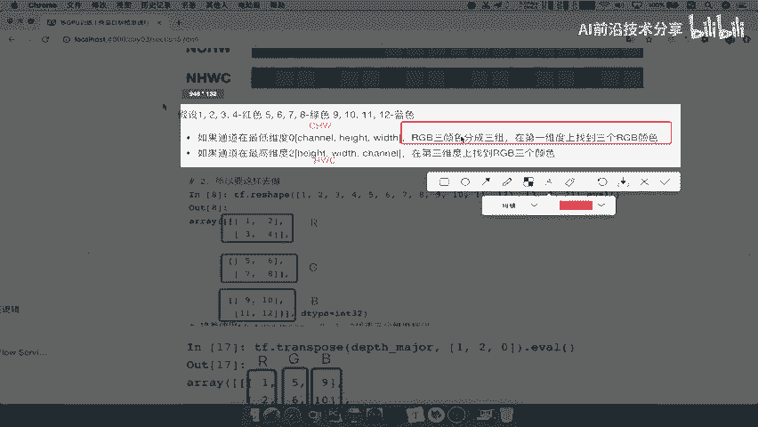
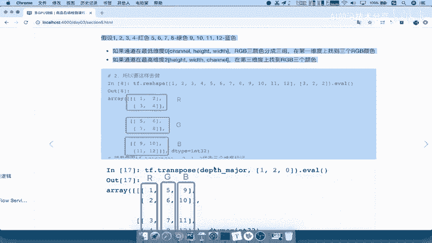
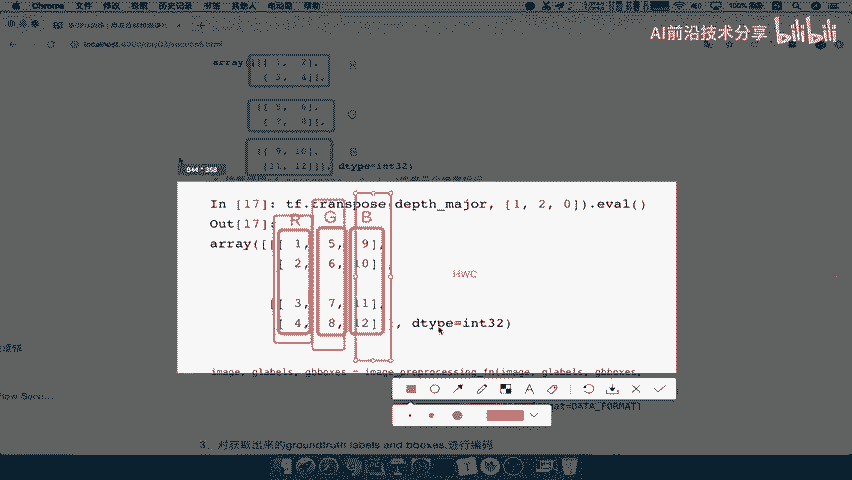
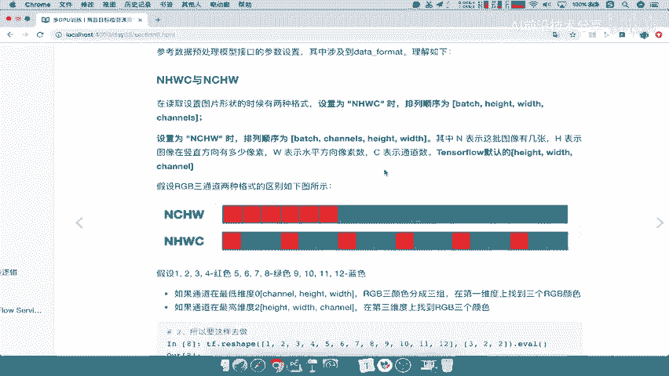

# P66：66.08_训练：2NHWC和NCHW介绍66 - AI前沿技术分享 - BV1PUmbYSEHm

那么NHWC和NCHW有什么区别呢。

在设置图片的时候啊，有两种格式可以进行一个选择，一个是NHWC，那么也就意味着你的数据格式将变成了，bench hate wise和channels，这分别代表什么意思啊，是不是批处理一共有多少个吧。

每个图片的长宽是不是固定的三百三百，然后以及那里的通道数啊，那如果你设置成NCHW，那你就反过来了，它会将channels放到第二个这样的维度，你的hit wiz在最后一个维度，那么这两个有什么区别呢。

TENSORFLOW默认的是使用KEWISE和channel。

注意了，它是使用第一种NHWC。

那么这两种格式的区别就在于，它的排列方式不一样，如果你是NHWC，那么可能是这样的一个排列方式，如果你是NCHW，它是这样一个排列方式，就是说我可以通过不同的这样的一个维度，可以获取我们的数据。

那什么意思呢，我们通过这个例子来理解啊。

比方说1234代表红色，5678代表绿色，九十十一十二代表蓝色，那么我们来看，如果你是第二种NANWNCHW啊，这个地方是NCHWNCHW，那你呢你的这个channel在哪个维度，是不是在第一个维度。

我们的N就直接忽略啊CHW第一个维度，那么RGB3个颜色会分成三组，你可以将这个三维的数据，在第一维度上找到三个RGB颜色，注意这一句话，你可以在第一个维度找到RGB颜色，然后如果你是在这种方式定义的。

那你就是HWC吧，那么你可以在第三个，也是最后一个维度上找到RGB颜色，这个维度什么意思呢，就是你数组的第一维。

第二维，第三维，那所以我们来看什么意思呢，如果我们定义的这样的一个数数组啊。

我们来看这个数组，就是以我们的NCA，或者说我们的这样一个NCHW啊，NCHW的，所以呢我们在这写一下，写一下NCHW，那我们说从第一个维度，三维数组来表示，三维数组的第一个维度在哪里啊。

是不是这个维度哎，这个维度找到R这个维度，找到G这个维度找到B是不是三个通道啊，能理解什么意思吗，也就是说你数组是不是这第一位的，这是不是一个三维数组啊，我们在这里展示的是一个三维数组吧，那第一维度。

第一维度，第一维度的三个地方找到RGB，然后你如果第二维度应该是什么，第二维度是不是这个是第二维度啊，哎这个是第二位的，那么如果说你是NHWC的，也就是HWC的，那你可以通过第三个维度。

三维数组的第三维度呢分别是这样，一列一列的哎，一列一列的，这才是第三维度，1234是不是R5678，是不是七九十十一十二，是不是B啊。

好，那么这个所以呢就是我们在这个处理的时候呢，默认会使用tensorflow or默认的hit wiz以及channel，这种格式去提供在我们的预处理当中能理解吧，他就按这种格式读取，把这个进行排列啊。

把这些像素进行排列，然后去进行处理，能理解吧，所以这是我对于NCHW和NHWC啊。

