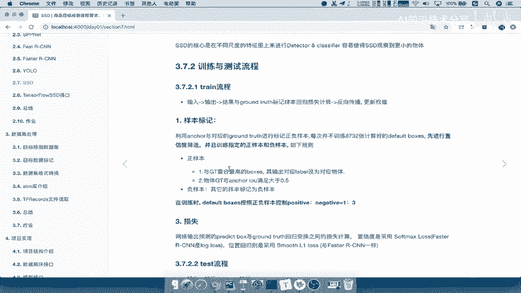

# P67：67.09_训练：2对anchors进行正负样本标记67 - AI前沿技术分享 - BV1PUmbYSEHm

那么刚才我们这样的一个格式讲完之后呢，我们接着来继续往后看，我们获取出来这个数据对吧，包括image已经处理完了，包括你的gt box啊，你的这样的一个真实的目标值，那我们想接下来再继续处理什么呢。

那么说输入到网络当中，你的真实值是不是你的图片数据，以及你的目标标签标记吧，那所以接下来我们要做的就是对原始的gt哎，choose进行啊标记，或者说应该是对ankle box进行标记啊。

Uncle boxes，进行一个正负样本标记，那注意啊，我们这里进行正负样本标记，是为了得到我们的目标值吧，哎得到目标值，那么这里的标记我们要使用的函数呢，在我们的SSD net网络当中啊。

可以去进行一个这样的一个编码。

就利用gt truth，就相当于g label和g box的意思啊，进行编码，那么基因编码用到的这个函数在这里，Ssd net b boxes in code，将你的目标JY的这个真实的啊。

图片当中有哪些类别，有哪些物体以及物体的边框，还有你网络当中的b box是不是一一对应的计算，I o u，然后使得每一个angle box有一个目标的对应的吧。

所以我们把这个函数复制过来，那我们g labels呢就是我们前面说了啊，这样的一个，这个我们目标的一个物体的类别的数字g boxes，它的宽边框，那么我们来看啊，这个东西编码之后返回什么东西。

也就是说编码之后相当于是标记之后，返回的东西是什么，我们说你在SSD网络训练，网络训练你是不是应该有一个预测值，还有一个目标值之间进行一个损失计算吧，预测值我们SSD网络的预测值是什么。

是不是它应该有一个boxes啊，有一个我们的这样的一个类别吧，你预测的类别以及你物体的位置吧，还有你物体的类别概率吧，是不是有个概率啊，所以我们这个目标值返回的值。

应该是跟我们SSD网络当中的这个值是一样的，我们详情来看一下我们的模型接口当中，SSD网络当中大家看到也就是这几个东西。

因为我们网络预测的这个东西要进行与真实值。

gt跟anchor box进行一一对应的进行标记。

也就相当于是啊，假如说我们现在有8000啊，732个anchor，那么GANCHOR怎么去计算损失呢，它预测出来anchor怎么样呢，那我就要去得到得到8732个。

与这样的一个gt对应的标记的anchor，标记的啊，anchor能理解什么意思吧，也就是说那相当于把gt的数量变多了啊。

我们的这个IOU计算IOU当中啊。

比如说你会设置为一零等等，你就利用IOU去进行设置吧。

好这个我们之前呢详细去说过啊，样本在训练的时候也要进行标记，那么返回的值就是这几个啊。

我们几个值，那也就是说我们返回的，返回到我们的GPU的训练的这样的一个模块当中，好，那么它返回值呢就这三个东西，就是你的目标类别以及我们的目标，这样的一个位置，真正的位置以及你标记的目标值。

它是真正的是一是正样本还是负样本嘛。

啊所以呢我们把这三个值复制过来，那么我们分别解释一下这三个值的一个意义，g labels啊，目标类别，目标类别的这样的一个编码，然后呢我们的GLOGZATION呢是啊。

目标类别的真实位置以及g scores，哎就是我们的这个目标结果相当于这里的，相当于是你的一个分数吧，相当于你的一个概率值对吧，我们或者说是一个概率值，但是呢我们标记的时候呢。

它应该就是是否为是否是正负样本吧，正负样本好，那么这就是我们获取的anchor box的一个，这样的一个值了进行啊，gt growth的一个编码编码之后，哎，它会有这样的一个目标代码好。

