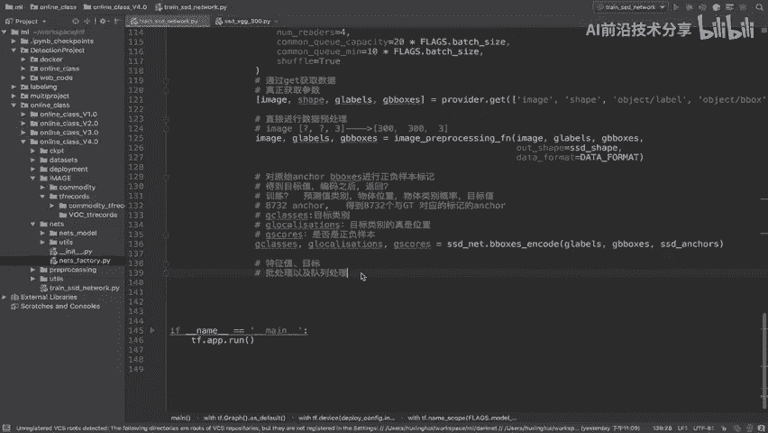
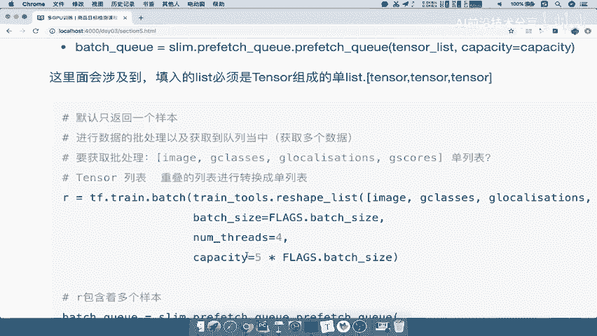

# P68：68.10_训练：2批处理获取以及数据形状变换68 - AI前沿技术分享 - BV1PUmbYSEHm

好，那么我们的这个图片信息，以及他的这样的一个标签标签啊。

正负样本的标记已经处理好了，那么接下来我们该做什么呢，看到第四步provider呢，默认啊读取的是单个样本啊，这一定要记清楚啊，那所以呢我们在一般在训练的时候呢，肯定会提供多多个样本去进行处理吧。

所以我们接下来要做的事情就是批处理啊，通过啊我们的批处理批处理，以及我们的这个队列队列处理，那么我们处理好的这些图片数据，和我们的目这个标签值对吧，相当于是我们的这个特征值和目标值，都处理完成了。

特征值还有目标值，那我们说批处理的话，第一个批处理。

我们在TENSORFLOW当中使用的是一个叫TTF，0train点bench的这样的一个函数，来看到这里，半截函数，它第一个参数呢，就是提供一个你的这样的一个列表。

这个列表呢是你的tensor值组成的一个列表，注意了，它是一个包含tensor的列表，以及后面这几个参数。

那我们把这个函数呢复制到这里来，我们来解释一下TENSLIST它的一个参数的作用，就呃它的一个参数的要求，是tensor组成的一个列表，那么类似于这个样子的啊，Tensor，然后呢tensor。

那么注意它是必须要求是这种单个的一个特色，一个特色组成的列表好，然后呢bench size就是你批处理的大小，那这个我们已经前面指定过它的bench size了吧。

啊我们默认使用32个nthrise capacity啊，这些都不用说了，那么我们接下来啊我们在这里TF点train，点bench tensor list，我们想要这个列表是一个装tensor的。

那我们想我们有哪些东西是需要去批处理的，数据呢，我们哪些数据需要批处理，首先图片的这样的一个image参数，数据需不需要处理啊，肯定是需要的，那所以我们把它image放到这里面来。

然后呢以及我们的g class，然后我们的g localization都是我们处理之后的啊，g scores好，那我们想一下g classes g logalize。

LOGALIZATION和g cos到底是不是一个tensor呢，哎那么这样的话呢，我们首先来在这里先打印一下，来看一下它到底是不是一个特色，好我们打印一个g class就OK了啊。

g class和g log zation吧，好我们打印两个先看一下，那我们要打印的话呢，就要去运行我们的程序，运行程序的话，注意一定要在运行的时候，提供我们的数据集目录。

data size的一个name，以及我们的model name是不是都要提供啊，好以及你的train test好。

那我们在这里呢新建一个终端，好那我在这里新建终端呢，进入我们的这样一个目录啊，然后呢进入这个online，然后呢我们的online v4。0好，那么我们首先进入下这个虚拟环境当中。

那么接下来你要去运行我们的train，这样的一个代码，首先来提供哪些参数，目前来讲啊，我们要提供杠杠SDR对吧，哎杠杠Z的set d r等于这个目录呢。

我们在当前文件夹的image下面来看到，是不是当前文件夹的image下面的TF，Recorcommodity。

TFREX吧，所以我们把这里的这个名字呢，我们直接拷贝一下好，那我们在这里指定是TFRECOR，DS下面的community tf recor好。

这是一个目录，然后接着要指定就是你的数据集的一个名字吧，是不是community哎这样的一个2018啊，所以杠杠我们的DATASET复制过来啊。

应该是DATASET内，那所以呢我们把这个删除掉，Dataset name，dataset name等于什么呢，COMODITY杠2018，接着我们的train or test。

指定一下我们是在训练还是在测试，然后最后我们还有一个叫model name。

其他这几个参数我们就不用了啊，这几个参数都有默认值对吧。

那我们的model name杠杠model name等于模型名字，我们说了叫什么SSSSSD啊，SSD杠VGG杠，我们的300能理解吧啊就是这样的一个值，那所以我们接下来运行这段代码，看到啊，运行。

那么这如果运行成功，他会把我们的网络参数给打印出来吧。

以及我们训练文件夹的参数好，这样我们就运行成功了，重点来关注我们打印出来的是什么结果，来看到我们打印哪几个分数呀，是不是一个是g class，还有一个叫我们的g localization吧。

我们来看打印出来是什么，看到这个地方它打印出来是两个结果，一个是第一个是不是一个列表，看到这个列表里面的元素，是不是有很多个tensor，是不是有很多tens，那注意了，这个列表有几个tensor了。

表一个两个三个以及第四个，然后呢我们的第五个和第六个，它一共包含了六个，就是说g classes里面就包含了六个tensor，然后GLOGZATION也是一样，也是一个列表好，那么我们来看要求。

在这里我们打印出来的是我们的这个这个class，本身是一个列表，它也本身一个列表好，如果我们在这里想转换的时候，我们填进去的是什么，是不是类似于这样的一个形式，一个列表装进去。

image是一个tensor，注意image肯定是一个tensor，然后呢g class又是一个列表，里面有六个元素，然后呢g location又是六个，然后呢这个g cos又是六个，为什么是六个。

因为我们的网络是不是有六个节点啊，六个节点要做相应的预测处理的吧，好，那你看一下这个东西，符不符合我们一个tensor的这样的一个，list的要求不符合，所以我们要把这样的一个嵌套的列表。

我们在这写上欠套的列表，要转换成一个单列表形式。

所以我们在这里要用到一个工具，就是啊叫做train tools，里面的有一个叫啊train啊，reshape啊，我们来看一下叫做reshape list，Train tooth。

Reshape list，将我们的这个列表，重叠的列表转换成一个单列表的形式，所以我们将这个列表传进去好，这是我们的第一个参数啊，那么接着我们第二个参数就是bench size。

所以呢我们把bench size等于flex点bench size填进来，以及我们将number rise指定一下啊，我们默认指定四个，还有我们这个等于号啊，还有我们的capacity啊。

你的这个队列的大小，这个对角大小呢我们可以随意指定啊，只要比这个bench size大就行了，好所以我们这里比如说就按照他这样来吧。

哎我们指定一个五倍的batch size，所以我这里最后呢返回的是一个，将这一个里面转换成单个元素组成的，这样的一个列表好，那么我们这里来看到已经打，已经返回了一个R值。

我们来打印一下这个R值到底是什么，好我们返回的这个R值，我们同样再来去运行一下我们的这个代码，好我们的代码呢正在运行。

看下它打印的结果，我们来看一下bench之后P处理的结果，来看到我们的bench size多少，是不是，你看结果就是如果一共有32张图片嘛，是不是你一共获取了32张图图，不是一张图片了。

这里是不是一张图片好，然后再仔细观察它的形式，它的列表形式是不是在这里，我们的所有数据是不是包含在一个列表当中了，是不是一共应该有多少个数据，看了一个多少数据，一个image加上六个class。

六个LOGZATION，六个scores，是不是一个19个数据啊，所以我们的R它应该是一个返回的，R应该是一个19个tensor组成的这一调，记清楚啊，组成的一个列表，所以呢我们想要做的就是。

在这里填进去的时候啊，一定是单个列表，而不是啊这样的一个列表重合的嵌套的结果好，那么这样的话呢我们就相当于批处理完成了。

