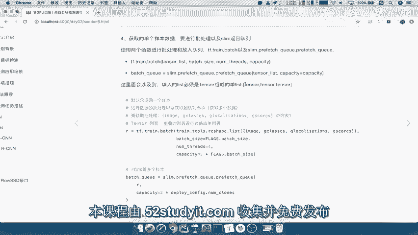
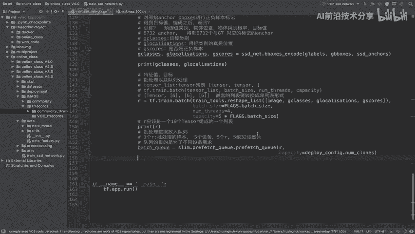
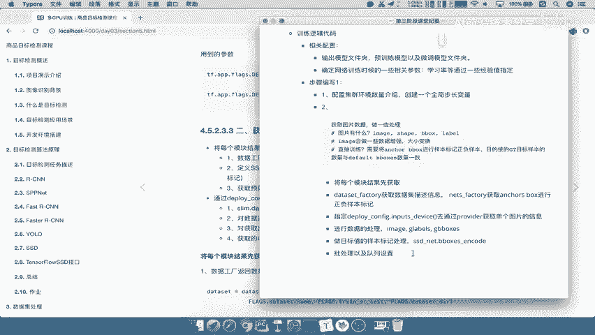

# P69：69.11_训练：2队列设置69 - AI前沿技术分享 - BV1PUmbYSEHm

那么批处理之后呢，我们的这个数据呢，就从一个样本变成多个样本了，所以接下来我们要做的事情，就是在我们这个后面模型再去读取，获取我们的这些数据的时候呢，啊他去计算损失啊，输入到模型当中。

计算它需要一个队列，那就是说slam呢会默认提供这种队列的机制，来将我们的批处理数据放到队列当中。

那我们来看P队列的这样的一个函数呢，叫做这个PREFRESH啊，可以把这样的一个数据，你的ten色列表放到我们这里面来，然后以及你的这个队列的一个啊大小，那么这个东西怎么用呢。

tensor list的还是跟刚才一样的，你放入进去的这样的一个呃，你的tensor必须用是单列表形式，但我们看一下我们刚才print r打印出来的，这个。

是不是所有的tensor变成了一个单列表的形式，所以我们的是不是可以，直接放到我们的这个pre fresh，对吧好，那所以我们在这里直接复制过来，那我们在这里啊进行进行啊，放入队列啊，批处理数据。

放入队列，那我们通过这个函数tensor list，我们直接传一个R过去就行了，注意它必须得是tensor组成的一个列表，那么capacity呢我们在这里可以提供一个零，想要这个队列有多大。

那么我们想队列什么意思呢，就是说将一个R放到队列当中，你想一个R1个R翻进去，那么这个R有什么啊，有我们一共有32个样本吧，或者说这个批处理的样本，那我们想一想这个队列读目的是什么呢。

为什么有了一个这样的一个批处理，又要有一个队列机制呢，那主要是队列，的目的是啊，或者是为了啊为了这样的一个不同，你的这个设备是不是有很多个，你每个设备是不是都要传一些数据进去。

那所以我们为了不同的设备需求，比如说我这里现在有五个设备，五个设备，那么你每个设备都需要一个R，也就是说一共批处理的样本对吧，你的设备一共就要五个对吧，五个R，五个R就相当于是五个这样的一个类似的啊。

我们五个，五组32张图片，是不是五组32张图片，然后每一组呢，我们会给它一个这样的一个批次处理，能理解吧，所以呢在这个地方我们capacity一般选择呢，我们可以选择大一些，比如说你有多少个设备。

设备数量在哪里获取，在我们的non clouds，那所以我们称之啊，之所以在这里呢，我们可以去获取deployment configure对吧，我们可以从通过这个获取，当然你也可以通过前面的参数获取啊。

deployment configure里面就有NCS，那么我们返回的就是你的这样的一个队列结果，bench queen q q u e u e好，那么这样的话呢，bench queen里面有五个R吧。

哎等于五个啊，好那么这是我们的这个结果，我们把这个格式调一下，来我们接着当我们放入队列之后，取出队列数据呢。

其实我们这一个终极的这样目的啊已经做完了，也就是说第一部分来看到这里，我们第一部分获取网络对接数据，以及处理样本的gt标记，哎已经结束了啊，那所以呢我们最后呢来总结一下，这这个相关的步骤。

那么我们这个在第二步当中，我们要去给所有的这些模块啊，单独的这些数据呀，规范信息等等去取出来，取出来之后，我们的这些函数，我们都可以在我们的指定设备当中去进行，取出来吧。

所以呢我们在指定input device啊，这个东西非常重要，我们必须指定CPU的这样的一个设备，接下来就是指定这样的一个设备，去通过通过我们的什么provider去获取吧。

provider获取出来的哎，通过get获取单个图片的是信息，通过provider获取单个图片的信息，那么这样的话呢，我们接着呢就可以去把这个单个图片进行，进行预处理，进行数据的处理，数据的处理。

然后呢这个处理结束之后，主要是对image进行处理，那么它返回的image label g labels和GB box，我们在这里粘贴到粘贴为文本，那么这三个东西我们说了，你要去做一个啊目标值的标记。

做目标值的标记，样本标记处理，也就告诉你哪些样本是好的，哪些样本是坏的吧，啊所以我们需要建立一个工具叫做SSD net啊，b boxes encoder好，当我们这些数据都处理之后。

那我们就需要去进行哎批处理，批处理以及D队列以及队列设置好，所以呢这就是我们所说的，在第二步当中所要去做的事情，好。

