# P71：71.13_训练：5总损失计算与变量平均梯度计算6训练配置71 - AI前沿技术分享 - BV1PUmbYSEHm

那么接下来我们就要到第五步了，配置好基本的学习率优化器，我们就要去真正的让我们的设备去进行，优化了吧，那这个优化我们说了。

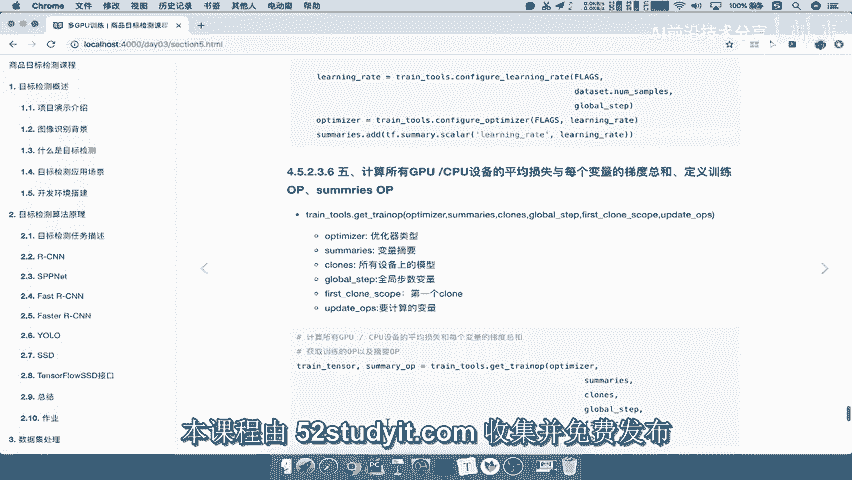

在这张图当中，是不是还是使用GPU设备去进行优化，它是真正的去进行计算，我们的设备的啊，其真正的去进行一个计算。

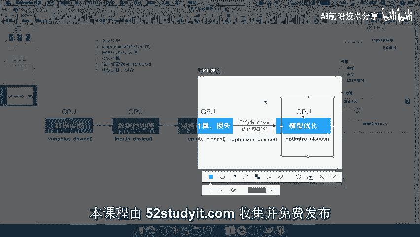

所以我们在这里所要用的这一个设备，肯定还是一样，是我们的GPU，那所以在这里我们直接也是通过一个函数，叫train tools。

Get a train op，这个get traob呢是干什么的，获取我们的训练的OP以及我们的摘要OP，获取这两个我们会添加到训练里面去就OK了，那这里面所做的事情是什么呢，它会计算每个设备。

平均损失和每个变量的梯度总和，我们要优化是不是需要这些东西哎，所以我质量这些设备的一个运算结果，那么我们还要去返回定义序列的这些OP。

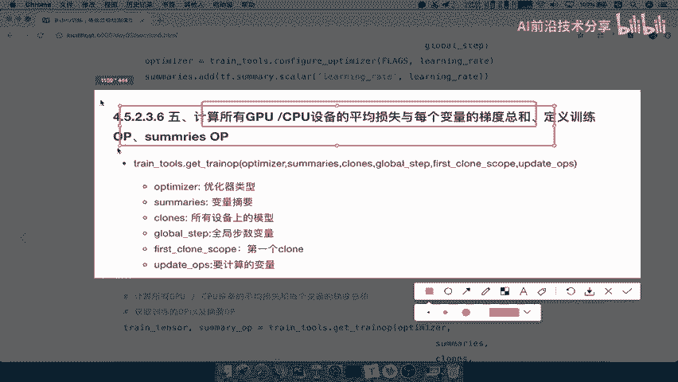

返回我们最终最后一步，那么所以在这里，我们只需要关注这里面的参数是哪些就OK了。

我们来简单看一下optimizer啊，你的优化器类型，你的summary，你的clothes，所有的设备是不是所有设备都要去参与计算，然后你的全局部署，你的第一个设备观察结果。

主要是观察第一个设备的损失就大小，然后呢我们所有要更新的API，所以也就是说更新的这个变量啊，所有要更新的变量，所以要更新的变量呢，就是意思是说这些变量我都是要计算梯度的。

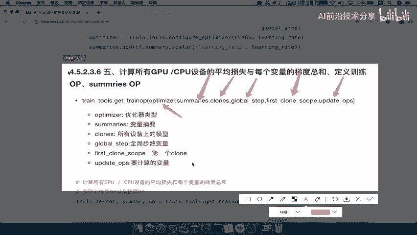

然后反向传播进行运算嘛，好那所以我们把这个函数呢拿过来，直接从这里复制啊。

第五步我们要去啊，计算不所有设备的总损失以及以及什么呢，平均损失啊，以及每个变量的梯度总和，损失以及每个的梯度总和啊，那么我们在这里呢复制一下我们的这个函数，那么这个函数呢返回值注意了。

这些值呢我们名称都已经是对的啊，那返回两个东西，一个是train o p，这就是你要训练的那个OP吧，以及我们的summary scar OP，这两个OP都要去获取的，然后我们将格式进行调整。

好那么我们来看一下返回的这两个东西，就是我们所需要的啦。

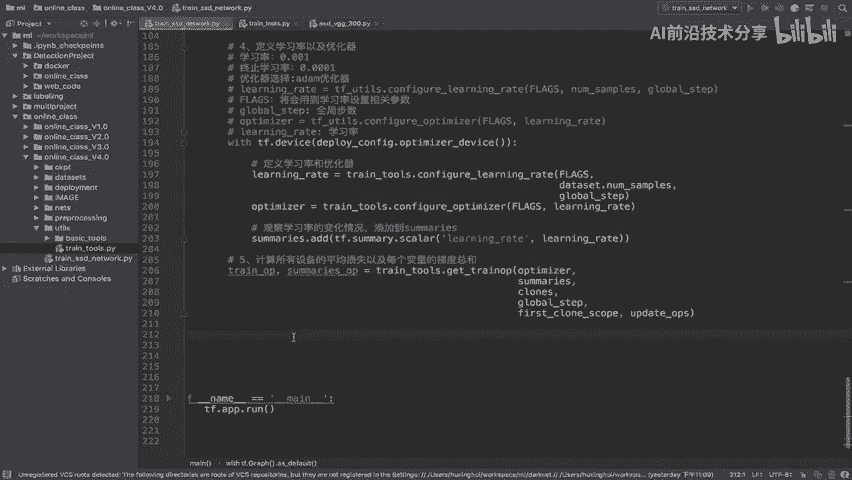

它计算这个设备，那所以最后一步就是通过这两个东西，我要去进行绘画，开启我们的绘画，然后通过配置绘画的相关参数，来进行进行一个训练，那所以最后一步就是使用slam点，learning点train就OK了。

那么在train当中需要指定什么东西呢，有一些比如说训练最大的部署，我们一定一共要训练几万步，几10万步，以及你训练输出的模型目录，以及我们预训练，也就是说我们预训练已经训练的一些参数，在哪里。

什么意思啊。

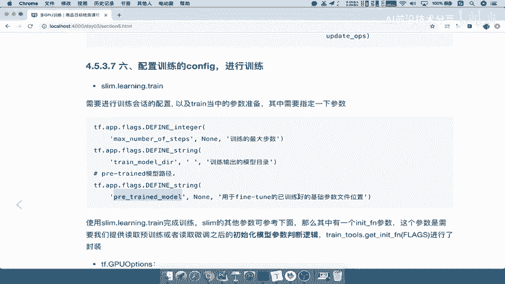

就是在我们之前提到这里，我们训练输出的文件是不是在FINTURNING。

而我们的预训练是不是，我们的这个在别人的基础上训练的结果好，所以呢我们在这先把这些参数放到这里，当然这个参数怎么来的，都是通过什么啊，都是通过我们的训练啊，训练相关参数放到这里好。

那么通过我们的这个train啊，train得来的，那么所以我们要先配置我们的CONFIG，然后呢创建我们的saver，在直接返回我们的training就OK了，直接在这里进行一个train就OK了。

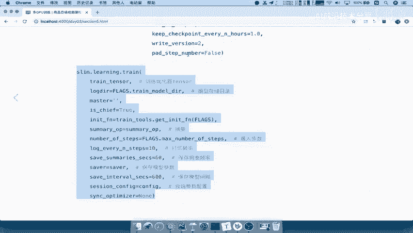

所以我们直接把最后啊，最后一个拿来过就行了吧，这里面参数这么多，其实我们就直接看参数怎么传就行了吧对吧，最后我们就是第五步，第六步，那么我们去进行进行会话训练，直接进行训练了，那么在这返返回。

那么train tensor，就是我们要训练优化器的这样的一个tensor，这个tensor在哪里呢，就是我们的train OP啊，就是说train OP是这个东西，注意名字啊。

然后第二个log dir就是你模型存储到哪个目录，模型存储train model d r，我们来看一下有没有定义，刚才我们复制过来了，train model d r默认我们应该在哪里呢。

find turning能理解FINTURNING跟pre trade是区别吧，一个是基础，一个是我们的这样的一个函数，就是我们微调之后的第三个啊，我们不用去传，这也是我们的分布式。

然后呢is the sheep呢，就是说是否指定一个默认的啊，这个默认第一个设备，然后init funk，我们等下再说啊，这个我们先留着summary OP好，Summer，Is op。

我们通过这个指令以及你训练的最大步数，我们会在这个训练的时候指定一个最大步数，如果没有指定，它默认的就是一个none对吧，哎没有最大值分，你就一直训练啊，一直训练，我认为好了为止。

然后其他的包括你打印这个结果的频率，打印你这训练的之间一些变量值频率，以及我们保存模型的频率，保存这个摘要和保存模型的频率，还有我们的saver。

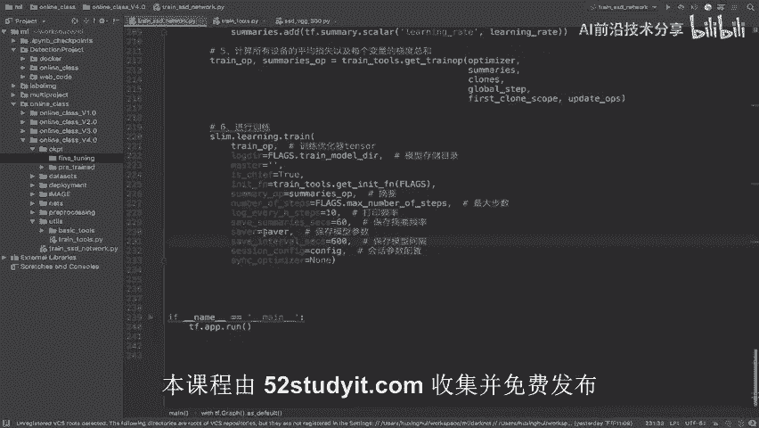

saver的话呢，我们就要去构建saver了，那么还有及绘画参数配置，那么这个都是通过这里面的进行配置了，能理解吧，好那么所以我们就要去配置configure和saver。

那我们在这里写上，配置configure，以及我们的saver configure怎么去配置呢，通过它会有一个这样的一个函数啊，叫做这个TF点CONFIGCONFIGPROTO，好提示了啊。

那么这个里面呢。

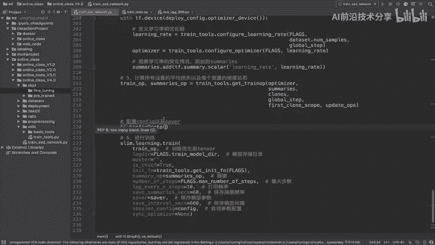

它会指定你需要去一些这个指定的一些参数，比如说log device placement。

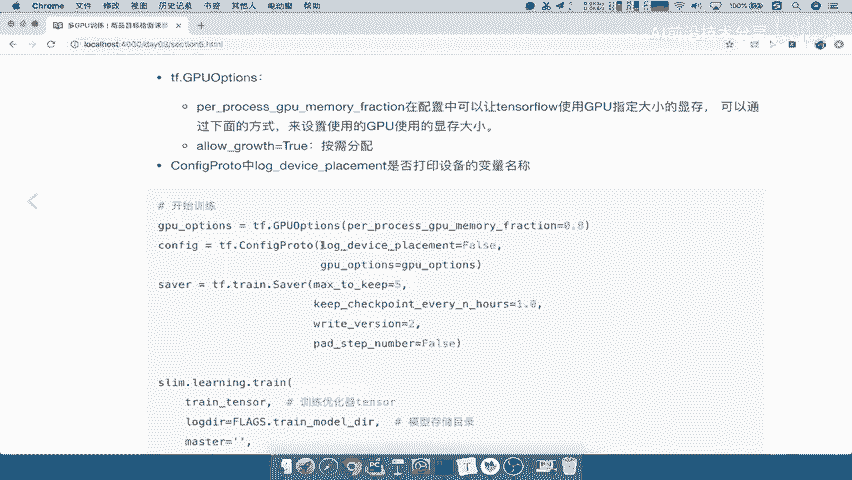

打不打印，每个变量所在的设备信息不打印啊，打印出来会非常多的啊，如果打印会非常多的东西出来，如果打印会打印，会有许多变量的设备信息出现，会太乱了啊，整导致整乱，然后你还可以干嘛呢。

你还可以直接你在训练的时候，你用GPU训练的，假如你是多个GPU，那怎么办，GPU有可能会爆满，那么我们可以指定GPU的使用参数，在这里指定一下，那么这个GPU指定参数。

我们就可以去通过哎配置一个GPU options，也就是说这个东西，那么这东西怎么配置呢，通过GPU options指定什么意思呢，每次每一个这样的一个进程，GPU去运行的时候，去计算的时候。

我们会使用的设备的内存大小为占80%，一旦我运行的时候计算的时候占80%，我就不占了，不占会用太多，不会把它占满，能理解吧，这样也是为你的这个设备考虑啊，好当然你这个可以选可不选啊，好，那么最后呢。

我们这个地方的返回就是一个COFIG，CONFIG啊，就是返回一个CONFIG，那我们来看一下，如果说我们这个CONFIG配置好了，还有个saver吧，哎这个CONFIG已经传到这了。

我们的saver saver的话就要去看你怎么去保存了，这个server里面，我们把这几个函数啊。

几个参数解释一下，saver啊，这个是保留默认，保留最近的一个啊，这最近的几个这个模型文件，以及你隔多少个这样的一个小时保存一次，这样的一个checkpoint，能理解吧，啊包括你写入的这样的一个啊。

每次就写入一个版本对吧，red version里你每次写成两个对吧，写入两个这样一个迭代版本好，那么这个呢我们就不看了啊，好那么这里面的这个参数呢可以啊，根据你自己的这个需求去选择，那么所以这样的话。

我们把整个训练过程就给定义结束了，能理解吧，好那么我们先把这一过程啊，把这个整个过程把这个地方总结一下，就是我们配置这个学习率等等这个地方，那么所以呢我们这一步呢，就是到了我们的第五步。

我们要去哎进行进行配置优化器，进行不同所有模型的损失平均值计算，然后我们的变量的梯度，变量的总梯度哎，总梯度这个梯度是要拿去进行返回，这个我们去进行优化的，对吧好，那么然后呢。

这个计算呢我们用到的函数就是这个东西啊，Train tools，点get a train OP，我们粘贴这来传文本，我们直接粘贴，然后呢对于这个函数来讲，我们这个里面接着就要去做的事情，返回好。

第六步就设计运行设置配置吧，设置配置以及那个saver去进行训练，那么这里面会涉及到哎一些参数啊，比如说我们的这里面值指代的这些参数，把这些参数拿过来，然后呢除了这个参数之外。

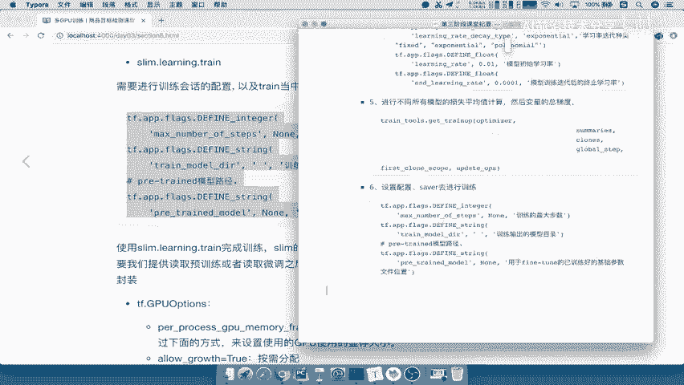

我们还会指定我们下面的这些打印频率啊等等，我们把这些都拿过去，注意这里面的参数好，那么我们刚才留了这样的一个叫get in need funk，这里做什么事情呢，Ini funk。

ini funk funk呢，我们这里只是写一下他的解释就OK了，它的作用就是，当你这个目录下面存在pre treat的时候，你是不是要先去加载这个pre treat，到我们的模型当中。

如果说你没有翻to对吧，你加载它，加载它之后，你训练出输出是不是在这里啊，如果我们有FIGHTERING，我们就不加载PRETRAIT了。

因为你的PREFIGHTERY是在PRETRAIT之后去训练的吧，所以你的参数会比它更加准确，适适应适用于这现在的一个数据集吧，所以它意思就是说初始化参数的逻辑，也就是说你预训练模型的读取。

和我们的这一个微调模型的判断和读取，包括这里面的读取过程吧，所以通过这个train tooth里面，也是还是在train tooth里面get in it funk啊，这个函数呢非常非常的重要。

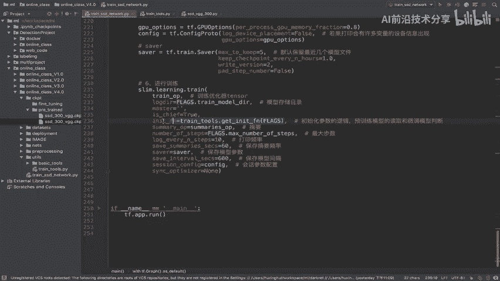

好，那么我们把这个呢也直接放到这里来，包括配置的一些参数能理解吧，好那这样的话呢，我们整个训练过程就定义结束了。

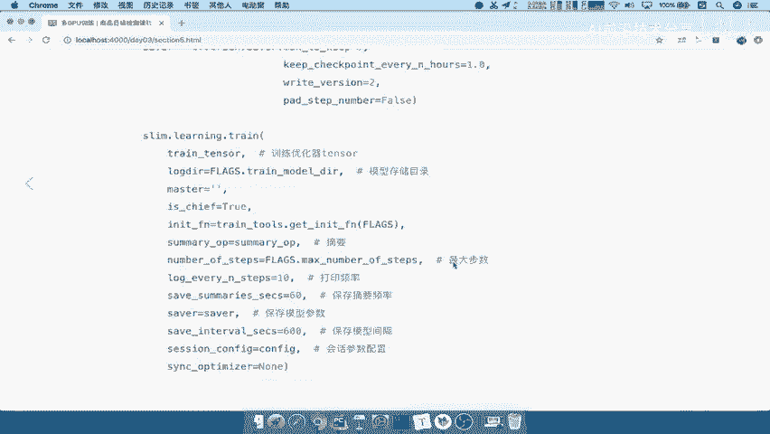