# P72：72.14_训练：训练流程总结72 - AI前沿技术分享 - BV1PUmbYSEHm

那么接下来呢我们就去运行一下，我们刚才所写的这样的一个代码过程，对吧好，那么我们直接啊，这里面呢因为我们这一代码的，包括这里面设置涉及到的这些参数呢，我们会跟之前我们定义的参数是一模一样的。

所以呢我们直接使用一开始，在这里咱们一开始是不是输入这个参数啊，包括我们的CKPT，包括我们保存的预训练的模型，和保存的这个微调模型都一样的，好，我们复制过来，包括在这里面指定的啊一些参数好。

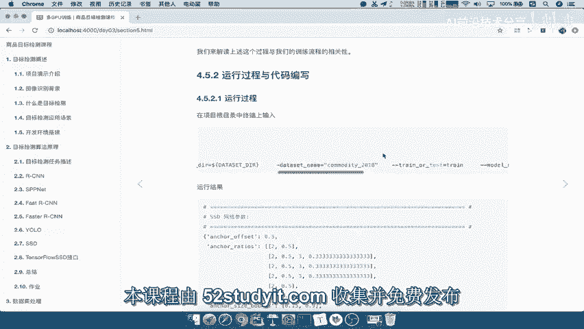

我们通过这个终端注意的是，在我们刚才写的这个代码，指的是这个目录文件夹，我们刚才是写的这个train SSD network吧，那么所以我在这里粘贴我们的这个啊，我们这刚才已经重新粘贴一遍啊。

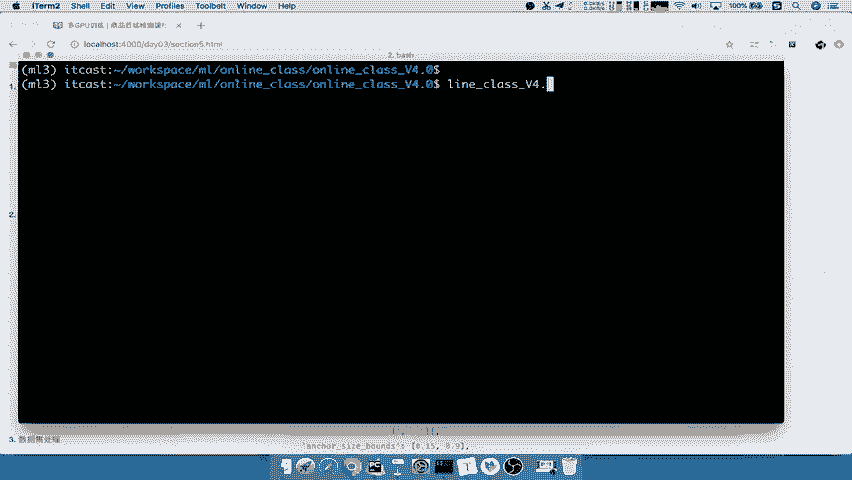

我们重新粘贴一遍好。

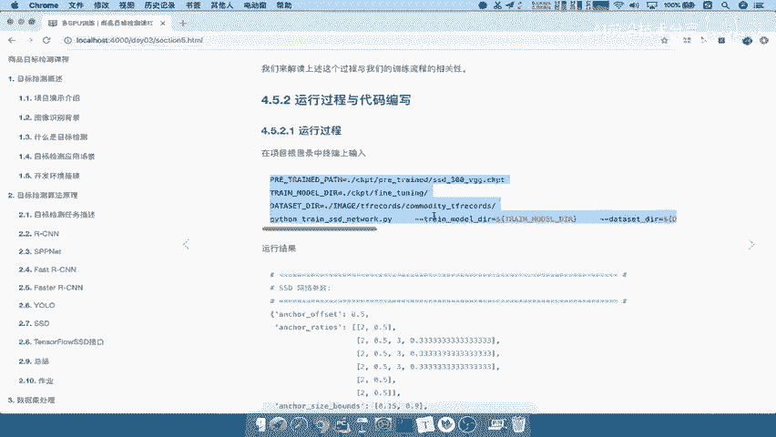

然后输入到这里面，那我们就要看它整个过程。

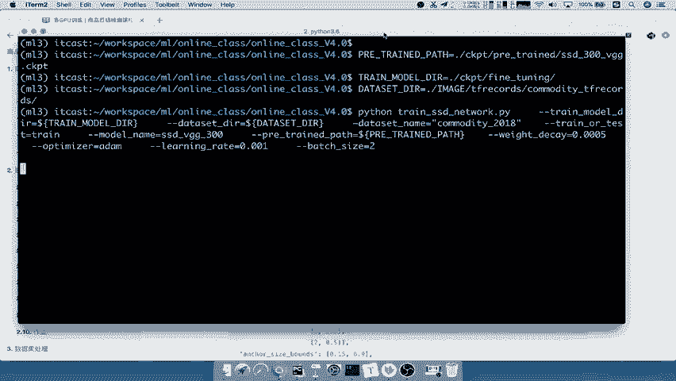

好我们刚才打印的这个tensor啊，我们把tensor给关闭，这个打印的地方给关闭啊，所以我们找到刚才在变化形状的地方吧，啊这个打印关闭，这个打印也进行关闭好，那么这个我们再重新运行一遍。

那我们看现在呢它已经运行成功了，读取了某个文件，每批次取了多少个数据，当然我们这里的数据呢，取得GD训练是取了两个啊，也就是说你不同的训练的时候啊，这个批次的数据是不一样的，这个你可以随意指定啊。

只要你的这个训练步数够，数据集够好，就差不多了，这样的话他就已经在训练了，那因为呢这个训练过程是很漫长的，这有可能你会训练一天两天，你用这个GPU去训练，能理解吧，所以我们在课堂当中呢。

我们训练出的模型效果哎呀不一定好，因为我们是线直接现成的去训练的吧，所以呢它效果肯定不是很好，以及呢我们这个我们key啊，这后面也是可以去使用一些，这个已经训练很久的，这些效果比较好的模型去读取。

那这样包括我们在在线使用的时候，我们使用的那个模型，就是训练了将近这样一个两天的时间啊，两三天的时间使用GPU啊，训练两三天的时间的，因为数据本身呢并不是很多，那么我们来看一下，当我们去训练好的时候呢。

我们看一下你的这个包括你的每每秒钟的步数，每秒走了几步，你看下每秒走的步数是非常非常小的，非常小了，因为我们计算过程太大了吧，导致你走的步数非常小，那么一旦你训练。

你这个CKPT当中的FINTURNING，就必定会存在我们的模型文件了，哪些是模型文件呢，这个是模型文件，然后呢另外一个我们就将这里打个箭头，这个呢是我们的summary的目录。

比如TENSORBOARD这样的一个观察的文件夹，那么所以我们想了，你这个既然你这个地方已经保存了，我们让它简单训练一下啊，好我们是不是就可以去再新建一个终端，我们进入到刚才的这个目录。

我们可以看到训练的时候的这个啊，占的内存呢是非常大的，work CD到work space，然后CD到我们的这个detection ml啊啊，CD到online CD的online。

然后CD2第四个版本的对吧好，那么在这里呢我们指定一下你的TENSORBOARD，这个目录啊，应该是在CKPD里面，是不是这个里面啊，然后我们进入fine turning，注意啊，进入这个目录。

我们首先打开我们的这个虚拟环境。

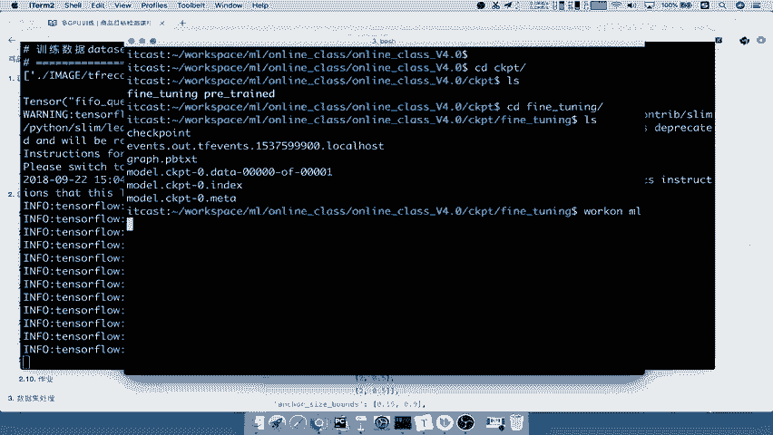

因为TENSORBOARD也是通过虚拟环境支持的，所以呢我在这里，tensor board杠杠，log d r r等于我们直接指定当前目录即可，它会默认寻找当前目录下的这个文件，能理解吧，好我们。

所以呢直接运行一下，当我们运行之后。

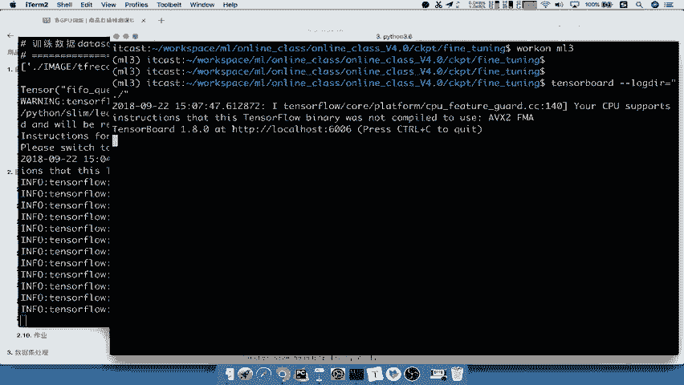

它会开启的这样的一个服务，那么所以我们就可以去这个后台，去观察我们的这个服务了，这个服务啊指的是我们当前这个训练的时候，他的一个进程，那么简单的看一下啊，这个是SCALA里面。

就是我们在这个这里面添加的，来看到哪添加的呢，在我们的这个地方添加了summary，对默认的一个设备上的变量进行了添加，包括glose step的一个观察全局的这样的步数哎，走了多少步。

然后呢你的这个这个地方的损失，还有你的学习率的一个变化啊，你的这个默认的这个地方打开了学习率好，然后呢包括你的image现在处理到哪一个image里面，它会进行的一些怎样的一个处理。

这是相当于你是原来标记了哪些这个目标值，它会进行一个什么，比如说反转对吧，翻转，然后进行一个其他的变化，颜色上的变化，那么图呢我们就不看了，因为这个本身这个模型呢就比较庞大。

它所以它这个图呢是非常非常庞大的，那我们就不用去看它这个图到底是什么意思，从哪里到哪里能理解吧，那我们还有的一些就是his grams，包括你对这个参数啊，模型当中的一些参数的变化。

这里每一个每一个这个节点上的一些参数啊，我们这打开的比较慢，打开每个节点上面的参数，它的一个变化情况，其实我们都不用去关心，我们主要关心的就是他的最后损失，这些参数，你看这些图也不一定能看得懂。

它到底是什么意思吧，所以呢一般都会去看这样一个啊，我们的完整的一个损失变化情况啊，就是这个损失来我们把它这个进行打开来，这呢就是我们整体的这样的一个损失变化情况，你看下这个损失。

目前来讲就是因为我们训练步数是不是很少啊，所以它会显得是一个上升的情况，应该一开始是比较高的啊，就这几次是比较高的，那后面慢慢的呢它可能会慢慢的变得啊。

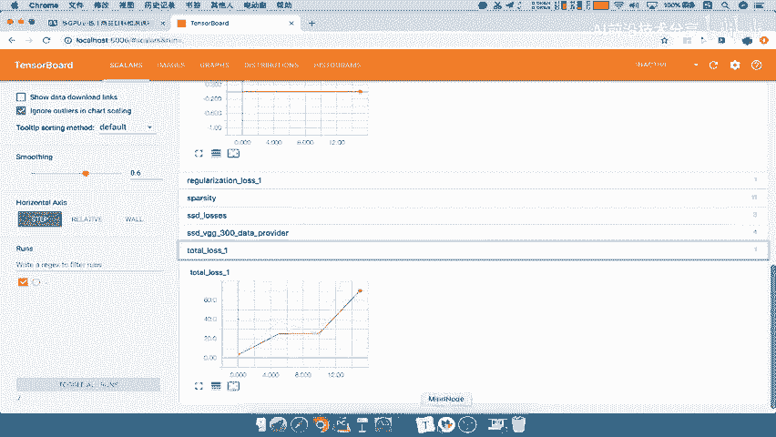

这你损失变得越来越低，包括你现在的损失都是很高吧，因为你最近来才学训练多少步啊，哎才19步而已，走了这么半天才走19步，所以这样的话我们这里就不去训练了啊，所以我们把这里过程给暂停了，到时候我们测试了。

用的时候呢，就拿一些现成的或者这个训练模型看一下，它的效果肯定是啊没有那个之前的效果好的好，包括这个TENSORBOARD呢我们也关闭了。

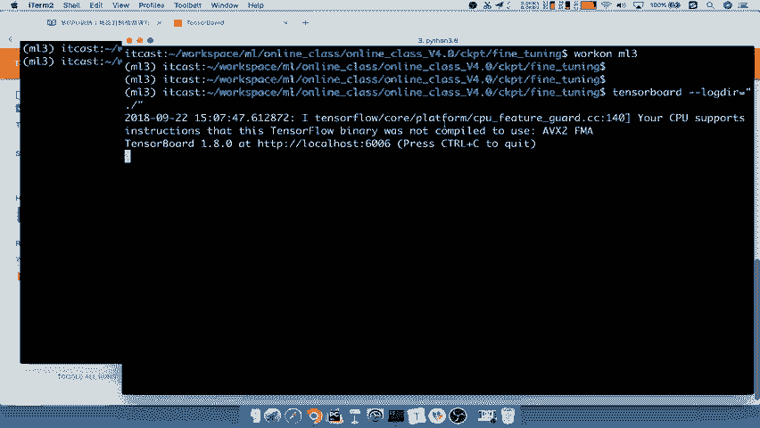

这个损失你想观察更多步数的，因为现在步数很少啊，所以呈现这样的一个形状，你步数多的话，就会呈现一个这样的一个曲线的形状了，那这个你自己去训练的时候添加观察，能理解吧，好我们把这个关闭了，好。

那么对于我们的训练过程就是这个样子了，训练出来的模型就是我们想要的结果了，这些就是我们想要的模模型，结果啊，除了这个疑问词，所以这个疑问词之外能理解吧，好，那所以最后呢。

我们按照这个流程来总结一下我们的东西，整个程序训练程序是不是训练的，这样的一个程序是比较复杂的，那么我们按照数据的这样的一个读取流程。

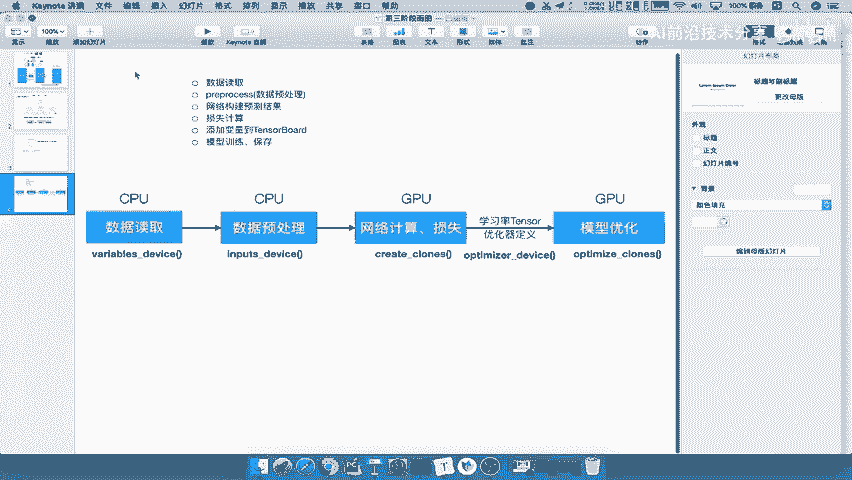

我们说了，首先我们第一步干嘛，第一步我们做的事情就是定义啊，定义设备吧，我们再整下定义设备以及你的全局步数，是不是在这一个什么variable device里面，第二步我们会获取数据，处理数据。

包括编码你的这个什么正负样本吧标记，那么接着你获取数据之后，我们会在所有的这一里面去进行损失计算吧，对吧，所以定义网络计算结果，还有你的损失结果，当然这是只是损失的一个操作。

然后呢以及我们会添加一些观察对吧，添加一些这个变量损失观察，最后我们要定义学习率，学习率以及我们的优化器，这个我们都是在optimizer device，在CPUCPUCPU这里是GPU操作。

然后优化的操作也是GPU当中，计算是这个每个设备计算，是每个设备计算损失对吧，然后呢会删加，然后呢每个变量计算梯度，计算梯度，然后呢，我们最终每一个设备，GPU计算出来的梯度会干嘛呢。

会传给我们的CPU，CPU统一的进行更新啊，CPU统一进行这样的一个变量值的更新，这个模型参数吧，模型参数的更新和损失更新吧，好那么你这这也是CPU所做的一个事情，好，那么这就是我们总结的在训练阶段。

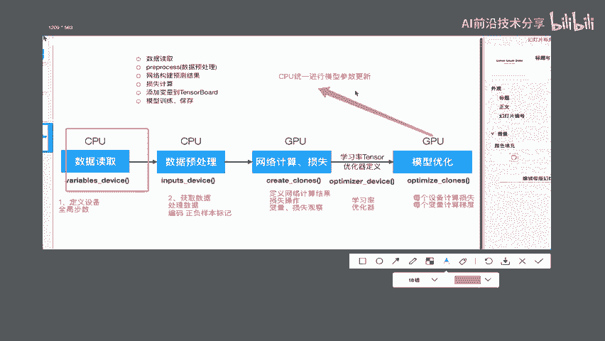

这一串代码所提到的这些步骤，每一步骤都在干什么好，我们保存一下，这也就是我们的训练总结。

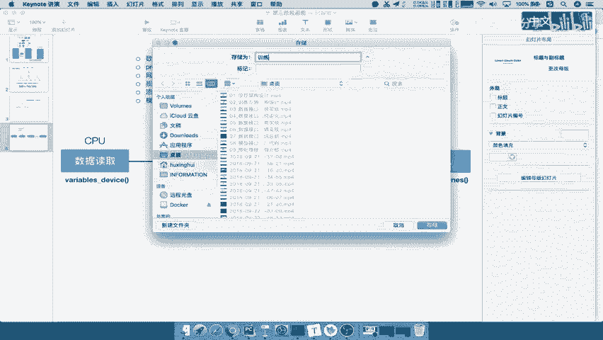