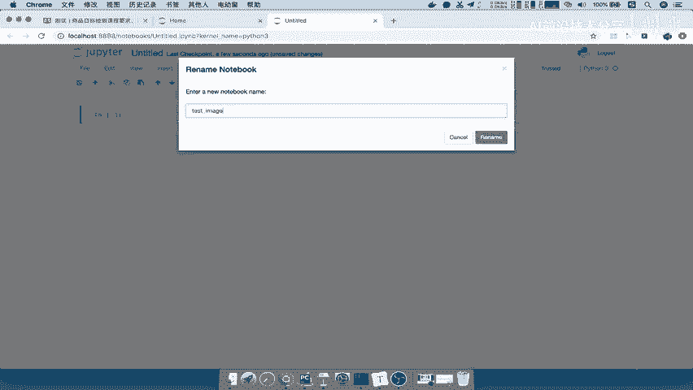
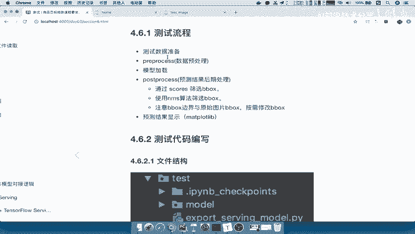

# P73：73.01_测试：测试流程介绍、代码73 - AI前沿技术分享 - BV1PUmbYSEHm

那么接下来呢我们就要去进行我们的这个训练，好的模型进行一个测试了，那么当然这个测试流程呢，其实跟训练流程很大多数还是相似的。

那我们来看一下此次建立一个学习目标呢，就是完成啊简单的一个测试，就看一下我们的学学习到了这个模型啊，怎么去加载，怎么去产生这样的一个预测结果，好以及预测结果怎么去处理。

那我们来看一下，首先看测试的流程，它是什么样的。

我们看到这里给了我们一个测试流程，第一步呢，我们准备我们的数据，是不是一张图片的输入进去啊，输入进去之后呢，我们要对这个图片进行处理，那么请问在这里的一个图片处理，跟我们训练有什么区别。

或者他们有什么不一样的地方，之前我们提到过吧，训练我们的处理，目的是为了提供，或者说进行一个数据增强的过程，那么我们测试的时候进行数据的一个处理，主要就是为了把图片只缩小到哎，或者说指定图片大小。

模型输入大小就OK了吧，哎只要进行一个reset就好了，那么这就是它的一个输入，那接下来我们就要去加载我们的模型以及模型，加载输入模型之后，数据预测结果出来，那你想你是不是要进行数据模型的一个。

后期的一个处理对吧，那这个处理就涉及到我们之前讲算法的时候，提到过了，你要通过score进行筛选，你要通过NM非极大抑制去筛选，以及我们需要将b box那些宽超过原图像面积的。

原图像大小的这些框进行缩放，或者说进行一个切割，那么整个这一套流程就是我们的后期处理啊，这是后期处理在训练当中有没有出现，训练当中并不需要后续处理，训练不需要后期处理好。

那么我们最终我们通过这样的一个MAD，power lib的这样工具去显示我们的图片，怎样的一个预测结果好。

这是我们的一个测试流程的总结，测试流程介绍，好那么我们怎么去做这个测试流程呢，那首先我们还是看一下我们的文件结构，我们会在我们的根目录下面，创建一个叫test目目录。

这个目录里面有存在啊很多的这个文件，那我们现在呢只要关注这两个东西，一个SSD notebook和一个visualization，这个呢是我们帮助显示的代码，来看这帮助显示的代码。

然后呢这个呢就是我们测试的一个流程代码，这里我们写上测试的啊，流程代码好，那么其中我们这个测试流程呢，选择在丘比特notebook里面去做，因为呢我们这个呃ching notebook呢。

其实方便于我们直接去一步一步的去输入图片，到一直到结果的一个显示，并且也方便in matt polive写这一个直接查看图片，结果好，那这是我们的一个文件结构测试。

文件结构组成好，那么所以呢我们就按照这个结构先建，把这个visualization拿过来对吧，以及我们的这个东西呢我们自己创建好。

那么所以呢我们在这里啊，在我们的online当中是有这样test文件的，所以我们进行哎重新复制一个版本的文件，我们命名成V5。0版本，那么我们新建一个文件夹啊，叫test，那么在这个test下面呢。

我们可以啊，可以把这个名字呢稍微改一下都可以好，那么我们把这个visualization呢先把它复制过来好，这复制过来，这是一个我们显示结果的，显示结果呢就一个函数，包括呢，这个里面通过使用这样的一个。

自定义的一个字典，然后在这里面显示相关字典的结果吧，这是对于我们这个训练的一个啊，商品数据集来说的好，那么我们来看一下，然后接着我们就要去使用这个sg notebook了。

那所以我们接着就要去进入notebook的环境。

那么我们在这里我们调整一下啊。

我们在这里新建一个窗口，那么这窗口它进入到我们的目录当中，CD到worker m l啊，然后呢CD到detection啊，应该是在点点CD到我们的online，这个是我们现在写的。

然后CD的online5。0，CD的online5。0好，那么进入这里之后呢，我们首先还是要建立进入每次大注意，进入我们的虚拟环境，虚拟环境当中，然后呢这个虚拟环境我们需要去啊。

直接用丘比特book notebook打开，那么这个打开我们就直接在test目录打开，能理解吧，因为我们就在这里面去做测试的，丘比特notebook NO t e b o o k好。

那么我们的notebook打开了，我在这里面新建一个这样的一个notebook文件。

那么这个文件呢我们称之为比如说这个predict，我们的，这个结果吧，Image，测试结结果吧，测试我们的image。

好建立一个文件，你看他的命名呢就叫做IPLYMDB了，好那么我们来看这个创建好之后呢，我们接着就要去理一下，我们这个流程到底怎么一步一步的去写了，那我们来看到首先呢对于这个代码来讲。

我们还是根据这样的一个流程去做啊，根据这样的流程去做，那么我们首先把我们这流程当中所需要用到的，这些模块先给导入进来，能理解啊，那所以呢我们这里面会用到很多，所以直接把这里面我们先复制过来。

然后再解释啊，我们把这个test image呢复制过来，那这里面的TENSORFLOW啊，non pie啊，PL啊，就是处理我们图片会读取的时候用，以及显示图片的时候用好，那么我们来运行一下。

那这里为什么要添加一个叫system，点什么append点点杠呢。

这为了让我们运行的这样的一个路径呢，会在我们的根目录，也就是说在这个目录径的上一节目录，也就是说在online这个目录运行，这样的话我就可以，因为我们要调用各个模块的一些处理模块吧。

所以呢我们需要调用处理模块，我们这写下解释啊，需要啊调用处理模块，我们运行以上级目录运行，那调用的这个包包的这个名字可以不变了对吧，那么我们在这里想想，我们需要用到哪些包啊，我们的需要用到哪些包。

来看到我们在这个流程当中。

首先PREPROCESSING，是不是要用到我们的测试的这样的一个处理，然后我们模型加载是不是要用到SSD net这样工厂，然后以及后期处理哎。

后期处理我们就不需要，不需要我们的这个工厂了，所以我们在这里测试的时候，需要需要用到，需要用到我们的这个处理预处理工程，还有我们的，还有我们的模型工程，好那所以我们就通过这两个呢。

把这两个工厂的一些库哎给导入进来好，那么这里面我们直接导入，包括我们的visualization对吧，还有我们的显示工具在这边进行导入，import一下visual alization。

好运行一下再运行好，那么接下来我们再看怎么去做，来我们就一步一步来了。

首先第一步我们说是不是你准备你的数据啊，在这里我们使用place加holder，placeholder加feed dig的形式就是TENSFLOW里面的，我们在运行的时候输入数据吧，哎运行输入数据。

运行输入数据的一个形式啊。

输入好，那所以呢我们在这里写上，我们使用啊FED杠dig tensorflow当中的啊，与这样的一个与place holder的形式啊，输入数据，运行时输入数据，好那么接下来第一步我们是不是要准备数据。

准备数据，我们应该准备一个占位符。

你想想在这里准备数据的占位符，应该准备什么样的一个数据占位符啊。

是不是要准备一个image啊，我们来看到我们准备一个image的占位符呢。

它就相当于是我们的一个输入数据的一个啊，代替代替者对吧，所以我们建立一个none none3，因为你任何测试数据的图片是不是都有，只能是这样一个闹闹的，或者说它长宽都不固定吧。

然后呢这个图片这个数据进去之后呢，我们直接获取我们的这样的一个工厂，工厂去进行处理，这我们的数据数据处理，这工厂得到我们的预处理的一个数据，那么一处理好的数据主要是形状的改变。

我们就会输入到我们这样的模型当中，然后我们模型直接net点计算计算我们的结果，然后最终我们对这个结果进行一个哎，开启会话运行的时候，我们处理这个结果就行了吧，哎所以呢这就是我们整个流程啊，注意啦。

就是网络输出输出之后，开启绘画运行输出的结果，输出的结果再进行我们的放工具的处理，然后再显示出来，我们的结果能理解吧，好那么这是我们整个一完整套的啊，一个这个这个完整的一个啊流程。

那首先我们第一个先把我们这个东西做好吧，所以我们自己去定义一个这样的一个啊。

第一步啊定义，定义数据输入图片数据的占位符，那么这里我们使用TF点place holder，placeholder呢，我们定义一个类型，就叫做INITUINT8的格式对吧，我们的shape指定什么呢。

哎直接300，这应该是问号啊，问号now和now以及三的这样的一个格式，这说对于我们来定义一个image guinput好，那么这个定义数据占位符之后，我们应该干嘛呀，哎数据数据输入到预处理工厂当中。

然后进行处理，得到结果能理解吧，那我所以现在要遇到预处理工厂里面的东西啊，preprocessing factory吧，那我在这里应该怎么去做，那所以我就直接啊PREPROCESSING。

这里应该是运行过了啊，preprocessing factory点。

那这个方法就是我们训练的里面的这个方法了。

我们直接看一下这个训练当中的方法是什么啊，我们可以直接这样吧，还是回到这个课件当中去讲吧，PREPROCESSING里面是不是有个getting processing啊，那所以我们在这里要调用它。

这里面要填的数据参数，还记得吗，是不是一个模型，SSD杠VGG杠300，这是我们的模型吗，以及我们要输入的这个模型的哎，它的是否是训练的这样的一个流程，那我们这里还是否是训练，不是吧。

所以我们这里is training等于false，不是训练流程，注意了，一定是false好，那么这个返回一个PREPROCESSING杠，FN等于这个，那么这是我们的预处理的工厂。

那么这个工厂是不是哪一个函数，请问它是现在它应该是哪一个函数，我们来回到这里，它应该在预处理当中，是不是代表着这个函数这个函数吧。

所以我们来看这个函数当中，需要输入什么图片的图片的一个image image，以及你的图片label b box诶，我们会发现你的email label b box有没有啊，你这就是一个测试图片。

没有吧，那没有的话，我们这个地方呢可以输入none，也可以输入none，这两个OSHAPE，你输出的时候它的形状是多大，那我们可以定义一个这样的一个形状，那以及我们的这个data format。

我们就不用指定了对吧，所以我们记住这个参数，一个image，一个NN，一个NN，然后呢一个out sh好。

所以呢我们直接调用我们的输入，就是image input，这个是这个大啊，这个全称的啊，Image input，然后呢以及我们的两个none，你以为你没有啊，测试图片没有，所以继续输入你的网络的形状。

那这个网络的，或者对你数据的这个图片的形状对吧，那我就定义一个数据形状吧，定义一个输出的形状，定义一个输出的形状，以元组表示，那么这个比如说叫net shape啊，也是网络的形状应都是一样，三百三百好。

那所以我在这里输入net shnet gsh，干shape啊，我们这个没有运行shape，那么然后呢我们最后一个参数就是data format，Data format，你这个输入呢默认都是NHWC啊。

但你如果想啊，那我们就啊再加一个吧，我们把这个参数都完整写上data杠，for mart等于NHWC对吧好，那我们把这个电流方from matt拿过来，那接着我们就来看它返回什么。

它返回一个images和labels b box。

这两个都没有对吧，所以接着还有最后一个叫b box image，它的一个值呢直接给你就是0011，那这个东西到底干什么的呢，它是在后续的NMS以及score过滤器使用。

那我们先就把这个值去进行一个接收就OK了，对吧，所以呢我们在这里返回了有我们的image的PRE结果，以及两个不要的结果，我们可以直接过滤吧，还有我们一个b box image啊。

就是这个东西相当于是我们image的，它的一个长宽的一个哎，以零一之间的表示对吧好，那么这样的话呢，我们数据预处理工厂就结束了，那么我们再来看继续往后看我们的这个步骤，数据返回的它是一个什么数据。

我们看一下in pre image pre，它是一个什么形状的image pre，是三维的一个形状，是三维形状，并且它转换之后之后形状变成什么了，是不是变成了三百三百三，是不是这样形状。

但是输入到网络的时候，我们要记住了，在基本上在所有的网络，卷积神经网络当中运算是需要四维的数据的，那你所以你必须把这个图片的形状转换成四维，那么因为输入卷积应该是卷积神经网络。

神经网络大多数要求四都是吧，要求都是四维的数据计算，所以你在这里呢需要进行一个维度的扩充对吧，扩充，那么维度的扩充，我们可以使用一个叫TF点expand demons，这个扩充呢第一个就是数据。

你要扩充哪一个数，哪一个图片，那么就是这个图片，然后呢你为它增加在哪个位置增加一个维度，那你直接在第一个维度增加，它是不是应该在这里增加一二对吧，哎所以应该是这样的一个形状。

应该是CTRLCCTRLV啊，这里呢还是三百三百变成这样好，那么它返回的就是一个啊，我们比如说image gu4D的这样的一个图片，好，我们来运行一下，这里呢我们看一下有问题。

就是data FA没有定义，那么运行一下再运行一下好没有问题，接下来来到第三步了，第三步接着怎么报数据。

已经准备好了吧，接着是不是，就是你从网络工厂当中去取出我们的数据吧。

哎那所以接下来要做的事情，就是取出网络工厂数据。

那么这里我们会取定义我们的网络工程，获取网络，然后定义里面的参数，注意了，一定要修改，它默认是21。

我们这里商品数据集是九能理解吧，然后呢在其中啊，我们通过这个参数初始化的一个网络，获取我们的这个SSD anchors，这个东西也是我们在后面要用的啊，那然后呢。

我们会直接用网络输入图片数据进行一个预测，那么在网络的这个地方，我们会多有一步骤叫做reuse，我们在TENSORFLOW当中，应该知道reuse的作用是什么。

繁殖如果我们创建一个新的variables Poke，我们会把它默认一开始为false，如果你下次再运行的时候，在notebook当中啊，运行的时候你会遇到再运行它这个值啊。

就是说这些变量网络当中的变量注意这一点啊，网络这当中的一些变量会存在这个内存当中，你再运行就会报错，也就是说一存在的话，你就不能为false了，你就要重用原来的这样的一个变量。

那这里添加的reuse我们一定要知道什么意思好，怎么去获取the reuse呢，我们直接先判断网络当中有没有去，定义网络SSD模型啊，并输出预测结果好。

那这里呢我们reuse的作用是reuse作用写上啊，在notebook当中运行，当中运行的时候，我们第一次创建新的变量就为false，但是我们一个原因就是，但是这个东西会，如果你下次再重复运行。

这个我们这个notebook当中的这个sell啊，注意了这个sell sell的话，那可能会保保留的啊，保留这些这些变量的值变量的命名，所以啊你再次运行的时候，就必须得选择重用了，选择重用这些命名。

因为已经存在内存当中了啊，没有消除，那么我们这里写上没有消除，所以你需要设置啊，reuse等于true，那所以我们在这里做了一个判断，如果你发现本地这个地方，本地已经有SSD net这个网络的名字了。

也就是这个名字，这个名字如果有了，那我说明我就不是none了吧，不是false了，那你就是true啊，就可以了，好这里就是我们写一下啊，那所以我们接下来在这里运行之后，我们接下来就要去哎网络工厂获取。

通常获取，首先net factory factory，net factory是不是在这里，它里面有个什么方法呀，叫做get network，那么指定get network呢，我们要指定它的名字。

SSD杠VGG杠300啊，跟这个名字是一样的，那返回的是一个类SSD杠class类，我们说了，对于这个类当中的参数，注意了这个网络类当中的参数，当中的这个参数有一个叫这个类别总数。

我们是不是在训练的时候已经指定了吧，训练的时候是不是指定将这个参数给replace。

成non cut减九，所以我们也要这一步骤，所以接下来这一步骤呢跟下面都是一样的了啊，我们先把这个呢复制到这里来，那么这个总数，因为我们当前是啊商品数据集的对吧，我们的商品数据集，所以是8+1。

注意网络当中为什么是8+1，这个一定要理解啊，你可以自己再去回去看一看，那然后呢我们这个SSD class的这个参数，我要去初始化网络对吧，初始化网络，初始化完了SSDPARAMAS。

点我们的直接啊直接输入进去吧，paramas class应该是class，然后呢输入SSD杠PARAMAS，然后呢返回一个网络SSD杠light，那么这个网络呢我们就可以去进行获取数据。

然后进行这个数据的这样的一个处理了，那所以我们接着就要去通过网络的net，或者一个方法吧获取结果，那么这个SSD net的方法怎么去获取网络结果呢。

我们这个在之前也提到的过啊。

我们直接看到nice里面吧，nice里面我们的SSD image里面有一个叫next的网络，这个呢就是直接定义网络，返回网络的这样的一个结果，能理解吧，哎它的这个net呢就传入你的输入数据就行了。

指定你是否是训练。

然后其他的就不用去进行一个输了，包括你的重用是否重用空间能理解吧，所以我们在这个地方通常会直接去定义啊，我们在这里定义一个格式，会建立通过我们的slim arguscope。

建议将我们的data format进行指定啊，如果说你没有指定data format，那这个网络当中会有很多指定你数据格式的啊，你的数据格式必须得在这个网络当中去指定，也就相当于啊。

我们在创建网络的时候要指定格式啊，使用啊，Slim，使用slam指定啊，公有参数，也就是在这个网络类下面，我们会有一些参数，什么意思呢。

来看到这里slim点arc scope呢，对于这个里面的网络，我们要指定一下它的所有很多函数要用到的，data from ma分up，也就是说我指定下面所有的很多函数，它有的公共的参数。

公共的参数就是fat t，我们把它全部指定这地方呢，就是因为它这个format呢肯定是会有的啊。

有这样的参数的，那with我们TF呃，应该是直接slam了点阿哥scope，然后呢对于阿格scope的话，我们直接指定SSD net点我们的这个阿哥scope，然后这1ux scope呢。

我们指定一下data format就OK了，等于我们的data format，这个data format就在前面对吧，那说明呢公有参数就是data format dnf map里面。

在这一个net函数里面有很多参数需要嗯，很多函数需要使用data fat好，那么接下来我们指定了这样的一个，公有的参数之后呢，我们直接SSD啊，干net点net。

我们第一个输入啊就是我们的图片数据image4D，然后我们的是否训练is training gun，应该直接t r a r n i n g is training等于false。

那么这个SSD net这个extrinity false之后呢，我们直接一个reduce是否重用传过来，通过这个值传过来就行了，好那么看网络的输出是什么，那么所以我们接着再来看网络的目输出。

那之前还是对于这个原来的这个接口啊。

网络的输出有这么几个，其实我们只要用到两个prediction和localization，一个是预测预测你的这个类别的概率，一个是我们每一个框的预测框的这样的一个。

什么位置吧，所以其他的就不用获取了，所以我们在这里获取predictions，以及我们的localization，LOCALISATIOS啊，Localizations，那么还有两个参数直接啊。

我们干给它忽略掉，好，那么这样的话我们相当于是网络已经定义好了，我们直接运行一下，我们看一下这个参数，is training啊，我们的这个位置，Follow key words，有问题啊。

reduce啊，reduce等于reduce，我们把这个参数给填上好，那我看这样的话，我们网络工程已经定义完了，那么这样的话我们先啊把这个地方呢，我们先暂停到这里。

那这样的话我们相当于是把完整的从输入的图，这个数据图片经过预处理，经过我们的网络得到输出结果了吧。

