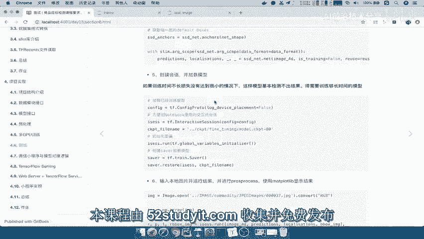
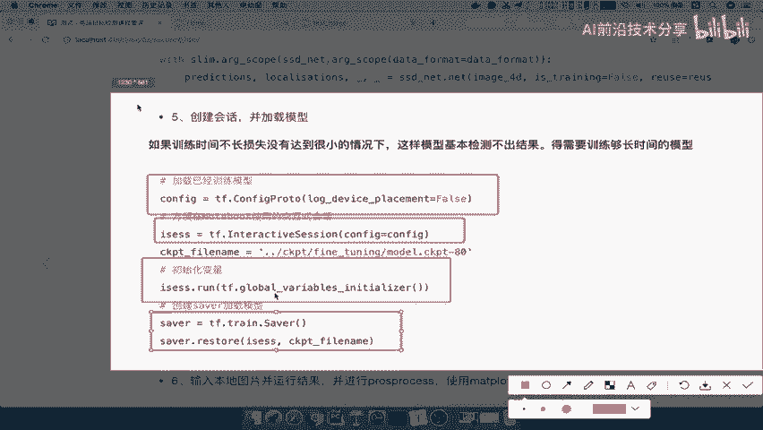
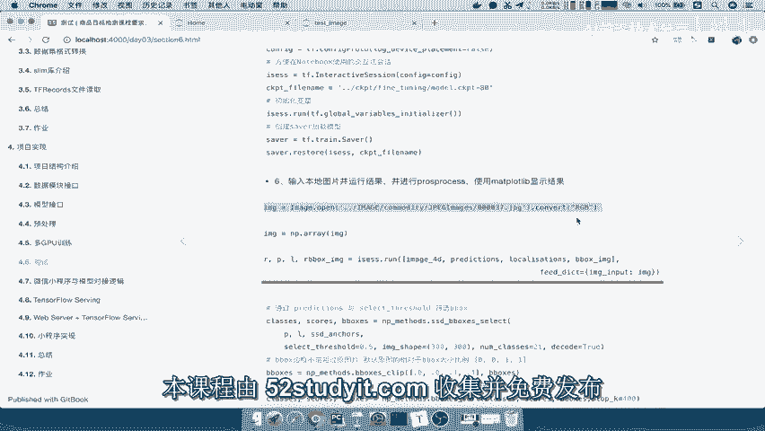
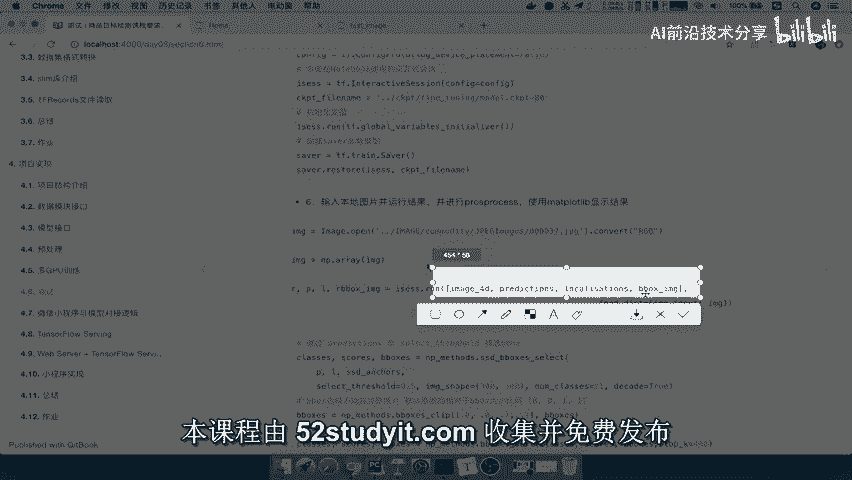
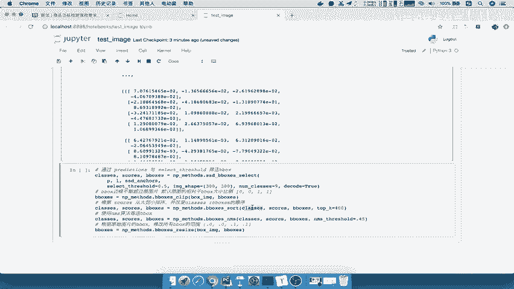
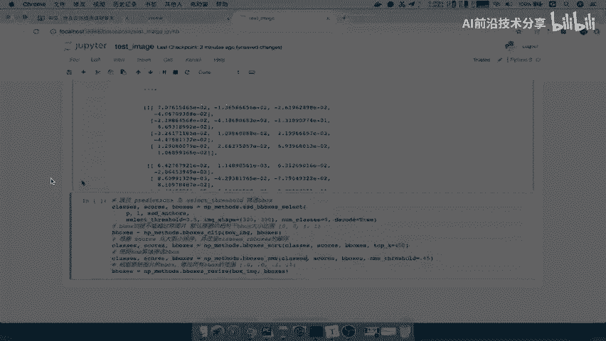
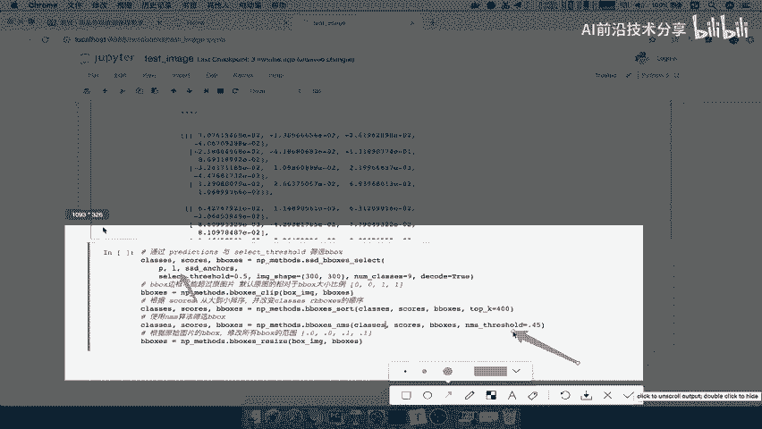
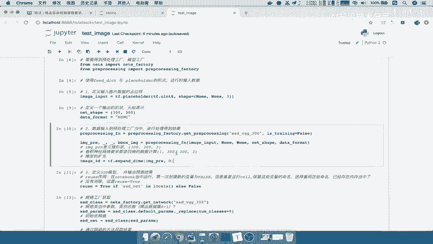

# P74：74.02_测试：图片输入、结果标记代码74 - AI前沿技术分享 - BV1PUmbYSEHm

那现在我们整个相当于整个测试的一个模型呢，就做好了，做好了之后，我们就要去创建绘画加载模型，加载我们什么模型，是不是已经训练好的模型，然后进行一个输入，数据输出结果一个处理，那所以我们接着来看。

先看创建绘画以及加载模型，那么因为我们的这个模型呢。

就要看你的这个模型加载是什么样的模型呢，如果加载的训练时间比较长的，效果肯定好，如果说你训练几分钟就来测试了，那肯定它不一定能识别出来，检测出来，那主要是呢，在这里我们会使用一个叫做交互式绘画的。

这样的一个end intersession的一个啊，这样的一个绘画，那么这个会话是方便在notebook里面啊去使用的，那同样我们要配置一下CONFIG，以及我们的这个使初始化所有的变量之后。

接着然后呢创建一个saver，saver呢去restore一下能理解吧，所以我们分这两个步骤，一个呢是创建这样的一个交互式绘画，使用configure，然后呢创建我们server。

然后使用我们的配置文件，初始化变量能理解吧。

好所以呢我们在这里先去做一下啊，在test image当中，第四步我们要定义绘画，交互式绘画，然后呢初始化变量，然后呢这个通过啊，这个保存啊，加载模型。

那我们交互式会话呢就是in interactive session，这个session里面有个configure跟VG呢，你可以直接把我们打印设备啊，直接默认是false啊，当然你直接也可以不填。

那么所以呢我们直接把这个CONFIG给拿过来好，那我在这里配置CONFIG等于CONFIG，那么返回一个SESS我们缩写SSESSION，那么首先呢我们要记住对于TENSORFLOW来讲。

要说把所有的变量给初始化session点run，我们run的应该是在TF点global initializer吧，啊应该是在global，看一下global直接没有出现啊。

没有出现我们的这个变量global variables，那我们直接复制过来吧，global variable是INITIALIZER对吧，好我们直接放这里好，那么然后呢对于这个初始化呢。

我们直接呢这个创建一个绘画，就是创建一个saver对吧，那所以创建saver去加载模型，那么saver呢在我们的train当中的SAVER，那么你指定哎SAVER等于它。

然后saver等于restore一下就行了嘛，我们在下面加几个，把它放到这里，saver点restore r e s t o r e好，那么我们restore restore什么呢。

要restore会话当中，然后以及你的模型的路径，那所以我们在这里指定一下，我们当前这个我们第五版本的对吧，哎V5。0这个版本当中的这个路径，那么这个路径呢应该是在上节目录下的。

CKPT上面的frightening，但是我们这个刚才训练的时候保存了什么，是不是就保存了一个零版本的，你想想这个效果肯定不行对吧，但我们呢只是目的说这个把这个过程体验一下。

你只要替换一下模型文件是不是就OK啦，对所以这个我们不必要去关注了啊，所以我们定一个这个CKPT的一个file path，那么这path呢等于在我们的上一级目录下的，应该是在CKPT上面的啊。

然后呢FINTURNING微调之后的，那我们这里面呢有个model0，那么这里面加载模型的时候选择哪一个呢，我们会选择CDPK0，一个都不选择，直接指定它前面这个名字就行了，加上版本号啊，名字加版本号。

名字加啊，版本这个步第几个对吧，步数号，部署啊好那么这个呢我们已经加载好了，来看一下，我们加载一下这个模型，缺少这样的一个参数，就是CKPT啊，File name file pass，好。

这样的话我们已经加载好了这样的一个模型了，接着我们就要去啊绘画运行我们的图片，然后呢输出这个结果，我们知道在这个会话当中，在TENSORFLOW当中。

我们需要通过session这样一个点run的方式运行吗，那我们要运行什么东西，什么东西要运行出来，首先要确定的一个问题，就是那在这里我们要运行的东西就要注意看了，你首先是不是要读取一个图片。

真正的把图片传过来才通过fit dict参数指定吗，是不是这个东西，然后以及这四个tensor，是不是我们都要去获取的图片本身的数据，到时候我们要处理在这图片上加这个这个标记。

prediction预测结果肯定要有的，以及我们一个建立一个输出的box的image。

用于这个过滤去用的，所以我们在这里直接啊，先去选择一个图片去读取，转换成一个RGB的三维的这个结果，然后转换成一个数组，能理解吧，好所以呢我们在这里先呢去读取一个图片，读取一张图片。

那么我们使用的就是PL下面的这个image image了，image点我们直接使用open方法打开，你哪个文件指定我们的这个我们这直接输吧，上节目录下有一个ANMG1吧，注意我们是在这里运行的。

我们是在test下面运行的这个这个文件夹，这个应该是上一级目录下的image，能理解吧，好上一节目录下，image下面的应该是我们的这个commodity啊，coo m m o好。

commodity下面有JPEG好，那这下面就有很多图片，那我们随机选一张啊，随机选择一张JPG，然后呢，这个转换的结果我们必须得转换成一个convert，一个RGB的格式啊。

因为它默认的不是这样的一个RGB的格式，那所以convert rgb好，那么对于RGB呢，我们来讲，我们把这个结果就返回了一张图片，准备好了，那么我们说了，直接run，那run什么呢。

run我们的张量吧，哪个要需要run，我们image4D需要run的prediction，需不需要run，然后以及我们的这个localization，我们说还有一个值。

我们需要用到的就是在这里返回的b box image啊，它是0000011啊，这样一值，然后我们会在这里指定一个C的dict，指定我们的数据给我们哪个数据进行传递呢，image啊。

我们的image的input注意的是image input，我们是不是图片输入到这个站列当中啊，肯定hold掉吧，所以我们在这里使用的输入image好，那我们在这里直接返回我们的四个返回结果。

我们分别用这个IP，然后呢L我们不写那么多了啊，还有这个这个image bbox，B box，这个image吧，box杠image等于好，那么这个我们就运行一下，那么这个image呢输入进来。

我们的结果就有了，我们可以其实可以打印下了，P是什么，运行一下P就是一大堆概率值了，这些概率值每一个这样的一个边框，当然我们这个东西形状肯定是看不懂的对吧，还有包括你的L是不是你的预测的。

这个里面也是一样的吧，啊都是要么是score，要么是概率值，要么是位置吧，一个是位置，一个是概率值好，那么接着我们就要去进行进行结果的筛选了，比如说我们有一些这个排序对吧，还有呢NMS方法。

那这些方法我们之前说过，这些方法要不要我们自己去写呢，啊不必要啊，没有必要，所以呢我们是可以直接去获取一个文件，下面的方法叫做np method，也是前面我们会有导入到这个np method。

但是我们这里就没有导入对吧，所以呢我们在这里导入n p meh能理解吧，Np method，那么np method当中呢就有这么多方法，这里呢方法我没有去过多详细介绍啊。

基本上就是你想要什么参数就给什么参数嘛，对吧，他的这个方法基本上都是固定的，那么会经过这么几个方法要去做处理的，一个是通过prediction跟select server hold。

就是说你预测的这个概率大小，通过一个哎如果说概率小于0。5的，我直接把这些框给删掉，能理解吧，然后呢你的边框不能超过b box的大小，也就是说你这边框会缩小到0~1之间的值，以及我们会排序。

score就将你的预测这样的一个这个概率呃，或者说他的这个位置啊，进行一个这样的一个排序，那么排序之后呢，使用n ms进行筛选b box啊，这也就是筛选出了中周中周啊，最终所选的那几个b box之后。

我们再用把刚才那几个b boss进行reset，把它调整到0~1之间没问题吧，所以呢这是这几个步骤呢是一个固定的步骤，所以我们就直接使用它，已经啊已经固定了这些步骤，也就是说你最终结果任何一个算法。

就结果呢，我们直接根据这个结果去进行一个填充好，那我们再来看这里面有一个这是输入的啊，我们看一下几个参数吧，select呢里面有PL啊，我们把PL传进来来，Ssd anchors。

我们有没有SSD anchors呢，现在没有，因为他要去利用我们网络当中的这个SSB安科，是不是网络当中每一层预测的，这样的一个default box啊，它也要用来进行一个筛选啊。

通通过这样一个进行筛选，所以呢我们在这里要把SSD anchors进行获取，那通过我们SSD net进行获取吧，增加一行在这里我们直接在这里SSD杠net点，我们这个net要获取，就是要获取。

我们还是在下面一行写上SST杠net点，我们的这个anchors，对吧啊，直接这个输入anchors，那么这个anchors输入的参数，就是你的网络形状吧，net sh好，那么返回这个net sh呢。

我们用这个SSD杠anchors接受real angles当中，你输入的是一个形状啊，形状输入进去，然后返回一个SSD anchors，那所以我们就可以使用这个ANX在这里了，以及image的形状。

name classes修改对吧，九个，然后呢decode true啊，我们这个里面呢就返回这几个结果，那然后我们的这个利用这个0000011，那么这个001呢，在这里我们没有用这个值去替换。

那么这个值呢其实就是我们的b box image吧，哎我们把b boxing image给拿过来，然后呢这个because image呢也进行一个替换，那其他的我们看一下参数就不需要我们指定了。

都是一些过滤的时候大小，那其中select holder呀。

或者说我们的nm series，后series hold这些参数呢是要啊根据你的严格程度，如果说你严格程度不严厉的话。

那么你刷出了可能会有一些部分框是会在的，能理解吧，好那么这样的话我们来运行这个结果，那我们看一下np method没有定义，那我们重新运行好，运行通过之后，我们要去显示我们的结果了，那这个就要用。

终于用到我们的visualization的p RT b box里面，输入图片，你的类别，你的分，你的这个预测分数，你的b box框的位置，这些都是去提供，那所以我们最后一行呢直接通过这里好。

那么我们把这个粘贴好了之后，直接运行来显示，那么我们的image当中啊，应该是提供我们的I啊，I直接提供过来，看一下我们这个输入的音频集，是该是哪个音频集呢，是原图啊，一定要注意了，是原图。

所以我们这里要输入的是原图好，那我这里报了我们的image啊，这个image没有什么shape，说明这个东西呢它不是我们的array，或者说你的这个什么tensor类型，tensor类型。

所以我们刚初说了，在这里还是必须得做一个哎做一个数组转换，那么你直接啊强行的把这个数组进行转换，NP点ARAY，然后呢将我们的image呢进行一个转换，转换成一个新的啊，我们还是叫image。

那再运行一次，我们再运行再运行筛选，我们再运行解一个好，你看一下现在是不是对于这个东西，它要去进行标记，但是呢这个结果是什么，是不是没有输出对象，因为什么，因为我们的这个模型来看到这个零模型。

刚才训练才几分钟嘛，那如果说我们看几分钟的有没有用呢，你可以把这个东西series select后series hold给它调整，你这个也可以调整，那这个呢比如说我把它调整成0。1来看一下。

你看一下宽是不是很多很多啊，说明这个框是在这个过程当中，被进行一个过滤的吧，哎所以呢这里的series hold，一般我们都会设置的比较高，去过滤掉一些不大可能的这些框啊，都给0。4已经没有了。

好那么这就是我们整个测试的流程，能理解整个过程吗，包括这其中哪一些参数怎么设置啊，这个里面的这个有一些的这个函数怎么去用好，那么我们接着呢，接下来最后呢，总结一下我们的整个测试的一个流程。

首先我们再来看测试流程当中，第一步我们做了哪些事情，是不是定义的一个数据输入图片的占位符啊，哎定义数据输入的占位符，这个里面使用的API place holder好，然后呢注输入数据之后。

我们要进行预处理，预处理我们要拿到数据工厂当中对吧，那所以拿数据工厂好，数据工厂拿到这里，那返回这个函数呢，选择哎进行预处理，预处理主要是把图片进行一个大小缩放，那然后你要扩充一个四个维度吧。

哎我们说了，必须得扩充四维啊。

你这个卷积网络计算肯定是四个维度计算的，那然后再进行网络的输入，网络这样的一个输出结果对吧，哎就是我们的第三步，网络定义输出结果，输出结果，那其中用到了一个比较重要的API。

就是我们这个API等于说我们要选择net，将数据输入是否训练，然后是否是重用空间，那么然后呢我们再去定义绘画初始化变量，加载模型嘛，哎这个过程我就不说了啊，直接在这里面拿过来。

那这里面呢也没有什么特别重要的API，就介绍了啊，那最后我们要去run啊，run运行运行我们的输入结果，输入图片SESESSION点run，然后过滤方法能理解吧，好session点这个run。

那我们应该是输入图片开始session得run提供数据，然后呢我们去啊读取输这个运行结果，运行结果呢要进行一个过滤，这个过滤我们在这里同样使用固定的，固定的NP杠method方法。

下面这也是它的一个源码啊，原版当中提供的这些方法，n peter method的方法去进行过滤，那么这个过滤呢，我们就有这么几步的这样的一个函数了，那么我们把这个复制过来。

然后呢以及这个b boss clip函数，还有我们的这个函数，最后一个啊，我们这倒数第二个应该是一个NMS，非极大抑制，这函数你不用自己去实现啊，只要知道他这个几个API怎么用去用就可以了啊。

写这些函数呢也是比较这个困难的，而不是一不是很容易，你应该因为你要清楚这个网络的一些这个，b box啊，相关的一些设置好，那么我们这样的话呢，就直接输出了这样的一个结果，是不是我们直接标记结果吧。

当然我们刚才一直强调你的模型，导致了你的预测结果准不准确吧，你可以换一个训练很久的模型过来，是不是就OK啦。

