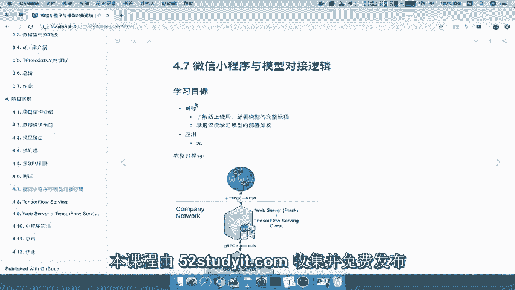
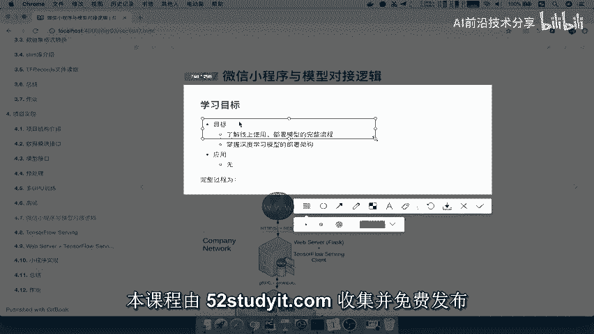
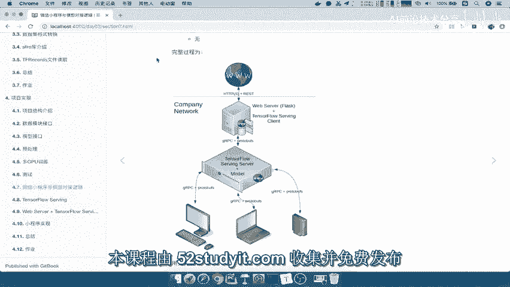
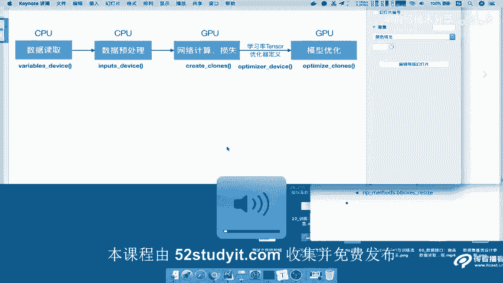
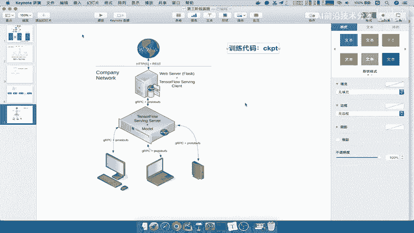
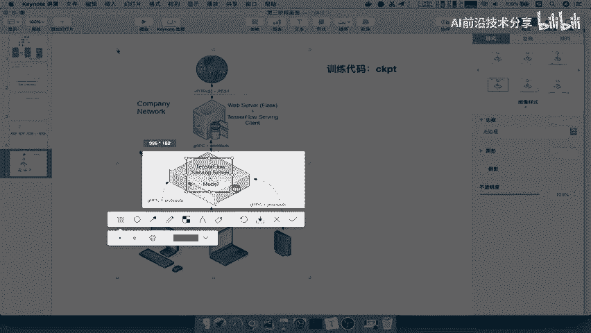
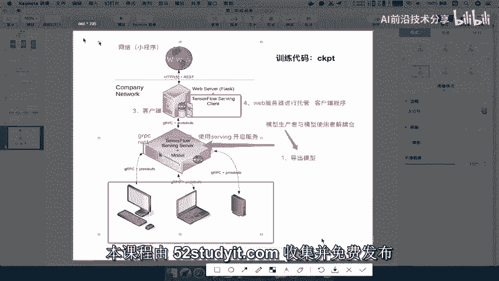
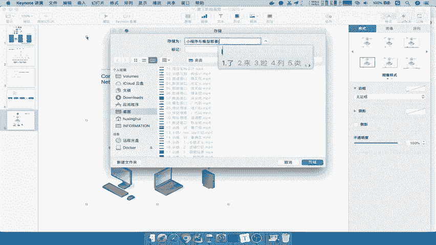

# P75：75.01_web服务与模型部署流程关系介绍75 - AI前沿技术分享 - BV1PUmbYSEHm

接下来我们就要去做这样的一个微信小程序，与模型对接啊，那首先我们先介绍一下，我们整个这样的一个逻辑是怎样的，那所以这里的学习目标呢。

就是了解我们这样的一个线上部署啊，它这个流程是什么样子的。

以及我们的这样一个部署架构用了哪些技术，那么我们看这里啊，就有一张图，他已经很明显的就能描述出来，我们整个这样的一个架构流程，那所以我们把这个呢复制过来。

好我们拿到这边来进行一个介绍。

那么我们来看一下我们新建一个，对于这张图呢，我们先来看中间的这样一个地方，我们之前一直在说我们训练出来这个东西啊，就是说我们一直导出来的，就是说训练代码，训练代码的东西得出来的。

这个CKPT我们是称之为一个模型文件吧，是不是一个模型保存模型文件，但是这个东西是拿来让我们去进行部，署使用的吗，不是我们还得去单独去做这样的一个部署工作。

那我们看到这张图，这一部分呢就是tensorflow serving server，那么这serving server呢，它会不将我们的模型导出的模型，部署在一个线上。

当然这是必须得在你的在线的服务器能理解吧，线上服务器部署这个服务器之后干什么呢。

我们之前一直提到的一个词，就是对于模型的这个生产者，比如模型生产者，与模型的使用者一要解耦合吧，一直强调是这一点，那么我们怎么解耦合呢，就是你模型生产者只要将你模型导出，我只要去导出来导出模型。

然后呢我把这个模型呢上传到这个地方，好模型的生产者，我画个箭头，然后把这个移过来，那么模型生产导出模型放到这个线上，然后使用tensorflow serving啊，使用serving开启服务。

使用serving tensorflow serving啊，开启服务，这样的话这个服务呢它会以两种接口，但这里只是体现了一种啊，GRPC它会以之前介绍了GRPC，还有什么Rest好，那么这个接口呢提供。

那我们作为这个本地的人啊，我们比如说你用本地的电脑或者是本地手机，我也可以去请求服务，作为这样的一个模型，请求这个模型的输入输出得出结果，那么另外一端我们来讲呢，我们如果想要请求这个服务的话。

其实必不可必不可少的，我们这一段应该是代表的是上传模型啊，上传模型，那么我们必须得去使用的一个东西，叫做turn for tensorflow serving client。

也就是说我们必须有一个服务客服务器的，这样客户端，你必须通过客户端，通过JIPC协议好，我们这里呢也就是说客户端，然后通过这样的一个GRPC协议，然后去获取我们的模型的输入输出。

那么这个客户端我们一般怎么去放到哪里，放到什么位置呢，我们会用一个web server，会会用一个web服务器进行一个托管，web服务器进行托管这个客户端程序。

注意这个客户端程序是我们相对于TENSORFLOW，service的客户端程序，然后web客户端web服务器我们就知道了，它的这个后台提供给外面的哎这些万维网对吧，哎网络。

那么这个比如说你用通过小程序进行一个访问，可不可以啊，哎进行小程序的访问，我从这里通过首先访问你的web server web的话，它转接到我们的客户端的访问程序，客户端访问程序。

通过我们的tensorflow serving，来获取我们的输入输出，然后再返回过去，那么这整个过程当中，我们呢如果使用JIPC呢，我们大多都是使用JIPC的这样接口。

那么它其中都会遵循着PROTOBUFFER协议，PROTOBUS是否有协议，等于能理解吧，那所以这就是我们整个说的小程序，跟我们整个模型部署之间的关系，所以我们要做的事情，我们来理一下。

是不是模型的生产者要去导出模型，然后上传的服务器，或者在你本地开启一个服务吧，哎开启服务，那所以我们在这写一个序号一导出模型，二使用这个东西开启服务，开启服务之后，你人都就可以直接访问了。

如果在服务器上，那么但是你访问的话，必须得使用一个客户端程序，三客户端程序进行一个访问，然后客户端程序访问呢，我们会把它放到我们的web服务器进行一个托管，托管的话对Y进行提供接口，能理解吧。

所以1234，我们的这样一个过程能不能理解好，那这就是我们对于我们小程序跟我们的模型的，之间的一个关系。

好我们的这一个小程序与模型。

