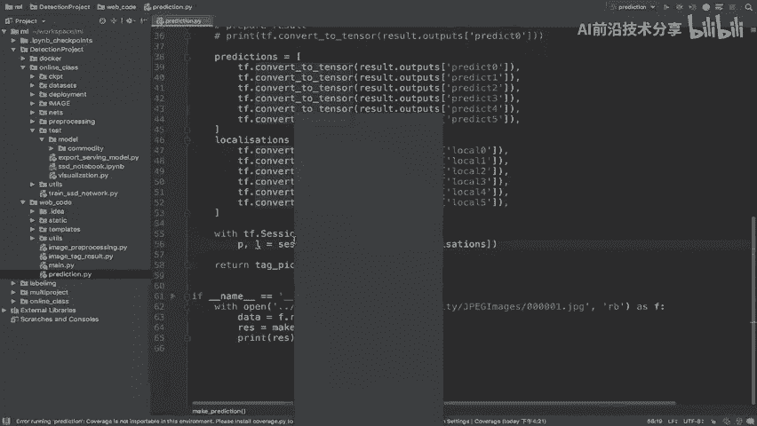
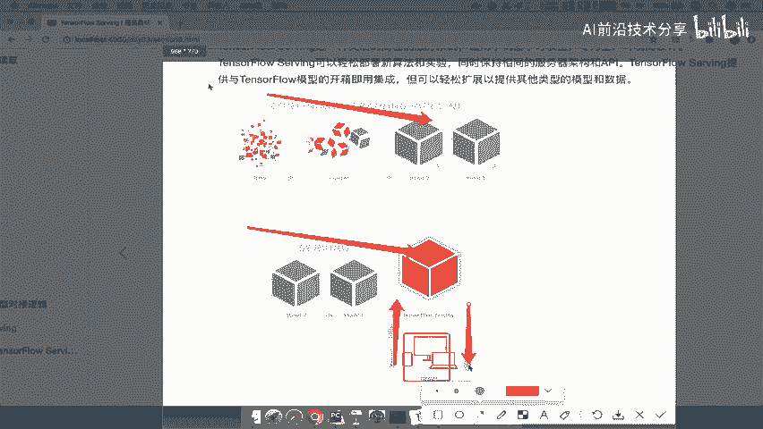

# P76：76.02_本地TensorFlow Serving演示以及逻辑介绍76 - AI前沿技术分享 - BV1PUmbYSEHm

接下来呢我们就要去介绍这个tensorflow or survey呢，那么在介绍之前呢，我们先去演示一下，我们整个哎通过上传的这个模型，开启这个模型服务，然后到我们客户端访问这个模型服务啊。

那所以我们来看一下。

首先我们说了这第一步干什么，是不是导出的模型啊，那么我们在这里啊，代码这个原来那个完整的代码当中，导出了已经导出的模型，导入模型是这个样子的啊。

我们稍后会介绍，然后呢这个模型呢我们是要去开启服务的。

那现在默认我们就使用docker呢，在我们本地去开启个服务。

那这个命令呢我们直接先从这里粘贴过来，然后我们打开终端。

那么这个粘贴的话呢，我们要找到模型的路径，也就是说这个啊COMMENTITY的路径，那么我们这里可以直接拷贝一下啊。

拷贝一下pass，那么拷贝path呢，我们把这里面进行修改来，看到我这里呢会去修改这个前面，也就是说comedy点是你最终的一个路径好，那我们这里多了这样的一个路径，好在这里前面是你的绝对路径。

加上你的这样的一个模型名，后面是固定的一个models加comedy好。

我现在开启这样一个服务，那么现在呢开启服务之后呢，因为是dog服务，你可以去直接CTRLC，那么dog里面呢我们可以P1下，看到我们开启了一个以这个tensorflow serving啊。

这样的一个程序啊，或者是相当于是一个后台运行的程序，那么它开启好之后，我们说了干什么呢，这个服务是要我们去通过客户端代码去，访问的吧，那所以我们接着通过在镶嵌在web code里面的。

一个啊单独的一个客户端代码，当然我们直接拿来就用了啊，我们不用去web去演示，通过这个客户端，那我们去进行一个运行prediction。

那么这个运行代码呢就是打开了一个文件，然后把这个文件读取之后，直接传给我们的make prediction，返回一个这个图片被标记的结果好，那我们在这里运行一下，好，那么这样的话它返回的是不是一个。

哎这样的一个图片的IO流啊，这个图片IO流到时候会介绍，那么这样的话呢，我们就完整地将我们的整个从唉，这个比如说开启的服务对吧，模型导出好之后，开启服务以后，然后呢通过客户端去访问你的服务，指定服务。

然后返回结果能理解吧，这就是一个完整的流程好那么我们把这个关了。

那接下来我们就要去介绍了哎这样一个特色，Flow serving。

那么首先呢在这里呢，我们要完成的任务是前面两个步骤，完成我们模型的一个导出工作啊，通过代码导出我们的模型，然后用TENSFLOW去完成我们的服务服务的运行，就是我们刚才那步骤能理解吧。

哎运行一个服务好，那我们首先来看tensorflow serving呢。

它是一个高性能这样的一个系统啊，服务系统它这个地方已经介绍了，它专门为生长环境去设计的，所以他提供的这个目的，就是为了我们模型的生产者和模型的使用者，之间进行解耦合对吧。

不需要进行过多的一些交互，那所以它的一个流程，也相当于在这张图当中也体现了。

首先你的这个模型呢，哎我首先通过这个数据，通过这个东西导出我们模型，模型呢我通过TENSFLOW部署在这服务器当中，我们就可以通过client客户端，这个客户端去进行一个提交，提交数据。

我们客户端提交数据，然后获取数据结果，能理解这意思吧啊这就是整个过程。

那么咳这是tensorflow serving的一个介绍，如果呢我们首先第一步呢，就是要去安装tensorflow survey，你必须得安装这个东西，那安装的话详情请参考这样的一个官网。

当然我们推荐使用docker，就是在你本地安装好docker之后，直接使用这样一个命令就安装好了它的环境了，你只要以后使用刚才我们使用的那个命令，就能够开启服务，能理解吧。

好那然后呢你就需需要去做的事情，就是先把模型给导出来，然后再去进行我们的模型的一个读取呃，这个服务的开启，那首先模型的导出，它是通过使用特定的一个模块的。

那这个模块呢我们称之为叫TENSORFLOW里面的save。

model builder啊。

建立相当于建立这样一个模型导出，那我们讲对于这个模型导出的这个过程呢，我们先不介绍，我们首先来想一下，我们要去导出模型，这个模型所做的事情是什么，也就是说我们这个地方的就是tensor。

Flow serving，我们首先要想的是导出模型，这个模型做什么东西，这个模型是提供这样的一个接口，相当于是你得到一个输入，然后直接得到一个输出结果吧，这是我们要做的吧，导出的模型。

那我们来讲这个导出的模型，别人提供给你的是什么样的数据，你进行一个输出，那我们说这个模型的一个过程，前期过程是不是有一个处理的过程，你是不是用户提供数据，提供数据，提供图片吧，图片。

然后你要去进行一个这个业务，应该是这样的吧，进行一个数据的一个输入处理，预处理过程，然后预处理的结果输入到模型当中，模型在输出结果，然后最后的结果也要去进行后期处理标记，返回给我们的这样的用户。

能理解这样的一个闭环吧，那么我们来想你的模型到底定义在哪个地方，也就是说你定义应该就是预处理，就是用户直接给你一个图片，然后你去处理这个图，你这个模型当中也要处理图片，然后获取结果，然后返回给来。

还是你的模型只去输入我们要求的数据。

然后直接输出，也就是说你是在这个闭环当中去做，就是说模型就在中间，那么还是在这个闭环当中去做，这就涉及到你怎么去导出这个模型了，那么一般来讲我们去设计这个导出模型的话呢，尽可能的简单就是简单，我只要。

导出模型我只要去干嘛呢，就是说我只要去把合格的数据输入到模型当中，然后呢我去输入出一个预测结果，也就是说和或者说这个处理过后的数据输入，然后呢我再去得出模型预测结果，我其他都不管了。

这就是我们模型要做的，尽可能让这些模型呢只拿到最小的这样的一个，其他的一些业务处理，我们全部都在模型当中做啊，其他的业务处理全部都不在模型当中去做，能理解吧，好我们把这句话写上，其业务处理。

包括数据的处理，我们都不在模型模型的其他地方去做，模型导出模型的服务当中去做，也就是我提供的模型服务呢非常简单。

你拿到这个提交好一个要求的数据能理解吧，好我们的这个模型服务这个设计好。

那所以呢我们需要去做的事情就是啊，通过这样的一个业务逻辑，那么我们首先来看一下啊，先来介绍一下我们的代码结构，在这里呢我们第一步呢就是先去加载我们的型。

定义我们的输入输出，首先就要确定你的输入输出是什么东西，你的输入是别人图输入的图片，还是输入的你模型的要求的输入图片，结果能理解什么意思啊，如果在我们之前测试图片的时候，你的输入是什么。

是不是一张测试的图片的一个placeholder，那样的结构啊，问号问号三吧，我这里输入的直接是模型要求的结果，唉然后呢我的输出直接就是模型的输出，结果非常的简洁，就是说直接跟模型的算算法。

相当于是跟这个算法直接打交道，哎我们输入到输出这里，我们写上输入对吧好。

那定义好了模型之后呢，我们就去通过save model builder，去定义你某我们整个完整的一个导出，模型的路径，比如说定义好你的路径，定义好你的这样一个builder。

然后通过这样一个builder呢去输入当中呢，会去建立一个这样的一个啊，这个prediction的一个signature啊，相当于是一份协议一样的，建立了这样的一个协议，包括定义你协议的什么呢，输出啊。

输入和你的输出结果，然后再把这个整个这样的一个协议呢。

放到我们的图结构当中，相当于导出一个完整的图结构，那这样的话就相当于导出来了。

能理解这个过程吗，所以我们分两步走，一步呢，一步呢是定义好你完整的模型的输入输出，以及把你完完整的这样的一个模型的代码写好，然后我们再去导出模型嘛，能理解吧。

