# P77：77.01_模型导出：模型输入输出定义77 - AI前沿技术分享 - BV1PUmbYSEHm

好所以呢我们接下来呢就就去这个新建啊，我们的这样的一个模型代码。

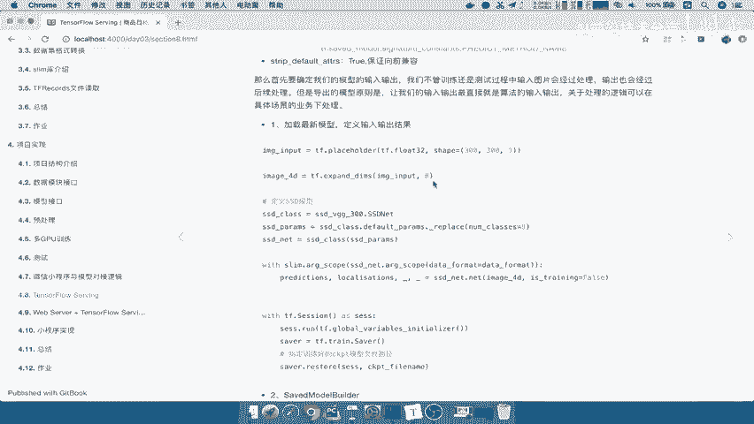

那么同样我们在这个啊，我们还是在这个第五个版本当中，我们也是在这个test下面啊，我们就新建一个代码，那我们在这里呢新建一个这样的一个，导出模型的这样文件export。

然后呢我们的serving杠model好，这是我们的要导出模型代码，那么首先呢我们对于这个代码当中，我们所需要用到的一些工具呢啊，以及这个我们的库呢先导入进来啊，比如说import我们的OS。

import一下我们的TENSORFLOW啊，as tf啊，这个OS应该在这里等一下再看啊。

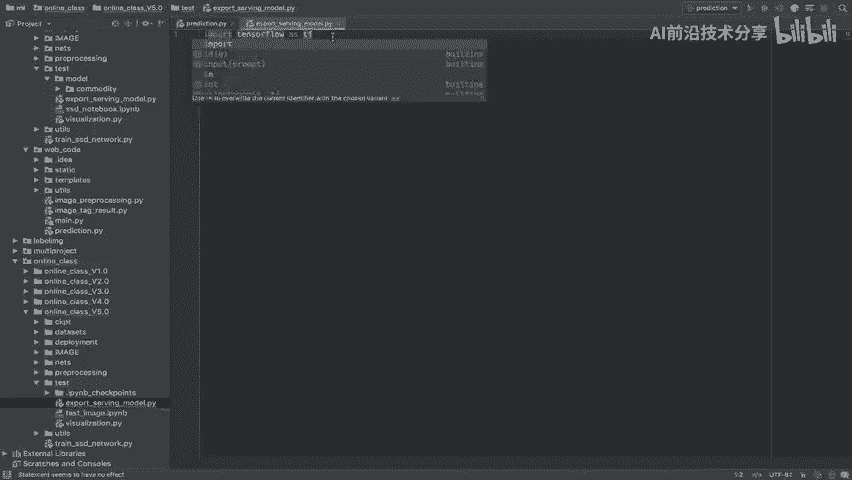

Import tensorflow，然后我们在这个过程当中，是不是需要去用到你的网络结构。

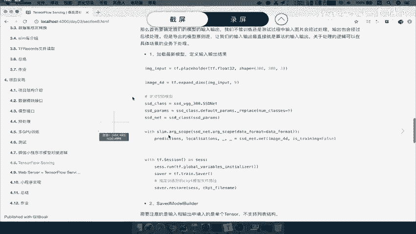

又到顽固结构吧，所以我们会FRAN一个，当然如果你要去fr nets里面去，直接把我们的nets model给拿到拿到过来，然后import一下我们的SSD，也就是直接将我们的nets当中的。

我们把这个关闭掉当中把factory我们不直接用factory了，我们直接用这个nets model下面的SSD啊，杠杠VGG杠300好，那么我们来看一下第一步呢。

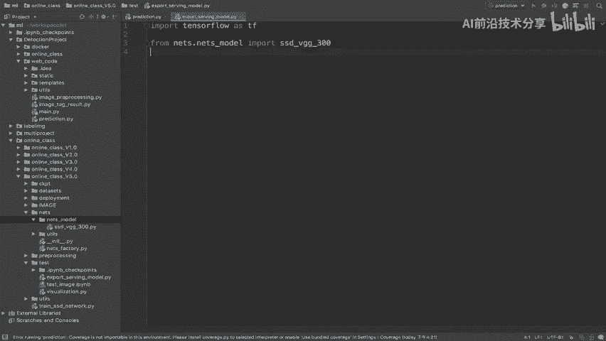

我们就是确定加载最新的模型啊。

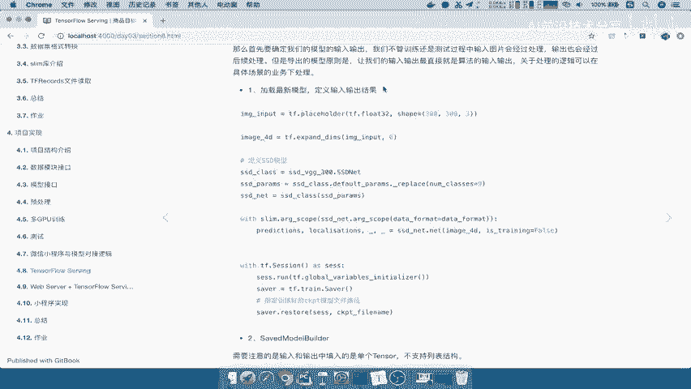

定义啊，定义好定义行，完整的定义好完整的模型图，然后呢去哎加载，或者说去这个进行一个定义输出结果啊，定义输出结果，然后呢去定义输出输输入输出结果好，这也是我们要做的，那么当当然了，我们整下在运行的时候。

是运行的这个一个export serving model，那所以你在这个地方呢啊，我们加入这样的一个import xy s，然后呢SYS点pass，点append啊，就是跟我们之前测试一样。

我们是以扇景目录去进行导入，这个运行的话，那可以去导入我们的这些结构，导入建立模这个模型好，那么所以我们在这里呢新建一个main函数，好然后呢我们还是使用TF点app点run。

那么我们在这里define一个main函数，define一个main，那么这个main当中需要一个参数，那么我们把这个对方呢复制到这里来，好，那么接下来就要去定义我们的这样的一个输入，输出。

结果我们说了，刚才一直在强调的就是你的输入，直接就是模型要求的输入，不不是预处理的输入，预处理不在我们模型的一个结果当中去做，然后呢，输出就是我们的SSD网络的SSD网络模型的，SSD模型的输出结果。

能理解这句话吧，我们要做的呢最好把整个模型定义到最简单，就是你这个SSD网络的模型输出输出输入输出好。

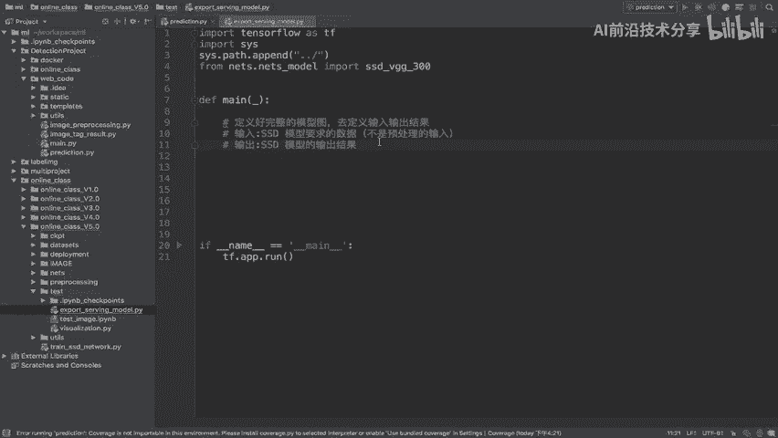

所以我们接下来要做的事情，按照这个步骤，第一定义好你的图片，然后扩展你的维度，定义我们的网络模型，以及我们的这样的一个啊，通过这样一个输出结果预测，能理解吧。

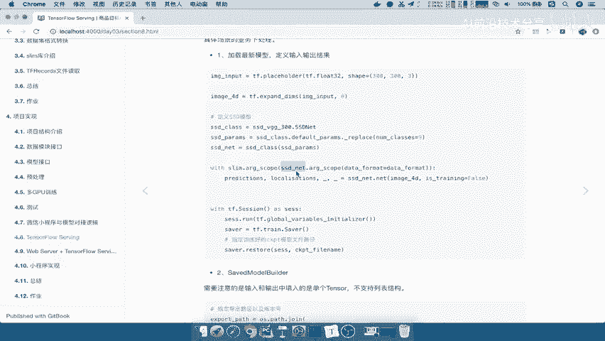

好那所以我们第一步，定好我们的输入，输入呢我们通过还是place holder，PLACE啊，H o r d e r t f，我们只指定一个它的类型，也就是说我们这个模型的一个导出类型呢。

我们指定float32就是模型输入的数据类型，Float32，因为你想想我们处理过的数据，是不是肯定是要float3号，才能输入到模型当中吧，对吧好，那么所以我们指定一个shape。

这个shape是不是固定的，还是不是问号，问号三了，不是它必须输入到模型当中的三，那么以及我们定义这样的一个东西呢，我们返回啊，image杠input好，这是我们返回结果，那么接着对于这个结果我们说了。

需要从一个三维三维3~1个四维的结果吧，一百三百三百313位到四位啊，所以我们通过使用一个TF点expand吧，Expand demons，然后呢对image input进行一个扩张啊。

对默认第一个维度进行一个扩展，image杠好比如说4D等于它4D啊，好我们的这个图片的这样的一个输入，处理之后的图片的输入哎，输入到这里面来了，那么然后呢，我们会对于这个图片输入到模型当中。

所以我们会使用SSDVGG300当中的SSD net，还记得这个吧，SSD net我们不去调用啊，我们先不去调用SSD杠class，那么这个过程我们已经写了很多遍了，我们应该去熟悉了SSD杠class。

应该去干嘛，是不是找到我们的参数吧，DEFAULT杠PARAMS，然后呢我们要对这个默认的这个参数进行替换。

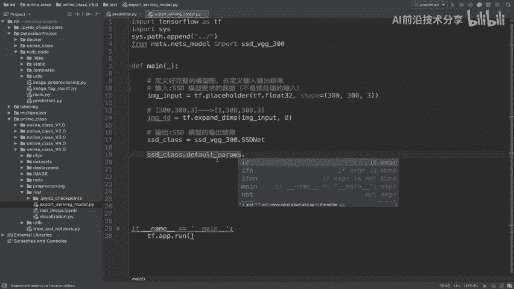

那就是说干replace，这个结果返回呢就是我们的这样一个参数。

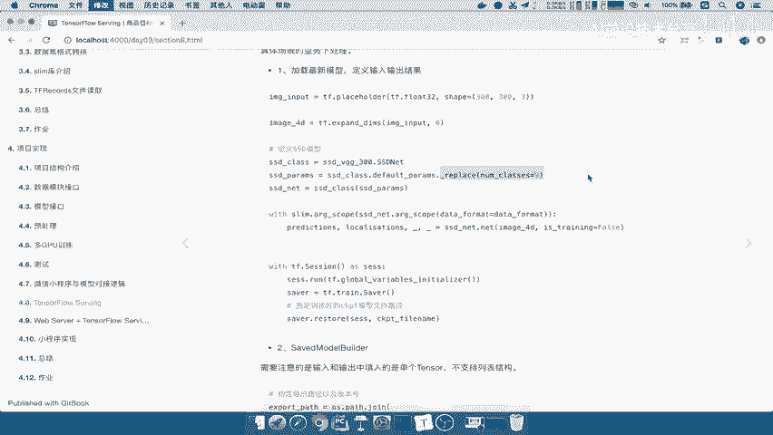

SSD杠PARNMS，那么这个参数可以作为我们这个模型的类的，初始化吧，好输入到这里面返回一个SSD杠net好，这样的话我们返回模型呢，接着我们要去哎得出模型输出，我们说了要去建立这样的一个。

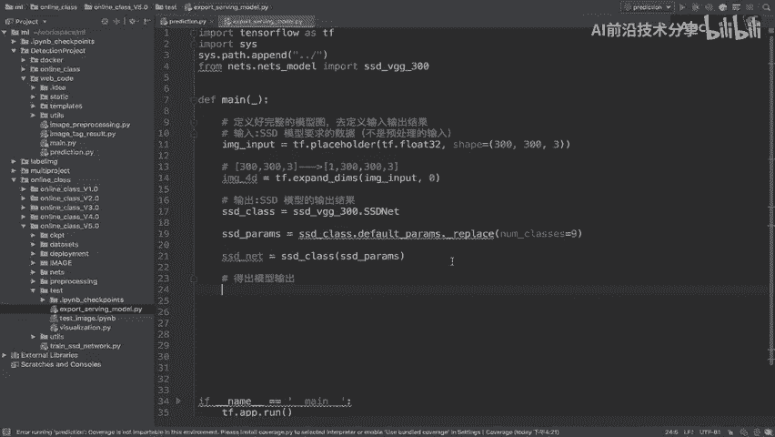

我们把参数给指定好，也是我们的数据的一个格式。

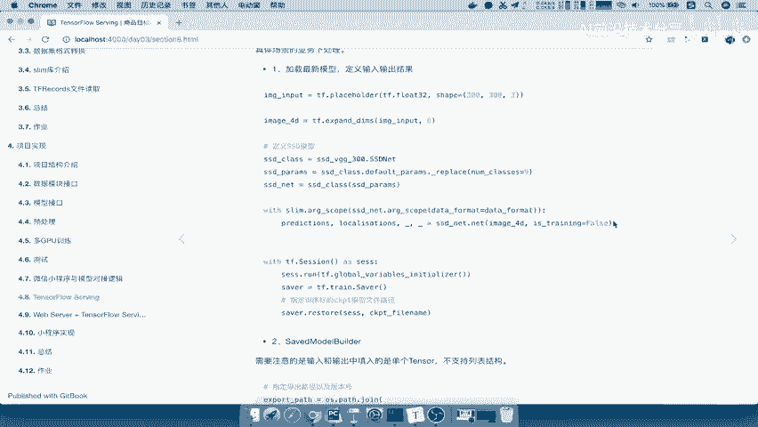

所以我们直接通过这一个代码呢复制过来，Data fat，我们在这里建立一个data FA，等于我们的NHWC好，然后通过SSD net点我们的net输入进去是什么。

是不是我们的image4D以及is training false吧，好OK了，那这个地方呢我们不需要用reduce，因为每次你运行的时候呢，我们的空间都是不存在的内存当中啊，好。

然后我们对于这个结果返回结果，就是prediction和localization了，Predictions，然后以及local lisa啊，SA这个TIONS好，那么然后中间还有我们说了。

有两个这样的一个参数，我们不需要的，那么然后呢，这相当于是我们把模型给定义好了吧，相当于是第一步，接着我们这整张图定义好了，就说输入定义好了，输出定义好了，是不是非常简洁。

那么我们就直接啊去开启绘画绘画，然后呢这个会话干什么呢，去加载我们这个最最后保存的模型文件，使得模型预测效果达到最好，要想想你要把这个模型提供给别人，你加载的这个模型里面的参数应该是什么，是最好的吧。

所以我们加载这个模型呢，直接啊我们先开启vs tf点3action s e s s，I o n as s e s s，然后呢我们初始化我们的变量，先SSSS点run t f点。

Global jo variable initializer，global initialize函数，接着我们创建server吧，创建saver，这都是固定的套路了啊。

train点s a v e r server，那么返回一个saver，创建好saver之后，我们说了去加载模型，那么saver点我们直接restore我们的size，加载哪个模型呢。

你加载模型是不是要指定一下，我们最近输出的这样的模型名字啊，比如说吧，我们还是以CKPT下面的fine turning对吧，我们所以在这里呢直接拷贝pass，我们建立一个比如说叫CKPT杠，我们的FI。

等于这样的一个路径啊，我们应该是一个值这样的路径，那么当然我们就以这个当前运行的这样，一个路径啊，应该是上一级目录的，上节目录的CKPT文件上面的find turning。

上面的我们指定model点CKPT，Model，点CKPT，然后呢CKBD我的版本这里只有零对吧，我们只训练了一些一点时间啊，只能加载这个了，当然它效果肯定是不是不是很理想的。

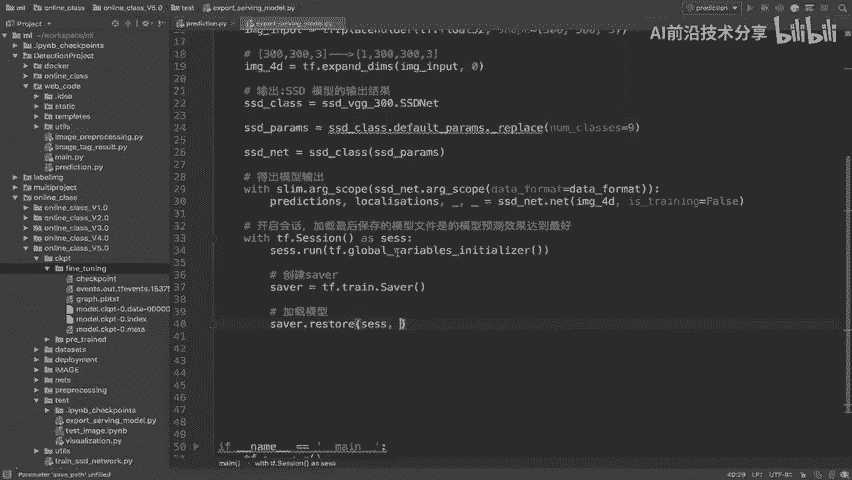

那我们的c k p t file path加载好了，OK那么这样的话呢，我们整个相当于是我的模型的输入输出，定义好了啊，定义好我们的输入输出了好。

