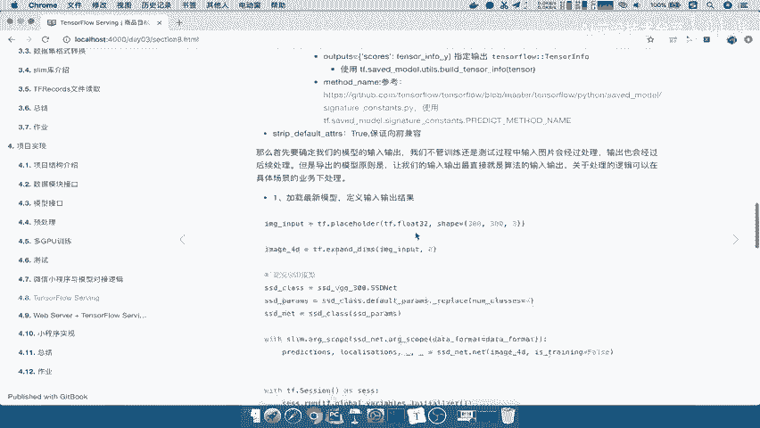

# P78：78.02_模型导出：Savedmodel导出模型78 - AI前沿技术分享 - BV1PUmbYSEHm

好那么接下来我们就要去做一个导出工作了，导出我们说了要借助这样的一个saved model builder，那么这个save model builder呢我们来介绍一下。

它大概有这么几个组成部分来看到，首先呢它会指定说你导出的路径，也就是说你导出相对于你现在的这样的一个，路径在哪里，以及你导出的版本，是不是，这个版本可以作为这样的一个命令行参数。

说你下次运行是不是有可能会导出第二个版本，第三个版本，那一般的我们这里面的数字呢，都会去使用1234啊去替代就好了，它会默认知道1234最新的版本是五，最最新的版本是六等等这样。

那么当我们定义好了路径之后呢，我们会需要去构建一个builder，注意啊，构建一个builder，Builder，就是相当于是我们通过这个东西来定义，我们的种一些导出的格式。

那么builder呢它会添加一个原图，以及每个变量的这样的一个描述，将这个里面的原图描述呢，去保存在我们本地的文件当中，相当于是导出了这样列俗称的这样模型文件，能理解吧，这个模型文件是当。

当然是相对于serving这个模型文件来说的好，那么这就是相当于它的一个步骤啊。

完整的一个步骤，那所以呢我们就去啊一步一步的去做一下。

那所以我们就直接在绘画当中去实现整个过程，那我们这刚才说了，导出模型过程好。

第二大步，那么这呢是第一大步，导出模型过程，第一步是先要去使你的模型的路径给啊填充。

那所以我们在这里复制过来，我们的这个pass呢先就不要了，我们导出的哪一个路径，以BS形式的提供我们字符串，写了一个字符串在这里，那我们就导出当前test吧，我们直接导出当前test。

在这个地方这个目录下面，好比如说我们取一个叫model名字，然后呢，你的这个取一个就是我们的这个模型名字，注意了，这是你的模型名称，那么这个模型名称呢，你只要写的这个模型名称可以是啊。

你关于你的数据集啊，啊与你的这个或者其他东西相关，所以我们这里是一个CEOMODITY哈，比如说我们叫这个，所以这个地方的介绍就是路径加模型名，路径，加上模型名字好，那么然后呢对于这个version。

那么你就可以指定一个参数去提供了，那我默认比如说先导入一个版本，第一个版本好，这样的话我们的路径加载完了，那路径导出路径建立好了，那我们需要去哎，比如说我们在这打印一下吧，正在导出吧，正在导出。

正在导出模型到我们的这个路径，打印一下S百分号S那么这个呢export pass，接下来呢我们就去我们就直接建立builder吧，比RLDER好，建立builder的话，我们直接把他的这个地方拿过来。

Saved model，Builder，Builder，Saved model，然后呢，export pass返回一个builder，好，那么这个builder呢我们要去干嘛去建立原图，建立原图。

一个原图格式啊，写入文件，那么这个原图我们来介绍一下，重点就是这个原图我们先把它复制过来啊，我们先复制到这里，这原图当中有这么几个参数啊，第一个参数就是size，就是说你把哪个会话导出去能理解吧。

size tensorflow会画text呢，它是给你这一次的导出呢，进行一个标记或者标记，你说你原图取个名字能理解吧。

所以呢你在这里相当于是TENSORFLOW，这个地方相当于取一个原图的啊，或者说你导本次导出的一个名称叫什么，这个你可以随意取，默认你也可以用它的一些标记能理解吧。

默认可以用它来标记，然后呢对于这个第三个参数。

重点就是在于single natural define map啊，这个参数这个参数呢它是一个字典的形式，字典的键也是你的SIGNNATION的名称，也是你自己自定义提供的。

然后呢predict signature g是一个什么呢，它是一个这样的一个相当于是一个口令，或者说它是一个签名映射，这套协议定义了我们的输入输出的结果，转换成了一个这样的一个格式。

就是说将我们输入输出，转换成我们这个协议中的格式，能理解吧啊那这个呢我们看一下predict signature，它是这样的一个格式，它可以通过这个函数去建立，这个函数里面会提供你的输入输出。

哎这就得定义了你的输入输出，这个输入输出关联在哪里呢，关联到我们的这个地方的模型当中的输入输出，能理解吧，这个输入以及这个输出会跟我们刚才的input，进行联系，那还有最后一个这个地方保证向前兼容。

我们就不说了啊，好，所以关键的是，我们这里的有一个这样的一个名字啊，然后呢还有一个就是这个地方predictor signature吧，那所以我们在这里取个名字，比如说我们叫做这个detected。

DECTECDED啊，Detected t e d，然后呢我们叫做detected model，好，我们比如说就取这个名字，然后呢这个名字我们用到了这样的一个signature，Signnature。

那么这个sin nature我们说了，这个signature是通过什么东西去建立呢，要通过刚才所说的建立一个完整的函数好，这个很NH，相当于使用这个函数建立一个啊，通过该函数建立建立这样的一个签名映射。

其实啊你就把它理解是一种协议啊，那么至于刚才我们所说的这个协议啊，我们这里呢就来来在这里面提供参数，这个协议是一个字典，字典的键和值都是什么呢，我们的键就是说这里面是一个字典input。

然后input字典格式，outputs outputs的格式，那么这个地方呢我们应该不是这样啊，应该是input等于什么，然后呢我们的output output ts等于什么，能理解吧。

以及呢它还会提供一个method name，这些method name呢，我们都是去使用这些默认的method name，能理解吧，好所以呢我们把这个method的name也使用过来。

这里method name默认是多少，这三个参数填好，那input是一个字典吧，这个字典代表的是什么呢，我提供这个输入的数据的名称，取一个别名，也就是说我给输入数据，其一个别名好，起一个别名呢。

那比如说我们输入呢我们叫做images，注意了这个别名用在哪里呢，用在客户端，客户端，客户端再去这个读取的时候，需要指定能理解吧，所以你等一下我们后面再写客户端的时候呢，就需要用这个名字。

那images我们这个地方写什么。

这里面说了，它是一个tensor的info，tensor info呢它是通过这个东西去建立的，也就是说你这里面传入进去的就是一个tensor，那么这个tensor是什么呢，就是你指定我们模型当中的输入。

那这个时候我们可以把input进行输入过来，OK那相当于你把input指定好了，以这样的一个方式去进行一个签名映射，能理解吧，哎这其实非常简单，就指你的模型的输入，把它放到这里来。

当做我们的这样的一个协议提供给别人，然后呢相当于他是把这个整个模型吧，我们可以理解把这整个模型进行一个分装协议，然后输入它封装了一下，输出它也分装了一下，能理解吧，好output。

那么output在这里还是一样的一个字典格式，那么这个字典格式也是一样，我们输出有什么呢，Prediction logalization，但是这里一定要注意一下TENSORFLOW这个东西呀。

提进去的填入的填入的参数，填入的参数必须是一个tensor，不能是列表，能理解什么意思吧，不能是列表，也就是说你这个地方只能腾一个tensor，那我们又之前说了，在我们训练的时候，这里输出是多少个。

这有六个，这有六个吧，所以怎么办呢，我们只能单独的把它拿开，所以你只能这个样子在我们导出模型当中。

所以我们可以看到这里有一长串的这样的东西，当然你可以循环的去把它给获取出来啊，循环获取好，我们这样的话得到了输出的六个值，以及这个这个相当于是预测的概率，六个值，以及我们的位置的六个值能理解吧。

六个网络的这个节点的六六个地址，然后呢method name也是提供默认的，我们所以就使用这样的一个默认在这也有啊，提供的是这样的一个method name，能理解吧，好我们把这个填到这里。

这样的话呢我们的predict prediction signature构造好了，然后我们再看这里这个地方呢我们的标记啊，就是整个导出呢我们取个名字呢，这个地方应该是前面有一个啊，有一个拼写来拼写好。

那么我们这个地方就导相当于是构建好了，构建原模式，直接我们说了保存保存，那么这个地方呢保存直接用building builder就行了，builder点save，那么最后我们可以打印一下哎。

比如说模型serving的模型，sin的模型结构导出结束好，那么我们来看一下，这就是我们的完整的一个代码了，那么接下来我们就去运行一下，来看我们来运行一下导出模型这个程序，看一下name slim啊。

我们当这个里面呢没有去导出slim的啊，我们在这里直接import一下，应该是在TF点control里面CONTRIB点slam slim，然后呢我们取个名字叫做slam好，我们再去运行一下。

name的OS，我们这里面也用到OS了啊，这个函数啊。

compete点NODELDEFUND，那也说我们这个地方可能会用错了，在我们的service model47行这个地方啊，这个地方应该是前面我们复制没有复制完全吧，应该是对于我们看这下面吧。

应该是TF点content的啊，看一下啊，TF点compact的啊，都是一些这个简单的拼写错误啊，那么这个要注意一下，好那我们看模型正在导出，并且导出模型结束，那么我们说了，如果你建立这样的一个文件。

在这里，test model这个如果这个model啊不存在啊，不存在的话，它会自己新建，然后新建COMMENTITY，那么这个一保存的就会得出一个variable和saved。

model的这样的一个两个文件，那么这两个文件的解释在这也有save mode点，PB是序列化的。

Tensorfloat，Saved model，它包括定义了我们的这个图形，就是我们刚才整个图的一些原数据，签名数据，variables呢包括了我们图形序列化的一些文件。

能理解吧，那所以这就是我们整个导出的结果了，能理解吧，好那么这个导出的结果我们来总结一下啊，总结一下，那么首先在导出这个模型的时候，我们说了，一定要确定你这个模型的输入输出一定是什么。

就说我们最接近模型的输入输出。

定为我们输出啊对吧，我们所以这里就写一下模型最，基本的或者说整个SSD模型的输入输出，就是我们要导出这个变成服务的，要导出吧，编程的接口输入，那么然后呢，我们首先就要去进行第一个模型的一个定义吧。

啊模型的定义，那模型的定义呢就相当于是模型图的定义。

这张图里面直接通过我们输入input input好。

我们在这里直接复制过来，以及呢我们在这里啊定义一个，来建立一个输出对吧，哎中间这一个过程呢我们就不输入了好，然后还有一个，那么最终呢我们定义好了这张图呢，我们需要去加载模型吧。

加载最新的模型CKPT没文件啊，注意了，这是CKPT文件，然后呢使得啊使好，那么这个加载就相当于把这个模型填充了，那你就输入我就能得到输出，最后我们就要去导出模型，我们说了分这几步走，第一步呢。

我们要去这个导出的路径模型名字对吧，导出的路径加模型名字，导出路径模型名字以及版本号，我们使用的这样的一个函数，就相当于一个重啊，一个export pass，接着我们要去建立builder。

建立builder，建立BUILDER，建立builder呢我们要去写入啊，相当于是去进行一个建立原图格式写入文件，好，那么我们就把这里啊，把这些函数呢直接就复制过来了，建立builder。

我们这个函数啊比较重要，返回呢是我们的一个BUILDE，以及写入文件，我们通过这个函数，这个函数里面的参数啊比较多，我们就不直接拿过来了，那么其中啊在这个里面，其中有个参数非常重要吧。

叫signature define map，我们把它理解成是一个签名协议吧，签名协议，那么这个签名协议怎么去定义，通过这个东西去定义我们的签名协议，包括你的input好，我们等一下复制过去呢。

把这些都删掉呃，直接复制这个函数吧，然后把这个参数写一下好，你的参数呢有什么呢，有input吧，我们看一下正不正确啊，然后呢你是一个字典的形式，然后outputs也是一个字典的形式，以及你的方法名。

这些方法名其实都是你可以去修改的名字，以及你提供一些名字能理解吧，好那么这样的话我们就将导出的模型啊。

