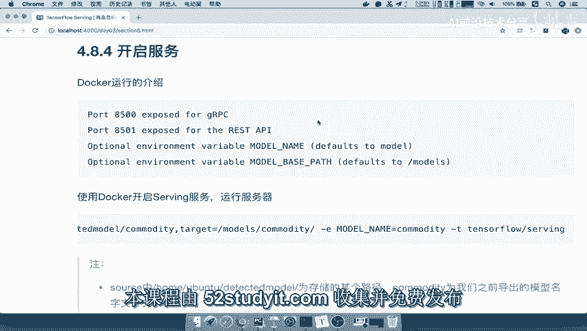
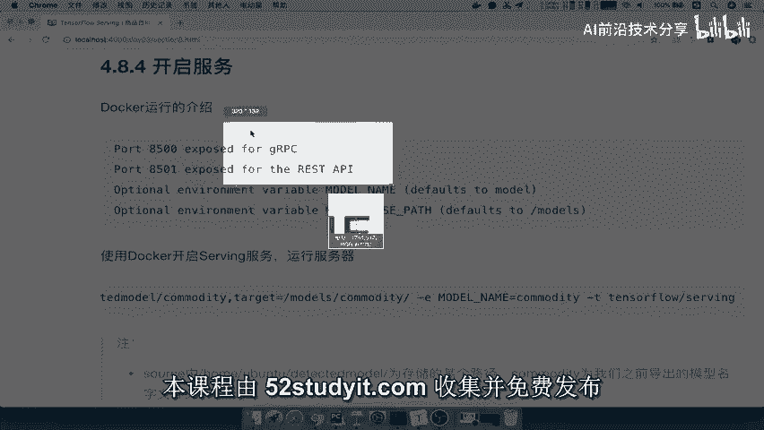
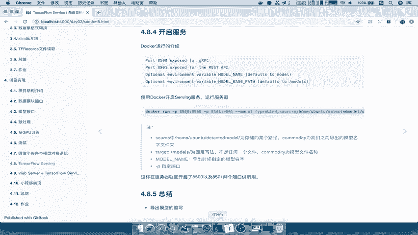
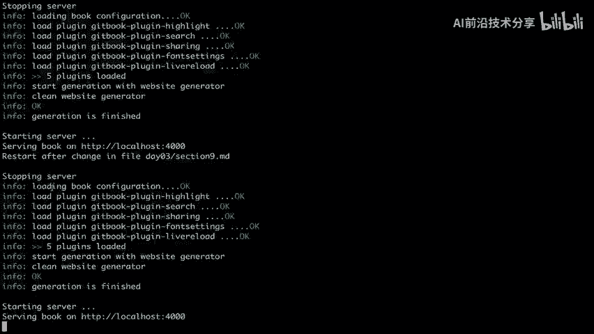
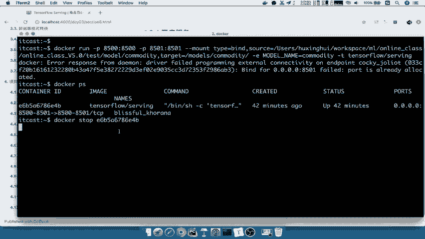

# P79：79.01_开启模型服务79 - AI前沿技术分享 - BV1PUmbYSEHm

那我们接着来看模型导出来之后，我们干些什么事情呢，就是开启服务了，那么这个开启服务是必须要求你安装了，tensorflow serving的这样的一个客户端，那么相当于是一个服务啊。

那么我们在这里相当于是在这个地方，模型我们可以上传到服务器，但是我们现在是在本地进行测试，以及呢我们可以通过serving去部署它，那么我们接着来看建设开启这个服务呢。

这个tensorflow serving呢提供给我们的有这两种。

一种呢是叫做JIPC的这样一个服务，还有一种就是Rest的专业服务。

那所以我们可以去选择任意一种，当然你只要去指定不同的端口就行，也就是说你在运行这个东西的时候，指定一下你的两个端口啊，我们应该是在这里啊，指定两个端口，就所有的两种服务啊都去开启了，能听明白吗。

刚才我们演示的就是这样，那么其中在这个开启的时候，我们解释一下前面source指定的就是你的模型，一直到你模型的名字的时候，我们刚才所说了，你的模型名字是不是commodity啊。

它默认会把这个当成你的模型名字，然后呢你的模一直到这个地方你的目路径，然后target的是一个固定的写法，注意了，不要误解了，这个models它是一个固定的，它不代表任何一个文件，也不代表任何意思。

就相当于他他自己去解析的时候会解析，然后加上你模型名以及也会提供一个model name，单独指定的模型名字会找到这个路径啊，找到这个这个文件，然后最终呢我们指定gt是通过TENSORFLOWSERY。

注意这是docker的运行啊，这是docker的运行，它会指定运行的时候呢，运行哪一个容器能理解吧，好那我们把这一段呢先复制过来，来，我们来看到这里。

我们在这里，那么我们首先来看一下，我们的这个模型名字在哪里呢。

我们的模型在看到他应该是在model，在我们的online class view5。0以及这样的目录吧，所以我们先把这个呢粘贴好，用docker开启，首先你当然你一直强调了是吧。

你要提前把这个dog装装好，然后把serving给装好，能理解吧，source我们直接拷贝到这里来，拷贝路径好，复制好，那么这样的话呢我们直接运行一下，我们看一下，这已经啊已经有了。

那我们可以docker p s看一下啊，那已经这里已经之前我们在演示的时候开启了，所以我们指定把这个id给拷贝过来，docker stop一下这个id。

好那么stop好了，我们就可以去把这个开启出来，那这样是不是跟我们运行的，是不是逻辑一样的吧，直接开启了，那么这个开启之后呢，我们是通过什么去访问的，它指定的这个端口去访问JIPC，用这个端口接。

如果说arrest用这个端口能理解吧，这两个端口好，那我们呢这个可以直接关闭啊，因为docker呢我们直接CTRLC没关系啊，然后呢，dog p s我们看是不是开启了这样的一个服务啊。

那么所以我们在这一端开启的当中呢，要注意的几个参数，一个是GP58500啊，比如说开启服务的时候好，这里就是我们的开启服务，首先呢你得去安装好docker啊，如果说使用docker比较方方便的话啊。

就是乱刀好，Docker，以及你docker去破破我们的这样的一个tensor，floor杠serving，能理解吧，好那么这个地方拼写错误了啊，Sorry，那么你这个地方开启服务呢。

那我接着就去直接运行端口了，我们说了这个8500啊，是给你提供了JRPC的端口，然后呢8501是提供了一个Rest窗口，能理解吧，好那么我们接着就可以使用这样的一个命令啊。

这样的一个命令我们复制到这边来，那么这命令当中有source指代文件夹对吧，source指代文件夹，然后呢你的这个target它指定模型名，加一个models固定格式，以及解释你名字能理解吧。

