# P8：8.01_Overfeat模型8 - AI前沿技术分享 - BV1PUmbYSEHm

好，那么刚才呢我们讲了这个目标检测，这个任务描述当中提出了目标这个分类啊，加上定位，那么它的一个解决方式，我们可以通过一个啊网络输出，增加一个全连接层输出我们的位置，这样的一个四个值吧。

但是啊如果说我们有多个目标的任务的时候，哎假设说你这个图片当中有多个目标的时候，那这种方法还行不行呢，那所以接下来我们就要提出刚才那种想法的，一个缺点啊，以及我们会用到的啊。

这种新的一种算法叫做R杠CN，那么RCNN呢它是一个基础的算法，也就是说它呢是作为一个起始的算法，后面呢会衍生出各种各样的sp p net，fast r cn和等等优路SSD。

那也就是说在这里第一点非常重要的。

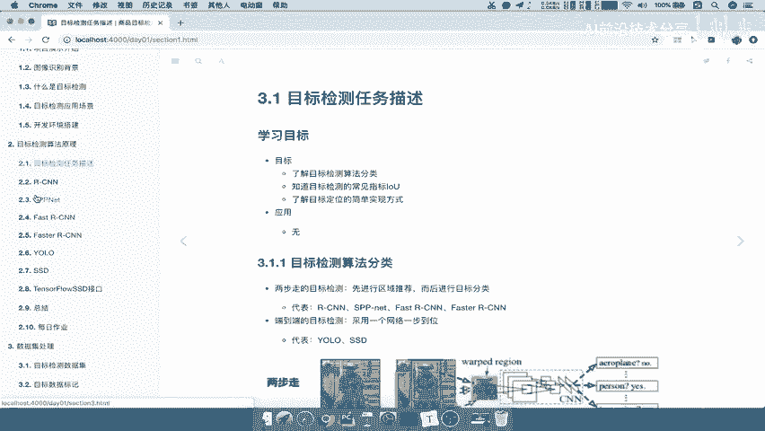

就是对于RCNN这个算法来讲，大家必须得先弄清楚了啊，把这个算法弄清楚了，那你后面请注意啊，后面你这些算法呢去理解的时候呢，就稍微简单很多啊，基本上就是一些改善操作而已。

能理解什么意思吧啊所以这里要注意了，一定要把RCN的整个过程能够啊熟悉啊，非常熟悉的去掌握它的整个过程好。

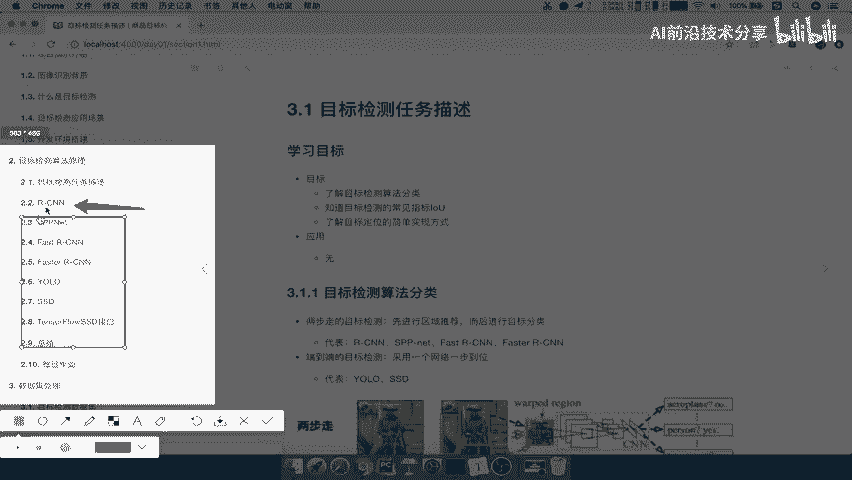

那么这也就是我们要说的啊，好那么首先我们就要来看一下RCN，那么这里我们的学习目标呢，这些我们就不列举了啊，就是在这个地方，那我们先来看一个问题，就是对于一张图片当中。

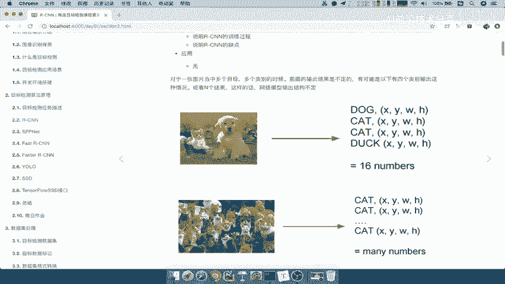

你有多个目标的时候，刚才我们说一个目标的时候，我们可以增加一个全连成输出这个目标的位置，那么如果对于多个类别的时候，多个目标的时候，你怎么办，你的输出还确不确定，你只输出一个对象的这个四个目标值吗。

你怎么知道是一个对象，比如说我现在就拍一张照对吧，我现在拍一张照片啊，拍一张照片，不确定这个照片里面有多少对象吗，哎有多少对象，所以你怎么办，你的这个最后一层你到底输出一个位置，两个位置，三个位置。

所以这个地方就是很困难了对吧。

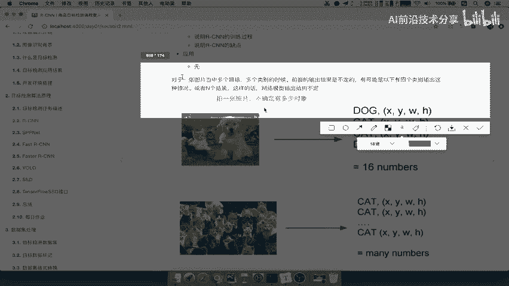

所以我们想如果说你有16个目标对象的话。

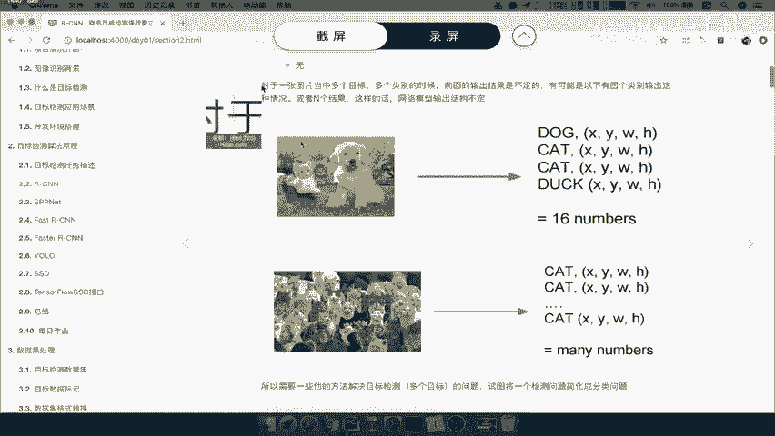

那你是不是要输出16个目标的位置，而且你输出必须输出16个这个目标对象的，一个每个对象的概率吧，你比如说第一个对象它是某个类别的概率，第二个对象是这十种类别的概率，第三个对象这是不是就是分类啊，对不对。

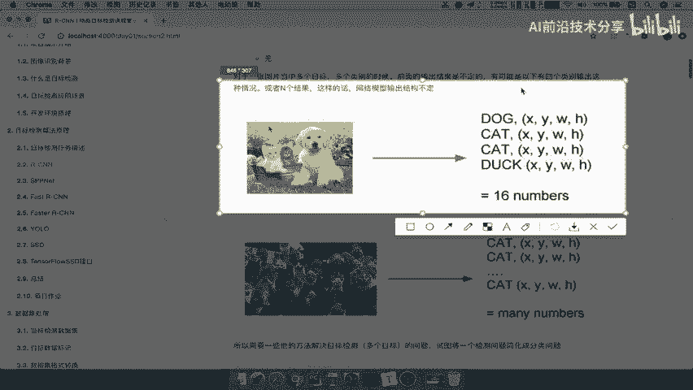

那所以呢我们如果说不确定有N个，那你所以就变成了一个many啊，many numbers啊，你各种各样的一个对象。

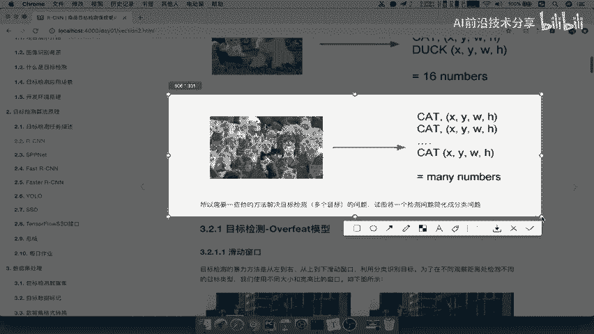

所以我们刚才使用的那种分类加回归来，看到分类加回归提出的那种解决思路，多输出一个全连接层有没有用，所以我们在这里写了，如果存在，肯定是存在的对吧，哎图片中假设存在多个物体的时候。

你的网络输出多少就不确定了吧，哎不确定，多少吧，哎不确定，比如说回归这个全链接层，回归输出的坐标多少个呢，哎多少个，所以呢这就是摆在面前的一个问题了，好那所以接下来我们就要提解决方法了。

怎么去解决多个目标的哎，目标检目标检测对吧，解决目标检测，那么我们第一种算法呢啊就是R干CN，但是呢我们要讲RRXCN之前呢，我们先来看怎么去解决这个问题的，思路在哪里对吧，解决问题的思路在哪里好。

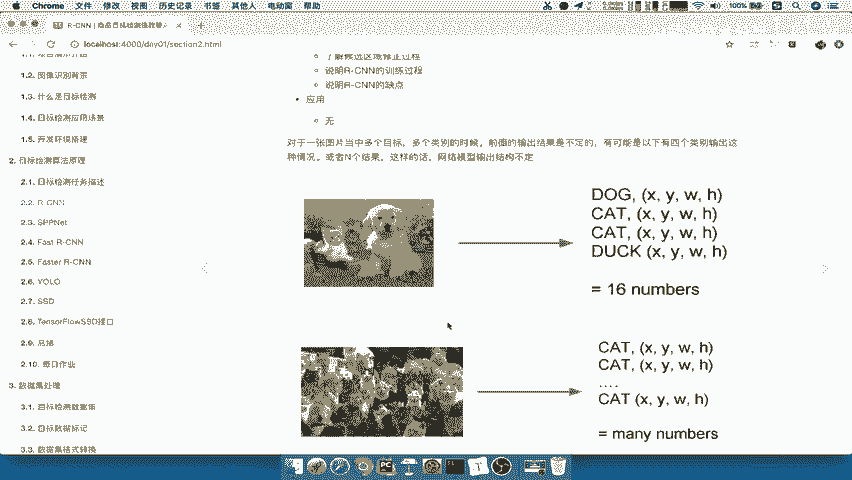

那么所以在讲XCN之前呢，我们要提出一个叫OVERFIT模型啊，注意了，OVERFIT模型，那么OOTD的模型里面有一个概念，叫做滑动窗口的概念，诶，听这个名词啊，你就知道滑动窗口是不是相当于一个窗口。

在我们这个某个图片上面进行滑动嘛，所以我们来看他是怎么做的呢，既然我不确定目标的一个数量吧，哎假设对于这张图片好，我先确定一个窗口大小，假设我确定窗口就这样，跟这个人这个窗口一样啊，好我假设这样。

那么我现在既然不知道有多少，那我就暴力的方式，我从左到右看到，划一下划一下划一下划一下划一下划一下，你是不是假设我们的含糊划划了这一个MN，M4对吧，然后呢我们再把这个框呢，比如说在向下滑啊。

我们比如说从左到右，然后再从上到下啊，然后从这里哎又继续往右滑，往右滑，是不是又滑出M个，然后再往下一点，哎那这个上下啊你自己可以定对吧，那所以我们最终得出来，比如说M是含滑了多少次。

N是向下的话多少次，那么你一共得出了M乘以N个滑动窗口，是以哪个窗口为基础的，是不是以这个窗口为基础的这么多个窗口哎，我就默认的得出了这么多窗口了，哎默认得出这么多窗口好。

那所以这就是滑动窗口的一个概念，当然滑动窗口呢我可以不只是这一种形状，哎我也可以另外一种形状，我们先把这个保存一下，好接下来我们还可以以什么另外一种形式，换一种形状，哎换一种形状。

我再也是一样同样的去划，比如说划了N次和乘M或者L4对吧，那也就是说我们可以指定不同的窗口大小，去滑动整个图片，取这个图片的什么呢，取这个图片当中的某一小块作为一个啊，我们将要检测的一个对象。

这样的话我们看一下，这样的话我们是不是变成了一张图片，变成了M乘以N个，比如说啊M乘以N个小的图像组成，能理解什么意思吧，唉M乘以N个小的图像组成，然后再干什么呢，然后哎。

我就假设这每一个小图像里面只有一个物体，是不是就可以做一个分类回归的一个操作了，哎所以这就是解决思路，那么所以我们在这里来看一下，这样的话呢，我们就变成了子图片的输出类别以及位置，变成了一个分类问题。

而且再加一个回归问题，那所以滑动窗口呢初始会设定固定的窗口，那么提前需要设定K个窗口，那么当然这个K窗口呢，只是说你这个窗口大小不一样的K个啊，K1个每个滑动窗口提取M个，你总共有K乘以M个图片。

这能理解吧，那最终呢我们每个图片呢都会输入到CN分类器，提取特征，那么也就是说最终变成这个样子，我们的整个啊网络结构，我假设以这个样结构为这样的一个基础结构，什么意思呢。

我假设啊假设第一个环数窗口的大小啊，滑动窗口大小一，一我滑动了多少个呢，比如说1234好，比如说划了这一个N个，然后M个吧，然后呢滑动窗口我不是设置了很多种大小的吧。

哎比如说又设置了一个很多种大小滑动窗口，大小，K1个好，那么我们这里问你一个问题，为什么要在这里去取这种不同的缓冲窗口大小，原因很简单吧，因为图像中的物体的大小固不固定啊，是一个固定的一个窗口大小吗。

有可能你取的这个，比如说你取的这个可能适合一个人站着的吧，但是如果我们这里写一下，这里是可是人占着的，如果你取的是一个横的哎，基本上很少就是人在这种比，比如说这种图片里面都是人占的对吧。

你就不可能是一个人了吧，所以你有可能这个里面哎检测到人，但是这个地方有没有检测到人呢，哎就不一定了，所以这个我们要取滑动窗口K个，也就是因为要覆盖了各种不同的对象大小啊，来去进行一个识别好。

那么当我们得出了这个K乘以，比如说K乘以M个，K乘以M个这样的一个子图片，子图片干嘛呢，每一张子图片都要去输入到CN里面，进行特征提取，然后呢哎最后来一个分类和回归好，这就是啊我们的这样的一个思路啊。

这是思路就是滑动窗口，重点啊，是对于这种over feit模型的滑动窗口的解决方案，一定要理解啊，能理解这个过程吧，好那这个后面我们等下再说啊。

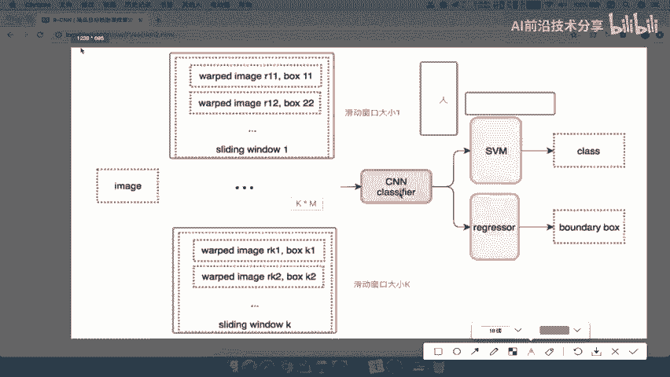

后面我们先不看了，就是分类回归嘛，好那我们把这张图呢保存一下，那我们的OVERFIT模型，那我们来看一下这种方法呢，啊我们称之为OOVERFIT，也称之为滑滑动窗口，里面有个滑动窗口啊。

接下来我们来看这种方法怎么去训练数据，我们说了，一提到训练数据，我们就要有目标值和哎预测值，那么什么意思呢，我们先来看。

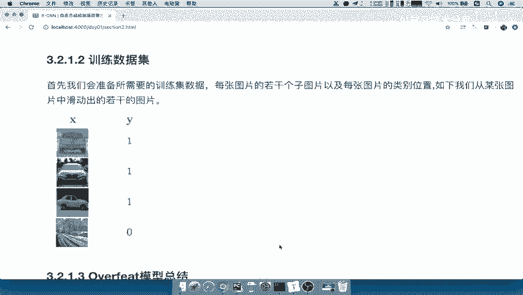

首先我们会准备所需的训练数据集，那么这个数据集呢，我们把每张图片的若干个子图片，以及每张图片的类别啊，位置如下其所示啊，什么意思呢，也就是说他先呢去在啊，我们先不说这个OOFE的模型了。

我们先去说我对于这张图片，我会先去在这里面取真正的，有物体的和没有物体的，取出N个子图片对吧，比如说取出这种X的，看到这是S的图片，然后呢对于图片我进行一个标记，有物体的我标记为一。

或者说我标记为具体的类别是什么，然后呢这个物体这里有物体标V1，这里有物体标V1好，这里没有物体标记为零好，接着呢我们就要去让这个滑动窗口滑动的来，滑动窗口取的，取的图片好。

取的图片呢我们会让这个里面呢输出啊，比如说这个图片输入输入到这个分类和回归，得出分类的这个概率哎，然后跟这个进行一个交叉熵损失运算，是不是就可以得出，我到底这个图片是不是这个类别了，哎这样的话呢。

我们的这样的一个样本呢相当于训练数据集啊，其实就是把我们的每个小图片进行一个标记啊，就变成了一个分类问题，然后又变成了一个回归问题，然后分类进行分类损失，回归进行回归损失就可以了。

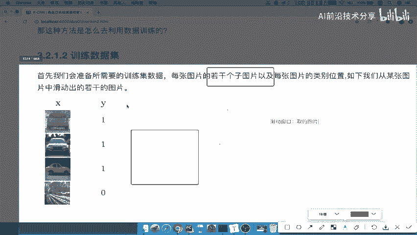

好那么这就是我们的OOD的模型，那我们总结一下o o feat模型呢，它是一种暴力求举的方式，因为你的M和K这个东西定不定啊，也不定越多越好吗，还是越少越好呢，也不确定对不对。

所以呢你会尽可能的把这两个值都给提的，非常高，所以你会消耗大量的这样的一个计算力啊，所以造成了你的窗口呢也不一定准确，而且非常耗时，这就是over feat模型能理解吧，所以o or fit模型的关键。

就是这样的一个滑动窗口的一个思想，好，那我们在这里总结一下，解决我们这种，啊或者说解决思路之一啊，我们通过滑动窗口，哎滑动窗口呢选出比如说K个滑动窗口，每个窗口M个这样的一个子图。

那所以我们总共有K啊乘以乘以M个子图，然后对于我们的每一个子图进行哎分类，以及我们的回归，这个我们后面会详细去说这个分类回归，他们到底怎么做的啊，好那也就是说这里就是它的一个over feit模型。

o over fit模型好。

