# P80：80.01_Tensorflow serving client逻辑80 - AI前沿技术分享 - BV1PUmbYSEHm

那么接下来我们就去做一个这样的一个，请求服务的客户端，那我们说我们的客户端呢怎么去安排。

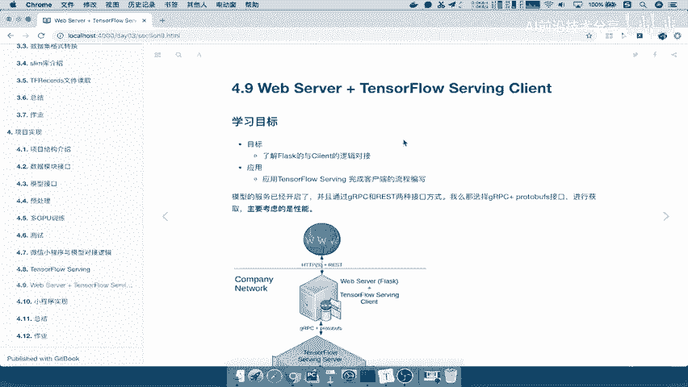

是这样的客户端呢，他会去被我们的web server，这样的一个哎web的服务器进行一个包裹，或者说托管它，那么也就是说外面用户请求给我们的，这样的一个东西哎，他会给我们传到client里面。

client又会请求我们的这样的一个server，那也就是说server再把回去哎，这样一条路能理解吧。

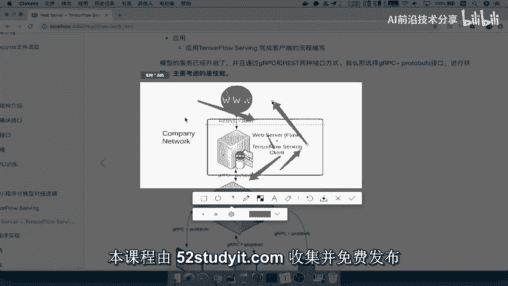

哎这条路我们已经说过了啊，那么我们通常的这个我们说tensor，TENSORFLOW这样一个serving client，它提供了这两种接口形式，那么我们会去选择GR。

PC加PROTOBUFFS的这样一个接口，那么主要考虑就是这种JIPC啊，它是性能呢要非常好。

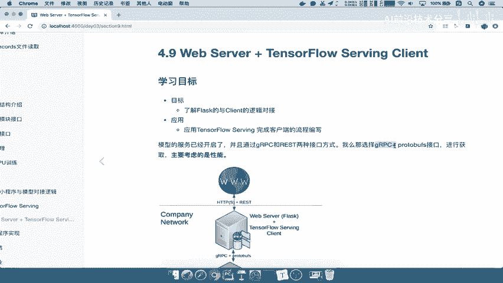

哎也就是说因为我们这种接口对不对，这个用户给提供的，所以呢我们一般在后台呢我们可能会啊，就是说既具体的场景具体考虑，如果你不是特别追求这种性能上的这样的一个，卓越的性能，那你呢可以使用CLA这一种啊。

Rest接口的方式去请求。

能理解吧，好那么这是我们完整的逻辑，那么我们说了，这个我们将web server和这样的一个客户端提供，构在一起，那么这整个逻辑怎么去理解呢，对吧，那也就是说我们又是这个web的服务器，的一个程序。

又是我们的这样一个完整的TENSORFLOW，serving客户端的这样的一个程序，那么我们会将这两个程序他们的所需。

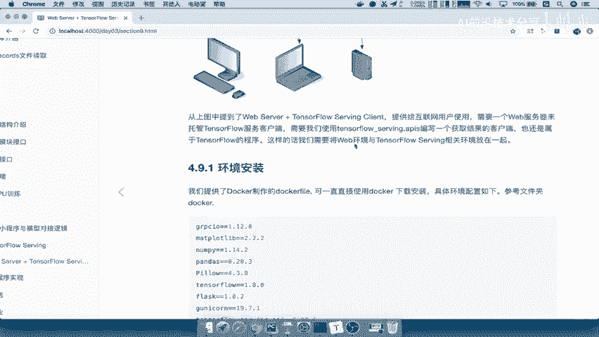

各自所需的环境会放在一起。

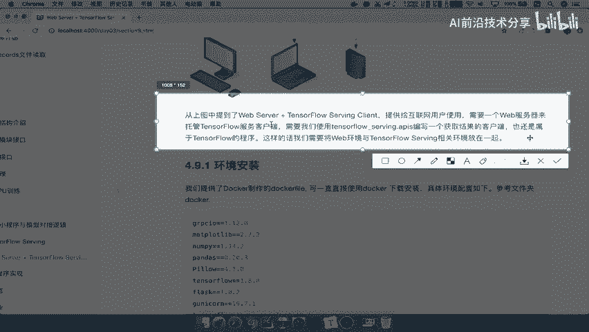

那么这个放在一起呢，我们在本地文件也经已经啊，把这个环境呢给它放到这里了，Docker file，那么也就是说你可以通过docker呢，直接把我们指定的这个环境给了。

或者说他可以去变成这样的一个容器对吧，哎可以去拉下载，下载成这样一个容器，那么这个环境当中有的什么呢。

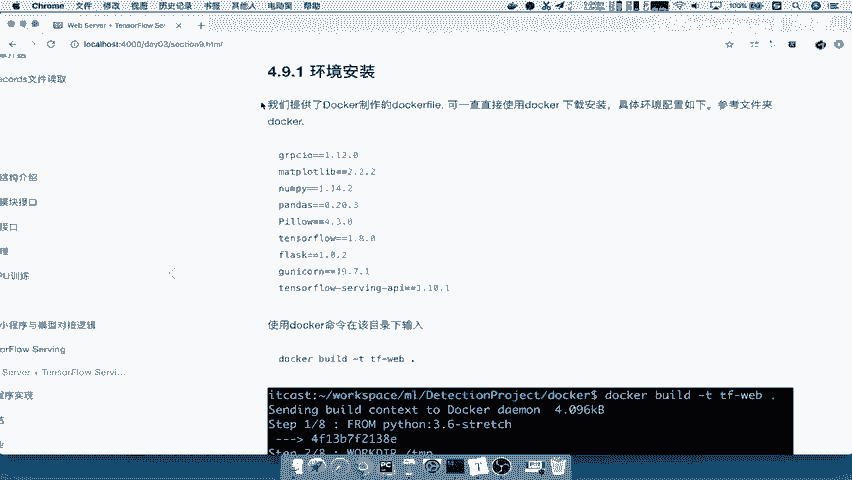

是这些内容，这些内容呢都是提供给有的是提供给我们的，TENSORFLOOR特serving客户端的程序，比如这种，然后有的呢是提供，比如这个flask是给我们提供给啊。

我们的这个web服务器的这样的一个包，那所以我们把这两种包呢都混在一起了啊，混在一起。

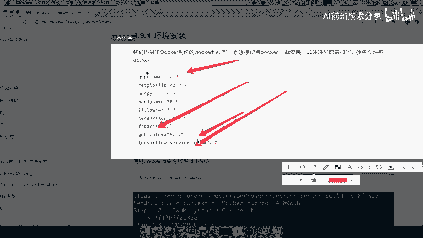

然后你就把这总的环境做成一个这个镜像好，那么这个镜像文件呢怎么去安装，这个我们就简单过一下就OK了，你可以使用docker去安装docker build。

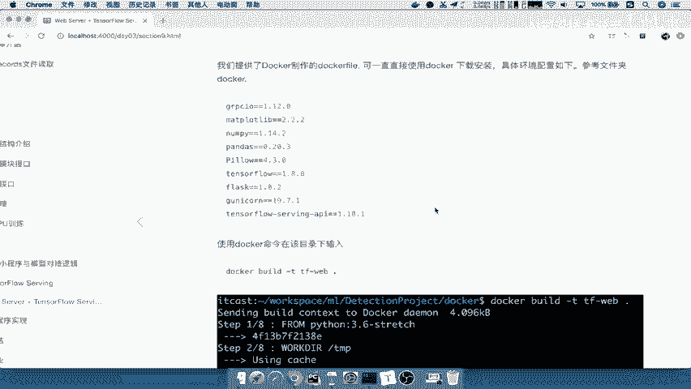

直接通过建立这样的一个，在docker的刚才这个文件目录下。

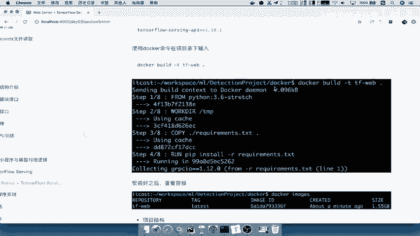

还有这个request点TXT的目录。

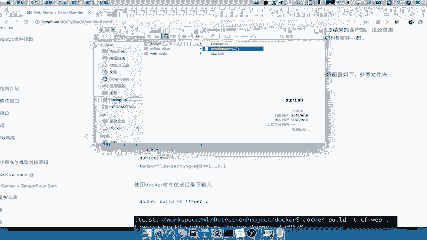

我们去进行一个输入build，构建好之后，它会下载相关的包，然后呢他把我们的镜像容器安装好之后，你通过docker images可以查看到我们的TF跟web，这样的一个容器已经在了。

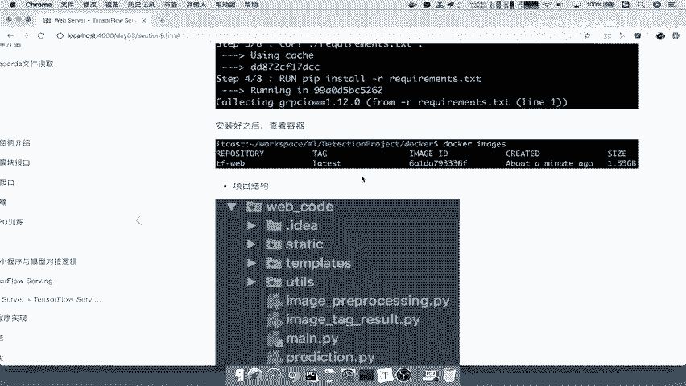

那么当然我们在这个本地呢，已经去安装好了这个环境，所以df docker点dog images。

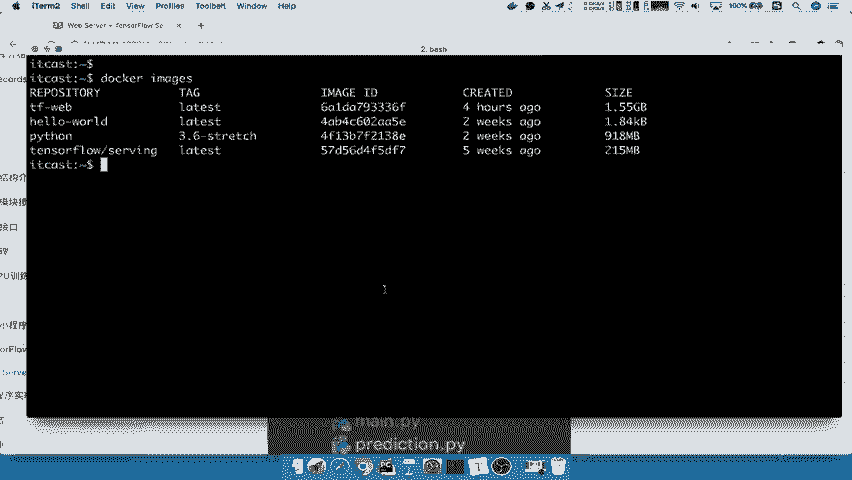

我们可以看到这里就有这样的一个服务了，然后以及我们tensorflow serving是也是啊。

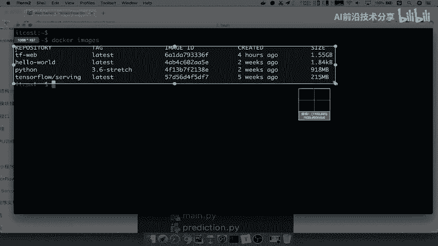

在本地进行这个读取过了啊，建立这样一个容器了。

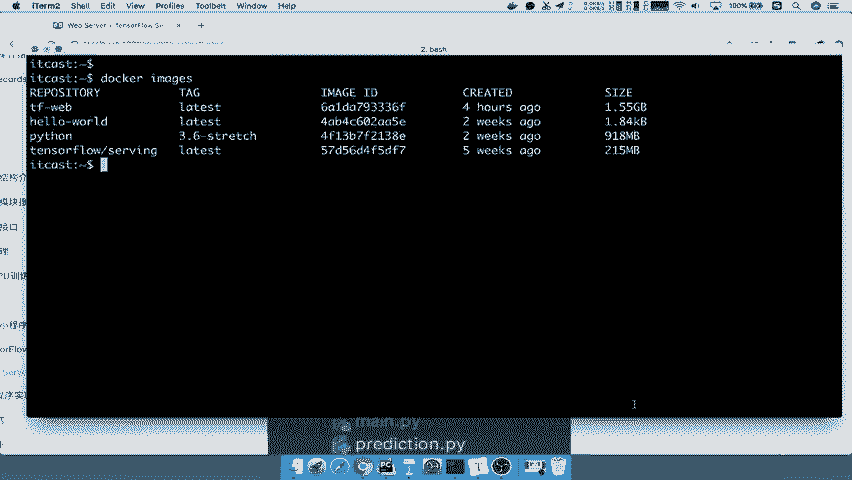

好那么这是我们的这个安装环境的一个介绍，一定要注意了，环境如果说你这个有问题的话，那你这些请求啊等等，就不会不是特别好去这个发送量啊。

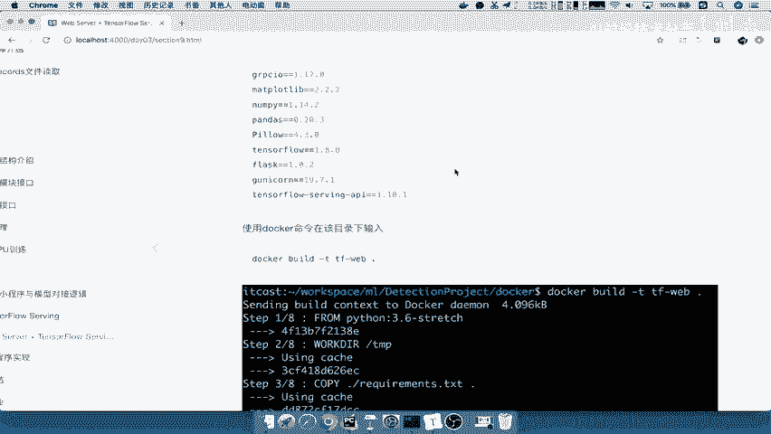

肯定会去有误啊，好，那么接下来我们就要看一下，我们的web项目的结构，因为我们的web主要的是这种web，包裹着我们TENSORFLOW，TENSORFLOW这个serving客户端，所以我们在这里。

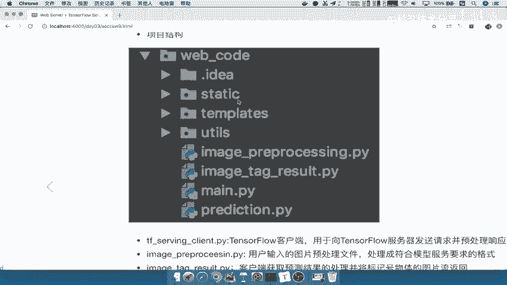

在我们的这个项目当中有一个叫web code的目录，那么这几个static和templates不用管，都是web相关的文件，如果你这个清楚web相关的东西啊，你可以知道。

那么main py也是不用去管的，注意了。

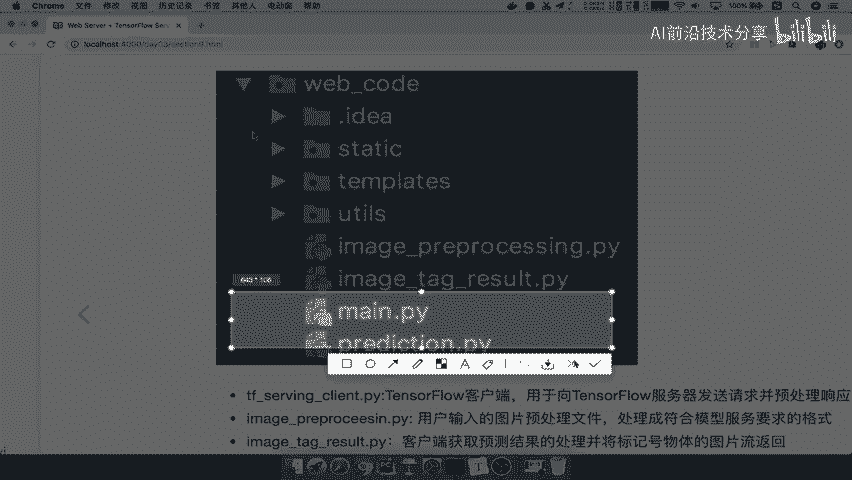

min点PUI也不用求吧，那所以最终呢我们做这个TENSORFLOW，serving客户端呢会用这三个文件啊，用这几个文件能理解吧。

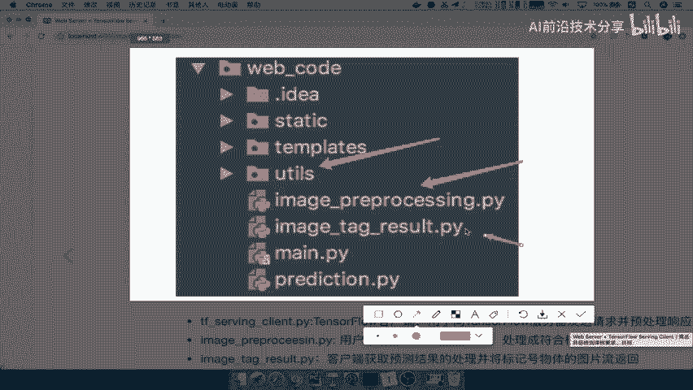

那其他的都是web文件，那这几个文件的关系呢，我们说了TENSORFLOWSERY客户端点PY啊，也就是这个文件啊，应该是prediction文件，这个图当中标有没这个不一样。

那么这个prediction的文件呢，它会是向服务器请求发送并处理这些格式响应。

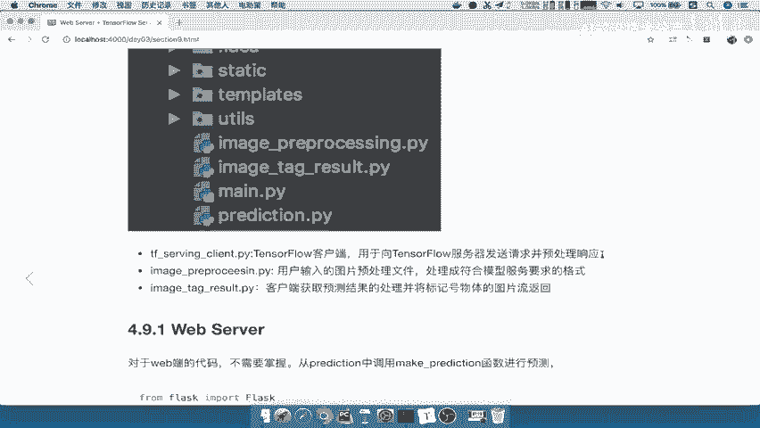

那么它会用到的两个文件，就是这两个文件是我们分装过的，一个是预处理的格式啊，一个是我们将处理的结果进行标记的。

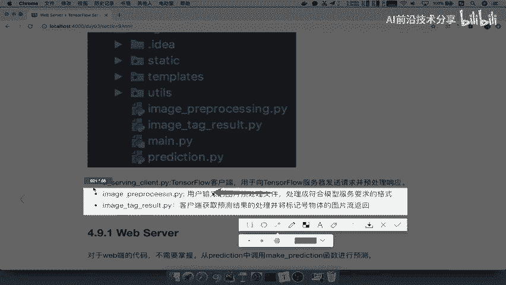

两个文件能理解吧，那么我们在想，我们的整个这样的一个流程，到底应该是怎么样的呢，也就是说web跟我们的client和用户之间的这样流程，我们在这里去写，那我们在这些图当中去画一下啊。

我们直接在这里去讲解吧，那么首先呢用户，提供图片，它提供图片发送到哪里，发送到我们的web客户端，或者说web后台，那web后台啊，web后台拿到这张图片之后怎么办。

那我们是想让web后台当中去做一些图片呢，比如说前期的一些预处理等等，还是想要去在我们的client当中去做的，那我们想这个之间应该怎么去安排，那我想web后台它既然作为是web的业务逻辑。

我们不能轻易的将我的TENSORFLOW，相关的一些包程序啊，导入在web当中，又去进行一些啊两者之间的一些交互，所以我们索性web就相当于做一个中转站而已，所以呢他直接把程序。

直接把我们的图片数据流直接干嘛呢，我们这里画一个箭头，把这个数据流直接提供给我们的哎，我们复制一下tensorflow serving client，Serving，还有client。

那么他把这个直接给他之后呢，我们的serving client，它会在这中间做很多的一些处理，那比方说，我们再缩小一点啊，然后呢变成细体，比方说我们的数据的图片，数据预处理预处理以及你格式的处理对吧。

格式，然后呢我们会去请求我们的serving服务，获取结果，然后呢重点是对于结果的一些解析，包括我们标签的标记对吧，标签图片的标签进行，标记好，这是我们的这三个部分，那么这也就是说。

我们会将处理的业务加上请求的业务，都会放到client里面，我们不会让web后台做一丝一毫的，关于TENSFLOW的事情，能理解吧，好那所以最终我们这个东西呢获取结果来，它是一个双向的对吧。

它通过我们像我们的serving，这里流程我们之前已经说过，只不过我们在这里重复的时候，是说这个具体的业务在哪里去做，能理解吧，我们这一个整个过程已经重复过了。

只能说这个过程是不是在tensorflow server，client里面去做，然后呢，反过来我们的tensorflow serving呢，去把请求呢返回给他好，返回给他之后呢。

他把数据流返回这一个web后台能理解吧，哎相当于在这里把web后台又拿过来，放到这里，接着呢他又去提供给用户好，那么这就是我们整个web跟我们的serving client，之间的一个逻辑。

业务逻辑设计能理解吧，所以在这个地方呢，我们说了我们web serving的相关代码。

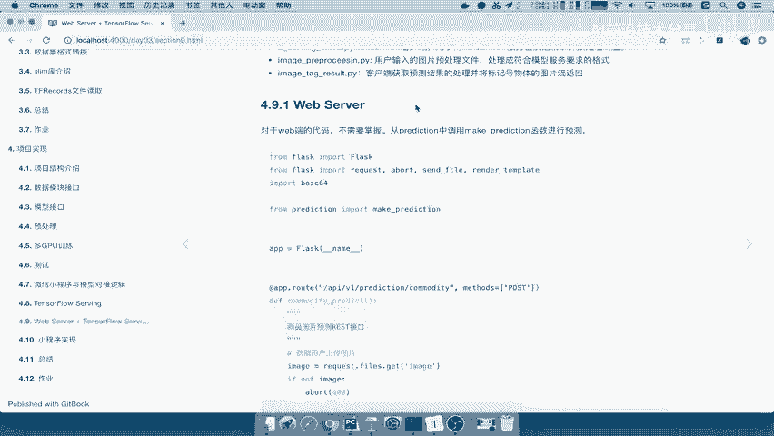

不用大家去掌握，这个代码呢直接在我们的在这个啊，不在我们的online class了，在单独的一个目录，它因为是一个web服务了，在main当中，那么这个文件当中做什么，提供了一些接口啊。

运行起来提供一个入默认的一个页面接口，然后呢他会去进行预测。

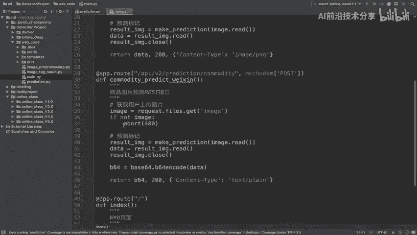

将某个路由函数，将我们的我们用的是flask，这样的一个这个框架啊，将我们的路由函数的获取的图片数据放，通过我们的这个预测结果，这就是我们的客户端的预测结果，然后进行哎进行一个返回嘛。

或者说它进行一些编码的处理，返回给我们的用户。

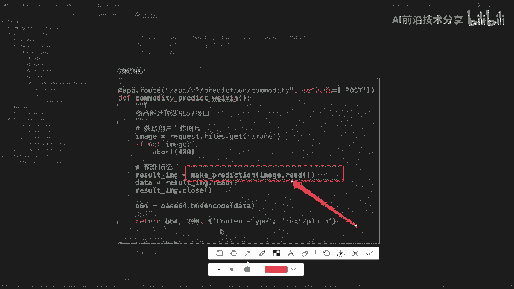

能理解这样过程吗，好，所以呢这就是我们web serving客户端相关的逻辑，他就是拿到图片，然后我们可TENSORFLOWSM客户端去做这些事情，然后再返回给我们的用户，这是他这个我们的web代码。

那我再强调一遍，这个web代码呢我们不需要去做掌握，这是flask的一些这个框架代码，那我们只要去能看懂啊。

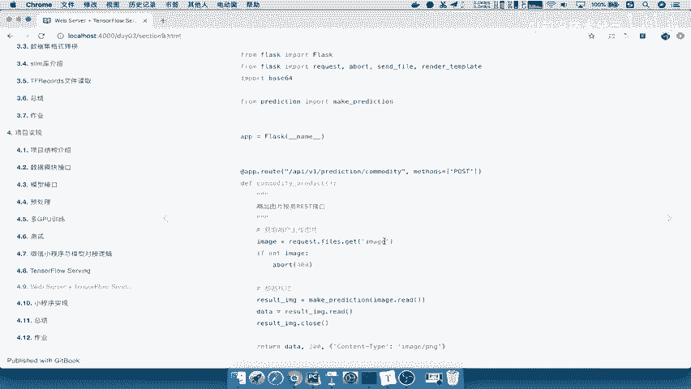