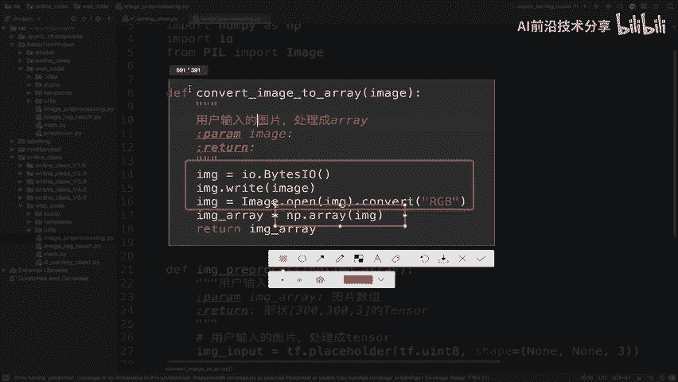

# P81：81.02_Client：用户输入图片处理81 - AI前沿技术分享 - BV1PUmbYSEHm

那么接下来我们就要去说一下我们的TENSORFLOW，serving客户端，那这个客户端做了什么事情呢，那我们就要分析一下，我们的客户端的流程是什么样的，那我们在这里来看一下流程。

在这个客户端流程当中呢，我们在这里通过这几步去做啊，一个是拿到我们的web服务的用户数据流，转换一下数据格式，因为它是一种二进制的格式嘛，那所以我们然后再去进图进行对图片预处理。

把这个处理成我们的服务模型，服务要求的数据吧，唉然后提供给他，那么发送我们的请求，数据提供给他，获取我们的结果，最后我们针对结果进行一个处理和标记。

能理解吧，所以这就是我们客户端的一个流程啊，跟我们的web呢只是一个拿数据取数据，传数据的过程，能理解吧，其他的我们不需要进行外部处理，那我们接下来就要进行一些相关代码的编写了，那么我们先来看一下。

我们完整的这样的一个代码啊。

那么这个代码当在我们的web code当中的prediction，那么这个prediction跟如我们之前所说的对吧，导入相关包之后呢，然后进行进行图片的一个，前期的转换以及预处理。

然后我们再去请求我们的服务，请求服务，请求服务之后，然后把我们的结果返回进行标记返回，那么这其中会涉及到一些工具对吧，那最后这里只是一个测试的一个代码，这个地方呢我们会提供给这个函数。

提供给我们的啊web客户端去使用。

能理解吧，好那么我们接下来就要去新建啊。

我们把我们的这个代码呢进行新建立，这样的一个目录啊，那我们在这个啊，1。0到5。0的这整个过程的代码当中呢，我们自己去新建一个web code，这个代表什么呢，我们的web的相关代码都放到这里。

所以呢我们把这些结构呢都给拿过来，包括啊main点PY好，我们直接复制过来，其他的文件呢，除了这个prediction是我们自己去实现的，那么其他文件都是相当于是一些啊，我帮助的这些这个组件能理解吧。

包括这个Python的这个web flask的代码好，那么接着我们就要去实现这样的一个过程，我们把新建一个，Python代码，那么这个代码呢我们就取名叫做这个啊。

我们之前这里定了一个名字啊，就叫做tf tensorflow serving客户端来在这里。

那么这个客户端代码。

首先我们第一件事情，就是将我们所需要的这些包呢给导入进来，那包括我们刚才所说的，web跟TENSORFLOW的共同的环境代码，包括jr vc tensorflow serving这些东西啊。

那所以呢我们把这些呢都直接拿过来了啊，好导入过来，这类里面包括了一些这个API，都同以同级目录啊，有一些路径呢不要搞错了好，那么接下来呢我们就去新建这样的一个main函数，那么TF点好。

这个我们就不用TF，因为我们要提供给别人接口对吧，所以我们define一个，那么这一个函数呢，我们主要去做的就是，比如说叫做叫做make prediction嘛，make prediction好。

那么这个地方我们make prediction呢，我们先传一个NN，你想你做去去做预测，那你拿到的是什么，是不是一张图片啊，你应该是在这个地方去调用的时候，我应该去web传给你的一个image对吧。

那所以这个地方我们先空啊，那这里注释掉，我们用一个这个pass，那么然后呢，我们这就是相当于你拿到用户的数据对吧，一个image流image应该是一个啊，我们回撤一下，这也就是拿到用户的数据。

拿到用户的数据进行预测标记返回，那么这个image就是web web传过，或者说直接吧哎这个用图片数据，数据量好，那么返回呢我们先不说了，那么我们就按刚才的步骤，第一步骤我们想第一个应该干什么。

对image进行格式转换以及处理吧，哎对image进行格式转换以及预处理操作，你想这个处理操作，我们想想你模型当中，是不是应该就相当于是这种NNNN3，这种格式转换成什么呀。

转换成我们模型输入的要求的哎三百三百三吧，哎这种格式那么处理好之后，我们直接哎建立请求，我们说了，建立我们的这样的一个客户端请求，请求，然后呢拿到我们的结果，拿到结果好，拿到结果之后呢，我们要对结果哎。

对结果进行预处，进行后期处理处理和我们的这个标签标记，这就是我们的整个流程，好那么所以我们来看第一步对image进行格式转换。

那这个格式转换要做什么呢，我们一般拿到这个image啊，我们看serving呢，它一般提供的这个image呢会直接把image拿过来，我们直接会把image read的结果拿过去。

所以这是一个二进制的结果，那我们需要在客户端当中去做一个转换，成我们能够识别的一种array，也就是说我们特斯word当中经常使用的一种格式，对吧，哎number派的是array格式。

所以在这个当中我们会涉及到使用这个array，进行这样的一个编写逻辑啊，那么这个逻辑呢我们已经放在了image processing的。

Convert，image to array里面，那就要放到这个函数当中了，我们可以去看一下convert image to array。

他做了一件事情，就是直接我们建立这样的一个IOBTS，那么把我们的数据先读取来转换成啊，用image p l里面的image转换成一个RGB的形式，然后直接用array分装啊。

直接这个覆盖一下就OK了，进返回的就是一个数组，所以我们在这里要用到的就是convert image，Convert image，我们的image输入进来，返回的是一个image array吧。

哎返回的是一个image array，那所以呢我们返回image跟ARR。

AY等于这个值好，那我们这个image的array拿到之后接着做什么处理。

你的数据的已经变成了这种形式了，那接着你要去进行处理，这个处理流程，我们也将其封装在了image preprocessing当中，好在这个函数当中直接有一个叫image preprocessing。

这个PREPROCESSING呢输入的数组，然后干什么，我们建立了一个占位符好，然后利用svd pro preprocessing，然后呢我们进行一个这样的一个evil，就是说测试的转换。

返回的一个是来进行了大小调整的，然后我们再输入的数据，通过这个feed dict参数，用我们的session run获取结果，这个结果就是我们的这个运行的结果啊，那我们所以把这个结果返回。

所以我们将这个地方啊，我们的image preprocessing拿到image array还没image和ray，那么它返回的就是我们所需要返回的一个，结果了，那我们这个地方呢就写作image等于好。

这样拿到的就是我们一张处理好的图片，处理成了进行过处理，那这一定要记得啊，我们的这个处理过程，还是要用到我模型当中的一些代码的，能理解吧，不过我只不过单独把它那些所用的代码都拿到。

训练的代码都拿到这边来封装了，好，那么这是我们的整个这样的一个啊。

我们先把这两步，这第一步啊先进行的一个实现好。

