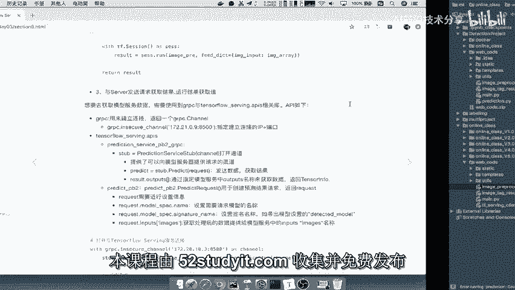
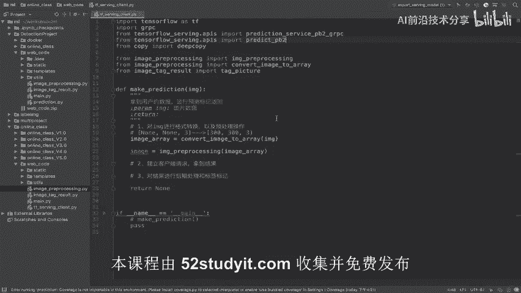
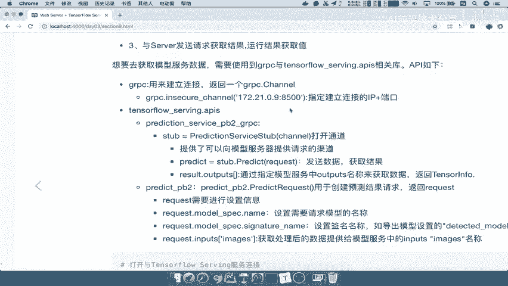
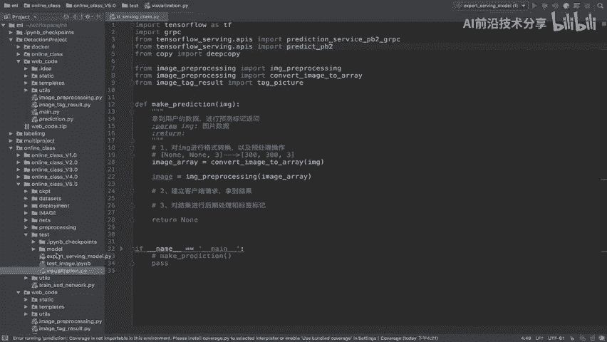
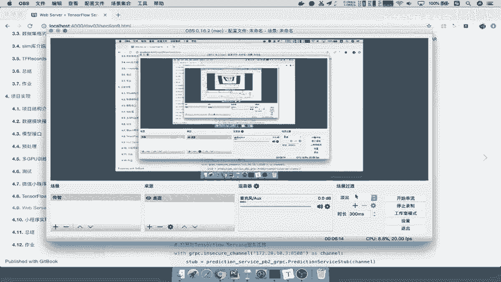

# P82：82.03_Client：grpc与serving apis介绍82 - AI前沿技术分享 - BV1PUmbYSEHm

那么接下来我们就要去通过我们的客户端代码，去发起请求了，那么我们怎么去做呢，来看到这里，那么想要去获取模型服务器的数据，也就是说我们开启了这个模型的数据，那么需要使用两两个这样的相关库。

也gr pc与tensorflow serving，点APRS好。

这两个东西也就是在这里我们导入的，那么这个东西我们是按照什么样的一个步骤呢。

我们先来看一下这样的步骤，首先打开我们的TENSORFLOW进行一个建立链接啊，建立链接获得这样一个通道，那么接着我们创建一个请求对吧，我们把请求给创建好，就相当于是一个协议准备。

然后呢获取我们的请求结果，就是说通过我们的这个通道获取请求结果，最后我们要解析这个过程，能理解吧，好那我们来看这其中用到的几个相关的API。

我们先啊介绍一下，第一个呢就是GRPC怎么去建立链接呢，我们说了它是GRPC进行通信嘛，那所以你必须使用GRPC的insecure channel，这个里面指定你的IP加端口啊。

你本地的就是指本地的一些IP加端口，你如果说是服务器的，那就服务器的IP加端口，那这是第一个，那么它会返回这样的一个channel，这个channel呢我们会拿来干什么的。

接着就是tensorflow serving的东西了，那也是基本JIPC吧，JIPC拿来建立通道，serving呢会相关去封装数据吧，去定义一些数据格式，或者说他去解析数据格式，那么我们里面有两个函数。

一个叫做prediction service pb r g i pc，一个是prediction predict pb2，那这拿两个拿来什么用的呢，一个是用来打开通道的，我们建立链接了。

那我这个地方呢要使用serving建立打开通道，它提供了一种可以像模型当中哎，提供请求的渠道，唉，相当于是打通了一个管道一样对吧，那管道里面是要干嘛呢，去发送数据去请求的。

那也就是说我可以通过这个管道去发送请求，数据获取结果能理解吧，哎相对于获取一个这样的一个最终结果好，那么这个结果当中呢，它包含了我们之前在我们的这个模型，导出的时候，封装的这个什么哎签名嘛，哎签名映射。

所以你获取的时候还是一样，他那边签名input和output ts，你这里获取也要是input output ts好，那么当然你要获取输出啊，输出就是output ts。

那么对于第二个这样的一个API来讲呢，它主要是去构造请求的，能理解吧，哎所以这个地方呢是构造啊，构造请求，那么这个构造请求呢，它会通过这个predict request返回一个request。

这个请求你就要去把这个请求封装一下，设置一下吧，比如说设置你请求的模型名字对吧，比如说你这里面有很多别的模型，那我请求一下模型的名字，以及模型在设置时候的，他的签名名称。

就是我们导出的时候设置的detective model，还记得吗，我们来看一下，就是我们在online class里面啊，我们看我们自己的这个代码啊，在我们的这里啊。

我们的nice test设置这样的一个请求。

我们在这个EXPING，我们当初导出的时候怎么导出的，在这里是不是设置了一个single nature of demap detection model，哎，就是这个东西。

那么然后呢我们会把这个请求发送过去，你这个请求请求呢，它相当于是把你的数据拿过来吧，所以你用户输入的数据也得去分装到这个，an input image里面，他会把这个用户数据放到这里。

包括你为什么指定这个images啊，因为我们分装的时候指定这个名字能理解吧，就相当于这个input，那所以我要把用户的数据封装到这里面，然后这构造好了一个请求之后，通过这个通道啊发送过去获取结果。

能理解吧，所以这就是完整的这样过程，好由于这个API呢比较这样的一个啊，或者说他这个名字也比较多啊，我们呢在这里先进行一个总结啊，先进行一个总结过程，那么这里我们就是要去获取啊，这个客户端获取结果。

第一步呢去进行一个这获取数据啊，获取用户数据进行了处理格式和预处理过程，那么这个我们就不用管了，第二个我们就要去进行这样的一个过程了，那么这个过程呢我们说啊，我们把它分成两步骤啊，两个这几个步骤。

一个是建立，这里呢可以是发送请求吧啊发送请求获取结果，那么我们这里把它用几个步骤，第一个是用通过GRPC去建立链接链接吧，建立链接之后，我们使用这个函数建立，那么我们是不是要去啊。

通过serving serving来建立通通道，那么这个通道呢我们去发送请求通道发送请求，所以我们需要去做干嘛呢，分装一个请求，这个请求里面包含了哪些信息啊，你请求的模型名称。

然后你的模型的一个映射是签名，映射模型的签名，然后以及你的图片数据分装一请求，将这几个分装进去，发送给我们的这样的一个客户端，能理解吧，好请求啊，好我们就分为这几个步骤发出啊，获取最后获取结果。

那所以我们就根据这几个步骤来去写一下，代码啊。

